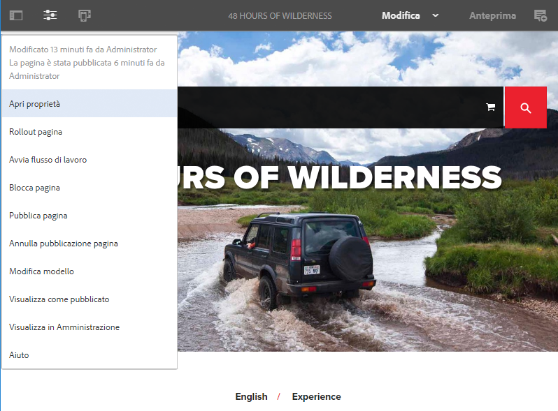
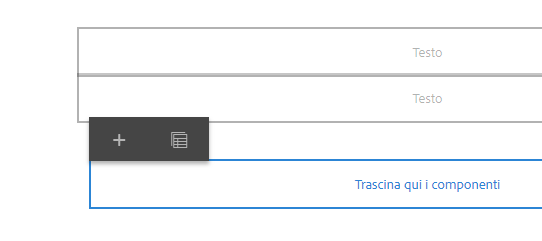
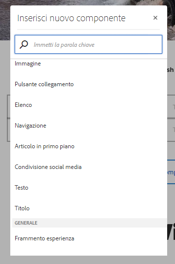
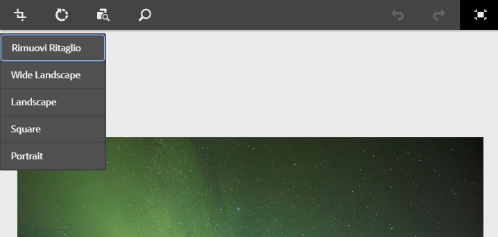
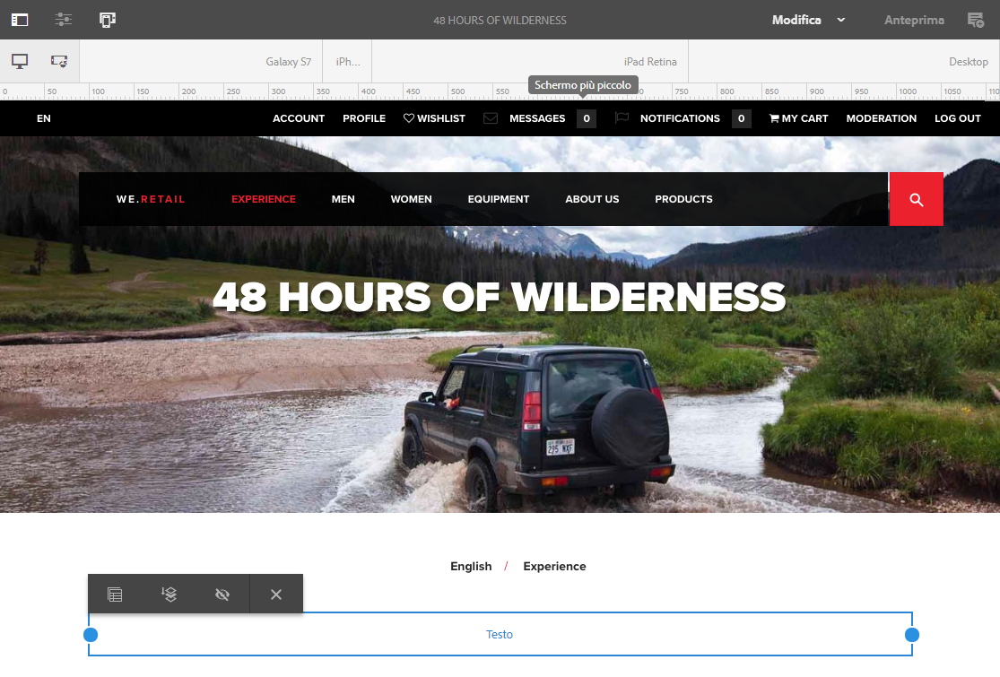
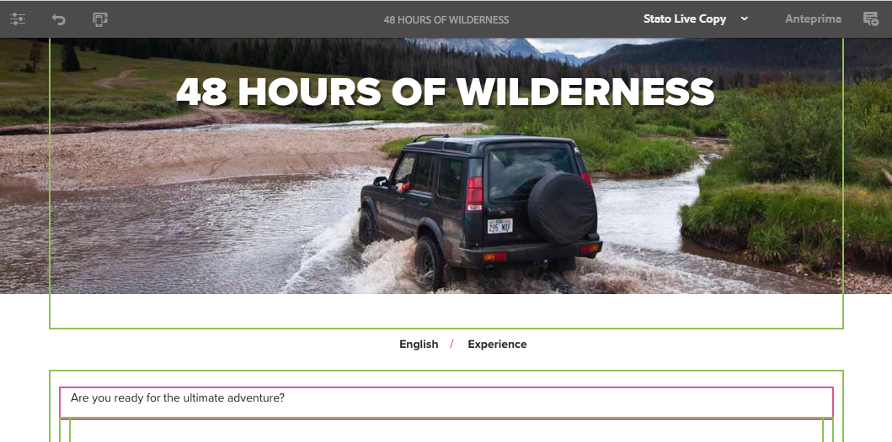

# Modifica del contenuto di una pagina{#editing-page-content}

>[!CAUTION]
>
>AEM 6.4 ha raggiunto la fine del supporto esteso e questa documentazione non viene più aggiornata. Per maggiori dettagli, consulta la nostra [periodi di assistenza tecnica](https://helpx.adobe.com/it/support/programs/eol-matrix.html). Trova le versioni supportate [qui](https://experienceleague.adobe.com/docs/).

Una volta creata la pagina (nuova o come parte di un lancio o di una Live Copy) è possibile modificare il contenuto per apportare gli aggiornamenti necessari.

Il contenuto viene aggiunto utilizzando [componenti](/help/sites-authoring/default-components-console.md) (in base al tipo di contenuto) trascinabile sulla pagina. che possono quindi essere modificati, spostati o eliminati.

>[!NOTE]
>
>Il tuo account deve [diritti di accesso appropriati](/help/sites-administering/security.md) e [permissions](/help/sites-administering/security.md#permissions) per modificare le pagine.
>
>Nell’eventualità di problemi, rivolgiti al tuo amministratore di sistema.

>[!NOTE]
>
>Se la pagina e/o il modello sono stati impostati in modo appropriato, è possibile utilizzare il [layout dinamico](/help/sites-authoring/responsive-layout.md) durante la modifica.

>[!NOTE]
>
>In modalità **Modifica**, i collegamenti presenti nel contenuto sono visibili, ma **non accessibili**. Utilizza la modalità [Anteprima](#previewing-pages) se desideri navigare utilizzando i collegamenti presenti nel tuo contenuto.

## Barra degli strumenti della pagina {#page-toolbar}

Dalla barra degli strumenti della pagina è possibile accedere alle funzionalità appropriate, a seconda della configurazione della pagina.

La barra degli strumenti offre l’accesso a numerose opzioni. A seconda del contesto e della configurazione correnti, alcune opzioni potrebbero non essere disponibili.

* **Attiva/Disattiva pannello laterale**

   Viene aperto/chiuso il pannello laterale, che contiene il comando [Browser risorse](/help/sites-authoring/author-environment-tools.md#assets-browser), [Browser componenti](/help/sites-authoring/author-environment-tools.md#components-browser)e [Struttura contenuto](/help/sites-authoring/author-environment-tools.md#content-tree).

   

* **Informazioni sulle pagine**

   Consente l&#39;accesso al [Informazioni pagina](/help/sites-authoring/author-environment-tools.md#page-information) che include i dettagli della pagina e le azioni che possono essere eseguite sulla pagina, compresi la visualizzazione e la modifica delle informazioni sulla pagina, la visualizzazione delle proprietà della pagina e la pubblicazione o l’annullamento della pubblicazione della pagina.

   

* **Emulatore**

   Attiva/disattiva la [barra degli strumenti dell&#39;emulatore](/help/sites-authoring/responsive-layout.md#selecting-a-device-to-emulate), che viene utilizzato per emulare l’aspetto della pagina su un altro dispositivo. Questa opzione viene attivata automaticamente in modalità layout.

   

* **ContextHub**

   Apre la [context hub](/help/sites-authoring/ch-previewing.md). Disponibile solo in modalità Anteprima.

   

* **Titolo pagina**

   Questo è puramente informativo.

   

* **Selettore modalità**

   Visualizza il [modalità](/help/sites-authoring/author-environment-tools.md#page-modes) e consente di selezionare un’altra modalità, ad esempio modifica, layout, timewarp o targeting.

   

* **Anteprima**

   Abilita [modalità anteprima](/help/sites-authoring/editing-content.md#preview-mode). La pagina viene visualizzata così come apparirà al momento della pubblicazione.

   

* **Annotazioni**

   Consente di aggiungere [annotazioni](/help/sites-authoring/annotations.md) alla pagina durante la revisione. Dopo la prima annotazione, l’icona viene sostituita da un numero che indica il numero di annotazioni sulla pagina.

   

### Notifica di stato {#status-notification}

Se una pagina fa parte di uno o più [flussi di lavoro](/help/sites-authoring/workflows.md), queste informazioni vengono visualizzate in una barra di notifica nella parte superiore dello schermo durante la modifica della pagina.

>[!NOTE]
>
>La barra di stato è visibile solo agli account utente con i privilegi appropriati.

La notifica elenca il flusso di lavoro in esecuzione sulla pagina. Se l’utente è coinvolto nel passaggio del flusso di lavoro corrente, le opzioni per [influisce sullo stato del flusso di lavoro](/help/sites-authoring/workflows-participating.md) e per ulteriori informazioni sul flusso di lavoro sono disponibili anche, ad esempio:

* **Completa** - Apre la **Elemento di lavoro completo** dialogo

* **Delega** - Apre la **Elemento di lavoro completo** dialogo

* **Visualizza dettagli**: apre la finestra **Dettagli** del flusso di lavoro

Il completamento e la delega delle fasi del flusso di lavoro a partire dalla barra delle notifiche funzionano in modo analogo alla [partecipazione ai flussi di lavoro](/help/sites-authoring/workflows-participating.md) a partire dalla casella in entrata delle Notifiche.

Se la pagina è soggetta a più flussi di lavoro, il numero dei flussi di lavoro viene visualizzato all’estremità destra della notifica, insieme ai pulsanti freccia che consentono di scorrere i flussi di lavoro.

## Segnaposto Componente {#component-placeholder}

Il segnaposto del componente è un indicatore che mostra dove verrà posizionato un componente al momento del rilascio, sopra il componente su cui si sta attualmente passando il mouse.

* Quando si aggiunge un nuovo componente alla pagina (trascinandolo dal browser Componenti):

   

* Quando si sposta un componente esistente:

   

## Inserimento di un componente {#inserting-a-component}

### Inserire un componente dal Browser Componenti {#inserting-a-component-from-the-components-browser}

È possibile aggiungere un nuovo componente utilizzando il [browser componenti](/help/sites-authoring/author-environment-tools.md#components-browser). Il [segnaposto componente](#component-placeholder) mostra dove sarà posizionato il componente:

1. Assicurati che la pagina sia in [**modalità Modifica**.](/help/sites-authoring/author-environment-tools.md#page-modes)
1. Apri il [browser Componenti](/help/sites-authoring/author-environment-tools.md#components-browser).
1. Trascina il componente di cui hai bisogno nella [posizione desiderata](#component-placeholder).

1. [Modifica](#edit-configure-copy-cut-delete-paste) il componente.

>[!NOTE]
>
>Su un dispositivo mobile, il browser Componenti occupa l’intero schermo. Quando si inizia a trascinare un componente, il browser si chiude per mostrare nuovamente la pagina, in modo da poter posizionare il componente.

### Inserimento di un Componente dal Sistema Paragrafo   {#inserting-a-component-from-the-paragraph-system}

È possibile aggiungere un nuovo componente utilizzando la casella **Trascina qui i componenti** del sistema paragrafo:

1. Assicurati che la pagina sia in [**modalità Modifica**.](/help/sites-authoring/author-environment-tools.md#page-modes)
1. Esistono due modi per selezionare e aggiungere un nuovo componente dal sistema paragrafo:

   * Seleziona la **Inserisci componente** dalla barra degli strumenti di un componente esistente o dal **Trascina qui i componenti** scatola.

   

   * Se utilizzi un dispositivo desktop, puoi fare doppio clic sulla casella **Trascina qui i componenti**.

   Viene visualizzata la finestra di dialogo **Inserisci nuovo componente**, che consente di selezionare il componente richiesto:

   

1. Il componente selezionato verrà aggiunto in fondo alla pagina. [Modifica](#edit-content) il componente come necessario.

### Inserimento di un componente utilizzando il browser Risorse   {#inserting-a-component-using-the-assets-browser}

È possibile aggiungere un nuovo componente alla pagina anche trascinando una risorsa dal [browser Risorse](/help/sites-authoring/author-environment-tools.md#assets-browser). Questo determina la creazione automatica di un nuovo componente del tipo appropriato (e che include la risorsa).

Questo vale per i seguenti tipi di risorse (alcune dipenderanno dal sistema di pagine/paragrafi):

<table> 
 <tbody>
  <tr>
   <th>Tipo risorsa</th> 
   <th>Tipo componente risultante</th> 
  </tr>
  <tr>
   <td>Immagine</td> 
   <td>Immagine</td> 
  </tr>
  <tr>
   <td>Documento</td> 
   <td>Scarica</td> 
  </tr>
  <tr>
   <td>Prodotto</td> 
   <td>Prodotto</td> 
  </tr>
  <tr>
   <td>Video</td> 
   <td>Flash</td> 
  </tr>
  <tr>
   <td>Frammenti di contenuto</td> 
   <td>Frammenti di contenuto  </td> 
  </tr>
 </tbody>
</table>

>[!NOTE]
>
>Puoi configurare questo comportamento per l’installazione in uso. Vedi [La configurazione di un sistema di paragrafi in modo che il trascinamento di una risorsa crei un’istanza di componente](/help/sites-developing/developing-components.md#configuring-a-paragraph-system-so-that-dragging-an-asset-creates-a-component-instance) per ulteriori dettagli.

Per creare un componente trascinando uno dei tipi di risorsa indicati sopra:

1. Assicurati che la pagina sia in [**modalità Modifica**.](/help/sites-authoring/author-environment-tools.md#page-modes)
1. Apri [browser risorse](/help/sites-authoring/author-environment-tools.md#assets-browser).
1. Trascina la risorsa desiderata nella posizione desiderata. La [segnaposto componente](#component-placeholder) mostra dove sarà posizionato il componente.

   Un componente, appropriato per il tipo di risorsa, verrà creato nella posizione desiderata, che conterrà la risorsa selezionata.

1. [Modifica](#edit-content) il componente, se necessario.

>[!NOTE]
>
>Su un dispositivo mobile, il browser Risorse occuperà l’intero schermo. Quando inizi a trascinare una risorsa, il browser si chiude per mostrare nuovamente la pagina in modo da poter posizionare la risorsa.

Se sfogliando le risorse disponibili scopri che è necessario apportare una rapida modifica a una risorsa, puoi avviare la funzione [editor risorse](/help/assets/managing-assets-touch-ui.md) direttamente dal browser, facendo clic sull’icona di modifica accanto al nome della risorsa.

## Modifica/Configura/Copia/Taglia/Elimina/Incolla {#edit-configure-copy-cut-delete-paste}

Selezionando un componente si aprirà la barra degli strumenti, che consente di accedere alle azioni disponibili per tale componente.

Le azioni disponibili dipendono dal contesto; in questa sezione ne vengono descritte solo alcune.

* **Modifica**

   [In base al tipo di componente,](/help/sites-authoring/default-components.md) questo comando consente di [modificare il contenuto del componente](#edit-content). Spesso è disponibile una barra degli strumenti.

   

* **Configura**

   [In base al tipo di componente,](/help/sites-authoring/default-components.md) questo comando consente di modificare e configurare le proprietà del componente. In genere presenta una finestra di dialogo.

   

* **Copia**

   Questo comando consente di copiare il componente negli Appunti. Dopo l’operazione Incolla, il componente originale rimarrà invariato.

   

* **Taglia**

   Questo comando consente di copiare il componente negli Appunti. Dopo l’operazione Incolla, il componente originale viene rimosso.

   

* **Eliminare**

   Il componente verrà eliminato dalla pagina con la conferma.

   

* **Inserisci componente**

   Viene visualizzata la finestra di dialogo [aggiungere un nuovo componente](/help/sites-authoring/editing-content.md#inserting-a-component-from-the-paragraph-system).

   

* **Incolla**

   Questo comando consente di incollare il componente dagli Appunti nella pagina. Il componente originale viene eliminato o meno a seconda che sia stata utilizzata l’opzione Copia o Taglia.

   * È possibile incollare nella stessa pagina o in una pagina diversa.
   * L’elemento incollato verrà incollato sopra l’elemento in cui si seleziona l’azione Incolla.
   * L’azione Incolla viene visualizzata solo se è presente del contenuto negli Appunti.

   

   >[!NOTE]
   >
   >Se si incolla un componente in una pagina che era già aperta prima dell’operazione Taglia o Copia, è necessario aggiornare la pagina per visualizzare il contenuto incollato.

* **Gruppo**

   Questo consente di selezionare più componenti contemporaneamente. Lo stesso può essere ottenuto su un dispositivo desktop da un **Ctrl+Clic** o **Comando+Clic**.

   

* **Elemento padre**

   Consente di selezionare il componente principale del componente selezionato.

   

* **Layout**

   Ciò ti consente di modificare il [layout](/help/sites-authoring/editing-content.md#edit-component-layout) del componente selezionato. Questo vale solo per il componente selezionato e non attiva il [Modalità Layout](/help/sites-authoring/author-environment-tools.md#page-modes) per l&#39;intera pagina.

   

* **Converti in variante di frammento di esperienza**

   Consente di creare un nuovo [Frammento esperienza](/help/sites-authoring/experience-fragments.md) dal componente selezionato o di aggiungerlo a un frammento di esperienza esistente.

   

## Modifica (contenuto) {#edit-content}

Esistono due metodi per aggiungere e/o modificare contenuti nei componenti:

* Apri [finestra di dialogo dei componenti per la modifica](#component-edit-dialog).
* [Trascinare una risorsa](#inserting-a-component-using-the-assets-browser) dal browser delle risorse per aggiungere direttamente il contenuto.

### Finestra di dialogo di modifica del componente   {#component-edit-dialog}

Per aprire un componente e modificarne il contenuto, utilizza l’icona [Modifica (a forma di matita) nella barra degli strumenti del componente](#edit-configure-copy-cut-delete-paste).

Le opzioni di modifica effettive dipendono dal componente. Per alcuni componenti [tutte le azioni sono disponibili solo in modalità a schermo intero](#edit-content-full-screen-mode). Esempio:

* [Componente testo](/help/sites-authoring/rich-text-editor.md)

   

* Componente immagine

   

   >[!NOTE]
   >
   >La modifica non funziona su un componente immagine vuoto.
   >
   >
   >Devi [trascinare o caricare un’immagine (utilizzando Configura)](/help/sites-authoring/default-components-foundation.md#image) prima di iniziare a modificarlo.

* Componente immagine - a schermo intero

   [L’accesso alla modalità a tutto schermo](/help/sites-authoring/editing-content.md#edit-content-full-screen-mode) per il componente immagine consente di avere più spazio per modificare l’immagine oltre che per visualizzare opzioni di modifica aggiuntive, ad esempio **Launch Map (Avvia mappa)** e **Ripristina zoom**. Inoltre, lo schermo intero consente di selezionare i predefiniti di ritaglio.

   

* Componenti costruiti da più componenti di base, come [Componente di base Testo e Immagine](/help/sites-authoring/default-components-foundation.md#text-image), chiedi innanzitutto di confermare quale insieme di opzioni di modifica desideri:

   

### Trascinare risorse nel componente {#drag-and-drop-assets-into-component}

Per tipi di componenti specifici puoi trascinare e rilasciare risorse dal browser risorse direttamente nel componente per aggiornare il contenuto:

| Tipo risorsa | Tipo componente |
|---|---|
| Immagine | Immagine |
| Documento | Scarica |
| Prodotto | Prodotto |
| Video | Flash |
| Frammenti di contenuto | Frammenti di contenuto |

## Modalità a tutto schermo Modifica (contenuto) {#edit-content-full-screen-mode}

Per tutti i componenti è possibile accedere alla (e uscire dalla) modalità a tutto tramite:

Per esempio, il componente **Testo**:

>[!NOTE]
>
>Per alcuni componenti, la modalità a schermo intero dispone di più opzioni rispetto all’editor locale di base.

## Spostamento di un componente {#moving-a-component}

Per spostare un componente paragrafo:

1. Tocca e tieni premuto o fai clic e tieni premuto per selezionare il paragrafo da spostare.
1. Trascinare il paragrafo nella nuova posizione. AEM indica dove è possibile spostare il paragrafo. Rilascia nella posizione desiderata.

   

1. Il paragrafo è stato spostato.

>[!NOTE]
>
>Per spostare un componente puoi anche utilizzare [Taglia e Incolla](/help/sites-authoring/editing-content.md#edit-configure-copy-cut-delete-paste).

## Modificare il layout del componente {#edit-component-layout}

Invece di passare più volte dalla modalità di modifica alla [modalità di layout](/help/sites-authoring/responsive-layout.md) per regolare le impostazioni di un componente, è possibile selezionare l’azione **Layout**. Questo permette di modificare rapidamente il layout di quello specifico componente, senza uscire dalla modalità di modifica.

1. In modalità **Modifica** nella console Sites, quando si seleziona un componente viene visualizzata la sua barra degli strumenti.

   

   Tocca o fai clic sull’azione **Layout** per modificare il layout del componente.

   

1. Una volta selezionata l’azione Layout :

   * Vengono visualizzate le maniglie di ridimensionamento del componente.
   * La barra degli strumenti dell’emulatore si trova nella parte superiore dello schermo.
   * Sulla barra degli strumenti del componente vengono visualizzate le azioni di layout anziché le azioni di modifica standard.

   

   Ora puoi modificare il layout del componente, in modo analogo a come lo si modifica nella [modalità di layout](/help/sites-authoring/responsive-layout.md#defining-layouts-layout-mode).

1. Dopo aver apportato le modifiche necessarie, fai clic sul pulsante **Chiudi** nel menu Azioni del componente per interrompere la modifica del layout del componente. La barra degli strumenti del componente torna al normale stato di modifica.

   

>[!NOTE]
>
>L’azione Layout è limitata al componente selezionato. Ad esempio, se stai modificando il layout di un componente e fai clic su un altro componente, per il componente appena selezionato viene visualizzata la barra degli strumenti di modifica standard (non quella di layout), mentre le maniglie di ridimensionamento e la barra degli strumenti dell’emulatore vengono nascosti.
>
>Se devi modificare il layout globale della pagina, interessando più componenti, passa alla [modalità layout](/help/sites-authoring/responsive-layout.md).

## Componenti ereditati {#inherited-components}

I componenti ereditati possono essere il risultato di vari scenari, tra cui:

* [Gestione multisito](/help/sites-administering/msm.md)
* [Lanci](/help/sites-authoring/launches.md) (se basati su Live Copy).
* Componenti specifici, ad esempio il sistema paragrafo ereditato all’interno di Geometrixx.

È possibile annullare l’ereditarietà, quindi riabilitarla. A seconda del componente, questo può essere disponibile da:

* **Live Copy**

   La barra degli strumenti del componente, se il componente si trova in una pagina che fa parte di una Live Copy o di un lancio (basato su una Live Copy). Ad esempio:

   

   L’opzione Annulla ereditarietà è disponibile:

   

   Oppure riattiva l’ereditarietà se già annullata:

   

   L’azione Rollout è disponibile anche nella blueprint o nella sorgente Live Copy:

   

* **Un Sistema Paragrafo Ereditato**

   Finestra di dialogo di configurazione. Ad esempio, come nel sistema paragrafo ereditato:

   

## Modificare il modello di pagina {#editing-the-page-template}

Se la pagina è basata su un [modello modificabile](/help/sites-authoring/templates.md#editable-and-static-templates), è possibile passare facilmente alla [editor modelli](/help/sites-authoring/templates.md#editing-templates-template-authors) selezionando **Modifica modello** in [Menu Informazioni pagina](/help/sites-authoring/author-environment-tools.md#page-information).

Se la pagina è basata su un [modello statico](/help/sites-authoring/templates.md#editable-and-static-templates), puoi passare a [Modalità Progettazione](/help/sites-authoring/default-components-designmode.md) utilizzando [selettore della modalità pagina](/help/sites-authoring/author-environment-tools.md#page-modes) sulla barra degli strumenti per abilitare/disabilitare i componenti da utilizzare nella pagina.

Puoi vedere facilmente su quale modello si basa la pagina quando la selezioni in [Vista a colonne](/help/sites-authoring/basic-handling.md#column-view) o [Vista a elenco](/help/sites-authoring/basic-handling.md#list-view).

## Stato della Live Copy   {#live-copy-status}

La [Modalità pagina di stato della Live Copy](/help/sites-authoring/author-environment-tools.md#page-modes) consente di visualizzare una panoramica rapida dello stato della Live Copy e dei componenti ereditati o non ereditati:

* Bordo verde: Ereditato
* Bordo rosa: Ereditarietà annullata

Esempio:

## Aggiunta di annotazioni {#adding-annotations}

[Annotazioni](/help/sites-authoring/annotations.md) consentono a revisori e altri autori di fornire feedback sui contenuti. Sono spesso utilizzati a scopo di revisione e convalida.

## Anteprima delle pagine   {#previewing-pages}

Esistono due opzioni per visualizzare in anteprima una pagina:

* [Modalità Anteprima](#preview-mode): un’anteprima rapida disponibile dalla stessa posizione

* [Visualizza come pubblicato](#view-as-published) - un’anteprima completa che apre la pagina in una nuova scheda

>[!NOTE]
>
>* I collegamenti nel contenuto sono visibili, ma non sono accessibili in modalità Modifica.
>* Per effettuare la navigazione tramite i collegamenti, utilizza una delle opzioni di anteprima.
>* Utilizza la [scelta rapida da tastiera](/help/sites-authoring/keyboard-shortcuts.md) `Ctrl-Shift-M` per passare dall’anteprima all’ultima modalità selezionata.
>

>[!NOTE]
>
>Il cookie della modalità WCM viene impostato per entrambe le opzioni.

### Modalità Anteprima {#preview-mode}

Durante la modifica del contenuto è possibile visualizzare in anteprima la pagina utilizzando l’anteprima [modalità](/help/sites-authoring/author-environment-tools.md#page-modes). Questa modalità:

* Nasconde vari meccanismi di modifica per fornire un’indicazione rapida di come apparirà la pagina una volta pubblicata.
* Consente di utilizzare i collegamenti per la navigazione.
* Does **not** aggiorna il contenuto della pagina.

Durante l’authoring, la modalità di anteprima è disponibile utilizzando l’icona in alto a destra dell’editor di pagine:

### Visualizza come pubblicato {#view-as-published}

L’opzione **Visualizza come pubblicato**, è disponibile nel menu [Informazioni pagina](/help/sites-authoring/author-environment-tools.md#page-information). Viene aperta la pagina in una nuova scheda, il contenuto viene aggiornato e la pagina viene visualizzata esattamente come apparirà nell’ambiente di pubblicazione.

## Blocco di una pagina   {#locking-a-page}

AEM consente di bloccare una pagina in modo da impedire che i contenuti possano essere modificati. Questa funzione è utile quando si devono apportare numerose modifiche a una pagina oppure se occorre bloccarla per un breve periodo di tempo.

Una pagina può essere bloccata da:

* **Sites** console

   1. Seleziona la pagina con [modalità di selezione](/help/sites-authoring/basic-handling.md#viewing-and-selecting-resources).
   1. Selezionare l’icona Blocca.

   

* **Editor pagina**

   1. Seleziona la **Informazioni pagina** per aprire il menu.
   1. Seleziona la **Blocca pagina** opzione .

Una volta eseguito il blocco le informazioni di visualizzazione della console vengono aggiornate e, durante la modifica, un simbolo a forma di lucchetto viene visualizzato nella barra degli strumenti.

>[!CAUTION]
>
>Il blocco di una pagina può essere eseguito quando [rappresentazione di un utente](/help/sites-administering/security.md#impersonating-another-user). Tuttavia, una pagina bloccata in questo modo può essere sbloccata solo dall’utente impersonato o dall’utente amministratore.
>
>Non è possibile sbloccare le pagine impersonando l’utente che ha bloccato la pagina.

## Sblocco di una pagina {#unlocking-a-page}

La procedura di sblocco di una pagina è molto simile a quella di [blocco](#locking-a-page): una volta che la pagina è bloccata, le opzioni di blocco vengono sostituite da quelle di sblocco.

Nel menu Informazioni pagina è presente l’opzione **Sblocca** e l’icona Blocca nella console Sites viene sostituita dall’icona **Sblocca**.

>[!CAUTION]
>
>Il blocco di una pagina può essere eseguito quando [rappresentazione di un utente](/help/sites-administering/security.md#impersonating-another-user). Tuttavia, una pagina bloccata in questo modo può essere sbloccata solo dall’utente impersonato o dall’utente amministratore.
>
>Non è possibile sbloccare le pagine impersonando l’utente che ha bloccato la pagina.

## Annullamento e ripristino di operazioni di modifica delle pagine {#undoing-and-redoing-page-edits}

Le icone seguenti consentono di annullare o ripristinare un’azione. Vengono visualizzate sulla barra degli strumenti quando necessario:

>[!NOTE]
>
>La [scelta rapida da tastiera](/help/sites-authoring/page-authoring-keyboard-shortcuts.md) `Ctrl-Z` è inoltre disponibile per annullare le azioni di modifica della pagina.
>
>La scelta rapida da tastiera `Ctrl-Y` è disponibile anche per ripristinare le azioni di modifica della pagina.

>[!NOTE]
>
>Per informazioni sulle possibilità di annullare e ripristinare le modifiche apportate a una pagina, consulta [Annullamento e ripristino di operazioni di modifica delle pagine - La teoria](#undoing-and-redoing-page-edits-the-theory).

## Annullamento e ripristino di operazioni di modifica delle pagine - La teoria {#undoing-and-redoing-page-edits-the-theory}

>[!NOTE]
>
>L&#39;amministratore di sistema può [configurare vari aspetti delle funzioni Annulla/Ripristina](/help/sites-administering/config-undo.md) in base ai requisiti della tua istanza.

In AEM vengono memorizzate una cronologia delle azioni eseguite e la relativa sequenza, in modo che le varie azioni possano essere annullate nell’ordine di esecuzione; inoltre è possibile utilizzare l’opzione Ripristina per riapplicare una o più azioni annullate.

Se è selezionato un elemento nella pagina del contenuto (ad esempio un componente di testo) il comando Annulla o Ripristina si riferisce all’elemento selezionato.

Il comportamento dei comandi Annulla e Ripristina è simile a quello di altri programmi software. Utilizzare i comandi per ripristinare lo stato recente della pagina web mentre si prendono decisioni sul contenuto. Se ad esempio si sposta un paragrafo di testo altrove nella pagina, è possibile ricorrere al comando Annulla per riportarlo nella posizione originale. Se poi decidi che la posizione precedente era migliore, utilizza il comando Ripristina per &quot;annullare l’annullamento&quot;.

>[!NOTE]
>
>Operazioni disponibili:
>
>* Le azioni annullate possono essere ripristinate solo se dopo l’annullamento non sono state apportate altre modifiche alla pagina.
>* Per impostazione predefinita, è possibile annullare fino a 20 azioni di modifica.
>* Utilizza anche [Scelte rapide da tastiera](/help/sites-authoring/page-authoring-keyboard-shortcuts.md) per annullare e ripristinare.
>

I comandi Annulla e Ripristina possono essere utilizzati per i seguenti tipi di modifiche alla pagina:

* Aggiunta, modifica, rimozione e spostamento di paragrafi
* Modifica diretta del contenuto del paragrafo
* Copiare, tagliare e incollare elementi all’interno di una pagina

Per i campi modulo di cui viene eseguito il rendering dei componenti modulo non deve essere specificato alcun valore durante l’authoring delle pagine. Pertanto, i comandi Annulla e Ripristina non influiscono sulle modifiche apportate ai valori di questi tipi di componenti. Ad esempio, non è possibile annullare la selezione di un valore in un elenco a discesa.

>[!NOTE]
>
>Per annullare e ripristinare le modifiche apportate a file e immagini sono necessarie autorizzazioni speciali.

>[!NOTE]
>
>La cronologia delle modifiche a file e immagini dura per almeno dieci ore. Oltre tale limite, la possibilità di annullare le modifiche non è garantita. L’amministratore può modificare l’orario predefinito di dieci ore.
