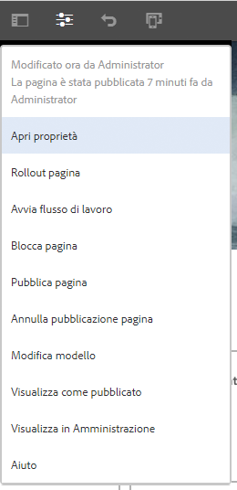
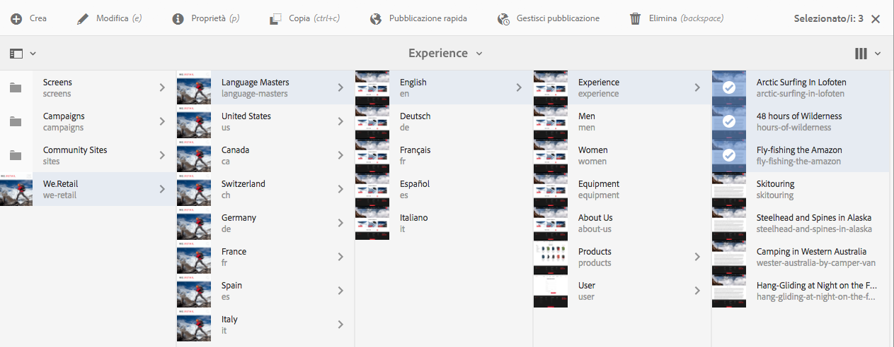
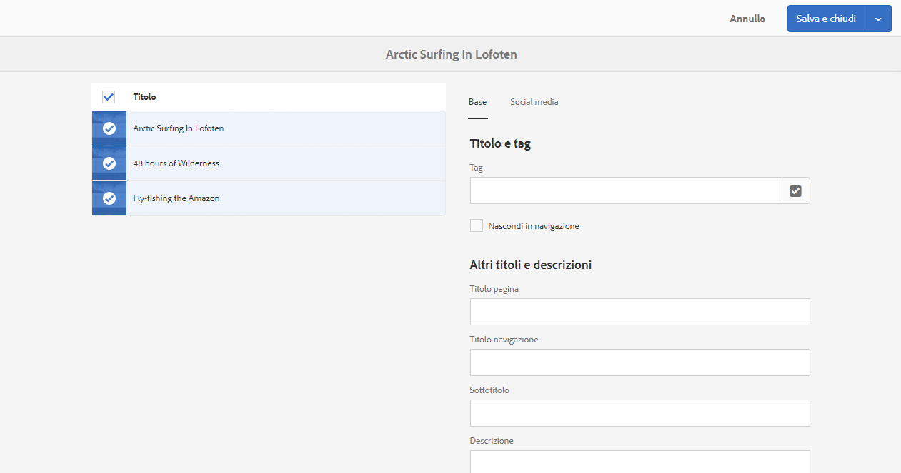

# Modifica delle proprietà di una pagina{#editing-page-properties}

Puoi impostare le proprietà richieste per una pagina. Queste possono variare a seconda del tipo di pagina. Ad esempio, alcune pagine possono essere connesse a una Live Copy, mentre altre no, e le informazioni della Live Copy saranno disponibili ove appropriato.

## Proprietà di pagina {#page-properties}

Le proprietà sono distribuite su più schede.

### Base {#basic}

* **Titolo**

   Il titolo della pagina viene visualizzato in diversi punti. Ad esempio, nell’elenco della scheda **Siti web** e nelle viste a scheda o elenco di **Sites**.

   Questo campo è obbligatorio.

* **Tag**

   Qui puoi aggiungere o rimuovere i tag nella pagina modificando l’elenco nella casella di selezione:

   * Dopo aver selezionato un tag, questo viene elencato nella casella di selezione. Per rimuovere un tag dall’elenco, utilizza l’icona x.
   * Per aggiungere un tag nuovo, digita il nome in una casella di selezione vuota.

      * Il nuovo tag viene creato quando premi Invio.
      * Un asterisco a destra del nome lo identifica come nuovo tag.
   * L’elenco a discesa consente di selezionare uno dei tag esistenti.
   * Quando sposti il mouse su un tag nella casella di selezione viene visualizzata una x, che consente di rimuovere il tag dalla pagina in questione.
   Per ulteriori informazioni sui tag, consulta [Utilizzo dei tag](/help/sites-authoring/tags.md).

* **Nascondi in navigazione**

   Indica se la pagina viene visualizzata o nascosta nella navigazione delle pagine del sito finale.

* **Titolo pagina**

   Titolo da utilizzare nella pagina. Generalmente utilizzato dai componenti titolo. Se questo campo è vuoto, viene utilizzato il **Titolo**.

* **Titolo navigazione**

   Puoi specificare un diverso titolo da usare per la navigazione (ad esempio un titolo più conciso). Se questo campo è vuoto, viene utilizzato il **Titolo**.

* **Sottotitolo**

   Sottotitolo da utilizzare nella pagina.

* **Descrizione**

   La descrizione della pagina, del suo ruolo o altri dettagli.

* **Ora di attivazione**

   Data e ora in cui verrà attivata la pagina pubblicata. Dopo la pubblicazione, la pagina rimarrà inattiva fino alla data e all’ora specificate. 

   Lascia vuoti questi campi per le pagine da pubblicare immediatamente (lo scenario più consueto).

* **Ora di disattivazione**

   Data e ora in cui verrà disattivata la pagina pubblicata.

   Lascia questi campi vuoti per un’azione immediata.

* **URL personalizzato**

   Consente di immettere un URL personalizzato per questa pagina, se desideri inserire un URL più breve e/o più significativo.

   Ad esempio, se l’URL personalizzato è impostato su w `elcome`per la pagina identificata dal percorso / `v1.0/startpage`per il sito Web h `ttp://example.com,` allora h `ttp://example.com/welcome`sarebbe l’URL personalizzato di h `ttp://example.com/content/v1.0/startpage`

   >[!CAUTION]
   >
   >Gli URL personalizzati:
   >
   >* devono essere univoci, quindi accertati che il valore scelto non sia già utilizzato per un’altra pagina;
   >* non supportano le espressioni regolari.

* **Reindirizza URL personalizzato**

   Specifica se vuoi che la pagina usi l’URL personalizzato.

### Avanzate {#advanced}

* **Lingua**

   Indica la lingua della pagina.

* **Reindirizza**

   Indica la pagina a cui deve essere automaticamente reindirizzata la pagina corrente.

* **Progettazione**

   Indica il [design](/help/sites-developing/designer.md) da utilizzare per la pagina.

* **Alias**

   Specifica un alias da utilizzare per la pagina.

   >[!NOTE]
   >
   > Alias imposta la `sling:alias` proprietà per definire un nome alias per la risorsa (questo interessa solo la risorsa, non il percorso).
   >
   >Ad esempio: se si definisce un alias di `latin-lang` per il nodo `/content/we-retail/spanish` , è possibile accedere alla pagina tramite `/content/we-retail/latin-language`
   >
   >Per ulteriori dettagli, consultate Nomi [delle pagine localizzate in SEO e Best practice per la gestione degli URL](/help/managing/seo-and-url-management.md#localized-page-names)

* **Modelli consentiti**

   [Definisci l’elenco di modelli che saranno disponibili](/help/sites-authoring/templates.md#enabling-and-allowing-a-template-template-author) in questo ramo secondario.

* **Autenticazione richiesta**

   Attiva (o disattiva) l’uso dell&#39;autenticazione per accedere alla pagina.

   Qui puoi impostare i requisiti di autenticazione insieme a una pagina di accesso specifica. Nella scheda **[Autorizzazioni](/help/sites-authoring/editing-page-properties.md#permissions)**è possibile definire gruppi utenti chiusi per la pagina.

   >[!CAUTION]
   >
   >The **[Permissions](/help/sites-authoring/editing-page-properties.md#permissions)**tab allows editing of CUG configurations based on the presence of the`granite:AuthenticationRequired`mixin. If page permissions are configured using deprecated CUG configurations, based on the presence of cq:cugEnabled property, a warning message will be shown under **Authentication Requirement**and the option will not be editable, nor will the[Permissions](/help/sites-authoring/editing-page-properties.md#permissions)be editable.
   >
   >
   >In questo caso, le autorizzazioni del gruppo utenti chiuso devono essere modificate [nell’interfaccia classica](/help/sites-classic-ui-authoring/classic-page-author-edit-page-properties.md).

* **Pagina di accesso**

   Indica la pagina da utilizzare per l’accesso.

* **Configurazione esportazione**

   Consente di specificare una configurazione di esportazione.

### Miniatura {#thumbnail}

1. **Miniatura pagina**

   Mostra la miniatura della pagina. Tieni presente quanto segue:

   * **Genera anteprima**

      Genera un’anteprima della pagina da usare come miniatura.

   * **Carica immagine**

      Carica un’immagine da usare come miniatura.

### Social media {#social-media}

* **Condivisione social media**

   Definisce le opzioni di condivisione disponibili sulla pagina. Rende disponibili le opzioni per la [Condivisione dei componenti di base](https://helpx.adobe.com/experience-manager/core-components/using/sharing.html).

   * **Abilita condivisione da parte degli utenti su Facebook**
   * **Abilita condivisione da parte degli utenti su Pinterest**
   * **Variante XF preferita** definisce la variante del frammento esperienza utilizzato per generare i metadati della pagina.

### Servizi cloud {#cloud-services}

* **Servizi cloud**

   Consente di definire le proprietà per i [servizi cloud](/help/sites-developing/extending-cloud-config.md).

### Personalizzazione {#personalization}

* **Personalizzazione**

   Seleziona un [marchio per specificare l’ambito di impostazione della destinazione](/help/sites-authoring/personalization.md).

### Autorizzazioni {#permissions}

* **Autorizzazioni**

   In questa scheda puoi:

   * [Aggiungere autorizzazioni](/help/sites-administering/user-group-ac-admin.md)
   * [Modificare un gruppo utenti chiuso](/help/sites-administering/cug.md#applying-your-closed-user-group-to-content-pages)
   * Visualizzare le [Autorizzazioni effettive](/help/sites-administering/user-group-ac-admin.md)
   >[!CAUTION]
   >
   >The **Permissions** tab allows editing of CUG configurations based on the presence of the `granite:AuthenticationRequired` mixin. Se le autorizzazioni della pagina utilizzano configurazioni del gruppo utenti chiuso obsolete, basate sulla proprietà `cq:cugEnabled`, viene visualizzato un messaggio di avvertenza e non sarà possibile modificare né l’opzione né l&#39;Autenticazione nella scheda [Avanzate](/help/sites-authoring/editing-page-properties.md#advanced).
   >
   >
   >In questo caso, le autorizzazioni del gruppo utenti chiuso devono essere modificate [nell’interfaccia classica](/help/sites-classic-ui-authoring/classic-page-author-edit-page-properties.md).

   >[!NOTE]
   >
   >La scheda Autorizzazioni non consente di creare gruppi utenti chiusi che siano vuoti; una soluzione utile per negare l’accesso a tutti gli utenti. A questo scopo devi usare CRX Explorer. See the document [User, Group and Access Rights Administration](/help/sites-administering/user-group-ac-admin.md) for more information.

### Blueprint {#blueprint}

* **Blueprint**

   Consente di definire le proprietà per una pagina Blueprint nella [gestione multisito](/help/sites-administering/msm.md). Controlla le circostanze in cui le modifiche verranno propagate alla Live Copy.

### Live Copy {#live-copy}

* **Livecopy**

   Consente di definire le proprietà per una pagina Live Copy nell’[utilità di gestione multisito](/help/sites-administering/msm.md). Controlla le circostanze in cui le modifiche verranno propagate dalla Blueprint.

### Struttura sito {#site-structure}

* Fornisce dei collegamenti verso pagine che offrono funzionalità a livello di sito, come **Pagina registrazione**, **Pagina offline** e altre.

## Modifica delle proprietà di una pagina {#editing-page-properties-2}

Puoi definire le proprietà di pagina:

* Dalla console **Sites**:

   * [Crea una nuova pagina](/help/sites-authoring/managing-pages.md#creating-a-new-page) (un sottoinsieme delle proprietà)
   * Clicking or tapping **Properties**

      * Per una singola pagina
      * Per più pagine (solo un sottoinsieme di proprietà è disponibile per la modifica in blocco)

* Dall’editor pagina:

   * Utilizzando **Informazioni pagina** (quindi fai clic su **Apri proprietà**)

### Dalla console Sites - Pagina singola {#from-the-sites-console-single-page}

Tocca o fai clic su **Proprietà** per definire le proprietà di pagina:

1. Nella console **Siti**, individuate il percorso della pagina di cui desiderate visualizzare e modificare le proprietà.

1. Select the **Properties** option for the required page using either:

   * [Azioni rapide](/help/sites-authoring/basic-handling.md#quick-actions)
   * [Modalità di selezione](/help/sites-authoring/basic-handling.md#viewing-and-selecting-resources)
   Le proprietà di pagina vengono visualizzate utilizzando le relative schede.

1. Visualizza o modifica le proprietà a seconda delle tue esigenze.

1. Quindi, seleziona **Salva** per salvare le modifiche e **Chiudi** per tornare alla console.

### Durante la modifica di una pagina {#when-editing-a-page}

Quando modifichi una pagina puoi utilizzare **Informazioni di pagina** per definire le proprietà della pagina:

1. Aprite la pagina di cui desiderate modificare le proprietà.

1. Seleziona l’icona **Informazioni di pagina** per aprire il menu di selezione.

   

1. Select **Open Properties** and a dailog will open allowing you to edit the properties, sorted by the appropriate tab. A destra della barra degli strumenti sono disponibili anche i seguenti pulsanti:

   * **Annulla**
   * **Salva e chiudi**

1. Usa il pulsante **Salva e chiudi** per salvare le modifiche. 

### Dalla console Sites - Pagine multiple {#from-the-sites-console-multiple-pages}

Dalla console **Sites** puoi selezionare diverse pagine, utilizzando poi **Visualizza proprietà** per visualizzare e/o modificare le proprietà della pagina. Questa operazione viene definita bulk edit delle proprietà della pagina.

>[!NOTE]
>
>La modifica collettiva delle proprietà è disponibile anche per le Risorse. È molto simile, ma differisce per alcuni aspetti. Per ulteriori informazioni, consulta [Modificare le proprietà di risorse multiple](/help/assets/managing-multiple-assets.md).
>
>È disponibile anche lo strumento di [Modifica collettiva](/help/sites-administering/bulk-editor.md), che consente di cercare contenuti da più pagine tramite GQL (Google Query Language), e quindi di modificare il contenuto direttamente sullo strumento prima di salvare le modifiche sulle pagine originate.

Puoi selezionare più pagine per la modifica collettiva utilizzando diversi metodi, tra i quali:

* Utilizzare la console **Sites**.
* Dopo aver utilizzato **Cerca** per individuare un insieme di pagine.

After selecting the pages and then clicking or tapping the **Properties** option, the bulk properties will be shown:

Puoi eseguire la modifica collettiva solo su pagine che:

* Condividono lo stesso tipo di risorsa;
* Non fanno parte di una live copy.

   * Se una delle pagine fa parte di una live copy, all’apertura delle proprietà viene visualizzato un messaggio di avviso.

Dopo aver attivato la funzione di modifica collettiva, puoi effettuare le seguenti operazioni:

* **Visualizzazione**

   Quando visualizzi le Proprietà pagina per pagine multiple puoi vedere:

   * Un elenco delle pagine interessate.

      * Puoi selezionarle/deselezionarle se necessario.
   * Schede

      * Come per la visualizzazione delle proprietà di una pagina singola, le proprietà sono ordinate in schede.
   * Un sottoinsieme di proprietà.

      * Puoi vedere le proprietà che sono disponibili su tutte le pagine selezionate, e che sono state esplicitamente definite come disponibili per la modifica collettiva.
      * Se la tua selezione include una sola pagina, tutte le proprietà sono visibili.
   * Proprietà condivise con un valore comune

      * Solo le proprietà con un valore comune vengono mostrate nella modalità Visualizzazione.
      * Quando il campo ha valori multipli (ad esempio i Tag), questi vengono visualizzati solo se *tutti* i valori sono applicati alle pagine selezionate. Se le pagine hanno in comune solo alcuni valori, questi verranno visualizzati solo in fase di modifica.
   Se non esiste nessuna proprietà con un valore comune, viene visualizzato un messaggio.

* **Modifica**

   Quando modifichi le Proprietà pagina per pagine multiple:

   * Puoi aggiornare i valori nei campi disponibili.

      * I nuovi valori saranno applicati a tutte le pagine selezionate quando fai clic su **Fine**.
      * Quando il campo ha valori multipli (ad esempio i Tag), puoi aggiungere un nuovo valore o rimuovere un valore comune.
   * Fields that are common, but have different values across the various pages will be indicated with a special value such as the text `<Mixed Entries>`. Presta attenzione quando modifichi tali campi per evitare una perdita di dati.

>[!NOTE]
>
>Il componente di pagina può essere configurato in modo da specificare i campi disponibili per la modifica collettiva. Consulta [Configurazione della pagina per la modifica collettiva delle proprietà di pagina](/help/sites-developing/bulk-editing.md).

