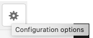

# Frammenti esperienza{#experience-fragments}

Un Frammento esperienza è un gruppo di uno o più componenti, che include contenuto e layout, a cui è possibile fare riferimento tra le pagine. Possono contenere qualsiasi componente.

Caratteristiche di un Frammento esperienza:

* È parte di un’esperienza (pagina).
* Può essere utilizzato su più pagine.
* Si basa su un modello (solo modificabile) per la definizione di struttura e componenti.
* È composto da uno o più componenti, con layout, in un sistema di paragrafo.
* Può contenere altri frammenti esperienza.
* Può essere combinato con altri componenti (inclusi gli altri Frammenti esperienza) per formare una pagina completa (esperienza).
* Può avere diverse varianti, che possono condividere contenuti e/o componenti.
* Può essere suddiviso in blocchi predefiniti che possono essere utilizzati in più varianti del frammento.

Quando utilizzare un Frammento esperienza:

* Se un autore desidera riutilizzare delle parti (un frammento di un’esperienza) di una pagina, deve copiare e incollare il frammento. Creare e gestire queste esperienze tramite copia/incolla richiede tempo e può essere fonte di errori da parte dell’utente. I frammenti esperienza eliminano la necessità di copiare/incollare.
* Per supportare il caso d’uso headless CMS. Gli autori desiderano utilizzare AEM solo per l’authoring ma non per la distribuzione al cliente. Un sistema o punto di contatto di terze parti potrebbe prendere in carico questa particolare esperienza e in seguito trasmetterla all’utente finale.

>[!NOTE]
>
>Per poter accedere in scrittura ai frammenti esperienza, l’account utente deve essere registrato nel gruppo
>
>`experience-fragments-editors`
>
>Per qualsiasi problema riscontrato, contatta l’amministratore del sistema.

## Quando utilizzare i frammenti esperienza? {#when-should-you-use-experience-fragments}

I frammenti esperienza devono essere utilizzati:

* Quando desideri riutilizzare le esperienze.

   * Per esperienze che riutilizzerai con contenuti simili o uguali.

* Quando utilizzi AEM come piattaforma di distribuzione di contenuti per terze parti.

   * Per qualsiasi soluzione che utilizza AEM come piattaforma di distribuzione di contenuti.
   * Per incorporare contenuti nei touchpoint di terze parti.

* Se usi un’esperienza con diverse varianti o rappresentazioni.

   * Varianti per un canale o per un contesto specifico.
   * Per esperienze che è utile raggruppare (ad esempio una campagna con diverse esperienze per i vari canali).

* Quando utilizzi Commerce omnichannel.

   * Per condividere contenuti commerciali sui canali di social media su larga scala.
   * Per assegnare funzioni transazionali ai touchpoint.

## Organizzazione dei frammenti esperienza {#organizing-your-experience-fragments}

Si consiglia di:
* utilizzare le cartelle per organizzare i frammenti esperienza,

* [configurate i modelli consentiti in queste cartelle](#configure-allowed-templates-folder).

La creazione di cartelle consente di:

* creare una struttura significativa per i frammenti esperienza; ad esempio, in base alla classificazione

   >[!NOTE]
   >
   >Non è necessario allineare la struttura dei frammenti esperienza con la struttura di pagina del sito.

* [allocare i modelli consentiti a livello di cartella](#configure-allowed-templates-folder)

   >[!NOTE]
   >
   >Puoi utilizzare l&#39;[Editor modelli](/help/sites-authoring/templates.md) per creare un modello personalizzato.

L’esempio seguente mostra i frammenti esperienza strutturati in base a `Contributors`. La struttura utilizzata illustra anche come possono essere utilizzate altre funzioni, come la gestione multisito (incluse le copie della lingua).

>[!CAUTION]
>
>La schermata seguente è stata ripresa dal sito WKND utilizzando Adobe Experience Manager come servizio Cloud.

## Creazione e configurazione di una cartella per i frammenti esperienza {#creating-and-configuring-a-folder-for-your-experience-fragments}

Per creare e configurare una cartella per i frammenti esperienza, si consiglia di:

1. [Create una cartella](/help/sites-authoring/managing-pages.md#creating-a-new-folder).

1. [Configura i modelli di frammento esperienza consentiti per la cartella](#configure-allowed-templates-folder).

>[!NOTE]
>
>È anche possibile configurare i modelli [consentiti per l’istanza](#configure-allowed-templates-instance), ma questo metodo **non** è consigliato in quanto i valori possono essere sovrascritti al momento dell’aggiornamento.

### Configurare i modelli consentiti per la cartella {#configure-allowed-templates-folder}

>[!NOTE]
>
>Questo è il metodo consigliato per specificare i modelli **** consentiti, poiché i valori non verranno sovrascritti al momento dell&#39;aggiornamento.

1. Individua la cartella **[!UICONTROL Frammenti esperienza]** necessaria.

1. Selezionate la cartella, quindi **[!UICONTROL Proprietà]**.

1. Specificate l&#39;espressione regolare per recuperare i modelli richiesti nel campo Modelli **** consentiti.

   Ad esempio:
   `/conf/(.*)/settings/wcm/templates/experience-fragment(.*)?`

   

1. Selezionate **[!UICONTROL Salva e chiudi]**.

### Configurare i modelli consentiti per la tua istanza {#configure-allowed-templates-instance}

>[!CAUTION]
>
>Non è consigliabile modificare i modelli **** consentiti con questo metodo, in quanto i modelli specificati potrebbero essere sovrascritti al momento dell&#39;aggiornamento.
>
>Utilizzare questa finestra di dialogo solo a scopo informativo.

1. Navigate to the required **[!UICONTROL Experience Fragments]** console.

1. Seleziona le **[!UICONTROL opzioni di configurazione]**:

   

1. Specifica i modelli richiesti nella finestra di dialogo **[!UICONTROL Configura frammenti esperienza]**:

   

1. Seleziona **[!UICONTROL Salva]**.

## Creazione di un frammento esperienza {#creating-an-experience-fragment}

Per creare un frammento esperienza:

1. Select **[!UICONTROL Experience Fragments]** from the Global Navigation.

   

1. Passate alla cartella desiderata e selezionate **[!UICONTROL Crea]**.

1. Selezionate **[!UICONTROL Frammento]** esperienza per aprire la procedura guidata **[!UICONTROL Crea frammento]** esperienza.

   Seleziona il **[!UICONTROL Modello]** richiesto, quindi fai clic su **[!UICONTROL Avanti]**:

   

1. Immetti le **[!UICONTROL Proprietà]** per il Frammento di esperienza.

   Il campo **[!UICONTROL Titolo]** è obbligatorio. Se il campo **[!UICONTROL Nome]** è lasciato vuoto, verrà derivato dal **[!UICONTROL Titolo]**.

   

1. Fai clic su **[!UICONTROL Crea]**.

   Viene visualizzato un messaggio. Seleziona:

   * **[!UICONTROL Fine]** per tornare alla console
   * **[!UICONTROL Apri]** per aprire l’editor frammenti

## Modifica del frammento esperienza {#editing-your-experience-fragment}

L’Editor di frammenti esperienza offre funzionalità simili al normale Editor di pagina. Consulta [Modifica del contenuto di pagina](/help/sites-authoring/editing-content.md) per ulteriori informazioni su come usare questo strumento.

L’esempio seguente illustra come creare un teaser per un prodotto:

1. Drag and drop a **[!UICONTROL Category Teaser]** from the [Components Browser](/help/sites-authoring/author-environment-tools.md#components-browser).

   

1. Seleziona **[!UICONTROL Configura](/help/sites-authoring/editing-content.md#edit-configure-copy-cut-delete-paste)**nella barra degli strumenti del componente.
1. Aggiungi la **[!UICONTROL Risorsa]** e definisci le **[!UICONTROL Proprietà]** secondo le esigenze.
1. Conferma le definizioni con **[!UICONTROL Fine]** (icona di spunta).
1. Aggiungi altri componenti in base alle esigenze.

## Creazione di una variante del frammento esperienza {#creating-an-experience-fragment-variation}

Puoi creare diverse varianti per un Frammento esperienza a seconda delle tue esigenze:

1. Apri la pagina per la [modifica](/help/sites-authoring/experience-fragments.md#editing-your-experience-fragment).
1. Apri la scheda **[!UICONTROL Varianti]**.

   

1. **Crea** ti consente di creare:

   * **[!UICONTROL Variazione]**
   * **[!UICONTROL Variante come Live Copy]**.

1. Definisci le proprietà richieste:

   * **[!UICONTROL Modello]**
   * **[!UICONTROL Titolo]**
   * **[!UICONTROL Nome]**; se lasciato vuoto, verrà derivato dal Titolo
   * **[!UICONTROL Descrizione]**
   * **[!UICONTROL Tag varianti]**
   

1. Conferma con **[!UICONTROL Fine]** (icona di spunta); la nuova variante viene visualizzata nel pannello:

   

## Utilizzo del frammento esperienza {#using-your-experience-fragment}

A questo punto puoi utilizzare il frammento esperienza durante l’authoring delle pagine:

1. Apri la pagina da modificare.

   Ad esempio: [http://localhost:4502/editor.html/content/we-retail/language-masters/en/products/men.html](http://localhost:4502/editor.html/content/we-retail/language-masters/en/products/men.html)

1. Crea un’istanza del componente Frammento esperienza trascinandolo dal browser Componenti al sistema di paragrafi della pagina:

   

1. Aggiungi il frammento esperienza effettivo all’istanza del componente, eseguendo una delle seguenti operazioni:

   * Trascina il frammento richiesto dal browser Risorse e rilascialo sul componente
   * Seleziona **[!UICONTROL Configura]** nella barra degli strumenti del componente e specifica il frammento da utilizzare, quindi conferma con **Fine** (spunta)
   

   >[!NOTE]
   >
   >L’opzione Modifica, nella barra degli strumenti del componente, funziona come una scelta rapida per aprire il frammento nell’editor frammenti.

## Blocchi predefiniti {#building-blocks}

Puoi selezionare uno o più componenti per creare un blocco predefinito da riutilizzare nel frammento:

### Creazione di un blocco predefinito {#creating-a-building-block}

Per creare un nuovo blocco predefinito:

1. Nell’editor Frammento esperienza, seleziona i componenti che desideri riutilizzare:

   

1. Dalla barra degli strumenti Componenti, seleziona **[!UICONTROL Converti in blocco predefinito]**:

   

   Ad esempio:

   

1. Inserisci il nome del **[!UICONTROL Blocco predefinito]** e conferma con **[!UICONTROL Converti]**:

   

1. Il **Blocco predefinito** viene visualizzato nella scheda e può essere selezionato nel sistema paragrafo:

   

### Gestione di un blocco predefinito {#managing-a-building-block}

Il blocco predefinito è visibile nella scheda **[!UICONTROL Blocchi predefiniti]**. Per ogni blocco sono disponibili le azioni seguenti:

* Vai a principale: apri la variante principale in una nuova scheda
* Rinomina
* Elimina

### Utilizzo di un blocco predefinito {#using-a-building-block}

Puoi trascinare il blocco predefinito sul sistema di paragrafi di qualsiasi frammento, così come si fa con qualsiasi componente.

## La rappresentazione HTML semplice {#the-plain-html-rendition}

Utilizzando il `.plain.` selettore nell’URL, potete accedere alla rappresentazione HTML semplice.

Questo è disponibile dal browser, ma il suo scopo principale è consentire ad altre applicazioni (ad esempio, app Web di terze parti, implementazioni mobili personalizzate) di accedere direttamente al contenuto del frammento esperienza, utilizzando solo l&#39;URL.

La rappresentazione HTML semplice aggiunge protocollo, host e percorso contestuale a percorsi che sono:

* del tipo: `src`, `href`oppure `action`

* o terminare con: `-src`, oppure `-href`

Ad esempio:

`.../brooklyn-coat/master.plain.html`

>[!NOTE]
>
>I collegamenti fanno sempre riferimento all’istanza di pubblicazione. Sono destinati a essere utilizzati da terzi, pertanto il collegamento verrà sempre chiamato dall’istanza pubblica, non dall’autore.

## Esportazione di frammenti esperienza {#exporting-experience-fragments}

Per impostazione predefinita, i frammenti esperienza vengono forniti nel formato HTML che può essere utilizzati sia da AEM che da canali di terze parti.

Per l&#39;esportazione in Adobe Target, viene utilizzato HTML. Per informazioni complete, consulta [Integrazione di Target con frammenti esperienza](/help/sites-administering/experience-fragments-target.md).

