# Casella in entrata  {#your-inbox}

>[!CAUTION]
>
>AEM 6.4 ha raggiunto la fine del supporto esteso e questa documentazione non viene più aggiornata. Per maggiori dettagli, consulta la nostra [periodi di assistenza tecnica](https://helpx.adobe.com/it/support/programs/eol-matrix.html). Trova le versioni supportate [qui](https://experienceleague.adobe.com/docs/).

Puoi ricevere notifiche da varie aree di AEM, compresi flussi di lavoro e progetti; ad esempio, informazioni su:

* Attività:

   * possono essere create anche in diversi punti nell’interfaccia AEM, ad esempio in **Progetti**,
   * possono essere il prodotto di un flusso di lavoro **Crea attività** o **Crea attività progetto** passo.

* Flussi di lavoro:

   * elementi di lavoro che rappresentano le azioni da eseguire sul contenuto della pagina;

      * sono il prodotto del flusso di lavoro **Partecipante** step
   * elementi con errore, per consentire agli amministratori di ripetere il passaggio non riuscito.

Puoi ricevere queste notifiche nella tua casella in entrata, dove potrai visualizzarle e intervenire.

>[!NOTE]
>
>Le AEM predefinite vengono precaricate con attività amministrative assegnate al gruppo di utenti amministratore. Vedi [Attività amministrative pronte all’uso](#out-of-the-box-administrative-tasks) per i dettagli.

>[!NOTE]
>
>Per ulteriori informazioni sui tipi di elementi, consulta anche:
>
>* [Progetti](/help/sites-authoring/touch-ui-managing-projects.md)
>* [Progetti: lavorare con le attività](/help/sites-authoring/task-content.md)
>* [Flussi di lavoro](/help/sites-authoring/workflows.md)
>* [Forms](/help/forms/home.md)
>

## Casella in entrata nell’intestazione {#inbox-in-the-header}

In una qualsiasi delle console, il numero corrente di elementi nella casella in entrata viene visualizzato nell’intestazione. L’indicatore può anche essere aperto per fornire un accesso rapido alle pagine che richiedono interventi o l’accesso alla casella in entrata:

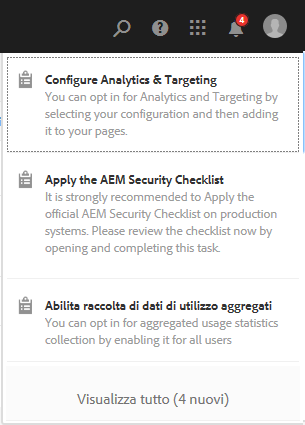

>[!NOTE]
>
>Alcune azioni sono anche visualizzate nella [vista a schede della relativa risorsa](/help/sites-authoring/basic-handling.md#card-view).

## Attività amministrative pronte all’uso  {#out-of-the-box-administrative-tasks}

Le AEM predefinite vengono precaricate con quattro attività assegnate al gruppo di utenti amministratore.

* [Configura Analytics e Targeting](/help/sites-administering/opt-in.md)
* [Applica elenco di controllo sicurezza AEM](/help/sites-administering/security-checklist.md)
* Abilita raccolta di dati di utilizzo aggregati
* [Configura HTTPS](/help/sites-administering/ssl-by-default.md)

## Apertura della casella in entrata  {#opening-the-inbox}

Per aprire la casella in entrata delle notifiche AEM:

1. Tocca o fai clic sull’indicatore nella barra degli strumenti.

1. Seleziona **Visualizza tutto**. Viene aperta la **Casella in entrata AEM**. La casella in entrata mostra gli elementi dei flussi di lavoro, delle attività e dei progetti.
1. La vista predefinita è [Vista elenco](#inbox-list-view), ma puoi anche passare alla [Vista calendario](#inbox-calendar-view). Questa operazione viene effettuata con il selettore vista (barra degli strumenti, in alto a destra).

   Per entrambe le viste è inoltre possibile definire [Visualizza impostazioni](#inbox-view-settings); le opzioni disponibili dipendono dalla vista corrente.

   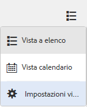

>[!NOTE]
>
>La casella in entrata funziona come una console; puoi quindi utilizzare le funzioni di [Navigazione globale](/help/sites-authoring/basic-handling.md#global-navigation) o [Ricerca](/help/sites-authoring/search.md) per passare a un’altra posizione al termine dell’operazione.

### Casella in entrata - Vista a elenco {#inbox-list-view}

Questa visualizzazione elenca tutti gli elementi, insieme alle informazioni chiave rilevanti:

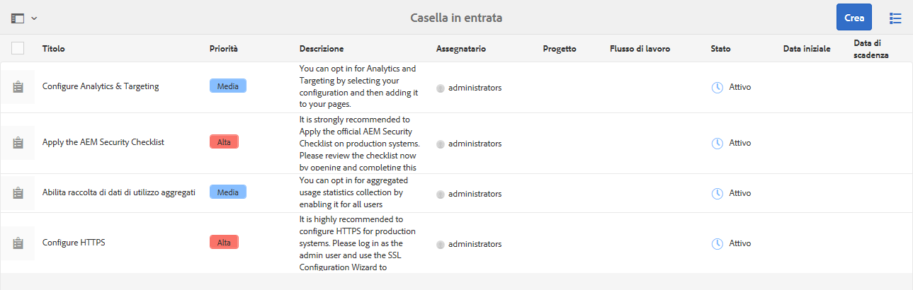

### Casella in entrata - Vista calendario {#inbox-calendar-view}

Questa visualizzazione presenta gli elementi in base alla loro posizione nel calendario e alla visualizzazione precisa selezionata:

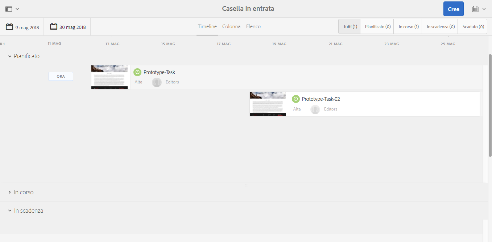

Operazioni disponibili:

* selezionare una vista specifica; **Timeline**, **Colonna**, **Elenco**

* specifica le attività da visualizzare in base a **Pianificazione**; **Tutto**, **Pianificato**, **In corso**, **In scadenza a breve**, **Scaduto**

* approfondire per ottenere informazioni più dettagliate su un elemento
* seleziona un intervallo di date per attivare la visualizzazione:

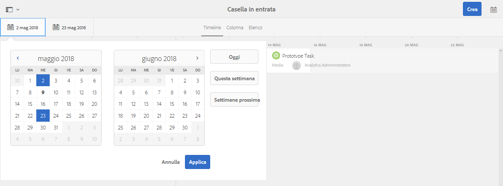

### Casella in entrata - Impostazioni vista {#inbox-view-settings}

Per entrambe le viste (Elenco e Calendario) puoi definire le impostazioni:

* **Vista calendario**

   Per **Vista calendario** puoi configurare:

   * **Raggruppa per**
   * **Pianificazione** o **Nessuna**
   * **Dimensioni scheda**

   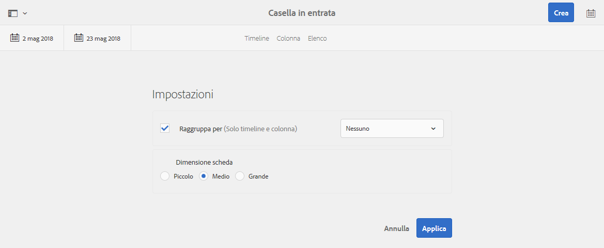

* **Vista a elenco**

   Per **Vista a elenco** puoi configurare il meccanismo di ordinamento:

   * **Ordina per**
   * **Ordinamento**

   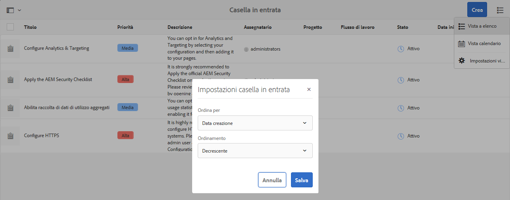

## Intervenire su un elemento {#taking-action-on-an-item}

1. Per intervenire su un elemento, seleziona la miniatura dell’elemento appropriato. Le icone per le azioni applicabili a tale elemento vengono visualizzate nella barra degli strumenti:

   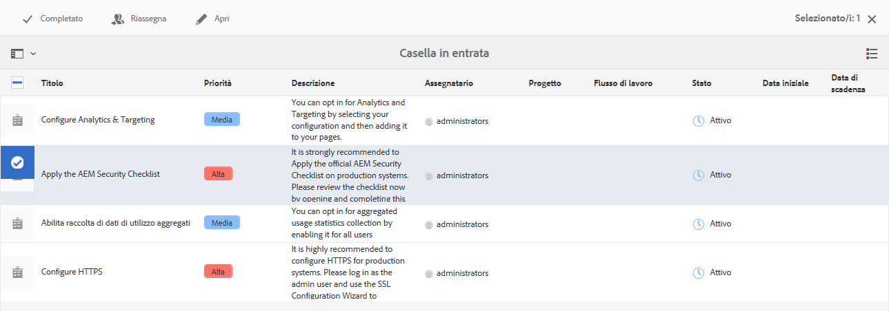

   Le azioni dipendono dall’elemento selezionato e includono:

   * **Completa** l’azione; ad esempio, un&#39;attività o un elemento di flusso di lavoro.
   * **Riassegna**/**Delega** un elemento.
   * **Apri** un elemento; a seconda del tipo di elemento, questa azione può:

      * mostra le proprietà dell’elemento
      * aprire un dashboard o una procedura guidata appropriata per ulteriori azioni
      * aprire la relativa documentazione
   * **Indietro** per tornare a un passaggio precedente.
   * Visualizzazione del payload di un flusso di lavoro.
   * Creazione di un progetto dall’elemento.

   >[!NOTE]
   >
   >Per ulteriori informazioni, consulta:
   >
   >* Elementi del flusso di lavoro - [Partecipazione ai flussi di lavoro](/help/sites-authoring/workflows-participating.md)

1. A seconda dell’elemento selezionato, verrà avviata un’azione; ad esempio:

   * viene aperta una finestra di dialogo appropriata per l’azione .
   * verrà avviata un&#39;azione guidata.
   * verrà aperta una pagina della documentazione.

   Ad esempio: **Riassegna** apre una finestra di dialogo:

   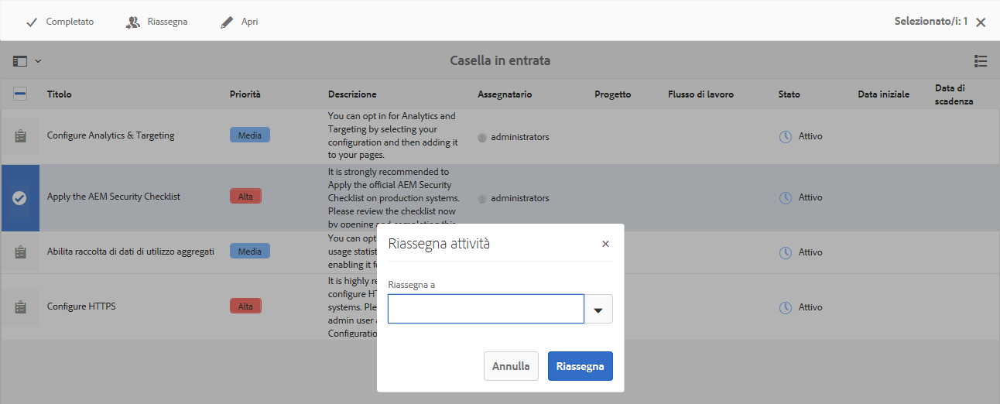

   A seconda della finestra di dialogo, procedura guidata o pagina di documentazione aperta, è possibile:

   * confermare l&#39;azione appropriata; Ad esempio Riassegna.
   * Annulla l’azione.
   * Freccia indietro; ad esempio, se è stata aperta una procedura guidata di azione o una pagina della documentazione, puoi tornare alla casella in entrata.

## Creazione di un’attività {#creating-a-task}

Dalla casella in entrata è possibile creare le attività:

1. Seleziona **Crea**, quindi **Attività**.
1. Compila i campi necessari nella sezione **Base** e **Avanzate** schede; solo il **Titolo** è obbligatorio, tutti gli altri sono facoltativi:

   * **Base**:

      * **Titolo**
      * **Progetto**
      * **Assegnatario**
      * **Contenuto**; simile a Payload, si tratta di un riferimento dall&#39;attività a una posizione nell&#39;archivio
      * **Descrizione**
      * **Priorità attività**
      * **Data inizio**
      * **Data di scadenza**

   

   * **Avanzate**

      * **Nome**: verrà utilizzato per formare l’URL; se vuoto, verrà basato sul **Titolo**.

   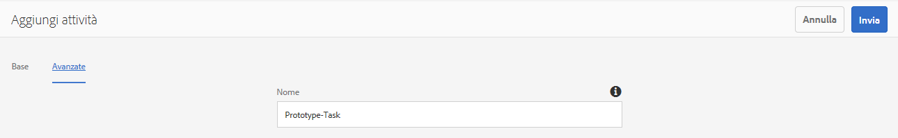

1. Seleziona **Invia**.

## Creazione di un progetto  {#creating-a-project}

Per determinate attività, puoi creare una [Progetto](/help/sites-authoring/projects.md) in base a tale attività:

1. Seleziona l’attività appropriata toccando/facendo clic sulla miniatura.

   >[!NOTE]
   >
   >Per creare un progetto, è possibile utilizzare solo le attività create con l’opzione **Crea** della **Casella in entrata**.
   >
   >Gli elementi di lavoro (da un flusso di lavoro) non possono essere utilizzati per creare un progetto.

1. Dalla barra degli strumenti, seleziona **Crea progetto** per aprire la procedura guidata.
1. Seleziona il modello appropriato, quindi **Successivo**.
1. Specifica le proprietà richieste:

   * **Base**

      * **Titolo**
      * **Descrizione**
      * **Data inizio**
      * **Data di scadenza**
      * **Utente** e ruolo
   * **Avanzate**

      * **Nome**
   >[!NOTE]
   >
   >Vedi [Creazione di un progetto](/help/sites-authoring/touch-ui-managing-projects.md#creating-a-project) per informazioni complete.

1. Seleziona **Crea** per confermare l’azione.

## Filtrare gli elementi nella Casella in entrata AEM {#filtering-items-in-the-aem-inbox}

Puoi filtrare gli elementi elencati:

1. Apri la **Casella in entrata AEM**.

1. Apri il selettore del filtro:

   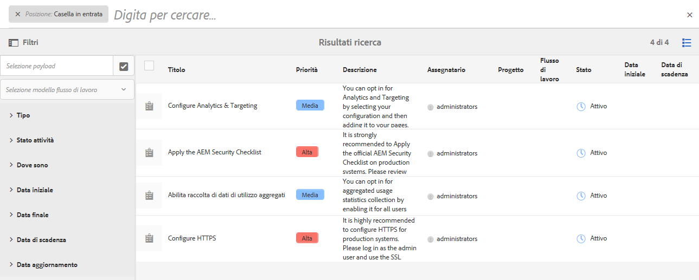

1. Puoi filtrare gli elementi elencati in base a una serie di criteri, molti dei quali possono essere perfezionati; ad esempio:

   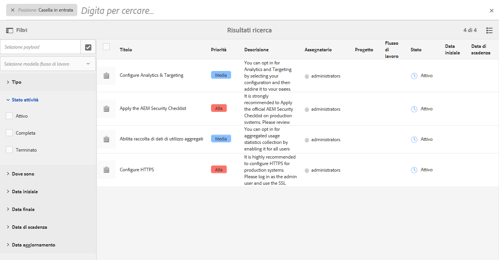

   >[!NOTE]
   >
   >Con [Impostazioni vista](#inbox-view-settings) è anche possibile configurare l’ordinamento quando si utilizza la [Vista a elenco](#inbox-list-view).
