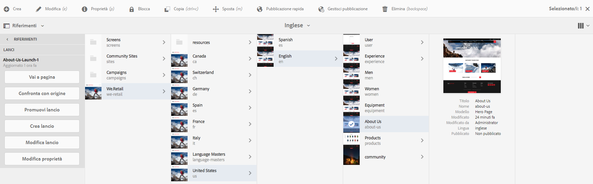
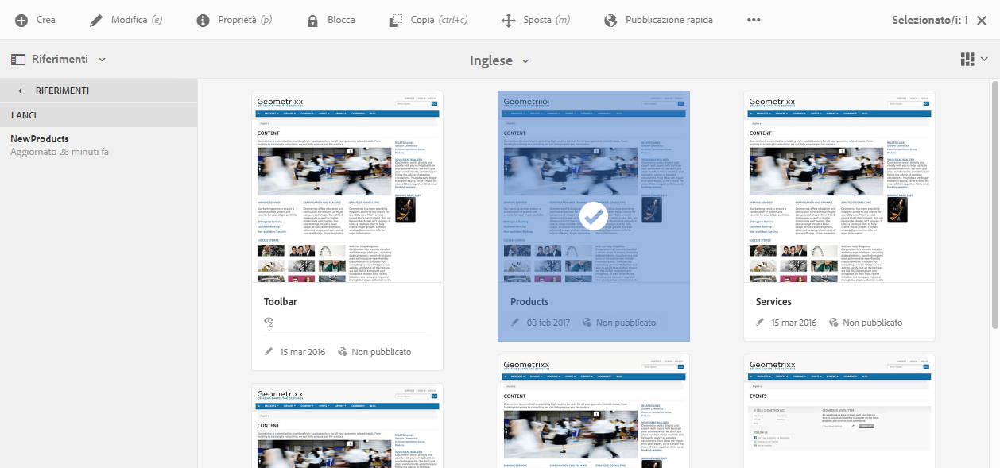

# Modifica dei lanci{#editing-launches}

>[!CAUTION]
>
>AEM 6.4 ha raggiunto la fine del supporto esteso e questa documentazione non viene più aggiornata. Per maggiori dettagli, consulta la nostra [periodi di assistenza tecnica](https://helpx.adobe.com/it/support/programs/eol-matrix.html). Trova le versioni supportate [qui](https://experienceleague.adobe.com/docs/).

## Modifica delle pagine di lancio {#editing-launch-pages}

Quando è stato creato un lancio per una pagina (o un insieme di pagine) è possibile modificare il contenuto nella copia di lancio delle pagine.

1. Accedi a [Lancio da Riferimenti (console Sites)](/help/sites-authoring/launches.md#launches-in-references-sites-console) per visualizzare le azioni disponibili.
1. Seleziona **Vai alla pagina** per aprire la pagina in modalità di modifica.

### Modifica delle pagine di lanci soggette a Live Copy {#editing-launch-pages-subject-to-a-live-copy}

Se il lancio si basa su un [Live Copy](/help/sites-administering/msm.md) quindi:

* consulta simboli di blocco (piccoli lucchetti) quando modifichi un componente (contenuto e/o proprietà).
* vedi **Live Copy** scheda in **Proprietà pagina**

Una Live Copy viene utilizzata per sincronizzare il contenuto *dal* ramo di origine *al* ramo lancio, al fine di mantenere aggiornato il lancio con le modifiche apportate nell’origine.

È possibile apportare modifiche allo stesso modo in cui è possibile modificare una Live Copy standard; ad esempio:

* Facendo clic su un lucchetto chiuso questa sincronizzazione verrà interrotta e potrai apportare nuovi aggiornamenti al contenuto del lancio. Una volta sbloccato (lucchetto aperto) le modifiche non verranno sovrascritte da eventuali modifiche apportate nella stessa posizione all’interno del ramo sorgente.
* **Sospendi** (e **Riprendi**) l’ereditarietà per una pagina specifica.

Vedi [Modifica del contenuto di Live Copy](/help/sites-administering/msm-livecopy.md#changing-live-copy-content) per ulteriori informazioni.

## Confronto di una pagina di lancio con la relativa pagina sorgente {#comparing-a-launch-page-to-its-source-page}

Per tenere traccia delle modifiche apportate, puoi visualizzare il lancio in **Riferimenti** e confrontare la pagina del lancio con la relativa pagina di origine:

1. In **Sites** console, [passa alla pagina sorgente del lancio e selezionala](/help/sites-authoring/basic-handling.md#viewing-and-selecting-resources).
1. Apri **[Riferimenti](/help/sites-authoring/basic-handling.md#references)** e seleziona **Lanci**.
1. Seleziona il lancio specifico e quindi **Confronta con origine**:

   

1. Le due pagine (lancio e sorgente) verranno aperte una accanto all’altra.

   Per informazioni complete sull’utilizzo di questa funzione, consulta [Differenze tra pagine](/help/sites-authoring/page-diff.md).

## Modifica delle pagine sorgente utilizzate {#changing-the-source-pages-used}

In qualsiasi momento è possibile aggiungere o rimuovere pagine da e verso la gamma di pagine di origine per un lancio:

1. Accedi e seleziona il lancio in uno dei seguenti modi:

   * la [Console Lanci](/help/sites-authoring/launches.md#the-launches-console):

      * Seleziona **Modifica**.
   * [Riferimenti (console Sites)](/help/sites-authoring/launches.md#launches-in-references-sites-console) per visualizzare le azioni disponibili:

      * Seleziona **Modifica lancio**.

   Verranno visualizzate le pagine sorgenti.

1. Apporta le modifiche necessarie, quindi conferma con **Salva**.

   >[!NOTE]
   >
   >Per aggiungere pagine a un lancio, queste devono trovarsi sotto una directory principale comune della lingua; ovvero all&#39;interno di un unico sito.

## Modifica di una configurazione di lancio {#editing-a-launch-configuration}

In qualsiasi momento è possibile modificare le proprietà per un lancio:

1. Accedi e seleziona il lancio in uno dei seguenti modi:

   * la [Console Lanci](/help/sites-authoring/launches.md#the-launches-console):

      * Seleziona **Proprietà**.
   * [Riferimenti (console Sites)](/help/sites-authoring/launches.md#launches-in-references-sites-console) per visualizzare le azioni disponibili:

      * Seleziona **Modifica proprietà**.

   Verranno visualizzati i dettagli.

1. Apporta le modifiche necessarie, quindi conferma con **Salva**.

   Consulta la sezione [Lanci - Ordine degli eventi](/help/sites-authoring/launches.md#launches-the-order-of-events) per informazioni sullo scopo e sull’interazione dei campi **Data lancio** e **Production Ready**.

## Esplorazione dello stato di lancio di una pagina {#discovering-the-launch-status-of-a-page}

Lo stato viene visualizzato quando selezioni un lancio specifico dalla scheda Riferimenti (vedi [Lanci nei riferimenti (console Sites)](/help/sites-authoring/launches.md#launches-in-references-sites-console)).

