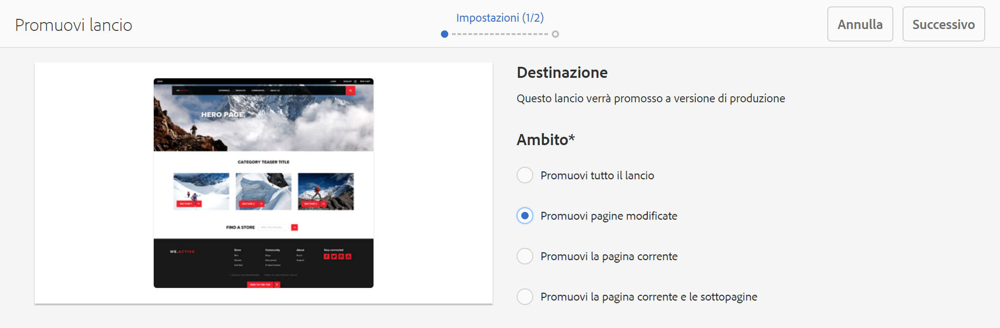
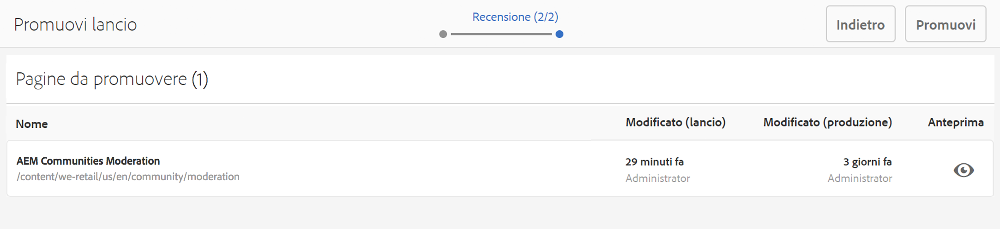
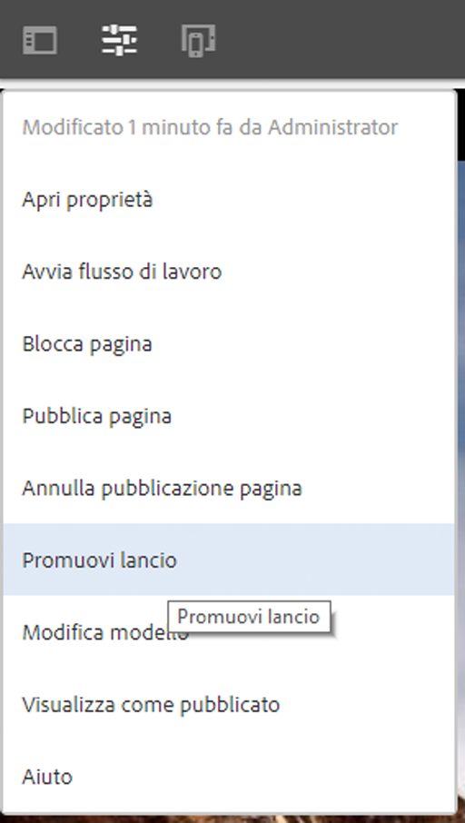
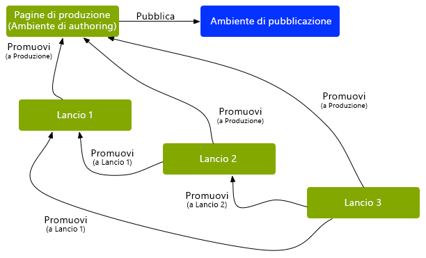
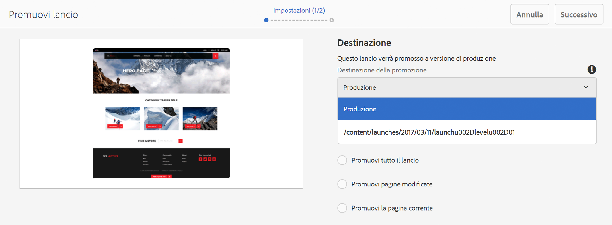
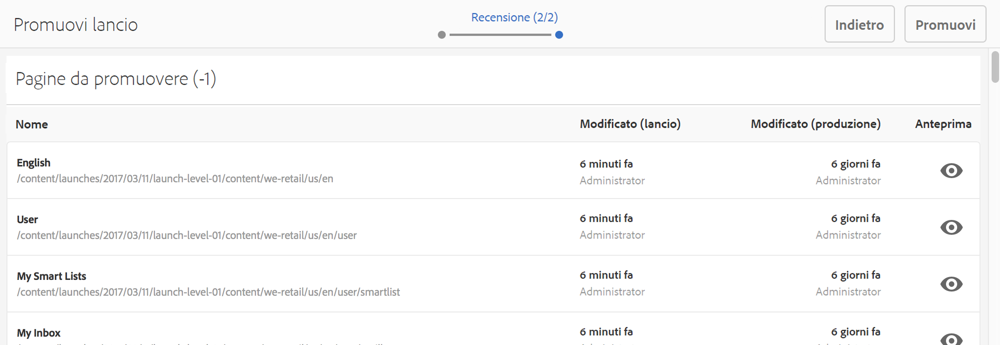
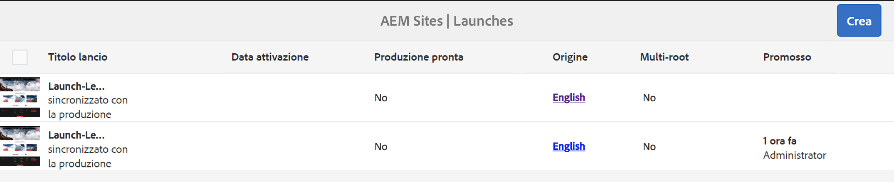
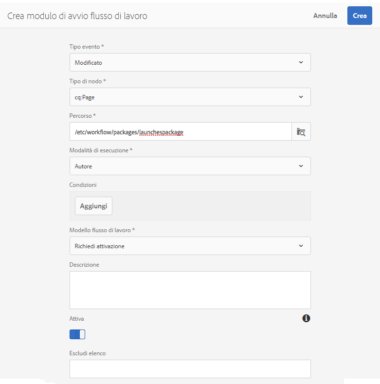

# Promozione dei lanci{#promoting-launches}

Con la promozione delle pagine di lancio si sposta il contenuto nella sorgente (produzione) prima della pubblicazione. Quando una pagina di lancio viene promossa, la pagina corrispondente nelle pagine sorgente viene sostituita con il contenuto della pagina promossa. Quando si promuove una pagina di lancio, sono disponibili le seguenti opzioni:

* Promuovere solo la pagina corrente o l’intero lancio.
* Promuovere le pagine figlie della pagina corrente.
* Promuovere il lancio completo o solo le pagine che sono state modificate.

>[!NOTE]
>
>Dopo aver promosso le pagine del lancio a destinazione (**Produzione**), puoi attivare le pagine di **Produzione** come entità (per rendere il processo più rapido). Aggiungi le pagine a un pacchetto di flusso di lavoro e utilizza quest’ultimo come payload per l’attivazione di un pacchetto di pagine. Prima di promuovere il lancio è necessario creare il pacchetto di workflow. Vedi [Elaborazione di pagine promosse con flusso di lavoro AEM](#processing-promoted-pages-using-aem-workflow).

>[!CAUTION]
>
>Non è possibile promuovere contemporaneamente un singolo lancio. This means that two promote actions on the same launch at the same time can result in an error - `Launch could not be promoted` (together with conflict errors in the log).

>[!CAUTION]
>
>Quando promuovi i lanci per le pagine *modificate*, vengono considerate le modifiche nei rami sia sorgente che lancio.

## Promozione delle pagine di lancio {#promoting-launch-pages}

>[!NOTE]
>
>Riguarda l’azione manuale per promuovere le pagine di lancio quando esiste un solo livello di lancio. Consulta:
>
>* [Promozione di un lancio nidificato](#promoting-a-nested-launch) in caso di più lanci nella struttura.
>* [Lanci: ordine degli eventi](/help/sites-authoring/launches.md#launches-the-order-of-events) per ulteriori dettagli sulla promozione e la pubblicazione automatica.

>

Puoi promuovere un lancio dalla console **Sites** o dalla console **Lanci**:

1. Apri:

   * la console **Sites**:

      1. Open the [references rail](/help/sites-authoring/author-environment-tools.md#references) and select the required source page using [selection mode](/help/sites-authoring/basic-handling.md) (or select and open the references rail, the order is not important). Verranno visualizzati tutti i riferimenti.

      1. Seleziona **Lanci** (ad esempio Lanci (1)) per visualizzare un elenco dei lanci specifici.
      1. Seleziona il lancio specifico per visualizzare le azioni disponibili.
      1. Seleziona **Promuovi lancio** per aprire la procedura guidata.
   * la console **Lanci**:

      1. Seleziona il lancio che ti interessa (tocca o fai clic sulla miniatura).
      1. Seleziona **Promuovi**.

1. Nel primo passaggio puoi specificare i seguenti parametri:

   * **Promuovi tutto il lancio**
   * **Promuovi pagine modificate**
   * **Promuovi la pagina corrente**
   * **Promuovi la pagina corrente e le sottopagine**

   Ad esempio, quando selezioni solo la promozione delle pagine modificate:

   

   >[!NOTE]
   >
   >Riguarda un singolo lancio; per lanci nidificati, vedi [Promozione di un lancio nidificato](#promoting-a-nested-launch).

1. Seleziona **Avanti** per continuare.
1. Puoi rivedere le pagine da promuovere, a seconda dell’intervallo di pagine scelto:

   

1. Seleziona **Promuovi**.

## Promozione di pagine di lancio durante la modifica {#promoting-launch-pages-when-editing}

Durante la modifica di una pagina di lancio, l’azione **Promuovi lancio** è disponibile anche da **Informazioni pagina**. Si aprirà la procedura guidata per raccogliere le informazioni necessarie.

>[!NOTE]
>
>Questa funzione è disponibile per i lanci singoli e per i [lanci nidificati](#promoting-a-nested-launch).

## Promozione di un lancio nidificato {#promoting-a-nested-launch}

Dopo aver creato un lancio nidificato, puoi promuoverlo di nuovo su qualsiasi sorgente, compresa la sorgente principale (produzione).

1. Come per la [Creazione di un lancio nidificato](/help/sites-authoring/launches-creating.md#creating-a-nested-launch), accedi e seleziona il lancio richiesto nella console **Lanci** o nella barra **Riferimenti**.
1. Seleziona **Promuovi lancio** per aprire la procedura guidata.

1. Immetti i dettagli necessari:

   * **Destinazione della promozione**

      È possibile promuovere a qualsiasi origine.

   * **Ambito** Puoi scegliere se promuovere l’intero lancio o solo le pagine che sono state modificate. Nel secondo caso, puoi scegliere di includere o escludere le pagine secondarie. La configurazione predefinita prevede di promuovere le modifiche solo per la pagina corrente:

      * **Promuovi tutto il lancio**
      * **Promuovi pagine modificate**
      * **Promuovi la pagina corrente**
      * **Promuovi la pagina corrente e le sottopagine**

   

1. Seleziona **Avanti**.
1. Rivedi i dettagli della promozione prima di selezionare **Promuovi**:

   

   >[!NOTE]
   >
   >Le pagine elencate dipendono dall’**Ambito** definito ed eventualmente dalle pagine che sono state modificate.

1. Le modifiche verranno promosse e riportate nella console **Lanci**:

   

## Elaborazione di pagine promosse tramite Flusso di lavoro AEM {#processing-promoted-pages-using-aem-workflow}

I modelli di flusso di lavoro consentono di eseguire operazioni di elaborazione collettive sulle pagine di lancio promosse:

1. Crea un pacchetto di flusso di lavoro.
1. Quando gli autori promuovono le pagine di lanci, queste vengono memorizzate nel pacchetto di flusso di lavoro.
1. Avvia un modello di flusso di lavoro utilizzando il pacchetto come payload.

Per avviare automaticamente un flusso di lavoro quando vengono promosse le pagine, [configura un programma di avvio del flusso di lavoro](/help/sites-administering/workflows-starting.md#workflows-launchers) per il nodo del pacchetto.

Ad esempio, puoi generare automaticamente le richieste di attivazione pagina non appena un autore promuove una pagina di lancio. Configura un programma di avvio per avviare il flusso di lavoro Attivazione richiesta quando viene modificato il nodo del pacchetto.

