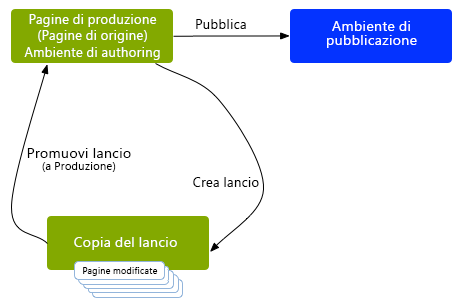
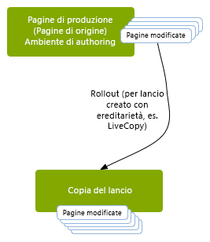
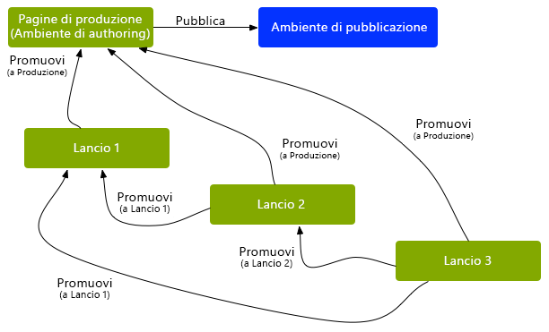
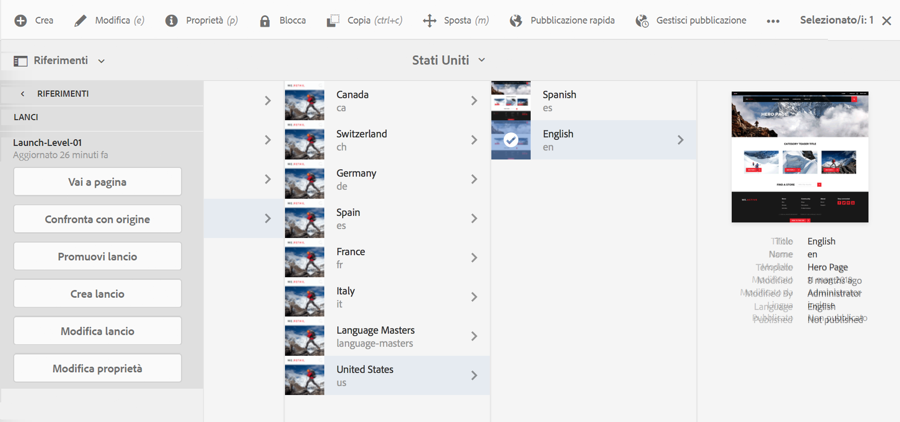

# Panoramica avvii{#launches}

I lanci consentono di creare in modo efficiente contenuti da pubblicare in futuro.

Il lancio creato consente di preparare modifiche pronte alla pubblicazione futura (mantenendo le tue pagine correnti). Dopo aver modificato e aggiornato le pagine di lancio, le promuovi di nuovo a sorgente e quindi attivi le pagine sorgente (livello superiore). Con la promozione il contenuto del lancio viene duplicato sulle pagine sorgente. La promozione può essere effettuata manualmente o automaticamente (a seconda dei campi impostati durante la creazione e la modifica del lancio).

Ad esempio, le pagine dei prodotti stagionali del tuo negozio online vengono aggiornate ogni tre mesi in modo da evidenziare i prodotti per la stagione corrente. Per preparare il prossimo aggiornamento trimestrale, puoi creare un lancio delle pagine web appropriate Nel corso del trimestre, le seguenti modifiche vengono accumulate nella copia del lancio:

* Modifiche apportate alle pagine sorgenti che si verificano in seguito alle consuete attività di manutenzione. Queste modifiche vengono automaticamente duplicate nelle pagine del lancio.
* Modifiche eseguite direttamente sulle pagine di lancio in preparazione del trimestre successivo.

Nel trimestre successivo, promuovi le pagine di lancio in modo da poter pubblicare le pagine sorgenti (mantenendo i contenuti aggiornati). Puoi promuovere tutte le pagine o solo quelle che hai modificato.

I lanci possono anche essere:

* Creati per rami principali multipli. Nonostante sia possibile creare il lancio per l&#39;intero sito (e apportare le modifiche desiderate), questa operazione potrebbe risultare poco pratica perché l&#39;intero sito dovrà essere copiato. Quando vengono coinvolte centinaia o persino migliaia di pagine, i requisiti e le prestazioni di sistema sono influenzate sia dall&#39;azione di copia che, in un secondo momento, dai confronti richiesti per le attività di promozione.
* Nidificato (un lancio all&#39;interno di un lancio), permette di creare un lancio da un lancio esistente, in modo che gli autori possano sfruttare le modifiche già apportate, senza dover eseguire le stesse modifiche più volte per ogni lancio.

Questa sezione spiega come creare, modificare e promuovere (e, se necessario, [eliminare](/help/sites-authoring/launches-creating.md#deleting-a-launch)) le pagine di lancio dall&#39;interno della console Sites o [della console dei lanci](#the-launches-console):

* [Creazione di lanci](/help/sites-authoring/launches-creating.md)
* [Modifica dei lanci](/help/sites-authoring/launches-editing.md)
* [Promozione del lancio](/help/sites-authoring/launches-promoting.md)

## Lanci - Ordine degli eventi {#launches-the-order-of-events}

La funzione Lanci consente di sviluppare i contenuti per il rilascio futuro di una o più pagine web attivate.

I lanci permettono di:

* Crea una copia delle pagine sorgente:

   * La copia è il lancio.
   * Le pagine sorgente di primo livello sono note come **Produzione**.

      * Le pagine sorgenti possono essere prelevate dai rami multipli (separati).
   >[!CAUTION]
   >
   >Nell’interfaccia classica non è possibile utilizzare più rami sorgente per un lancio.

   

* Modifica la configurazione del lancio:

   * Aggiungi o rimuovi pagine e/o rami al/dal lancio.
   * Modifica le proprietà di lancio, come **Titolo**, **Data lancio** e il flag **Production Ready**.

* Puoi promuovere e pubblicare i contenuti manualmente o automaticamente:

   * Manualmente:

      * Promuovi il contenuto del lancio fino al **Target** (pagine sorgenti) quando è pronto per essere pubblicato.
      * Modifica il contenuto dalle pagine sorgenti (dopo la promozione).
      * Promuovi tutte le pagine o solo le pagine modificate.
   * Automaticamente - questo implica le seguenti attività:

      * Il campo **Data** **lancio**(**Live**): può essere impostato durante la creazione o la modifica di un lancio.
      * Il flag **pronto per la produzione**: può essere impostato solo quando si modifica un lancio.
      * Se il flag **pronto per la produzione** è impostato, il lancio verrà promosso automaticamente sulla pagine di produzione alla **data** **lancio**(**Live**) specificata. Dopo la promozione, le pagine di produzione vengono pubblicate automaticamente.

         Se la data non è stata impostata, il flag non ha alcun effetto.

* Aggiorna parallelamente la pagina sorgente e la pagina di lancio:

   * Le modifiche apportate alle pagine sorgenti vengono automaticamente implementate nella copia lancio (se impostate con ereditarietà; ovvero come Live Copy).
   * Le modifiche apportate alla copia di lancio possono essere effettuate senza interrompere gli aggiornamenti automatici o le pagine sorgenti.

   

* [Crea un lancio nidificato](/help/sites-authoring/launches-creating.md#creating-a-nested-launch) - un lancio all&#39;interno di un lancio:

   * L’origine è un lancio esistente.
   * Puoi [promuovere un lancio nidificato](/help/sites-authoring/launches-promoting.md#promoting-a-nested-launch) per qualsiasi target; può trattarsi di un lancio padre o di pagine sorgenti di primo livello (Produzione).

   

   >[!CAUTION]
   >
   >L’eliminazione del lancio rimuove il lancio stesso e tutti i lanci nidificati discendenti.

>[!NOTE]
>
>La creazione e la modifica di avvii richiede diritti di accesso a `/content/launches`, come nel caso del gruppo predefinito `content-authors`.
>
>Per qualsiasi problema riscontrato, contatta l&#39;amministratore del sistema.

### La console dei lanci {#the-launches-console}

La console dei lanci fornisce una panoramica dei tuoi lanci e consente di intraprendere azioni su quelli elencati. Puoi accedere alla console da:

* La console **Strumenti**: **Strumenti**, **Sites**, **Lanci**.

* O direttamente su [http://localhost:4502/libs/launches/content/launches.html](http://localhost:4502/libs/launches/content/launches.html)

## Lanci nei Riferimenti (console Sites) {#launches-in-references-sites-console}

1. Nella console **Sites**, vai all’origine dei lanci.
1. Apri la barra **Riferimenti** e seleziona la pagina sorgente.
1. Seleziona **Lanci** per visualizzare l’elenco dei lanci esistenti:

   

1. Tocca o fai clic sul lancio appropriato per visualizzare l&#39;elenco delle azioni possibili :

   

