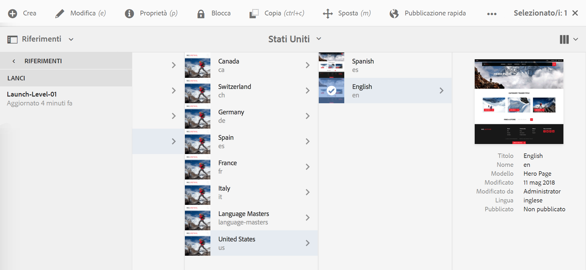

# Panoramica dei lanci{#launches}

>[!CAUTION]
>
>AEM 6.4 ha raggiunto la fine del supporto esteso e questa documentazione non viene più aggiornata. Per maggiori dettagli, consulta la nostra [periodi di assistenza tecnica](https://helpx.adobe.com/it/support/programs/eol-matrix.html). Trova le versioni supportate [qui](https://experienceleague.adobe.com/docs/).

I lanci consentono di creare in modo efficiente contenuti da pubblicare in futuro.

Il lancio creato consente di preparare modifiche pronte alla pubblicazione futura (mantenendo le tue pagine correnti). Dopo aver modificato e aggiornato le pagine di lancio, le promuovi nuovamente all’origine e quindi attivi le pagine sorgente (livello superiore). La promozione duplica il contenuto del lancio nelle pagine sorgente e può essere eseguita manualmente o automaticamente (a seconda dei campi impostati durante la creazione e la modifica del lancio).

Ad esempio, le pagine dei prodotti stagionali del tuo negozio online vengono aggiornate trimestralmente in modo che i prodotti in evidenza si allineino alla stagione corrente. Per preparare il prossimo aggiornamento trimestrale, puoi creare un lancio delle pagine web appropriate. Nel corso del trimestre, le seguenti modifiche vengono accumulate nella copia del lancio:

* Modifiche apportate alle pagine sorgenti che si verificano in seguito alle consuete attività di manutenzione. Queste modifiche vengono duplicate automaticamente nelle pagine del lancio.
* Modifiche eseguite direttamente sulle pagine del lancio in preparazione del trimestre successivo.

Nel trimestre successivo, promuovi le pagine di lancio in modo da poter pubblicare le pagine sorgenti (mantenendo i contenuti aggiornati). Puoi promuovere tutte le pagine o solo quelle che hai modificato.

I lanci possono anche essere:

* Creato per più rami principali. Nonostante sia possibile creare il lancio per l&#39;intero sito (e apportare le modifiche desiderate), questa operazione potrebbe risultare poco pratica perché l&#39;intero sito dovrà essere copiato. Quando sono coinvolte centinaia o persino migliaia di pagine, i requisiti di sistema e le prestazioni sono influenzati sia dall&#39;azione di copia che, successivamente, dai confronti richiesti per le attività di promozione.
* Nidificato (un lancio all’interno di un lancio) per consentirti di creare un lancio da un lancio esistente in modo che gli autori possano sfruttare le modifiche già apportate, anziché dover apportare le stesse modifiche più volte per ogni lancio.

Questa sezione descrive come creare, modificare e promuovere (e se necessario [delete](/help/sites-authoring/launches-creating.md#deleting-a-launch)) avvia le pagine dall’interno della console Sites o [la console Lanci](#the-launches-console):

* [Creazione dei lanci](/help/sites-authoring/launches-creating.md)
* [Modifica dei lanci](/help/sites-authoring/launches-editing.md)
* [Promozione dei lanci](/help/sites-authoring/launches-promoting.md)

## Lanci - Ordine degli eventi {#launches-the-order-of-events}

I lanci consentono di sviluppare in modo efficiente i contenuti per una versione futura di una o più pagine web attivate.

I lanci consentono di:

* Crea una copia delle pagine sorgente:

   * La copia è il lancio.
   * Le pagine sorgente di primo livello sono note come **Produzione**.

      * Le pagine sorgenti possono essere prelevate da più rami (separati).
   >[!CAUTION]
   >
   >Nell’interfaccia classica non è possibile utilizzare più rami sorgente per un lancio.

   

* Modifica la configurazione del lancio:

   * Aggiungi o rimuovi pagine e/o rami dal lancio.
   * Modifica le proprietà di lancio, come **Titolo**, **Data lancio** e il flag **Production Ready**.

* Puoi promuovere e pubblicare il contenuto manualmente o automaticamente:

   * Manualmente:

      * Promuovi il contenuto del lancio verso **Target** (pagine di origine) quando è pronto per essere pubblicato.
      * Pubblica il contenuto dalle pagine sorgente (dopo la promozione).
      * Promuovi tutte le pagine o solo le pagine modificate.
   * Automaticamente - questo implica le seguenti attività:

      * Il campo **Data** **lancio**(**Live**): può essere impostato durante la creazione o la modifica di un lancio.
      * La **Produzione pronta** bandiera: può essere impostato solo durante la modifica di un lancio.
      * Se la **Produzione pronta** è impostato il flag , il lancio verrà promosso automaticamente alle pagine di produzione nel **Launch**(**Live**) **date**. Dopo la promozione, le pagine di produzione vengono pubblicate automaticamente.

         Se la data non è stata impostata, il flag non ha alcun effetto.

* Aggiorna parallelamente la pagina sorgente e la pagina di lancio:

   * Le modifiche apportate alle pagine sorgenti vengono automaticamente implementate nella copia lancio (se impostate con ereditarietà; ovvero come Live Copy).
   * Le modifiche apportate alla copia di lancio possono essere effettuate senza interrompere gli aggiornamenti automatici o le pagine sorgenti.

   

* [Creare un lancio nidificato](/help/sites-authoring/launches-creating.md#creating-a-nested-launch) - un lancio in un lancio:

   * L&#39;origine è un lancio esistente.
   * È possibile [promuovere un lancio nidificato](/help/sites-authoring/launches-promoting.md#promoting-a-nested-launch) a qualsiasi bersaglio; può trattarsi di un lancio padre o di pagine sorgente di primo livello (Produzione).

   

   >[!CAUTION]
   >
   >L’eliminazione del lancio rimuove il lancio stesso e tutti i lanci nidificati discendenti.

>[!NOTE]
>
>La creazione e la modifica dei lanci richiede diritti di accesso a `/content/launches`- come per il gruppo predefinito `content-authors`.
>
>Per qualsiasi problema riscontrato, contatta l&#39;amministratore del sistema.

### Console Lanci {#the-launches-console}

La console Lanci fornisce una panoramica dei lanci e consente di intervenire sui quelli elencati. Puoi accedere alla console da:

* La console **Strumenti**: **Strumenti**, **Sites**, **Lanci**.

* Oppure direttamente con [http://localhost:4502/libs/launches/content/launches.html](http://localhost:4502/libs/launches/content/launches.html)

## Lanci nei riferimenti (console Sites) {#launches-in-references-sites-console}

1. In **Sites** console, passa all’origine dei lanci.
1. Apri **Riferimenti** e seleziona la pagina sorgente.
1. Seleziona **Lanci**, verranno elencati i lanci esistenti:

   

1. Tocca o fai clic sul lancio appropriato per visualizzare l&#39;elenco delle azioni possibili:

   
