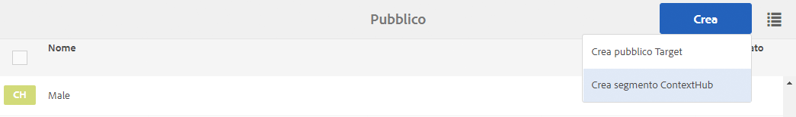
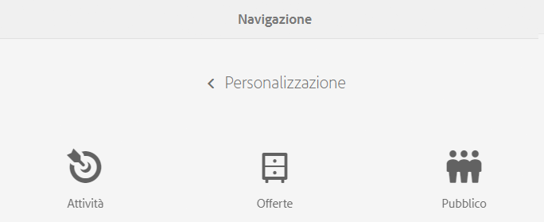
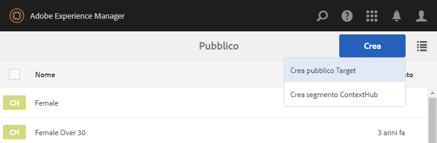

# Gestione dei tipi di pubblico{#managing-audiences}

La console Pubblico consente di creare, organizzare e gestire i tipi di pubblico per il tuo account Adobe Target o i segmenti per ContextHub o Client Context.

* Aggiungi tipi di pubblico: sia per il pubblico Adobe Target che per i segmenti ContextHub.
* Gestisci i tipi di pubblico.

An Audiences, called *segment* in ContextHub and Client Context, is a class of visitors defined by specific criteria, which then determines who sees a targeted activity. Quando esegui il targeting di un&#39;attività, puoi selezionare il pubblico direttamente nel processo Impostazione destinazione o creare nuovi tipi di pubblico nella console Pubblico.

Nella console Pubblico, i tipi di pubblico sono organizzati per marchio.

Audiences are available in Targeting mode for [authoring targeted content](/help/sites-authoring/content-targeting-touch.md), where you can also create audiences (but you need to create Adobe Target audiences in the Audiences console). I tipi di pubblico creati nella modalità Impostazione destinazione appaiono nella console Pubblico.

I tipi di pubblico vengono visualizzati con un’etichetta che li descrive:

* CH - Segmento ContextHub
* CC - Segmento Client Context
* AT - Pubblico Adobe Target

## Creare un segmento ContextHub nella console Pubblico {#creating-a-contexthub-segment-in-the-audiences-console}

Puoi creare un segmento ContextHub sia nella console Pubblico sia durante la procedura di Impostazione destinazione.

Per creare un segmento ContextHub nella console Pubblico:

1. Nella console Navigazione, tocca o fai clic su **Personalizzazione**. Click or tap **Audiences**.
1. Tocca o fai clic su **Crea segmento ContextHub**.

   

1. Nella finestra di dialogo **Nuovo segmento ContextHub**, inserisci un titolo, regola l&#39;incremento e fai clic su **Crea**. Il nuovo segmento ContextHub appare nell&#39;elenco dei tipi di pubblico.

   >[!NOTE]
   >
   >Per ordinare l’elenco modificato in base all’ordine decrescente, tocca o fai clic su **Modificato**, così da visualizzare i tipi di audiences appena creati.

Per ulteriori dettagli sulla creazione di segmenti utilizzando ContextHub, consulta la documentazione [Configurazione della segmentazione con ContextHub](/help/sites-administering/segmentation.md).

## Creazione di un pubblico di Adobe Target dalla console Pubblico {#creating-an-adobe-target-audience-using-the-audience-console}

Puoi creare un pubblico di Adobe Target direttamente in AEM usando la console Pubblico.

I tipi di pubblico sono definiti da regole che determinano chi è incluso in un&#39;attività di targeting. Una definizione di pubblico può includere più regole e ogni regola può includere più parametri.

Quando utilizzi più regole, queste vengono combinate tramite l&#39;operatore booleano E, di conseguenza tutti i potenziali visitatori appartenenti al pubblico devono soddisfare tutte le condizioni definite per essere inclusi nell&#39;attività. Ad esempio, se definisci una regola per il sistema operativo E una regola per il browser, verranno inclusi nell&#39;attività solo i visitatori che usano sia il sistema operativo sia il browser definiti nelle regole.

>[!NOTE]
>
>Se non vedi le voci **Crea pubblico Target** nel menu **Crea**, non disponi delle autorizzazioni necessarie per creare un pubblico. You need write permissions under **/etc/segmentation** to be able to create audiences. Per impostazione predefinita, gli autori dei contenuti del gruppo sono in possesso di autorizzazioni di scrittura.

Per creare un pubblico di Adobe Target:

1. Nella console Navigazione, tocca o fai clic su **Personalizzazione**. Click or tap **Audiences**.

   

1. Nella console Pubblico, tocca o fai clic su **Crea** e poi su **Crea pubblico Target**.

   

1. Nella finestra di dialogo **Configurazione Adobe Target**, seleziona la configurazione di destinazione, quindi tocca o fai clic su **OK**.
1. Nell&#39;area della prima regola, tocca o fai clic sul tipo di attributo e inserisci tutte le informazioni sull&#39;attributo nei campi disponibili. Una volta terminato, fai clic sul segno di spunta a destra dell&#39;attributo per salvarlo. Consulta [Attributi e relative opzioni](#attributes-and-their-options) per informazioni su tutti gli attributi.
1. Fai clic su **Aggiungi regola** per aggiungere un’altra regola. Immetti tutte le regole necessarie. Le regole sono combinate con l’operatore booleano AND, il che significa che l’audience deve soddisfare tutti i requisiti di ciascuna regola per essere idonea a un’attività.
1. Tocca o fai clic su **Avanti**.
1. Inserisci un nome per il pubblico e poi tocca o fai clic su **Salva**.
1. Tap or click **Save**. La nuovo pubblico viene inserito nell’elenco dei tipi di pubblico.

### Attributi e relative opzioni {#attributes-and-their-options}

È possibile creare regole di targeting per ciascuno dei seguenti attributi:

| **Attributo** | **Descrizione** | **Per ulteriori informazioni** |
|---|---|---|
| **Mobile** | Consente di eseguire il targeting dei dispositivi mobili in base a parametri quali dispositivo mobile, tipo di dispositivo, fornitore del dispositivo, dimensioni dello schermo (in pixel) e altro ancora. | Consulta la documentazione  Mobile in  Adobe Target. |
| **Personalizzata** | I parametri personalizzati sono parametri mbox. Se passi dei parametri mbox alle mbox o se utilizzi la funzione targetPageParams, tali parametri vengono visualizzati qui per poter essere utilizzati nei tipi di pubblico. | Consultate la documentazione [sui parametri](https://docs.adobe.com/content/help/en/target/using/audiences/create-audiences/categories-audiences/custom-parameters.html) personalizzati in  Adobe Target. |
| **Sistema operativo** | Potete eseguire il targeting dei visitatori che utilizzano un determinato sistema operativo. | Individua utenti che usano Linux, Macintosh, o Windows. |
| **Pagine del sito** | Esegue il targeting dei visitatori che si trovano su una pagina specifica o che dispongono di un parametro mbox specifico. | Consultate la documentazione [Pagine](https://docs.adobe.com/content/help/en/target/using/audiences/create-audiences/categories-audiences/site-pages.html) del sito  Adobe Target. |
| **Browser** | Potete eseguire il targeting degli utenti che utilizzano un browser specifico o opzioni specifiche del browser quando visitano la pagina. | Consultate [Documentazione sulle opzioni](https://docs.adobe.com/content/help/en/target/using/audiences/create-audiences/categories-audiences/browser.html)del browser in  Adobe Target. |
| **Profilo visitatore** | Esegue il targeting dei visitatori che soddisfano parametri di profilo specifici. | Consulta la documentazione [sul profilo del](https://docs.adobe.com/content/help/en/target/using/audiences/visitor-profiles/visitor-profile.html) visitatore  Adobe Target. |
| **Sorgenti di traffico** | Esegue il targeting dei visitatori in base al motore di ricerca o alla pagina di destinazione che li rimanda al sito. | Consulta la documentazione [Origini](https://docs.adobe.com/content/help/en/target/using/audiences/create-audiences/categories-audiences/traffic-sources.html) traffico in  Adobe Target. |

## Modifica di un pubblico nella console Pubblico {#modifying-an-audience-in-the-audiences-console}

>[!NOTE]
>
>È possibile modificare solo i tipi di pubblico di Adobe Target che sono stati creati nella stessa istanza AEM utilizzata per la modifica. I tipi di pubblico creati in ambienti AEM diversi non possono essere modificati.

Puoi modificare qualsiasi pubblico ContextHub o Client Context dalla console Pubblico. Puoi anche modificare i tipi di pubblico di Adobe Target, ma solo quelli che sono stati creati in AEM:

1. Nella console Navigazione, tocca o fai clic su **Personalizzazione**. Click or tap **Audiences**.
1. Tocca o fai clic sull&#39;icona accanto al segmento ContextHub o Client Context da modificare, e poi tocca o fai clic su **Modifica**.
1. Apporta le modifiche nell&#39;editor segmento. Consulta la documentazione [ClientContext](/help/sites-administering/campaign-segmentation.md) o [ContextHub](/help/sites-administering/contexthub-config.md).

