# Creazione e organizzazione delle pagine{#creating-and-organizing-pages}

>[!CAUTION]
>
>AEM 6.4 ha raggiunto la fine del supporto esteso e questa documentazione non viene più aggiornata. Per maggiori dettagli, consulta la nostra [periodi di assistenza tecnica](https://helpx.adobe.com/it/support/programs/eol-matrix.html). Trova le versioni supportate [qui](https://experienceleague.adobe.com/docs/).

Questa sezione descrive come creare e gestire le pagine con Adobe Experience Manager (AEM) in modo da poter [creare contenuto](/help/sites-authoring/editing-content.md) su quelle pagine.

>[!NOTE]
>
>Il tuo account deve [diritti di accesso appropriati](/help/sites-administering/security.md) e [permissions](/help/sites-administering/security.md#permissions) per intervenire sulle pagine, ad esempio per creare, copiare, spostare, modificare ed eliminare elementi.
>
>Nell’eventualità di problemi, rivolgiti al tuo amministratore di sistema.

>[!NOTE]
>
>Vi sono una serie di [scelte rapide da tastiera](/help/sites-authoring/keyboard-shortcuts.md) che si possono utilizzare dalla console di siti web che consentono di organizzare le pagine con maggiore efficienza.

## Organizzazione del sito web {#organizing-your-website}

In qualità di autore dovrai organizzare il tuo sito web all’interno di AEM. Ciò comporta la creazione e la denominazione delle pagine di contenuto in modo che:

* siano facilmente reperibili nell’ambiente di authoring;
* i visitatori possano facilmente sfogliare le pagine nell’ambiente di pubblicazione.

È inoltre possibile utilizzare le [cartelle](#creating-a-new-folder) per organizzare i contenuti.

La struttura di un sito web può essere pensata come una struttura ad albero che contiene le pagine dei contenuti. I nomi di queste pagine di contenuto vengono utilizzati per formare gli URL, mentre il titolo viene visualizzato quando viene visualizzato il contenuto della pagina.

Di seguito è riportato un esempio del sito We.Retail, in cui una pagina di pantaloncini da trekking ( `desert-sky-shorts`) è accessibile:

* Ambiente di authoring: `http://localhost:4502/editor.html/content/we-retail/us/en/products/equipment/hiking/desert-sky-shorts.html`

* Ambiente di pubblicazione: `http://localhost:4503/content/we-retail/us/en/products/equipment/hiking/desert-sky-shorts.html`

A seconda della configurazione dell’istanza, utilizza `/content` potrebbe essere facoltativo nell’ambiente di pubblicazione.

```xml
 /content
 /we-retail
  /us
   /en
    /products
     /equipment
      /hiking
       /desert-sky-shorts
       /hiking-poles
       /... 
      /running...
      /surfing...
      /...
     /seasonal...
     /...
    /about-us
    /experience
    /...
   /es...
  /de...
  /fr...
  /...
 /...
```

Questa struttura può essere visualizzata dalla console **Sites**, che consente di [navigare tra le varie pagine del sito web](/help/sites-authoring/basic-handling.md#product-navigation) e di eseguire azioni sulle pagine. È possibile, inoltre, creare nuovi siti e [nuove pagine](#creating-a-new-page).

Da qualsiasi punto, puoi vedere il ramo verso l’alto dalle breadcrumb nella barra dell’intestazione:

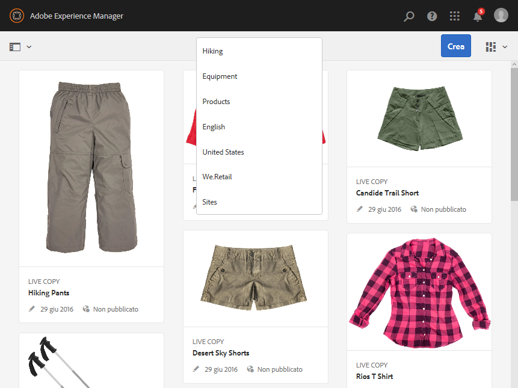

### Convenzioni di denominazione delle pagine {#page-naming-conventions}

Durante la creazione di una nuova pagina sono disponibili due campi chiave:

* **[Titolo](#title)**:

   * Viene mostrato all’utente nella console ed è disponibile sopra il contenuto della pagina durante la modifica.
   * Questo campo è obbligatorio.

* **[Nome](#name)**:

   * Viene utilizzato per generare l’URI.
   * L’input dell’utente per questo campo è opzionale. Se non viene specificato, il nome viene derivato dal titolo. Per ulteriori dettagli, consulta la seguente sezione sulle [restrizioni e best practice per i nomi delle pagine](/help/sites-authoring/managing-pages.md#page-name-restrictions-and-best-practices).

#### Restrizioni e best practice per i nomi delle pagine {#page-name-restrictions-and-best-practices}

Il **Titolo** e il **Nome** della pagina possono essere creati separatamente, ma sono correlati:

* Durante la creazione di una pagina, solo il **Titolo** campo obbligatorio. Se no **Nome** viene fornito al momento della creazione della pagina, AEM genera un nome a partire dai primi 64 caratteri del titolo (osservando la convalida di seguito riportata). Vengono utilizzati solo i primi 64 caratteri, per rispettare la best practice sui nomi di pagina brevi.

* Se un nome di una pagina è specificato manualmente dall’autore, il limite di 64 caratteri non è applicabile; tuttavia, potrebbero esserci altre limitazioni tecniche sulla lunghezza del nome della pagina.

>[!NOTE]
>
>Quando si definisce un nome di una pagina, è buona norma mantenere il nome breve, che deve comunque essere espressivo e facile da ricordare, in modo che il lettore possa facilmente comprenderlo. Per ulteriori informazioni, consulta la [guida allo stile W3C ](https://www.w3.org/Provider/Style/TITLE.html) per l’elemento `title`.
>
>Tieni presente che alcuni browser (ad esempio le versioni precedenti di IE) possono accettare solo gli URL fino a una certa lunghezza; pertanto, esistono anche delle ragioni tecniche per cui è bene mantenere brevi i nomi di pagina.

Durante la creazione di una nuova pagina, AEM ne [convalida il nome in base alle convenzioni](/help/sites-developing/naming-conventions.md) imposte da AEM e JCR.

I caratteri minimi consentiti sono:

* da &quot;a&quot; a &quot;z&quot;
* Da &quot;A&quot; a &quot;Z&quot;
* da &quot;0&quot; a &quot;9&quot;
* _ (trattino basso)
* `-` (trattino/segno meno)

Per informazioni complete su tutti i caratteri consentiti, consulta le [convenzioni di denominazione](/help/sites-developing/naming-conventions.md).

>[!NOTE]
>
>Se AEM in esecuzione su un [Distribuzione di gestione della persistenza MongoMK](/help/sites-deploying/recommended-deploys.md), i nomi delle pagine non possono superare i 150 caratteri.

#### Titolo {#title}

Se specifichi solo il **titolo** della pagina quando crei una nuova pagina, AEM ne deriva il **nome** [da questa stringa e lo convalida in base alle convenzioni imposte da AEM e JCR. ](/help/sites-developing/naming-conventions.md) Un campo **Titolo** che contiene caratteri non validi viene accettato, ma tali caratteri vengono sostituiti nel nome derivato dal titolo. Ad esempio:

| Titolo | Nome derivato |
|---|---|
| Schön | schoen.html |
| SC%&amp;&amp;ast;ç+ | sc---c-.html |

#### Nome {#name}

Se specifichi il **nome** della pagina quando crei una nuova pagina, AEM lo [convalida in base alle convenzioni](/help/sites-developing/naming-conventions.md) imposte da AEM e JCR. Non è possibile utilizzare caratteri non validi nel campo **Nome**. Quando AEM rileva caratteri non validi, il campo viene evidenziato con un messaggio di avviso.

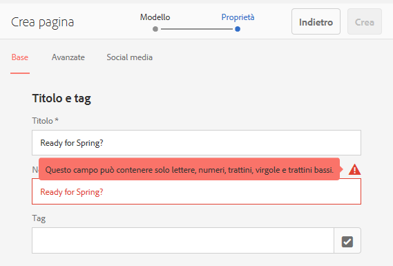

>[!NOTE]
>
>È consigliabile evitare di utilizzare, come nome di pagina, codici di due lettere specificati dallo standard ISO-639-1, a meno che non si tratti dell’identificativo della lingua.
>
>Vedi [Preparazione del contenuto per la traduzione](/help/sites-administering/tc-prep.md) per ulteriori informazioni.

### Modelli {#templates}

In AEM, un modello specifica un tipo di pagina specializzato. Un modello viene utilizzato come base per la creazione di nuove pagine.

Il modello definisce la struttura di una pagina, inclusa un’immagine in miniatura e altre proprietà. Ad esempio, puoi disporre di modelli separati per le pagine di prodotto, le mappe dei siti e le informazioni di contatto. I modelli sono formati da [componenti](#components).

AEM viene fornito con diversi modelli preconfigurati. I modelli disponibili dipendono dal singolo sito web. I campi chiave sono i seguenti:

* **Titolo**
Il titolo visualizzato nella pagina web risultante.

* **Nome**
Utilizzato per la denominazione della pagina.

* **Modello**
Elenco di modelli disponibili per la generazione della nuova pagina.

>[!NOTE]
>
>Se la configurazione dell’istanza lo prevede, [gli autori di modelli possono creare modelli con l’Editor modelli](/help/sites-authoring/templates.md).

### Componenti {#components}

I componenti sono gli elementi forniti da AEM che consentono di aggiungere specifici tipi di contenuto. AEM viene fornito con una serie di [componenti predefiniti](/help/sites-authoring/default-components-console.md) che forniscono funzionalità complete. Comprendono:

* Testo
* Immagine
* Presentazione
* Video
* E molti altri

Dopo aver creato e aperto una pagina è possibile [aggiungere contenuti utilizzando i componenti](/help/sites-authoring/editing-content.md#inserting-a-component), che sono disponibili dal [browser componenti](/help/sites-authoring/author-environment-tools.md#components-browser).

>[!NOTE]
>
>La [console Componenti](/help/sites-authoring/default-components-console.md) fornisce una panoramica dei componenti utilizzati nell’istanza.

## Gestione delle pagine {#managing-pages}

### Creazione di una nuova pagina {#creating-a-new-page}

A meno che non siano state create tutte le pagine in anticipo, prima di iniziare a creare il contenuto devi creare una pagina:

1. Apri la console Sites (ad esempio, [http://localhost:4502/sites.html/content](http://localhost:4502/sites.html/content)).
1. Passa alla posizione in cui desideri creare la nuova pagina.
1. Apri il selettore a discesa utilizzando l’opzione **Crea** nella barra degli strumenti, quindi seleziona **Pagina** dall’elenco:

   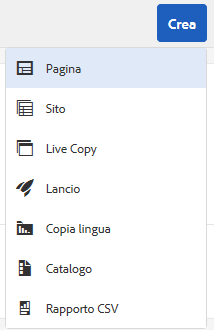

1. Nel primo passaggio della creazione guidata puoi effettuare le seguenti operazioni:

   * Seleziona il modello da utilizzare per creare la prima pagina, quindi tocca o fai clic su **Avanti** per proseguire.
   * Seleziona **Annulla** per interrompere la procedura.

   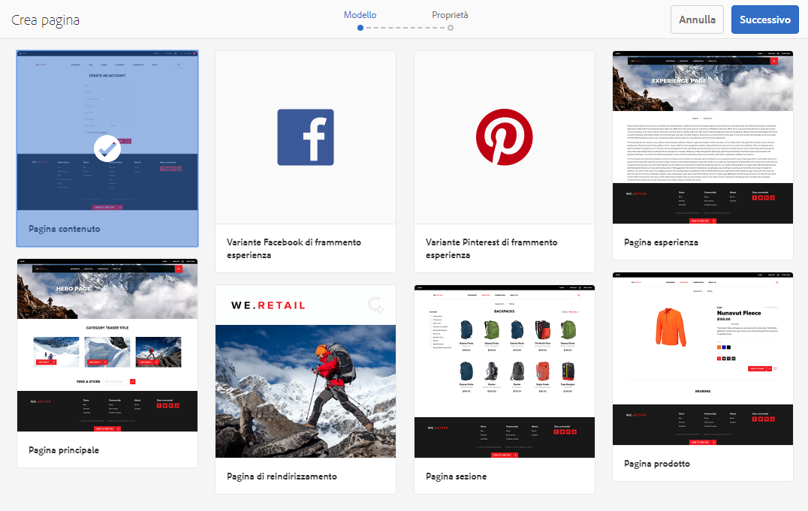

1. Nell’ultimo passaggio della creazione guidata puoi effettuare le seguenti operazioni:

   * Usa le tre schede per specificare le [proprietà di pagina](/help/sites-authoring/editing-page-properties.md) da assegnare alla nuova pagina, quindi tocca o fai clic su **Crea** per creare la pagina.
   * Utilizzo **Indietro** per tornare alla selezione del modello.

   I campi chiave sono:

   * **Titolo**:

      * Questo viene presentato all’utente ed è obbligatorio.
   * **Nome**:

      * Viene utilizzato per generare l’URI. Se non viene specificato, il nome viene derivato dal titolo.
      * Se fornisci una pagina **Nome** quando si crea una nuova pagina, AEM [convalida il nome in base alle convenzioni](/help/sites-developing/naming-conventions.md) imposto da AEM e JCR.
      * You **impossibile inviare caratteri non validi** in **Nome** campo . Quando AEM rileva caratteri non validi, il campo viene evidenziato e viene visualizzato un messaggio di avviso che indica i caratteri che devono essere rimossi o sostituiti.

   >[!NOTE]
   >
   >Vedi [Convenzioni di denominazione delle pagine](#page-naming-conventions).

   Le informazioni minime necessarie per creare una nuova pagina sono le seguenti: **Titolo**.

   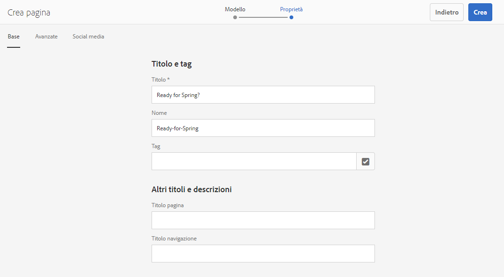

1. Tocca o fai clic su **Crea** per completare il processo e creare la nuova pagina. Viene visualizzata una finestra di dialogo di conferma in cui viene richiesto se desideri **aprire** subito la pagina o ritornare alla console (selezionando **Fine**):

   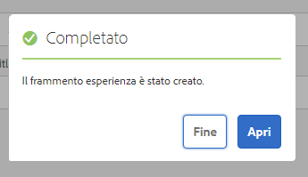

   >[!NOTE]
   >
   >Se per la pagina creata hai specificato un nome già esistente nello stesso percorso, viene automaticamente generata una variante del nome aggiungendo un numero. Se, ad esempio, esiste già `winter`, la nuova pagina diventa `winter0`.

1. Torna alla console per visualizzare la nuova pagina:

   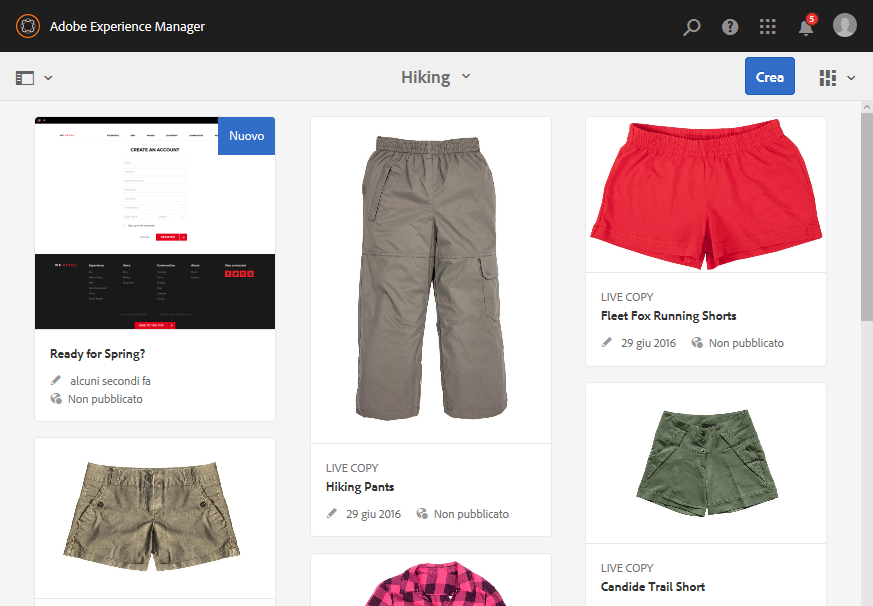

>[!CAUTION]
>
>Una volta creata una pagina, il relativo modello non può essere modificato, a meno che tu non [creare un lancio con un nuovo modello](/help/sites-authoring/launches-creating.md#create-launch-with-new-template), anche se questo determinerà la perdita di eventuali contenuti già esistenti.

### Apertura di una pagina per la modifica {#opening-a-page-for-editing}

Dopo aver creato una pagina o essere passato a una pagina esistente (nella console), puoi aprirla per modificarla:

1. Apri **Sites** console.
1. Individua la pagina da modificare.
1. Seleziona la pagina utilizzando:

   * [Azioni rapide](/help/sites-authoring/basic-handling.md#quick-actions)
   * [Modalità di selezione](/help/sites-authoring/basic-handling.md#product-navigation) e barra degli strumenti

   Quindi seleziona l’icona **Modifica**:

   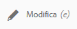

1. La pagina verrà visualizzata e potrai [modificarla](/help/sites-authoring/editing-content.md) come necessario.

>[!NOTE]
>
>La navigazione verso altre pagine dall’Editor pagina è possibile solo in modalità Anteprima, in quanto i collegamenti non sono attivi nella modalità di modifica.

### Copiare e incollare una pagina    {#copying-and-pasting-a-page}

È possibile copiare una pagina e tutte le relative sottopagine in una nuova posizione:

1. In **Sites** , individua la pagina da copiare.
1. Seleziona la pagina utilizzando:

   * [Azioni rapide](/help/sites-authoring/basic-handling.md#quick-actions)
   * [Modalità di selezione](/help/sites-authoring/basic-handling.md#product-navigation) e barra degli strumenti

   E poi il **Copia** icona della pagina:

   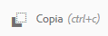

   >[!NOTE]
   >
   >Se sei in modalità Selezione, questa viene chiusa automaticamente non appena la pagina viene copiata.

1. Passa al percorso in cui desideri inserire la nuova copia della pagina.
1. Utilizza la **Incolla** icona della pagina:

   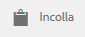

   In questa posizione viene creata una copia della pagina originale e delle relative sottopagine.

   >[!NOTE]
   >
   >Se copi la pagina in un percorso in cui esiste già una pagina con lo stesso nome dell’originale, viene automaticamente generata una variante del nome aggiungendo un numero. Ad esempio, se `winter` esiste già, `winter` diventerà `winter1`.

### Spostamento o ridenominazione di una pagina {#moving-or-renaming-a-page}

>[!NOTE]
>
>Anche la ridenominazione di una pagina è soggetta alla [Convenzioni di denominazione delle pagine](#page-naming-conventions) quando si specifica il nuovo nome della pagina.

>[!NOTE]
>
>È possibile spostare una pagina solo in una posizione in cui è consentito il modello su cui si basa la pagina. Per ulteriori informazioni consulta la sezione dedicata alla [disponibilità dei modelli](/help/sites-developing/templates.md#template-availability).

La procedura per spostare o rinominare una pagina è sostanzialmente identica e viene gestita dalla stessa procedura guidata. Con questa procedura guidata è possibile:

* Rinominare una pagina senza spostarla.
* Spostare la pagina senza rinominarla.
* Spostare e rinominare allo stesso tempo.

AEM offre la funzionalità di aggiornare eventuali collegamenti interni che fanno riferimento alla pagina rinominata o spostata. Questa operazione può essere eseguita pagina per pagina per garantire la massima flessibilità.

1. Individua la pagina da spostare.
1. Seleziona la pagina utilizzando:

   * [Azioni rapide](/help/sites-authoring/basic-handling.md#quick-actions)
   * [Modalità di selezione](/help/sites-authoring/basic-handling.md#product-navigation) e barra degli strumenti

   Quindi seleziona la **Sposta** icona della pagina:

   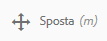

   Verrà aperta la procedura guidata per lo spostamento della pagina.

1. Da **Rinomina** nella procedura guidata puoi effettuare le seguenti operazioni:

   * Specifica il nome da assegnare alla pagina spostata, quindi tocca o fai clic su **Avanti**.
   * Seleziona **Annulla** per interrompere la procedura.

   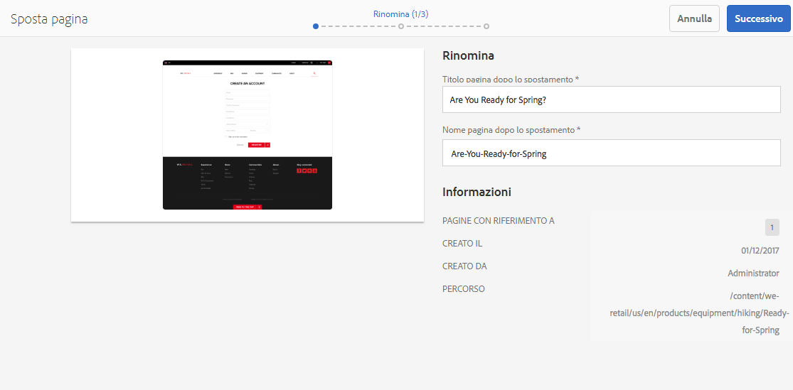

   Il nome della pagina può rimanere invariato solo se la pagina viene spostata.

   >[!NOTE]
   >
   >Se sposti la pagina in una posizione in cui esiste già una pagina con lo stesso nome, il sistema genera automaticamente una variante del nome aggiungendo un numero. Ad esempio, se `winter` esiste già, `winter` diventerà `winter1`.

1. Da **Seleziona destinazione** nella procedura guidata puoi effettuare le seguenti operazioni:

   * Utilizza la [vista a colonne](/help/sites-authoring/basic-handling.md#column-view) per passare alla nuova posizione della pagina:

      * Seleziona la destinazione facendo clic sulla miniatura della destinazione.
      * Fai clic su **Avanti** per continuare.
   * Utilizzo **Indietro** per tornare alle specifiche del nome della pagina.

   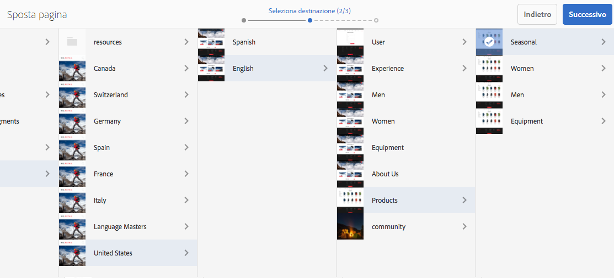

   >[!NOTE]
   >
   >Se sposti la pagina in una posizione in cui esiste già una pagina con lo stesso nome, il sistema genera automaticamente una variante del nome aggiungendo un numero. Ad esempio, se `winter` esiste già, `winter` diventerà `winter1`.

1. Se la pagina è collegata o utilizzata in un riferimento, tali riferimenti verranno elencati nella sezione **Regola/Ripubblica** passo. Puoi quindi indicare cosa deve essere regolato e ripubblicato in base alle necessità.

   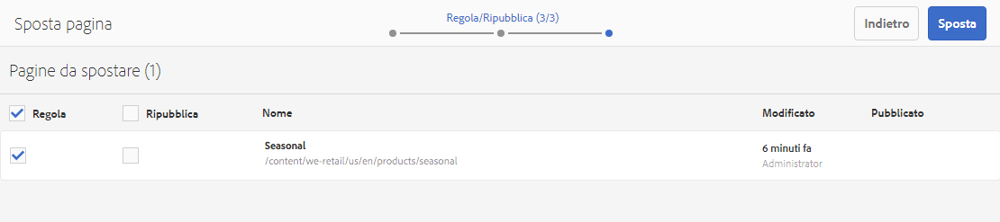

1. Selezione **Sposta** completa il processo e sposta/rinomina la pagina in base alle necessità.

>[!NOTE]
>
>Se la pagina è già stata pubblicata, lo spostamento ne determina automaticamente l’annullamento della pubblicazione. Per impostazione predefinita, la pagina viene pubblicata nuovamente al termine dello spostamento, ma questa può essere modificata deselezionando la **Ripubblica** nel campo **Regola/Ripubblica** passo.

>[!NOTE]
>
>Se non è presente alcun riferimento alla pagina, il passaggio **Regola/Ripubblica** non verrà visualizzato.

### Eliminazione di una pagina {#deleting-a-page}

1. Individua la pagina da eliminare.
1. Utilizzo [modalità di selezione](/help/sites-authoring/basic-handling.md#viewing-and-selecting-resources) per selezionare la pagina richiesta, utilizza **Elimina** dalla barra degli strumenti:

   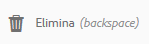

   >[!NOTE]
   >
   >Come precauzione di sicurezza, l’icona **Elimina** pagina non è disponibile come azione rapida.

1. Una finestra di dialogo chiederà una conferma.

   * **Intendi archiviare le pagine prima di eliminarle?** - Se questa opzione è selezionata, al momento dell’eliminazione verranno create versioni delle pagine selezionate da eliminare.
      * [Le versioni possono essere ripristinate in un momento successivo.](/help/sites-authoring/working-with-page-versions.md)
      * Le pagine eliminate senza versioni precedenti non possono essere ripristinate.
      * Questa opzione è disponibile solo AEM versione 6.4.7.0.
   * **Annulla** per interrompere l’azione
   * **Elimina** per confermare l’azione:

      * Se la pagina non dispone di riferimenti, verrà eliminata.
      * Se la pagina include riferimenti, viene visualizzata una finestra con il messaggio **Si fa riferimento a una o più pagine.** È possibile selezionare **Forza eliminazione** o **Annulla**.

>[!NOTE]
>
>Se una pagina è già stata pubblicata, prima di eliminarla ne verrà automaticamente annullata la pubblicazione.

### Blocco di una pagina   {#locking-a-page}

È possibile [bloccare/sbloccare una pagina](/help/sites-authoring/editing-content.md#locking-a-page) da una console o quando si modifica una singola pagina. L’indicazione relativa al fatto che una pagina sia bloccata o meno è visualizzata in entrambe le posizioni.

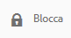 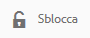

### Creazione di una nuova cartella {#creating-a-new-folder}

Puoi creare cartelle per organizzare file e pagine.

>[!NOTE]
>
>Anche le cartelle sono soggette al [Convenzioni di denominazione delle pagine](#page-naming-conventions) quando si specifica il nuovo nome della cartella.

>[!CAUTION]
>
>* Le cartelle possono essere create solo direttamente in **Sites** o in altre cartelle. Non possono essere create sotto una pagina.
>* Le azioni standard Sposta, Copia, Incolla, Elimina, Modifica, Pubblica, Annulla pubblicazione e Visualizza/Modifica proprietà possono essere eseguite in una cartella.
>* Le cartelle non sono disponibili per la selezione all’interno di una Live Copy.
>


1. Apri **Sites** e passa alla posizione desiderata.
1. Per aprire l’elenco delle opzioni, seleziona **Crea** dalla barra degli strumenti
1. Seleziona **Cartella** per aprire la finestra di dialogo. Nella finestra puoi immettere il **Nome** e il **Titolo**:

   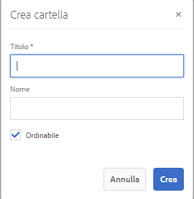

1. Seleziona **Crea** per creare la nuova cartella.
