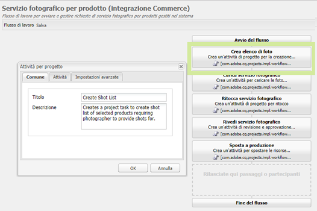
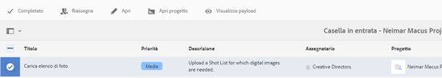
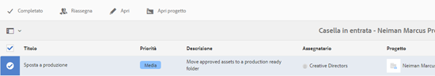

# Integrazione di progetti creativi e PIM{#creative-project-and-pim-integration}

>[!CAUTION]
>
>AEM 6.4 ha raggiunto la fine del supporto esteso e questa documentazione non viene più aggiornata. Per maggiori dettagli, consulta la nostra [periodi di assistenza tecnica](https://helpx.adobe.com/it/support/programs/eol-matrix.html). Trova le versioni supportate [qui](https://experienceleague.adobe.com/docs/).

Se sei un addetto al marketing o un professionista creativo, puoi utilizzare gli strumenti Progetto creativo in Adobe Experience Manager (AEM) per gestire la fotografia di prodotti correlata all’e-commerce e i processi creativi associati all’interno della tua organizzazione.

In particolare, puoi utilizzare Progetto creativo per semplificare le seguenti attività nel flusso di lavoro del servizio fotografico:

* Generazione di una richiesta di servizio fotografico
* Caricamento di un servizio fotografico
* Collaborazione su un servizio fotografico
* Creazione di pacchetti di risorse approvate

>[!NOTE]
>
>Vedi [Ruoli utente del progetto per informazioni](/help/sites-authoring/projects.md#user-roles-in-a-project) sull’assegnazione di ruoli utente e flussi di lavoro a determinati tipi di utenti.

## Esplorazione dei flussi di lavoro Servizio fotografico per prodotto  {#exploring-product-photo-shoot-workflows}

Il Progetto creativo fornisce vari modelli di progetto per soddisfare diverse esigenze di progetto. Il modello **Progetto servizio fotografico per prodotto **è disponibile in dotazione. Questo modello include flussi di lavoro per il servizio fotografico che consentono di avviare e gestire le richieste di servizio fotografico per i prodotti. Include inoltre una serie di attività che consentono di ottenere immagini digitali per i prodotti attraverso processi di revisione e approvazione appropriati.

Il modello include i seguenti flussi di lavoro:

* **Flusso di lavoro Servizio fotografico per prodotto (integrazione Commerce)**: Questo flusso di lavoro sfrutta l’integrazione Commerce con il sistema di gestione delle informazioni sui prodotti (PIM) per generare automaticamente un elenco di foto per i prodotti selezionati (gerarchia). Al termine del flusso di lavoro, puoi visualizzare i dati del prodotto come parte dei metadati della risorsa.
* **Flusso di lavoro Servizio fotografico per prodotto**: Questo flusso di lavoro ti consente di fornire un elenco di foto invece di dipendere dall’integrazione Commerce. Mappa le immagini caricate in un file CSV nella cartella delle risorse del progetto.

>[!NOTE]
>
>Il file CSV caricato nell’attività Carica elenco di foto del flusso di lavoro Servizio fotografico per prodotto deve avere il nome shotlist.csv .

## Creare un progetto Servizio fotografico per prodotto {#create-a-product-photo-shoot-project}

1. In **Progetti** console, tocca o fai clic **Crea** e poi scegliere **Crea progetto** dall&#39;elenco.

   

1. In **Crea progetto** , seleziona il modello di progetto del servizio fotografico e tocca o fai clic su **Successivo**.

   

1. Immetti i dettagli del progetto, inclusi titolo, descrizione e data di scadenza. Aggiungi utenti e assegna loro vari ruoli. Puoi anche aggiungere una miniatura per il progetto.

   

1. Tocca o fai clic su **Crea**. Un messaggio di conferma notifica la creazione del progetto.
1. Tocca o fai clic su **Fine** per tornare al **Progetti** console. In alternativa, tocca o fai clic su **Apri** per visualizzare le risorse all’interno del progetto di servizio fotografico.

## Avvio del lavoro in un progetto Servizio fotografico per prodotto {#starting-work-in-a-product-photo-shoot-project}

Per avviare una richiesta di servizio fotografico, tocca o fai clic su un progetto, quindi tocca o fai clic su **Aggiungi lavoro** nella pagina dei dettagli del progetto per avviare un flusso di lavoro.


Un progetto Servizio fotografico per prodotto include i seguenti flussi di lavoro preconfigurati:

* Flusso di lavoro Servizio fotografico per prodotto (integrazione Commerce)
* Flusso di lavoro Servizio fotografico per prodotto

Utilizza il flusso di lavoro Servizio fotografico per prodotto (integrazione Commerce) per mappare le risorse immagini con i prodotti in AEM. Questo flusso di lavoro sfrutta l’integrazione Commerce per collegare le immagini approvate ai dati di prodotto esistenti nella posizione */etc/commerce*.

Il flusso di lavoro Servizio fotografico per prodotto (integrazione Commerce) include le seguenti attività:

* Crea elenco di foto
* Carica servizio fotografico
* Ritocca servizio fotografico
* Rivedi e approva
* Sposta ad attività produzione

Se le informazioni sul prodotto non sono disponibili in AEM, utilizza il flusso di lavoro Servizio fotografico per prodotto per mappare le risorse immagini con i prodotti in base ai dettagli caricati in un file CSV. Il file CSV deve contenere informazioni di base sul prodotto, ad esempio ID prodotto, categoria e descrizione. Il flusso di lavoro recupera le risorse approvate per i prodotti.

Questo flusso di lavoro include le seguenti attività:

* Carica elenco di foto
* Carica servizio fotografico
* Ritocca servizio fotografico
* Rivedi e approva
* Sposta ad attività produzione

Puoi personalizzare questo flusso di lavoro utilizzando l’opzione Configurazioni flusso di lavoro .

Entrambi i flussi di lavoro includono passaggi per collegare i prodotti alle risorse approvate. Ogni flusso di lavoro include i seguenti passaggi:

* Configurazione del flusso di lavoro: Descrive le opzioni per personalizzare il flusso di lavoro
* Avvio di un flusso di lavoro di progetto: Spiega come avviare un servizio fotografico per prodotto
* Dettagli attività flusso di lavoro: Fornisce i dettagli delle attività disponibili nel flusso di lavoro

## Tracciamento dell&#39;avanzamento del progetto {#tracking-project-progress}

Puoi tenere traccia dell’avanzamento di un progetto monitorando le attività attive/completate all’interno di un progetto.

Utilizza quanto segue per monitorare l’avanzamento di un progetto:

* **Scheda attività**

* **Elenco delle attività**

La scheda Attività mostra l’avanzamento generale del progetto. Viene visualizzata nella pagina Dettagli progetto solo se il progetto dispone di attività correlate. Nella scheda Attività viene visualizzato lo stato di completamento corrente del progetto in base al numero di attività completate. Non include attività future.

La scheda Attività fornisce i seguenti dettagli:

* Percentuale di attività attive
* Percentuale di attività completate


L’elenco Attività contiene informazioni dettagliate sull’attività del flusso di lavoro attualmente attiva per il progetto. Per visualizzare l’elenco, tocca o fai clic sulla scheda Attività . Nell’elenco Attività sono inoltre visualizzati metadati quali data di inizio, data di scadenza, assegnatario, priorità e stato dell’attività.


## Configurazione flusso di lavoro {#workflow-configuration}

Questa attività comporta l’assegnazione di passaggi del flusso di lavoro agli utenti in base ai loro ruoli.

Per configurare le **Servizio fotografico per prodotto** flusso di lavoro:

1. Passa a **Strumenti** > **Flussi di lavoro**, quindi tocca **Modelli** riquadro per aprire **Modelli di flusso di lavoro** pagina.
1. Seleziona la **Servizio fotografico per prodotto** e tocca **Modifica** dalla barra degli strumenti per aprirla in modalità di modifica.

   

1. In **Flusso di lavoro Servizio fotografico per prodotto** aprire un&#39;attività del progetto. Ad esempio, apri la **Carica elenco di foto** compito.

   

1. Fai clic sul pulsante **Attività** per configurare quanto segue:

   * Nome dell’attività
   * Utente predefinito (ruolo) che riceve l&#39;attività
   * Priorità predefinita dell&#39;attività, visualizzata nell&#39;elenco delle attività dell&#39;utente
   * Descrizione dell’attività da visualizzare quando l’assegnatario apre l’attività
   * Data di scadenza per un&#39;attività, calcolata in base all&#39;ora di inizio dell&#39;attività

1. Fai clic su **OK** per salvare le impostazioni di configurazione.

   Analogamente, è possibile configurare le seguenti attività per **Servizio fotografico per prodotto** flusso di lavoro:

   * Carica servizio fotografico
   * Ritocca servizio fotografico
   * Revisione servizio fotografico
   * Sposta a produzione

   Eseguire una procedura simile per configurare le attività nel **Flusso di lavoro Servizio fotografico per prodotto (integrazione Commerce)**.

Questa sezione descrive come integrare la gestione delle informazioni sui prodotti con il progetto creativo.

## Avvio di un flusso di lavoro di progetto {#starting-a-project-workflow}

1. Passa a un progetto Servizio fotografico per prodotto e tocca o fai clic sul pulsante **Aggiungi lavoro** sull&#39;icona **Flussi di lavoro** il Card.
1. Seleziona la **Servizio fotografico per prodotto (integrazione Commerce)** scheda del flusso di lavoro per avviare il flusso di lavoro Servizio fotografico per prodotto (integrazione Commerce). Se le informazioni sul prodotto non sono disponibili in /etc/commerce, seleziona la **Servizio fotografico per prodotto** e avvia il flusso di lavoro Servizio fotografico per prodotto .

   

1. Tocca o fai clic su **Successivo** per avviare il flusso di lavoro nel progetto.
1. Immetti i dettagli del flusso di lavoro nella pagina successiva.

   

   Fai clic su **Invia** per avviare il flusso di lavoro del servizio fotografico. Viene visualizzata la pagina dei dettagli del progetto del servizio fotografico.

   

### Dettagli attività flusso di lavoro {#workflow-tasks-details}

Il flusso di lavoro del servizio fotografico include diverse attività. Ogni attività viene assegnata a un gruppo di utenti in base alla configurazione definita per l&#39;attività.

#### Crea attività elenco di foto {#create-shot-list-task}

La **Crea elenco di foto** consente al proprietario del progetto di selezionare i prodotti per i quali sono richieste le immagini. In base all’opzione selezionata dall’utente, viene generato un file CSV contenente le informazioni di base sul prodotto.

1. Nella cartella del progetto, tocca o fai clic sui puntini di sospensione nel [Scheda Attività](#tracking-project-progress) per visualizzare l’elemento dell’attività nel flusso di lavoro.

   

1. Seleziona la **Crea elenco di foto** e quindi tocca o fai clic sul pulsante **Apri** dalla barra degli strumenti.

   

1. Esamina i dettagli dell’attività, quindi tocca o fai clic sul pulsante **Crea elenco di foto** pulsante .

   

1. Seleziona i prodotti per i quali esistono dati di prodotto senza immagini associate.

   

1. Tocca o fai clic sul pulsante **Aggiungi a elenco a discesa** per creare un file CSV contenente un elenco di tutti questi prodotti. Viene visualizzato un messaggio di conferma della creazione dell’elenco di foto per i prodotti selezionati. Fai clic su **Chiudi** per completare il flusso di lavoro.
1. Dopo aver creato un elenco di foto, la **Visualizza elenco di foto** appare il link. Per aggiungere altri prodotti all’elenco di foto, tocca o fai clic su **Aggiungi a elenco di foto**. In questo caso, i dati vengono aggiunti all’elenco di foto creato inizialmente.

   

1. Tocca o fai clic su **Visualizza elenco di foto** per visualizzare il nuovo elenco di foto.

   

   Per modificare i dati esistenti o aggiungere nuovi dati, tocca o fai clic su **Modifica** dalla barra degli strumenti. Solo il **Prodotto **e **Descrizione** i campi sono modificabili.

   

   Dopo aver aggiornato il file, tocca o fai clic su **Salva** sulla barra degli strumenti per salvare il file.

1. Dopo aver aggiunto i prodotti, tocca o fai clic sul pulsante **Completa** nella pagina dei dettagli dell’attività **Crea elenco di foto **per contrassegnare l’attività come completata. È possibile aggiungere un commento facoltativo.

   Il completamento dell’attività introduce le seguenti modifiche all’interno del progetto:

   * Le risorse corrispondenti alla gerarchia dei prodotti vengono create in una cartella con lo stesso nome del titolo del flusso di lavoro.
   * I metadati per le risorse diventano modificabili mediante la console Risorse , anche prima che il fotografo fornisca le immagini.
   * Viene creata una cartella Servizio fotografico che memorizza le immagini fornite dal fotografo. La cartella Servizio fotografico contiene sottocartelle per ogni voce di prodotto nell’elenco di foto.

   Per il flusso di lavoro Servizio fotografico per prodotto (senza integrazione Commerce), Carica elenco di foto è la prima attività. Tocca o fai clic su **Carica elenco di foto** per caricare un **shotlist.csv** file. Il file CSV deve contenere l’ID prodotto. Gli altri campi sono facoltativi. Puoi utilizzarli per mappare le risorse ai prodotti.

### Carica attività elenco di foto {#upload-shot-list-task}

Questa attività fa parte del flusso di lavoro Servizio fotografico per prodotto . Esegui questa attività se le informazioni di prodotto non sono disponibili in AEM. In questo caso, carica un elenco di prodotti in un file CSV per il quale sono richieste le risorse immagine. In base ai dettagli nel file CSV, mappa le risorse immagine con i prodotti.

Utilizza la **Visualizza elenco di foto** per scaricare un file CSV di esempio, effettua un collegamento sotto la scheda del progetto nella procedura precedente. Esamina il file di esempio per conoscere il solito contenuto di un file CSV.

L’elenco dei prodotti o il file CSV possono contenere campi quali **Categoria, Prodotto, Id, Descrizione** e **Percorso**. La **Id** Il campo è obbligatorio e contiene l’ID prodotto. Gli altri campi sono facoltativi.

Un prodotto può appartenere a una particolare categoria. La categoria di prodotto può essere elencata nel CSV sotto il **Categoria** colonna. La **Prodotto** contiene il nome del prodotto. In **Descrizione** immettere la descrizione o le istruzioni del prodotto per il fotografo.

>[!NOTE]
>
>Il nome delle immagini da caricare deve iniziare con &quot;**&lt;productid>_&quot;** in cui viene fatto riferimento all’ID prodotto dal **Id** nel campo *shotlist.csv* file. Ad esempio, per un prodotto nell’elenco di foto con **Id 397122**, puoi caricare i file con nomi **397122_highcontrasto.jpg**, **397122_lowlight.png** e così via.

1. Nella cartella del progetto, tocca o fai clic sui puntini di sospensione nel [Scheda Attività](#tracking-project-progress) per visualizzare l’elenco delle attività nel flusso di lavoro.
1. Seleziona la **Carica elenco di foto** e quindi tocca o fai clic sul pulsante **Apri** dalla barra degli strumenti.

   

1. Esamina i dettagli dell’attività, quindi tocca o fai clic sul pulsante **Carica elenco di foto** pulsante .

   

1. Tocca o fai clic sul pulsante **Carica elenco di foto** per caricare il file CSV con il nome shotlist.csv. Il flusso di lavoro riconosce questo file come origine da utilizzare per estrarre i dati di prodotto per l’attività successiva.
1. Carica un file CSV contenente le informazioni sul prodotto nel formato appropriato. Il collegamento **Visualizza risorse caricate **viene visualizzato sotto la scheda dopo il caricamento del file CSV.

   

   Fai clic sul pulsante **Completa** per completare l’attività.

1. Tocca o fai clic sul pulsante **Completa** per completare l’attività.

### Carica attività servizio fotografico {#upload-photo-shoot-task}

Se sei un editor, puoi caricare le foto per i prodotti elencati in **shotlist.csv** file creato o caricato nell’attività precedente.

Il nome delle immagini da caricare deve iniziare con **&quot;&lt;productid>_&quot;** in cui viene fatto riferimento all’ID prodotto dal **Id** nel campo **shotlist.csv** file. Ad esempio, per un prodotto con **ID 397122** nell’elenco di foto, puoi caricare i file con nomi **397122_highcontrasto.jpg**, **397122_lowlight.png** e così via.

Puoi caricare direttamente le immagini o caricare un file ZIP contenente le immagini. In base ai loro nomi, le immagini vengono posizionate all’interno delle rispettive cartelle di prodotti **Servizio fotografico** cartella.

1. Nella cartella del progetto, tocca o fai clic sui puntini di sospensione nel [Scheda attività](#tracking-project-progress) per visualizzare l’elemento dell’attività nel flusso di lavoro.
1. Seleziona la **Carica servizio fotografico** e quindi tocca o fai clic sul pulsante **Apri** dalla barra degli strumenti.

   

1. Tocca o fai clic su **Carica servizio fotografico **e carica le immagini del servizio fotografico.
1. Tocca o fai clic sul pulsante **Completa** icona dalla barra degli strumenti per completare l’attività.

### Ritocca attività servizio fotografico {#retouch-photo-shoot-task}

Se disponi dei diritti di modifica, esegui l’attività Ritocca servizio fotografico per modificare le immagini caricate nella cartella Servizio fotografico.

1. Nella cartella del progetto, tocca o fai clic sui puntini di sospensione nel [Scheda attività](#tracking-project-progress) per visualizzare l’elemento dell’attività nel flusso di lavoro.
1. Seleziona la **Ritocca servizio fotografico** e quindi tocca o fai clic sul pulsante **Apri** dalla barra degli strumenti.

   

1. Tocca o fai clic sul pulsante **Visualizzare le risorse caricate** nel collegamento **Ritocca servizio fotografico** per sfogliare le immagini caricate.

   

   Se necessario, modifica le immagini utilizzando un’applicazione Adobe Creative Cloud.

   

1. Tocca o fai clic sul pulsante **Completa** icona dalla barra degli strumenti per completare l’attività.

### Attività di revisione e approvazione {#review-and-approve-task}

In questa attività, rivedi le immagini del servizio fotografico caricate da un fotografo e contrassegna le immagini come approvate per l&#39;uso.

1. Nella cartella del progetto, tocca o fai clic sui puntini di sospensione nel [Scheda attività](#tracking-project-progress) per visualizzare l’elemento dell’attività nel flusso di lavoro.
1. Seleziona la **Rivedi e approva** e quindi tocca o fai clic sul pulsante **Apri** dalla barra degli strumenti.

   

1. In **Rivedi e approva** , assegna l’attività di revisione a un ruolo, ad esempio Revisori, quindi tocca o fai clic su **Rivedi **per iniziare a rivedere le immagini del prodotto caricate.

   

1. Seleziona un’immagine di prodotto e tocca o fai clic sull’icona Approva nella barra degli strumenti per contrassegnarla come approvata.

   

   Una volta approvata un’immagine, sopra di essa viene visualizzato un banner approvato.

   >[!NOTE]
   È possibile escludere alcuni prodotti senza alcuna immagine. In seguito, puoi rivedere l’attività e contrassegnarla come completata.

1. Tocca o fai clic su **Completa**. Le immagini approvate sono collegate alle risorse vuote create.

Puoi accedere alle risorse del progetto tramite l’interfaccia utente Assets e verificare le immagini approvate.

Tocca o fai clic sul livello successivo per visualizzare i prodotti in base alla gerarchia dei dati di prodotto.

I collaboratori di Progetto creativo approvano le risorse con il prodotto di riferimento. I metadati della risorsa vengono aggiornati con il riferimento al prodotto e le informazioni di base nella scheda **Dati prodotto **nelle proprietà della risorsa che vengono visualizzate nella sezione Metadati risorsa AEM .

>[!NOTE]
Nel flusso di lavoro Servizio fotografico per prodotto (senza integrazione Commerce), le immagini approvate non hanno alcuna associazione ai prodotti.

### Sposta ad attività produzione {#move-to-production-task}

Questa attività sposta le risorse approvate nella cartella pronta per la produzione per renderle disponibili per l’uso.

1. Nella cartella del progetto, tocca o fai clic sui puntini di sospensione nel [Scheda attività](#tracking-project-progress) per visualizzare l’elemento dell’attività nel flusso di lavoro.
1. Seleziona la **Sposta a produzione** e quindi tocca o fai clic sul pulsante **Apri** dalla barra degli strumenti.

   

1. Per visualizzare le risorse approvate per il servizio fotografico prima di spostarle nella cartella pronta per la produzione, fai clic sul pulsante **Visualizza risorse approvate** link sotto la miniatura del progetto sul **Sposta a produzione** pagina attività.

   

1. Immetti il percorso della cartella pronta per la produzione nel **Sposta a** campo .

   

   Tocca o fai clic su **Sposta a produzione**. Chiudi il messaggio di conferma. Le risorse vengono spostate nel percorso indicato e viene creato automaticamente un set 360 gradi per le risorse approvate per ogni prodotto in base alla gerarchia delle cartelle.

1. Tocca o fai clic sul pulsante **Completa** dalla barra degli strumenti. Il flusso di lavoro viene completato quando l’ultimo passaggio è contrassegnato come completato.

## Visualizzazione dei metadati delle risorse DAM {#viewing-dam-asset-metadata}

Dopo l’approvazione, le risorse sono collegate ai prodotti corrispondenti. La [Pagina Proprietà](/help/assets/managing-assets-touch-ui.md#editing-properties) delle risorse approvate dispone ora di un **Dati prodotto** scheda (informazioni prodotto collegate). In questa scheda vengono visualizzati i dettagli del prodotto, il numero SKU e altri dettagli relativi al prodotto che collegano la risorsa. Tocca o fai clic sul pulsante **Modifica** per aggiornare una proprietà di una risorsa. Le informazioni relative al prodotto rimangono di sola lettura.

Tocca o fai clic sul collegamento che appare per passare alla relativa pagina dei dettagli del prodotto nella console del prodotto a cui è associata la risorsa.

## Personalizzazione dei flussi di lavoro Servizio fotografico per progetto {#customizing-the-project-photo-shoot-workflows}

Puoi personalizzare i flussi di lavoro Servizio fotografico per progetto in base ai requisiti. Si tratta di un’attività facoltativa basata su ruoli eseguita per impostare il valore di una variabile all’interno del progetto. Successivamente, puoi utilizzare il valore configurato per arrivare a una decisione.

1. Tocca o fai clic sul logo AEM, quindi passa a **Strumenti** > **Flusso di lavoro** > **Modelli** per aprire la pagina Modelli di flusso di lavoro .
1. Seleziona la **Servizio fotografico per prodotto (integrazione Commerce)** o **Servizio fotografico per prodotto** flusso di lavoro e tocca o fai clic su **Modifica** dalla barra degli strumenti per aprire il flusso di lavoro in modalità di modifica.
1. Apri **Progetti** attività nella barra laterale e trascina **Crea attività progetto basata su ruolo** al flusso di lavoro.

   

1. Apri **Attività basata su ruolo** passo.
1. In **Attività** , specifica un nome per l’attività che verrà visualizzato nel **Attività** Elenco. È inoltre possibile assegnare l&#39;attività a un ruolo, impostare la priorità predefinita, fornire una descrizione e specificare l&#39;ora in cui l&#39;attività è in scadenza.

   

1. In **Indirizzamento** Specifica le azioni per l’attività. Per aggiungere più azioni, tocca o fai clic sul collegamento **Aggiungi elemento **.

   

1. Dopo aver aggiunto le opzioni fai clic su **OK** per aggiungere le modifiche al passaggio .

   >[!NOTE]
   Tocca/fai clic **OK** non salva le modifiche nel flusso di lavoro. Per salvare le modifiche nel flusso di lavoro, tocca o fai clic su **Salva**.

1. Apri **Flusso di lavoro** attività dalla barra laterale e aggiungere un **Goto** compito.
1. Apri **Goto** e tocca o fai clic sul pulsante **Processo** scheda .
1. Specifica il seguente codice nel **Script** casella:

```
   function check() {

   if (workflowData.getMetaDataMap().get("lastTaskAction","") == "Reject All") {

   return true

   }

   // set copywriter user in metadata

   var previousId = workflowData.getMetaDataMap().get("lastTaskCompletedBy", "");

   workflowData.getMetaDataMap().put("copywriter", previousId);

   return false;

   }
```

>[!NOTE]
Per informazioni dettagliate sugli script nei passaggi del flusso di lavoro, consulta [Definizione di una regola per una divisione OR](/help/sites-developing/workflows-models.md).


1. Tocca o fai clic su **OK**.

1. Tocca o fai clic su **Salva** per salvare il flusso di lavoro.

   

1. Una nuova attività di accettazione del proprietario del progetto viene visualizzata dopo la [Sposta all’attività Produzione](#move-to-production-task) è completato e viene assegnato al proprietario.

   L’utente con il ruolo Proprietario può completare l’attività e selezionare un’azione (dall’elenco delle azioni aggiunte nelle configurazioni delle fasi del flusso di lavoro) dall’elenco nella finestra a comparsa dei commenti.

   

   Seleziona l’opzione appropriata e fai clic su **Completa** per eseguire **Passaggio Vai a** nel flusso di lavoro.

>[!NOTE]
Quando si avvia un server, il servlet di elenco delle attività del progetto memorizza in cache le mappature tra i tipi di attività e gli URL definiti in `/libs/cq/core/content/projects/tasktypes`. Puoi quindi eseguire la sovrapposizione usuale e aggiungere tipi di attività personalizzati inserendoli in `/apps/cq/core/content/projects/tasktypes`.
