# Utilizzo dei contenuti di destinazione in più siti{#working-with-targeted-content-in-multisites}

>[!CAUTION]
>
>AEM 6.4 ha raggiunto la fine del supporto esteso e questa documentazione non viene più aggiornata. Per maggiori dettagli, consulta la nostra [periodi di assistenza tecnica](https://helpx.adobe.com/it/support/programs/eol-matrix.html). Trova le versioni supportate [qui](https://experienceleague.adobe.com/docs/).

Se devi gestire contenuti mirati, ad esempio attività, esperienze e offerte tra siti diversi, puoi sfruttare AEM supporto multisito integrato per contenuti di destinazione.

>[!NOTE]
>
>L’utilizzo del supporto multisito per contenuti di destinazione è una funzione avanzata. Per utilizzare questa funzionalità, è necessario avere dimestichezza con [Multi Site Manager](/help/sites-administering/msm.md) e [l’integrazione Adobe Target](/help/sites-administering/target.md) con AEM.

Questo documento descrive quanto segue:

* Fornisce una breve panoramica del supporto multisito AEM contenuti di destinazione.
* Descrive alcuni possibili scenari di utilizzo su come collegare i siti (in un marchio).
* Fornisce un esempio di progressione di come gli addetti al marketing utilizzeranno questa funzione.
* Istruzioni dettagliate su come implementare il supporto multisito per contenuti di destinazione.

Per impostare la modalità di condivisione dei contenuti personalizzati sui siti, esegui le seguenti operazioni:

1. [Crea una nuova area](#creating-new-areas) o [crea una nuova area come Live Copy](#creating-new-areas). Un’area include tutte le attività disponibili per un *area* della pagina; ovvero la posizione nella pagina in cui è eseguito il targeting del componente. La creazione di una nuova area crea un’area vuota, mentre la creazione di una nuova area come Live Copy consente di ereditare il contenuto tra le strutture del sito.

1. [Collegamento del sito o della pagina](#linking-sites-to-an-area) in un&#39;area.

In qualsiasi momento puoi sospendere o ripristinare l’ereditarietà. Inoltre, se non desideri sospendere l’ereditarietà, puoi anche creare esperienze locali. Per impostazione predefinita, tutte le pagine utilizzano l’Area master, a meno che non sia specificato diversamente.

## Introduzione al supporto multisito per contenuti di destinazione {#introduction-to-multisite-support-for-targeted-content}

Il supporto multisito per contenuti di destinazione è disponibile come opzione e consente di inviare contenuti di destinazione dalla pagina master gestita tramite MSM a una Live Copy locale o di gestire le modifiche globali e locali di tali contenuti.

È possibile gestirlo in un’**area**. Le aree separano il contenuto di destinazione (attività, esperienze e offerte) utilizzato in siti diversi e forniscono un meccanismo MSM per creare e gestire l’ereditarietà di contenuti di destinazione insieme all’ereditarietà del sito. In questo modo si evita di dover ricreare contenuti di destinazione in siti ereditati come richiesto in AEM prima della versione 6.2.

In un’area, solo le attività collegate a tale area vengono inviate a Live Copy. Per impostazione predefinita, è selezionata l’Area master. Dopo aver creato altre aree, puoi collegarle ai siti o alle pagine per indicare quale contenuto di destinazione viene inviato.

Un sito o una Live Copy effettua un collegamento a un’area contenente le attività che devono essere disponibili sul sito o sulla Live Copy. Per impostazione predefinita, il sito o la Live Copy collegano all’area master, ma è possibile collegare altre aree oltre all’area master.

>[!NOTE]
>
>Quando utilizzi il supporto multisito per contenuti di destinazione, tieni presente quanto segue:
>
>* Quando utilizzi rollout o Live Copy, è necessaria una licenza MSM.
>* Quando utilizzi la sincronizzazione con Adobe Target, è necessaria una licenza Adobe Target.
>

## Casi d’uso {#use-cases}

Puoi impostare il supporto multisito per contenuti di destinazione in diversi modi, a seconda del caso d’uso. Questa sezione descrive come questo potrebbe funzionare teoricamente con un solo marchio. Inoltre, [Esempio: Targeting dei contenuti in base alla geografia](#example-targeting-content-based-on-geography), puoi visualizzare un’applicazione reale di targeting del contenuto in più siti.

Il contenuto di destinazione viene racchiuso in una cosiddetta area, che definisce l’ambito per siti o pagine. Queste aree sono definite a livello di marchio. Un marchio può contenere più aree. Le aree possono essere diverse tra i marchi. Anche se un marchio può contenere solo l’area master e quindi è condiviso tra tutti i marchi, un altro marchio può contenere più marchi (ad esempio, per regione). I marchi, pertanto, non devono rispecchiare l’insieme di aree tra loro.

Con il supporto multisito per contenuti di destinazione, ad esempio, puoi avere due (o più) siti con **uno** marchio con una delle caratteristiche seguenti:

* Un insieme completamente *distinto* di contenuti di destinazione: la modifica dei contenuti di destinazione in uno non influisce sull’altro. I siti che rimandano alle aree distinte sono in grado di leggere e scrivere sulla propria area configurata. Esempio:

   * Il sito A si collega all’Area X
   * Il sito B si collega all’Area Y

* Un insieme *comune* di contenuti di destinazione: la modifica in uno ha un impatto diretto su entrambi i siti; puoi eseguire questa operazione con due siti che fanno riferimento alla stessa area. I siti che si collegano alla stessa area condividono il contenuto di destinazione all’interno di quest’area. Esempio:

   * Il sito A si collega all’Area X
   * Il sito B si collega all’Area X

* Un set distinto di contenuti mirati *ereditato* da un altro sito tramite MSM: il contenuto può essere implementato in modo unidirezionale dalla pagina master alla Live Copy. Esempio:

   * Il sito A si collega all’Area X
   * Il sito B si collega all’Area Y (che è una Live Copy dell’Area X).

Anche **multiplo** marchi utilizzati in un sito, che potrebbero essere più complessi di questo esempio.

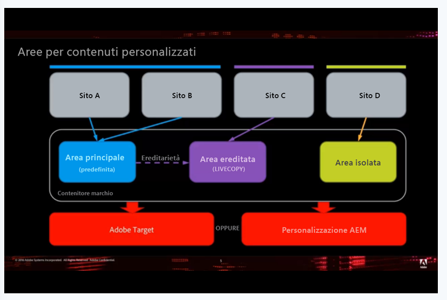

>[!NOTE]
>
>Per informazioni tecniche su questa funzione, consulta [Struttura della gestione multisito per contenuti mirati](/help/sites-authoring/technical-multisite-targeted.md).

## Esempio: Targeting dei contenuti in base alla posizione geografica {#example-targeting-content-based-on-geography}

L’utilizzo di più siti per contenuti di destinazione consente di condividere, distribuire o isolare contenuti di personalizzazione. Per illustrare meglio come viene utilizzata questa funzione, considera uno scenario in cui desideri controllare il modo in cui il contenuto di destinazione viene implementato in base all’area geografica, come nello scenario seguente:

Esistono quattro versioni dello stesso sito basate sull’area geografica:

* La **Stati Uniti** il sito si trova nell’angolo in alto a sinistra ed è il sito principale. In questo esempio, viene aperto in modalità Targeting.
* Le altre tre versioni di questo sito sono **Canada**, **Gran Bretagna** e **Australia**, che sono tutte Live Copy. Questi siti sono aperti in modalità Anteprima.

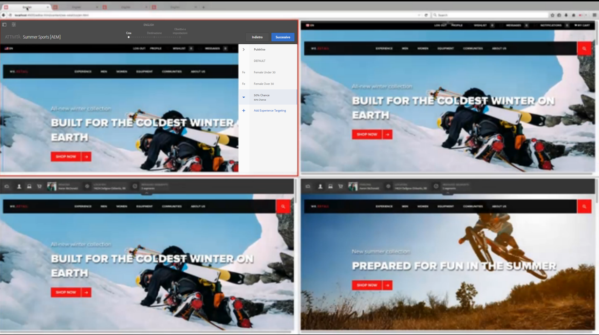

Ogni sito condivide contenuti personalizzati nelle aree geografiche:

* Il Canada condivide l&#39;area master con gli Stati Uniti.
* La Gran Bretagna è legata allo spazio europeo ed eredita dall&#39;area master.
* L’Australia, poiché si trova nell’emisfero australe e i prodotti stagionali non sarebbero adatti, dispone di un proprio contenuto personalizzato.

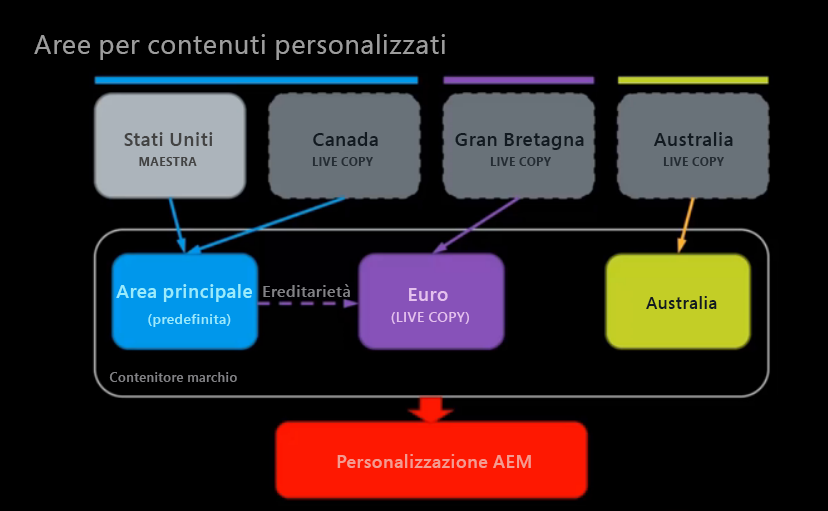

Per l’emisfero Nord abbiamo creato un’attività invernale, ma nel pubblico maschile l’addetto al marketing in America del Nord vorrebbe un’immagine diversa per l’inverno, perciò la cambia nel sito degli Stati Uniti.

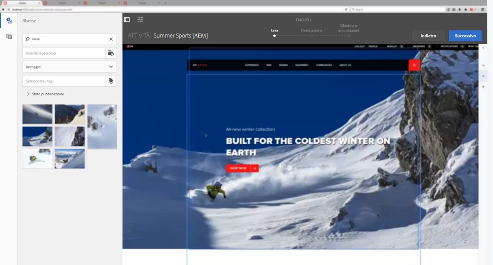

Dopo aver aggiornato la scheda, il sito canadese cambia alla nuova immagine senza alcuna azione da parte nostra. Lo fa perché condivide l&#39;area master con gli Stati Uniti. Nei siti della Gran Bretagna e dell&#39;Australia, l&#39;immagine non cambia.

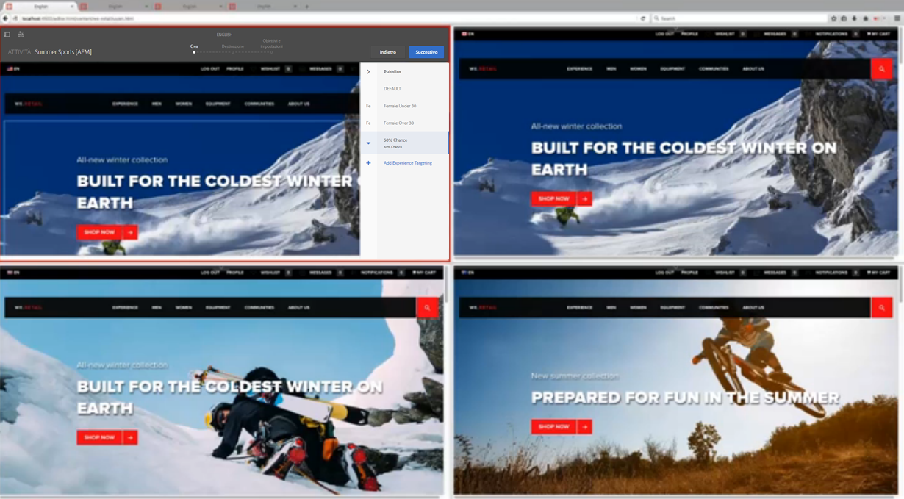

L&#39;addetto al marketing desidera introdurre tali modifiche nella regione europea e [esegue il rollout della Live Copy](/help/sites-administering/msm-livecopy.md) toccando o facendo clic **Pagina di rollout**. Dopo aver aggiornato la scheda, il sito Gran Bretagna ha la nuova immagine come l&#39;area Europa eredita dall&#39;area master (dopo il rollout).

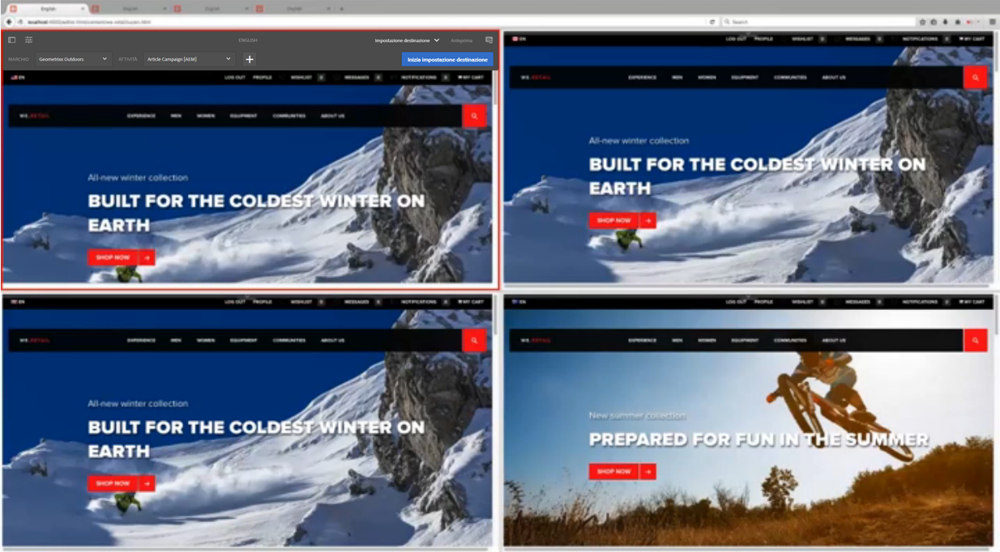

L’immagine nel sito Australia rimane invariata, che è il comportamento desiderato, in quanto è estate in Australia e l’addetto al marketing non vuole modificare quel contenuto. Il sito dell&#39;Australia non cambia perché non condivide un&#39;area con nessun&#39;altra regione né è una Live Copy di un&#39;altra regione. L’addetto al marketing non deve mai preoccuparsi che il contenuto di destinazione del sito australiano venga sovrascritto.

Inoltre, per la Gran Bretagna, la cui area è una Live Copy dell’area master, lo stato di ereditarietà è visibile dall’indicatore verde accanto al nome dell’attività. Se un’attività viene ereditata, non puoi modificarla a meno che tu non sospenda o scolleghi la Live Copy.

In qualsiasi momento, puoi sospendere l’ereditarietà o scollegare completamente l’ereditarietà. Puoi anche aggiungere sempre esperienze locali disponibili solo per tale esperienza senza sospendere l’ereditarietà.

>[!NOTE]
>
>Per informazioni tecniche su questa funzione, consulta [Struttura della gestione di più siti per contenuti mirati](/help/sites-authoring/technical-multisite-targeted.md).

### Creazione di una nuova area rispetto alla creazione di una nuova area come Live Copy {#creating-a-new-area-versus-creating-a-new-area-as-livecopy}

In AEM, puoi creare una nuova area o crearne una nuova come Live Copy. La creazione di una nuova area raggruppa le attività e tutto ciò che appartiene a tali attività, ad esempio offerte, esperienze e così via. È possibile creare una nuova area quando si desidera creare un set completamente distinto di contenuti di destinazione o condividere un set di contenuti di destinazione.

Tuttavia, se hai impostato l’ereditarietà tramite l’MSM tra i due siti, puoi ereditare le attività. In questo caso, crei una nuova area come Live Copy, in cui Y è una Live Copy di X e quindi eredita anche tutte le attività.

>[!NOTE]
>
>Il rollout predefinito attiva i rollout successivi di contenuti di destinazione ogni volta che una pagina è una Live Copy, attraverso il collegamento a un’area che è una Live Copy dell’area associata alle pagine blueprint.

Ad esempio, nel diagramma seguente, sono disponibili quattro siti in cui due condividono l’area master (e tutte le attività che fanno parte di tale area), un sito ha un’area che è una Live Copy di un’area, quindi condivide le attività dopo il rollout, e un sito è completamente diverso (che quindi richiede un’area per le relative attività).

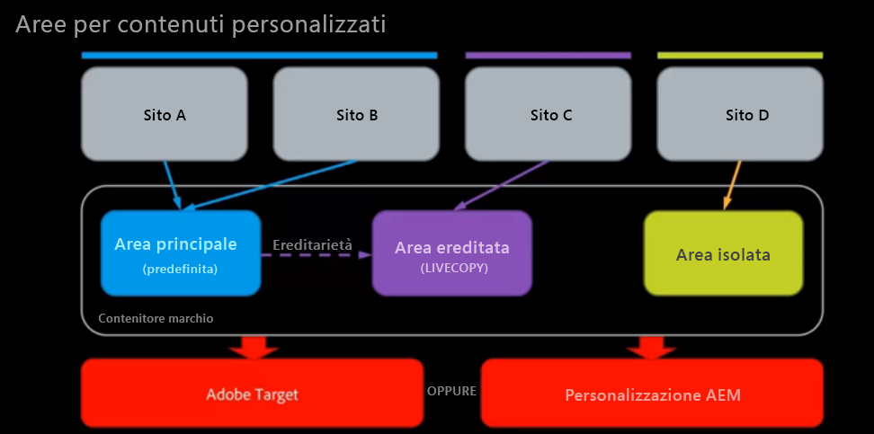

Per ottenere questo AEM, effettua le seguenti operazioni:

* Il sito A si collega all’area master: non è necessaria alcuna creazione di area. Area master è selezionata per impostazione predefinita in AEM. Il sito A e il sito B condividono attività e così via.
* Il sito B si collega all’Area master: non è necessaria alcuna creazione di area. Area master è selezionata per impostazione predefinita in AEM. Il sito A e il sito B condividono attività e così via.
* Il sito C si collega all’area ereditata, che è una Live Copy dell’area master - Crea area come Live Copy in cui si crea una Live Copy basata sull’area master. L’area ereditata eredita le attività dall’area master al momento del rollout.
* Il sito D si collega alla propria Area isolata: consente di creare un’area completamente nuova senza attività ancora definite. L&#39;area isolata non condividerà le attività con nessun altro sito.

## Creazione di nuove aree {#creating-new-areas}

Le aree possono includere attività e offerte. Dopo aver creato un’area in una di queste (ad esempio, attività), l’area disponibile anche nell’altra (ad esempio, offerte).

>[!NOTE]
>
>L’area predefinita denominata Area mastro viene ridotta per impostazione predefinita quando tocchi o fai clic sul nome di un marchio **fino** a creare un’altra area. Quindi, quando selezioni un marchio nella console **Attività** o **Offerte**, viene visualizzata la console **Area**.

Per creare una nuova area:

1. Passa a **Personalizzazione** > **Attività** o **Offerte** per poi, infine, arrivare al tuo marchio.
1. Tocca o fai clic su **Crea area**.

   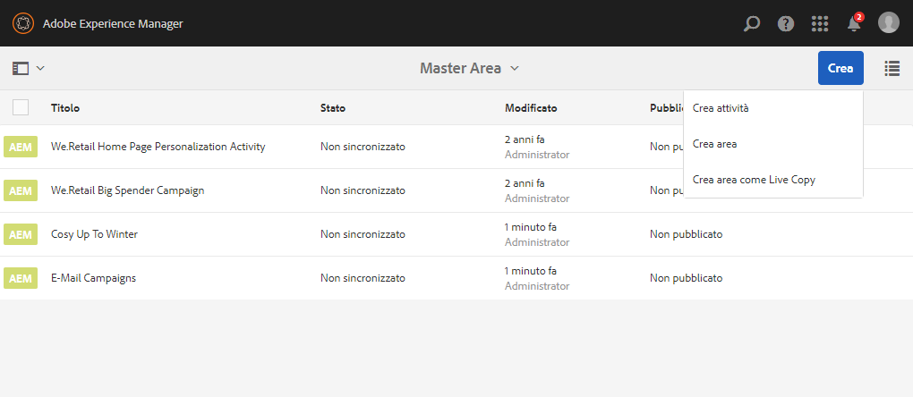

1. Fai clic sul pulsante **Area** e fai clic su **Successivo**.
1. In **Titolo** immettere un nome per la nuova area. Facoltativamente, seleziona i tag.
1. Tocca o fai clic su **Crea**.

   AEM reindirizza alla finestra del marchio, in cui sono elencate tutte le aree create. Se è presente un’altra area oltre all’Area master, puoi creare aree direttamente nella console Marchio .

   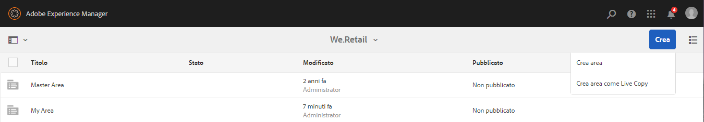

## Creazione di aree come Live Copy {#creating-areas-as-live-copies}

Puoi creare un’area come Live Copy per ereditare il contenuto di destinazione tra le strutture del sito.

Per creare un’area come Live Copy:

1. Passa a **Personalizzazione** > **Attività** o **Offerte** e infine, al tuo marchio.
1. Tocca o fai clic su **Crea area come Live Copy**.

   

1. Seleziona l’area di cui desideri effettuare una Live Copy e fai clic su **Avanti**.

   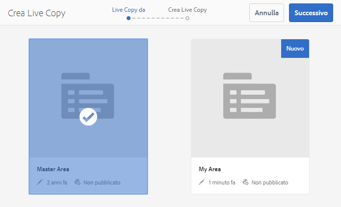

1. Nel campo **Nome**, inserisci un nome per la Live Copy. Per impostazione predefinita, le sottopagine sono incluse, escludile selezionando la casella di controllo **Escludi sottopagine**.

   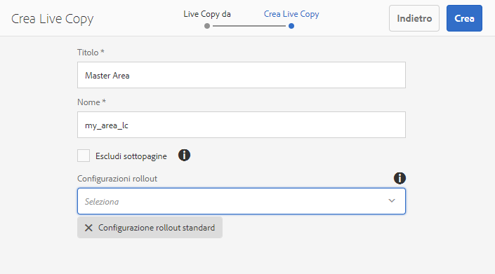

1. In **Configurazioni di rollout** dal menu a discesa, seleziona la configurazione appropriata.

   Vedi [Configurazioni di rollout installate](/help/sites-administering/msm-sync.md#installed-rollout-configurations) per la descrizione di ciascuna opzione.

   Vedi [Creazione e sincronizzazione di Live Copy](/help/sites-administering/msm-livecopy.md) per ulteriori informazioni sulle Live Copy.

   >[!NOTE]
   >
   >Quando si effettua il rollout di una pagina su una Live Copy e l’area viene configurata per la pagina del Blueprint, il Blueprint per l’area viene configurato per le Pagine Live Copy, **personalizationContentRollout** attiva un subRollout in sincronia, che fa parte di **Configurazione rollout standard**.

1. Tocca o fai clic su **Crea**.

   AEM reindirizza alla finestra del marchio, in cui sono elencate tutte le aree create. Se esiste un’altra area oltre all’Area master, puoi creare aree direttamente dalla finestra del marchio.

   

## Collegamento di siti a un’area {#linking-sites-to-an-area}

È possibile collegare aree a pagine o siti. Le aree vengono ereditate da tutte le sottopagine a meno che non siano sovrapposte da una mappatura su una sottopagine. In genere, tuttavia, crei collegamenti a livello del sito.

Quando effettui un collegamento, sono disponibili solo le attività, le esperienze e le offerte dell’area selezionata. Questo impedisce il mixup accidentale di contenuti gestiti in modo indipendente. Se non è configurata alcuna altra area, viene utilizzata l’area master di ogni marchio.

>[!NOTE]
>
>Le pagine o i siti che fanno riferimento alla stessa area utilizzano *lo stesso* insieme comune delle attività, delle esperienze e delle offerte. La modifica di attività, esperienze o offerte che viene condivisa da più siti agisce su tutti i siti.

Per collegare un sito a un’area:

1. Passa al sito (o alla pagina) a cui desideri collegare un’area.
1. Seleziona il sito o la pagina e tocca o fai clic su **Visualizza proprietà**.
1. Tocca o fai clic sulla scheda **Personalizzazione**.
1. In **Brand** seleziona il marchio a cui desideri collegare l’area. Dopo aver selezionato il marchio, le aree disponibili nella **Riferimento area** menu.

   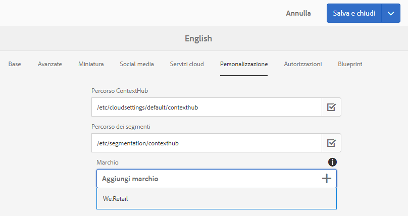

1. Seleziona l’area dal menu a discesa **Riferimento Area** e tocca o fati clic su **Salva**.

   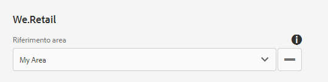

## Stacco della Live Copy o sospensione dell’ereditarietà di contenuti di destinazione {#detaching-live-copy-or-suspending-inheritance-of-targeted-content}

È possibile sospendere o scollegare l’ereditarietà di contenuti di destinazione. La sospensione o lo scollegamento della Live Copy viene eseguito per attività. Ad esempio, puoi modificare le esperienze nell’attività, ma se l’attività è ancora collegata alla copia ereditata, non puoi modificare l’esperienza o nessuna delle proprietà dell’attività.

La sospensione della Live Copy interrompe temporaneamente l’ereditarietà, ma in futuro è possibile ripristinare l’ereditarietà. Il distacco della Live Copy interrompe in modo permanente l’ereditarietà.

Sospendi o scolleghi l’ereditarietà dei contenuti di destinazione ristabilendola in un’attività. Se una pagina o un sito si collega a un’area che è una Live Copy, puoi visualizzare lo stato di ereditarietà di un’attività.

Un’attività che eredita da un altro sito viene contrassegnata in verde accanto al nome dell’attività. Un’ereditarietà sospesa è contrassegnata in rosso e un’attività creata localmente non ha alcuna icona.

>[!NOTE]
>
>* Puoi sospendere o scollegare solo le Live Copy in un’attività.
>* Non è necessario sospendere o scollegare le Live Copy per estendere un’attività ereditata. Puoi sempre creare **nuovo** esperienze e offerte locali per tale attività. Se desideri modificare un’attività esistente, devi sospendere l’ereditarietà.
>

### Sospensione dell’ereditarietà {#suspending-inheritance}

Per sospendere o scollegare l’ereditarietà di contenuti di destinazione in un’attività:

1. Passa alla pagina in cui desideri scollegare o sospendere l’ereditarietà e tocca o fai clic su **Targeting** nel menu a discesa modalità .
1. Se la pagina è collegata a un’area che è una Live Copy, viene visualizzato lo stato di ereditarietà. Tocca o fai clic su **Inizia impostazione destinazione**.
1. Per sospendere un’attività, effettua una delle seguenti operazioni:

   1. Seleziona un elemento dell’attività, ad esempio il pubblico. AEM visualizza automaticamente una casella di conferma Sospendi Live Copy . Puoi sospendere la Live Copy toccando o facendo clic su qualsiasi elemento durante il processo di targeting.
   1. Seleziona **Sospendi Live Copy** dal menu a discesa nella barra degli strumenti.

   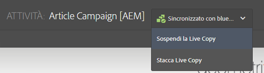

1. Tocca o fai clic su **Sospendi** per sospendere l’attività. Le attività sospese sono contrassegnate in rosso.

   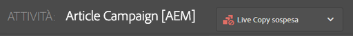

### Interruzione dell’ereditarietà {#breaking-inheritance}

Per interrompere l’ereditarietà di contenuti di destinazione in un’attività:

1. Passa alla pagina in cui desideri scollegare la Live Copy dal master e tocca o fai clic su **Targeting** nel menu a discesa modalità .
1. Se la pagina è collegata a un’area che è una Live Copy, viene visualizzato lo stato di ereditarietà. Tocca o fai clic su **Inizia impostazione destinazione**.
1. Dal menu a discesa nella barra degli strumenti, seleziona **Stacca Live Copy**. AEM conferma che vuoi scollegare la Live Copy.
1. Tocca o fai clic su **Stacca** per scollegare la Live Copy dall’attività. Una volta scollegato, il menu a discesa relativo all’ereditarietà non viene più visualizzato. L’attività ora è un’attività locale.

   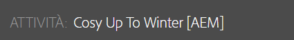

## Ripristino dell’ereditarietà di contenuti di destinazione {#restoring-inheritance-of-targeted-content}

Se hai sospeso l’ereditarietà di contenuti di destinazione in un’attività, puoi ripristinarla in qualsiasi momento. Tuttavia, se hai scollegato la Live Copy, non puoi ripristinare l’ereditarietà.

Per ripristinare l’ereditarietà di contenuti di destinazione in un’attività:

1. Accedi alla pagina in cui desideri ripristinare l’ereditarietà e tocca o fai clic su **Targeting** nel menu a discesa della modalità.
1. Tocca o fai clic su **Inizia impostazione destinazione**.
1. Dal menu a discesa nella barra degli strumenti, seleziona **Riprendi Live Copy**.

   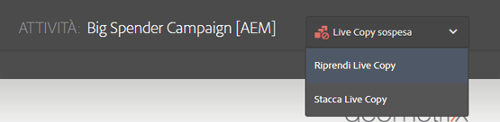

1. Tocca o fai clic su **Riprendi** per confermare che desideri riprendere l’ereditarietà della Live Copy. Eventuali modifiche apportate all’attività corrente andranno perse se riprendi l’ereditarietà.

## Eliminazione di aree {#deleting-areas}

Quando elimini un’area, elimina tutte le attività in tale area. AEM avvisa prima di eliminare un’area. Se elimini un’area a cui è collegato un sito, la mappatura per questo marchio riassocia automaticamente all’area master.

Eliminare un’area:

1. Vai su **Personalizzazione** > **Attività** or **Offerte** e quindi al tuo marchio.
1. Tocca o fai clic sull’icona accanto all’area da eliminare.
1. Tocca o fai clic su **Elimina** e confermare che si desidera eliminare l&#39;area.
