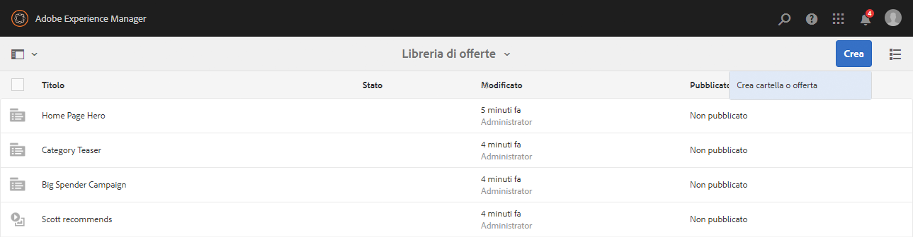
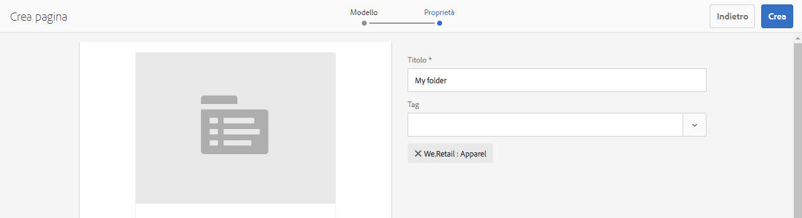
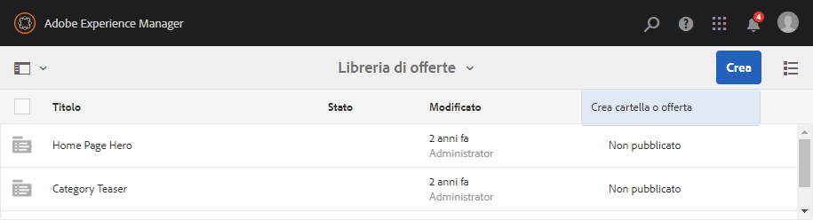
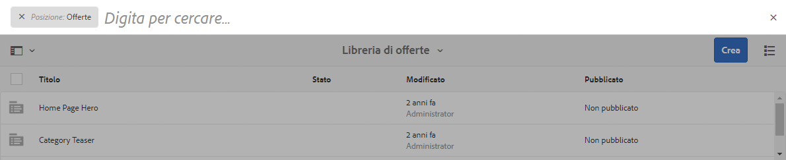

# Creazione e gestione delle offerte{#creating-and-managing-offers}

>[!CAUTION]
>
>AEM 6.4 ha raggiunto la fine del supporto esteso e questa documentazione non viene più aggiornata. Per maggiori dettagli, consulta la nostra [periodi di assistenza tecnica](https://helpx.adobe.com/it/support/programs/eol-matrix.html). Trova le versioni supportate [qui](https://experienceleague.adobe.com/docs/).

Usa la console Offerte per creare offerte da [utilizzare in più esperienze](/help/sites-authoring/content-targeting-touch.md). La creazione di offerte nella console Offerte consente di risparmiare tempo quando più esperienze richiedono la stessa offerta:

* Crea l’offerta una volta nella libreria e utilizzala in più esperienze delle attività del tuo marchio.
* Modifica l’offerta nella libreria e la modifica interessa tutte le esperienze che la utilizzano.

Nella console Offerte, le offerte sono organizzate per marchio. Ogni marchio contiene una libreria di offerte che possono essere utilizzate nelle diverse esperienze del marchio. Utilizza le cartelle per definire una struttura gerarchica per organizzare le offerte in ogni libreria. Una struttura logica delle cartelle consente agli autori di trovare facilmente le offerte navigando nella libreria. Gli strumenti di assegnazione tag e ricerca consentono inoltre agli autori di trovare le offerte.

## Aggiungere un marchio utilizzando la console Offerte {#add-a-brand-using-the-offers-console}

Crea un marchio a cui le offerte sono associate. Apri un marchio nella console Offerte per accedere alla libreria delle offerte, dove puoi creare cartelle e offerte.

Quando crei un marchio utilizzando la console Offerte, questo viene visualizzato anche nel [Console Attività](/help/sites-authoring/activitylib.md) dove puoi aggiungere e amministrare attività per il marchio.

1. Fai clic o tocca **Personalizzazione** > **Offerte** nella console di navigazione.

   

1. Tocca o fai clic su **Crea** e quindi su **Crea marchio**.
1. Seleziona il modello di marchio e tocca o fai clic su **Successivo**.
1. Digita un titolo per il marchio come desideri che appaia nelle console Offerte e Attività . Facoltativamente, digita o seleziona uno o più tag da associare al brand.
1. Tocca o fai clic su **Crea**.

## Aggiungere una cartella a una libreria di offerte {#add-a-folder-to-an-offer-library}

Aggiungi una cartella alla libreria di offerte di un marchio per organizzare e archiviare le offerte. Puoi creare una cartella sotto il marchio o sotto altre cartelle.

1. Nella console Offerte, apri il percorso in cui desideri creare la cartella. Ad esempio, apri il marchio per creare una cartella di livello superiore o apri un’altra cartella nella libreria.
1. Tocca o fai clic su **Crea** > **Crea cartella o offerta**.

   

1. Seleziona **Cartella** e fai clic su **Avanti**.
1. Digita un titolo per la cartella come desideri che appaia nella libreria dell&#39;offerta e digita o seleziona i tag.

   

1. Tocca o fai clic su **Crea**.

## Aggiungere un’offerta a una libreria di offerte {#add-an-offer-to-an-offer-library}

Aggiungi un’offerta alla libreria delle offerte di un marchio in modo che possa essere aggiunta alle esperienze del marchio. Quando aggiungi un’offerta, fornisci un titolo. Puoi anche associare l’offerta a uno o più tag per migliorare la ricercabilità.

Dopo aver creato l’offerta puoi aprirla per creare il contenuto.

1. Nella console Offerte, apri la posizione in cui desideri creare l’offerta. Ad esempio, apri il marchio per creare un’offerta di livello principale o apri una cartella nella libreria.
1. Tocca o fai clic su **Crea** > **Crea cartella o offerta**.

   

1. Seleziona la **Pagina Offerta** modello , quindi tocca o fai clic su **Successivo**.
1. Digita un titolo per l’offerta e, facoltativamente, seleziona o digita uno o più tag da associare all’offerta, quindi tocca o fai clic su **Crea**.
1. Nella finestra di dialogo di conferma, per aprire l&#39;offerta di modifica tocca o fai clic su **Apri pagina**.

## Modifica di un’offerta {#editing-an-offer}

Apri un’offerta e modifica il contenuto come desideri che appaia nelle esperienze che la utilizzano. Quando modifichi un’offerta utilizzata in qualsiasi esperienza, le modifiche vengono visualizzate nelle esperienze.

Puoi aprire un’offerta da una cartella in una libreria di offerte o dai risultati della ricerca. Puoi anche aprire un’offerta da un’esperienza che utilizza l’offerta.

1. Nella console Offerte, tocca o fai clic sull’icona accanto all’offerta e tocca o fai clic su **Modifica**.
1. Aggiungi i componenti all’offerta e modifica il contenuto del componente come di consueto.

## Eliminazione di un’offerta {#deleting-an-offer}

Elimina un’offerta quando non è più necessaria. Quando tenti di eliminare un’offerta utilizzata in un’esperienza, ti viene richiesto di confermare l’eliminazione. La conferma elimina l’offerta e la rimuove dalle esperienze.

Puoi eliminare un’offerta visualizzando il contenuto di una cartella in una libreria di offerte o i risultati della ricerca.

1. Nella console Offerte, tocca o fai clic sull’icona accanto all’offerta e tocca o fai clic su **Elimina**.

   Seleziona l’offerta e tocca o fai clic su **Elimina**.

1. Nella finestra di dialogo visualizzata, tocca o fai clic su **Elimina** per confermare l’eliminazione.
1. Se l’offerta viene utilizzata in una o più esperienze, viene visualizzata una finestra di dialogo per indicare che si fa riferimento all’offerta:

   * Per eliminare l’offerta e rimuoverla dalle esperienze, tocca o fai clic su **Forza eliminazione**.
   * Per mantenere l’offerta, tocca o fai clic su **Annulla**.

## Ricerca di offerte {#searching-for-offers}

Cerca offerte di qualsiasi marchio utilizzando parole chiave per abbinare il titolo.

I criteri di ricerca correnti vengono visualizzati accanto ai risultati della ricerca. Puoi anche ordinare i risultati per colonna in ordine crescente o decrescente. Puoi eseguire una ricerca da qualsiasi cartella di qualsiasi libreria di offerte. I risultati della ricerca sono gli stessi, indipendentemente dalla cartella corrente.

Per cercare le offerte:

1. Nella parte superiore della console Offerte, tocca o fai clic sull&#39;icona della lente d&#39;ingrandimento. Per impostazione predefinita, la ricerca è limitata alle offerte.
1. Immetti la parola chiave per cercare le offerte. Seleziona dai risultati.
