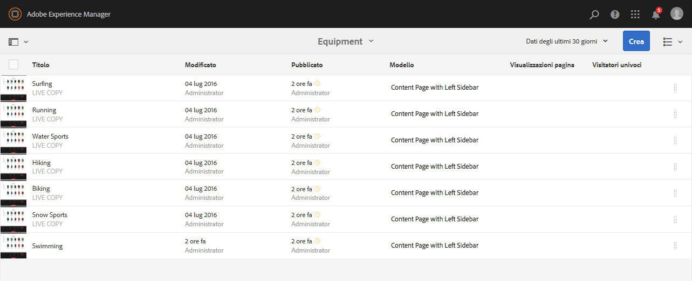
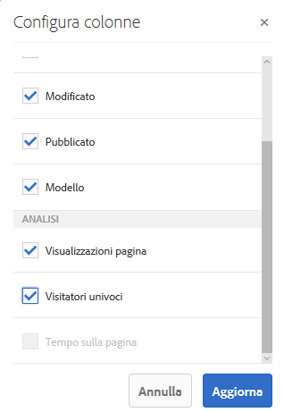
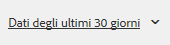

# Visualizzazione dei dati analitici sulle pagine{#seeing-page-analytics-data}

Utilizza i dati analitici pagina per misurare l&#39;efficacia del contenuto della pagina.

## Dati analitici visibili dalla console {#analytics-visible-from-the-console}

I dati analitici pagina vengono visualizzati nella [Vista a elenco](/help/sites-authoring/basic-handling.md#list-view) della console Sites. Quando le pagine vengono visualizzate nel formato elenco, sono disponibili le colonne seguenti per impostazione predefinita:

* Visualizzazioni pagina
* Visitatori univoci
* Tempo sulla pagina

Ciascuna colonna mostra un valore per il periodo di generazione rapporti in corso e indica anche se tale valore è aumentato o diminuito rispetto al periodo di generazione rapporti precedente. I dati visualizzati vengono aggiornati ogni 12 ore.

>[!NOTE]
>
>Per modificare il periodo di aggiornamento, [configura l&#39;intervallo di importazione](/help/sites-administering/adobeanalytics-connect.md#configuring-the-import-interval).

1. Apri la console **Sites**, ad esempio [http://localhost:4502/sites.html/content](http://localhost:4502/sites.html/content)
1. Nella parte all&#39;estrema destra della barra degli strumenti (angolo in alto a destra), tocca o fai clic sull&#39;icona per selezionare **Vista a elenco** (l&#39;icona mostrata dipende dalla [vista corrente](/help/sites-authoring/basic-handling.md#viewing-and-selecting-resources)).

1. Di nuovo, all&#39;estrema destra della barra degli strumenti (angolo in alto a destra) tocca o fai clic sull&#39;icona **Visualizza impostazioni**. Si aprirà la finestra di dialogo **Configura colonne**. Apporta le modifiche necessarie e conferma con **Aggiorna**.

   

### Selezione del periodo di generazione rapporti {#selecting-the-reporting-period}

Seleziona il periodo di generazione rapporti per il quale i dati di Analytics vengono visualizzati sulla console Sites:

* Dati degli ultimi 30 giorni
* Dati degli ultimi 90 giorni
* Dati di quest&#39;anno

Il periodo di rigenerazione rapporti corrente viene visualizzato nella barra degli strumenti della console Sites (a destra della barra degli strumenti superiore). Utilizza il menu a discesa per selezionare il periodo di generazione rapporti desiderato.\

### Configurazione delle colonne di dati disponibili {#configuring-available-data-columns}

I membri del gruppo utenti amministratori-analytics possono configurare la console Sites per consentire agli autori di vedere ulteriori colonne di Analytics.

>[!NOTE]
>
>Quando una struttura ad albero di pagine contiene elementi secondari associati a diverse configurazioni cloud di Adobe Analytics, non potrai configurare le colonne di dati disponibili per le pagine.

1. Nella vista a elenco, usa i selettori vista (a destra della barra degli strumenti), seleziona **Impostazioni vista** e quindi **Aggiungi dati di analisi personalizzati**.

   

1. Seleziona le metriche che desideri esporre agli autori nella console Sites, quindi fai clic su **Aggiungi**.

   Le colonne visualizzate vengono recuperate da Adobe Analytics.

   

### Apertura di approfondimenti sui contenuti da Sites {#opening-content-insights-from-sites}

Open [Content Insight](/help/sites-authoring/content-insights.md) from the Sites console to further investigate page effectiveness.

1. Nella console Sites, seleziona la pagina per la quale desideri visualizzare gli approfondimenti dei contenuti.
1. Nella barra degli strumenti, fai clic sull’icona di Analytics e Recommendations.

   

## Dati analitici visibili dall’Editor pagine (Mappa attività) {#analytics-visible-from-the-page-editor-activity-map}

>[!CAUTION]
>
>In seguito a modifiche di sicurezza in Adobe Analytics API, non è più possibile utilizzare la versione di Activity Map inclusa in AEM.
>
>The [ActivityMap plugin provided by Adobe Analytics](https://docs.adobe.com/content/help/en/analytics/analyze/activity-map/getting-started/get-started-users/activitymap-install.html) should now be used.
