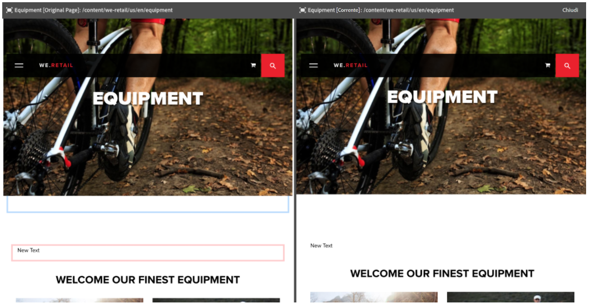
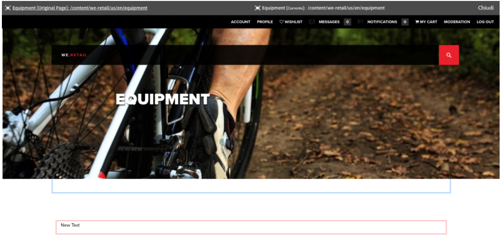

# Differenze tra pagine {#page-diff}

## Introduzione {#introduction}

La creazione di contenuti è un processo iterativo. Per un authoring efficace, è necessario essere in grado di vedere cosa è cambiato da un’iterazione all’altro. La visualizzazione separata di due versioni di una pagina è inefficiente e soggetta a errori. L’autore desidera poter confrontare facilmente la pagina corrente affiancata a un’altra sua versione.

È possibile confrontare in modalità affiancata i contenuti di due pagine, evidenziandone le differenze rilevate.

>[!CAUTION]
>
>Se state eseguendo una versione precedente a AEM 6.4.3, per utilizzare la funzione l&#39;utente deve disporre dell&#39;autorizzazione **Modifica/Crea/Elimina** sul nodo `/content/versionhistory` .
>
>Per ulteriori informazioni tecniche su questa funzione, consulta [Sviluppo e differenze tra pagine](/help/sites-developing/pagediff.md#operation-details).

## Utilizzo {#use}

La visualizzazione affiancata delle differenze permette di confrontare:

* [Versioni](/help/sites-authoring/working-with-page-versions.md#comparing-a-version-with-current-page) - Versione precedente di una pagina con il relativo stato corrente
* Live Copy - Live Copy con la relativa blueprint
* [Lanci](/help/sites-authoring/launches-editing.md#comparing-a-launch-page-to-its-source-page) - Lancio con la rispettiva origine
* Copie per lingua - Una pagina prima e dopo la traduzione o la ritraduzione

Consulta i rispettivi argomenti su come avviare la funzione per il rilevamento delle differenze in questi contesti.

### Presentazione delle differenze   {#presentation-of-differences}

A prescindere dal contenuto, la presentazione delle differenze rimane la stessa.

* Il contenuto selezionato viene visualizzato a sinistra (punto di ingresso per il rilevamento delle differenze).
* Il contenuto con cui viene confrontato è visualizzato a destra.

Ad esempio, se si confrontano due versioni, la versione corrente è a sinistra e quella precedente a destra.

L’origine di entrambe le pagine è indicata chiaramente nella barra dell’intestazione, nella parte superiore della finestra del browser.

Vengono rilevate le modifiche apportate a livello di componente e di codice HTML. Gli elementi che sono stati modificati sono evidenziati con colori diversi.

**Modifica componenti**

* Verde chiaro - Componente aggiunto
* Rosa - Componente rimosso
* Blu - Componente modificato
* Blu - Componente spostato

Nota: il colore dei componenti modificati e spostati è lo stesso.

**Modifiche HTML**

* Verde scuro - HTML aggiunto
* Rosso - HTML rimosso

>[!NOTE]
>
>Quando si confrontano le copie per lingua, l’evidenziazione è disattivata poiché in una traduzione tutto cambia.

### Modalità a schermo intero e Uscita   {#fullscreen-and-exiting}

Per concentrarti su un contenuto particolare, fai clic sull’icona schermo intero di entrambi i “lati” a confronto, per ingrandire il contenuto nella finestra del browser a schermo intero.

Il lato selezionato occupa l’intera finestra, ma nella parte superiore rimane visualizzata la barra che consente di alternare tra le due pagine.

Per chiudere la visualizzazione a schermo intero, fai clic sull’icona per uscire dalla modalità a tutto schermo.

Puoi uscire dalla modalità di confronto affiancato delle differenze in qualsiasi momento facendo clic sul pulsante Chiudi, nell’intestazione.

## Limiti   {#limitations}

Esistono alcune situazioni in cui il confronto delle differenze della pagina non è in grado di rilevare una differenza nel modo previsto.

* Nel confronto di versioni e lanci, la funzione non prende in considerazione le differenze dinamiche, come i componenti breadcrumb, i menu, gli elenchi di prodotti o i loghi (componenti che si basano sulla struttura del sito per eseguire il rendering del contenuto).
* Per le versioni, non viene ricreato il criterio per il controllo degli accessi e le relazioni Live Copy.
* Le eventuali modifiche apportate a un’immagine, ad esempio agli attributi alt, title o src, vengono evidenziate in blu. Tuttavia, in alcuni casi le immagini hanno una rappresentazione Base64 dell’attributo src e, nonostante siano uguali, vengono contrassegnate come diverse a causa dei differenti attributi src.
* Il confronto non è in grado di rilevare la rotazione di un’immagine.
* Se una pagina viene spostata, non ti sarà più possibile eseguire una rilevazione delle differenze con qualsiasi versione creata prima dello spostamento.

   * Se rilevi dei problemi con una differenza, controlla la [Timeline](/help/sites-authoring/basic-handling.md#timeline) per verificare se la pagina è stata spostata.

>[!NOTE]
>
>Le versioni non possono essere confrontate tra di loro. Solo la versione corrente può essere confrontata con altre versioni della pagina. La versione corrente è sempre la versione con le modifiche evidenziate.

>[!NOTE]
>
>Per ulteriori informazioni sull’operazione del meccanismo di differenze tra pagine e sui limiti che possono influenzare tale meccanismo, consulta la [documentazione per gli sviluppatori](/help/sites-developing/pagediff.md) per questa funzione.

