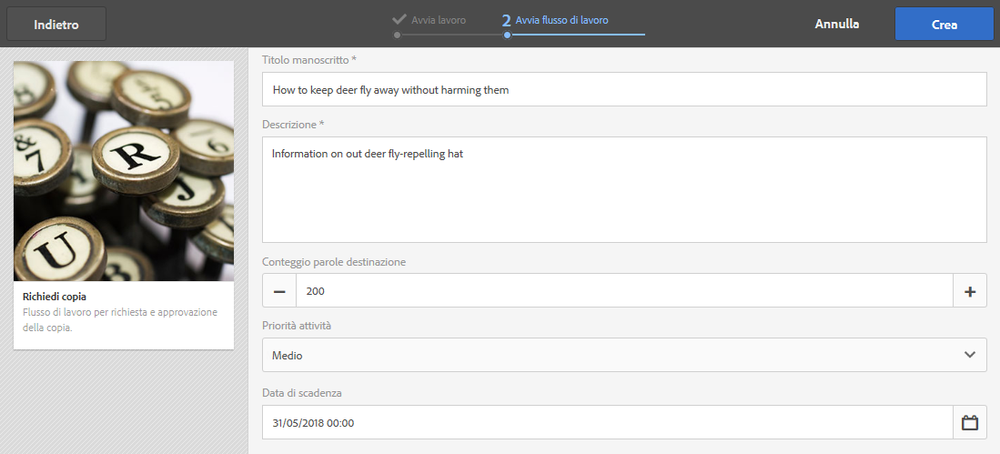
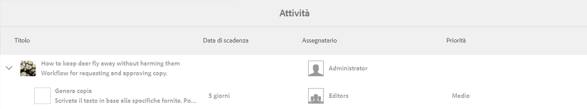
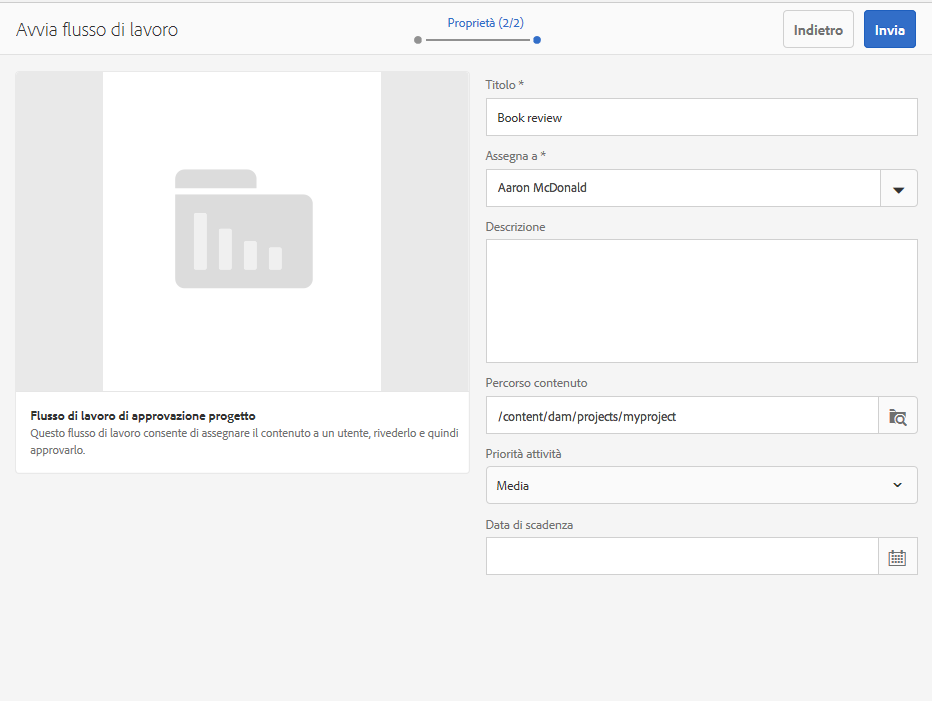
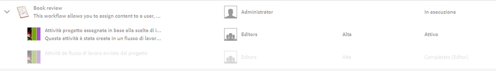
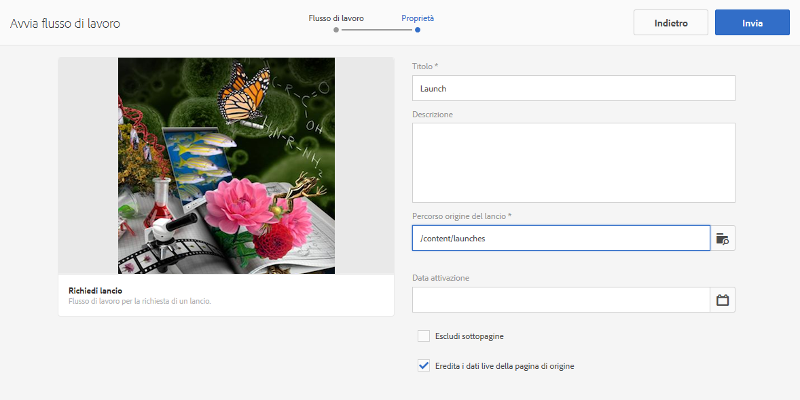
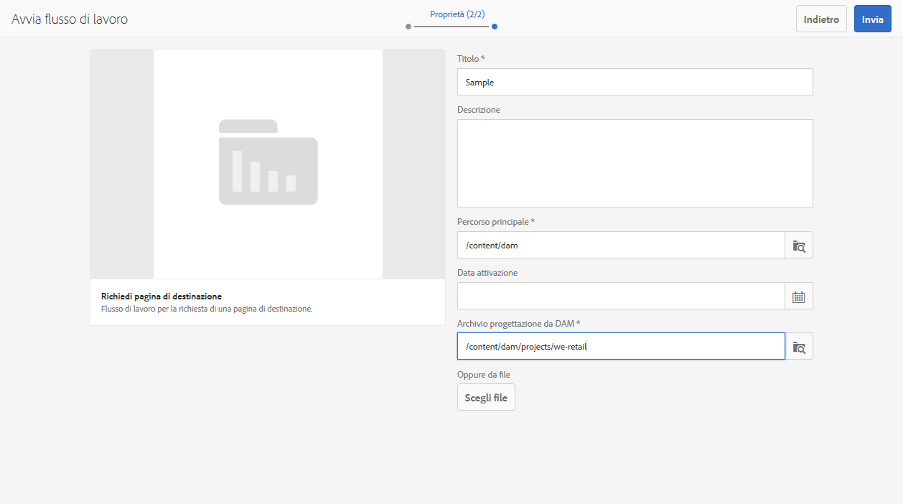
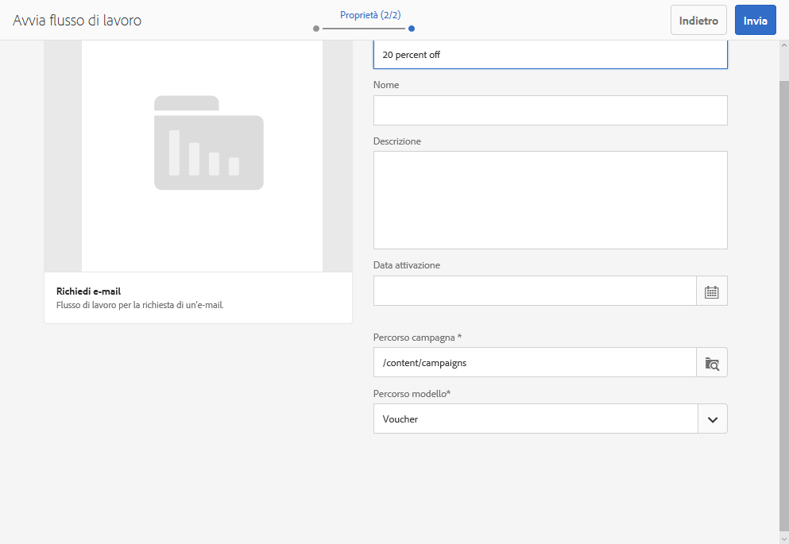
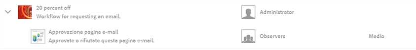

# Utilizzo dei flussi di lavoro per i progetti{#working-with-project-workflows}

>[!CAUTION]
>
>AEM 6.4 ha raggiunto la fine del supporto esteso e questa documentazione non viene più aggiornata. Per maggiori dettagli, consulta la nostra [periodi di assistenza tecnica](https://helpx.adobe.com/it/support/programs/eol-matrix.html). Trova le versioni supportate [qui](https://experienceleague.adobe.com/docs/).

I flussi di lavoro di progetto disponibili includono:

* **Flusso di lavoro di approvazione progetto:** questo flusso di lavoro consente di assegnare dei contenuti a un utente, rivederli e approvarli.
* **Richiedi lancio**: flusso di lavoro per richiedere un lancio.
* **Richiedi pagina di destinazione**: flusso di lavoro per richiedere una pagina di destinazione.
* **Richiedi e-mail**: flusso di lavoro per la richiesta di un’e-mail.
* **Servizio fotografico per prodotto e servizio fotografico per prodotto (Commerce)** - Mappa le risorse con i prodotti
* **Crea e traduci copia e copia DAM Crea copia per lingua** - Crea binari, metadati e tag tradotti per risorse e cartelle.

A seconda del modello di progetto selezionato, sono disponibili alcuni flussi di lavoro:

|  | **Progetto semplice** | **Progetto multimediale** | **Progetto servizio fotografico per prodotto** | **Progetto di traduzione** |
|---|:-:|:-:|:-:|:-:|
| Richiedi copia |  | x |  |  |
| Servizio fotografico per prodotto |  | x | x |  |
| Servizio fotografico per prodotto (Commerce) |  |  | x |  |
| Approvazione del progetto | x |  |  |  |
| Richiedi lancio | x |  |  |  |
| Richiedi pagina di destinazione | x |  |  |  |
| Richiedi e-mail | x |  |  |  |
| Creazione DAM copia in lingua &amp;ast; |  |  |  | x |
| Creazione DAM e traduzione copia in lingua &amp;ast; |  |  |  | x |

>[!NOTE]
>
>&amp;ast Questi flussi di lavoro non si trovano nella sezione **Flusso di lavoro** in Progetti. Vedi [Creazione di copie per lingua per le risorse.](/help/sites-administering/tc-manage.md)

I passaggi per avviare e completare i flussi di lavoro sono gli stessi, indipendentemente dal flusso di lavoro scelto. Cambiano solo i passaggi.

Puoi avviare un flusso di lavoro direttamente in Progetti (eccetto Crea copia per lingua DAM o Crea e traduci copia DAM). Le informazioni sulle attività in sospeso in un progetto sono elencate nella sezione **Attività** piastrelle. Le notifiche per le attività da completare vengono visualizzate accanto all’icona utente.

Per ulteriori informazioni sulle operazioni con i flussi di lavoro in AEM, consulta quanto segue:

* [Partecipare ai flussi di lavoro](/help/sites-authoring/workflows-participating.md)
* [Applicazione dei flussi di lavoro alle pagine](/help/sites-authoring/workflows-applying.md)
* [Configurare i flussi di lavoro](/help/sites-administering/workflows.md)

Questa sezione descrive i flussi di lavoro disponibili per Progetti.

## Flusso di lavoro Richiedi copia {#request-copy-workflow}

Questo flusso di lavoro ti consente di richiedere un manoscritto a un utente e quindi di approvarlo. Per avviare il flusso di lavoro di copia della richiesta:

1. Nel progetto Media, seleziona il segno **+** nella sezione **Flussi di lavoro** e fai clic su **Request Copy Workflow (Richiedi copia flusso di lavoro)**.
1. Inserisci un titolo del manoscritto e un breve riepilogo della richiesta. Se applicabile, immettere un numero di parole di destinazione, una priorità dell&#39;attività e una data di scadenza.

   

1. Fai clic su **Crea**. Viene avviato il flusso di lavoro. L’attività viene visualizzata nella **Attività** piastrelle.

   

## Flusso di lavoro Servizio fotografico per prodotto {#product-photo-shoot-workflow}

I flussi di lavoro Servizio fotografico per prodotto (sia per e-commerce che senza e-commerce) sono descritti dettagliatamente [Progetto creativo](/help/sites-authoring/managing-product-information.md).

## Flusso di lavoro di approvazione del progetto {#project-approval-workflow}

Nel flusso di lavoro di approvazione del progetto, assegni il contenuto a un utente, rivedi e quindi approva il contenuto.

1. Nel tuo progetto Semplice, seleziona ****+** accedi a **Flussi di lavoro** piastrelle e seleziona **Flusso di lavoro di approvazione del progetto**.
1. Immettere un titolo e selezionare a chi assegnarlo dall&#39;elenco Team. Se applicabile, immettere una descrizione, un percorso di contenuto, una priorità dell’attività e una data di scadenza.

   

1. Fai clic su **Crea**. Viene avviato il flusso di lavoro. L’attività viene visualizzata nella **Attività** piastrelle.

   

## Flusso di lavoro di richiesta di avvio {#request-launch-workflow}

Questo flusso di lavoro consente di richiedere un lancio.

1. Nel progetto Semplice, seleziona il segno **+** nella sezione **Flussi di lavoro** e fai clic su **Request Launch Workflow (Richiedi flusso di lavoro di Launch)**.
1. Inserisci un titolo per il lancio e fornisci il percorso sorgente del lancio. Puoi anche aggiungere una descrizione e una data di inizio, se applicabile. Seleziona Eredita i dati live della pagina sorgente o Escludi pagine secondarie a seconda di come desideri che si comporti il lancio.

   

1. Fai clic su **Crea**. Viene avviato il flusso di lavoro. Il flusso di lavoro viene visualizzato nell&#39;elenco **Flussi di lavoro** (fai clic sui puntini di sospensione **…** nella sezione **Flussi di lavoro** per accedere a questo elenco).

## Flusso di lavoro Richiedi pagina di destinazione {#request-landing-page-workflow}

Questo flusso di lavoro consente di richiedere una pagina di destinazione.

1. Nel progetto Semplice, seleziona la **+** accedi a **Flussi di lavoro** seleziona Richiedi flusso di lavoro pagina di destinazione .
1. Immetti un titolo per la pagina di destinazione e il percorso principale. Se applicabile, immetti una data di inizio o scegli un file per la pagina di destinazione.

   

1. Fai clic su **Crea**. Viene avviato il flusso di lavoro. L’attività viene visualizzata nella **Attività** piastrelle.

## Flusso di lavoro Richiedi e-mail {#request-email-workflow}

Questo flusso di lavoro ti consente di richiedere un’e-mail. È lo stesso flusso di lavoro che viene visualizzato nel **E-mail** piastrelle.

1. Nel progetto Media o Simple , seleziona la **+** accedi a **Flussi di lavoro** piastrelle e seleziona **Flusso di lavoro Richiedi e-mail**.
1. Immetti un titolo e-mail, nonché i percorsi della campagna e del modello. Inoltre puoi fornire un nome, una descrizione e una data di inizio.

   

1. Fai clic su **Crea**. Viene avviato il flusso di lavoro. L’attività viene visualizzata nella **Attività** piastrelle.

   

## Flusso di lavoro Crea (e traduci) copia per lingua per le risorse {#create-and-translate-language-copy-workflow-for-assets}

La **Crea copia in lingua** e **Crea e traduci copia in lingua** I flussi di lavoro sono descritti in dettaglio in [Creazione di copie per lingua per le risorse.](/help/assets/translation-projects.md)
