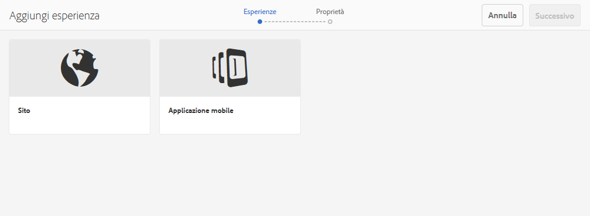
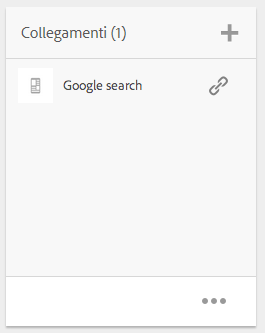

# Progetti{#projects}

>[!CAUTION]
>
>AEM 6.4 ha raggiunto la fine del supporto esteso e questa documentazione non viene più aggiornata. Per maggiori dettagli, consulta la nostra [periodi di assistenza tecnica](https://helpx.adobe.com/it/support/programs/eol-matrix.html). Trova le versioni supportate [qui](https://experienceleague.adobe.com/docs/).

La funzione Progetti consente di raggruppare le risorse in una singola entità. Si ottiene così un ambiente comune e condiviso che semplifica la gestione dei progetti. I tipi di risorse che puoi associare a un progetto in AEM vengono definiti porzioni. I riquadri possono includere informazioni sul progetto e sul team, risorse, flussi di lavoro e altro, come descritto in dettaglio in [Riquadri di progetto.](#project-tiles)

>[!CAUTION]
>
>Affinché gli utenti dei progetti possano vedere altri utenti/gruppi utilizzando le funzionalità Progetti come la creazione di progetti, la creazione di attività/flussi di lavoro, la visualizzazione e la gestione del team, questi utenti devono avere accesso in lettura a **/home/users** e **/home/groups**. Il modo più semplice per implementarlo è quello di fornire **utenti dei progetti** accesso in lettura di gruppo a **/home/users** e **/home/groups**.

In qualità di utente, puoi effettuare le seguenti operazioni:

* Creare progetti
* Associare contenuti e cartelle di risorse a un progetto
* Eliminare progetti
* Rimuovere i collegamenti al contenuto dal progetto

Vedi i seguenti argomenti aggiuntivi:

* [Gestione dei progetti](/help/sites-authoring/touch-ui-managing-projects.md)
* [Utilizzo delle attività](/help/sites-authoring/task-content.md)
* [Utilizzo dei flussi di lavoro per i progetti](/help/sites-authoring/projects-with-workflows.md)
* [Integrazione di progetti creativi e PIM](/help/sites-authoring/managing-product-information.md)

## Console Progetti {#projects-console}

La console Progetti consente di accedere ai progetti e gestirli all’interno di AEM.

* Seleziona **Timeline** e quindi un progetto per visualizzarne la timeline.
* Tocca o fai clic **Seleziona** per passare alla modalità di selezione.
* Fai clic su **Crea** per aggiungere progetti.
* **Attiva/Disattiva progetti** consente di passare da tutti i progetti a solo quelli attivi.
* **Mostra vista statistiche** consente di visualizzare le statistiche del progetto relative alle operazioni completate.

## Porzioni di progetto {#project-tiles}

Con Progetti è possibile associare diversi tipi di informazioni ai progetti. Si chiamano **Porzioni**. In questa sezione sono descritte le tessere e il tipo di informazioni che contengono.

Al progetto possono essere associati i seguenti riquadri. Le sezioni che seguono descrivono ciascuna di esse:

* Risorse e raccolte di risorse
* Esperienze
* Collegamenti
* Informazioni sul progetto
* Team
* Pagine di destinazione
* E-mail
* Flussi di lavoro
* Lanci
* Attività

### Assets {#assets}

In **Risorse** Puoi raccogliere tutte le risorse utilizzate per un particolare progetto.

Puoi caricare le risorse direttamente nella tessera. Inoltre, se disponi del componente aggiuntivo Dynamic Media, puoi creare set di immagini, set 360 gradi o set di file multimediali diversi.

### Raccolte di risorse {#asset-collections}

Simile alle risorse, puoi aggiungere [raccolte di risorse](/help/assets/managing-collections-touch-ui.md) direttamente al progetto. Puoi definire le raccolte in Assets.

Per aggiungere una raccolta, fai clic su **Aggiungi raccolta** e seleziona la raccolta appropriata dall’elenco.

### Esperienze {#experiences}

La **Esperienze** consente di aggiungere al progetto un’app mobile, un sito web o una pubblicazione.

Le icone indicano quale tipo di esperienza è rappresentata: sito web, app mobile o pubblicazione. Aggiungi le esperienze facendo clic sul segno + o su **Aggiungi esperienza** e selezionandone il tipo.

Seleziona il percorso per le miniature, se applicabile, modifica la miniatura per l&#39;esperienza. Le esperienze sono raggruppate insieme nel riquadro **Esperienze**.

### Collegamenti {#links}

La sezione Collegamenti consente di associare collegamenti esterni al progetto.

Puoi denominare il collegamento con un nome facile da riconoscere, nonché modificare la miniatura.

### Informazioni progetto {#project-info}

La sezione Informazioni sul progetto fornisce informazioni generali sul progetto, tra cui una descrizione, lo stato del progetto (inattivo o attivo), una data di scadenza e i membri. Inoltre, puoi aggiungere una miniatura del progetto, che viene visualizzata nella pagina principale Progetti .

I membri del team possono essere assegnati a questa porzione ed eliminati (oppure è possibile modificare i ruoli), lo stesso vale per la porzione Team.

### Processo di traduzione {#translation-job}

La sezione Processo di traduzione è il punto in cui si avvia una traduzione e anche il punto in cui si vede lo stato delle traduzioni. Per impostare la traduzione, vedi [Creazione di progetti di traduzione](/help/assets/translation-projects.md).

Fai clic sull’ellissi nella parte inferiore della scheda **Lavoro di traduzione** per visualizzare le risorse nel flusso di lavoro di traduzione. Nell’elenco dei processi di traduzione vengono visualizzate anche le voci per i metadati risorsa e i tag. Queste voci indicano che anche i metadati e i tag per le risorse vengono tradotti.

### Team {#team}

In questa sezione puoi specificare i membri del team del progetto. Durante la modifica, è possibile immettere il nome del membro del team e assegnare il ruolo utente.

Puoi aggiungere ed eliminare membri dal team. Inoltre, puoi modificare il [ruolo utente](#user-roles-in-a-project) assegnato al membro del team.

### Pagine di destinazione {#landing-pages}

La **Atterraggio** Il riquadro Pagine consente di richiedere una nuova pagina di destinazione.

Questo flusso di lavoro è descritto in [Creare un flusso di lavoro Pagina di destinazione](/help/sites-authoring/projects-with-workflows.md#request-landing-page-workflow).

### E-mail {#emails}

La **E-mail** consente di gestire le richieste di e-mail. Avvia il flusso di lavoro Richiedi e-mail .

Ulteriori informazioni sono descritte nella sezione [Richiedi flusso di lavoro e-mail.](/help/sites-authoring/projects-with-workflows.md#request-email-workflow)

### Flussi di lavoro {#workflows}

Puoi assegnare il progetto per seguire determinati flussi di lavoro. Se sono in esecuzione flussi di lavoro, il loro stato viene visualizzato nella sezione **Flussi di lavoro** in Progetti.

Puoi assegnare il progetto per seguire determinati flussi di lavoro. A seconda del progetto scelto sono disponibili diversi flussi di lavoro.

Sono descritti in [Utilizzo dei flussi di lavoro dei progetti.](/help/sites-authoring/projects-with-workflows.md)

### Lanci {#launches}

La porzione Lanci mostra tutti i lanci richiesti con un [Richiedi flusso di lavoro Launch.](/help/sites-authoring/projects-with-workflows.md)

### Attività {#tasks}

Le attività ti consentono di monitorare lo stato di tutte le attività relative al progetto, compresi i flussi di lavoro. Le attività sono trattate in dettaglio in [Lavorare con le attività](/help/sites-authoring/task-content.md).

## Modelli di progetto {#project-templates}

AEM viene fornito con tre modelli diversi:

* Un progetto semplice: un esempio di riferimento per tutti i progetti che non rientrano in altre categorie (onnicomprensivo). Comprende tre ruoli di base (Proprietari, Editor e Osservatori) e quattro flussi di lavoro (Approvazione progetto, Richiedi lancio, Richiedi pagina di destinazione e Richiedi e-mail).
* Un progetto multimediale: un progetto di riferimento per le attività che coinvolgono file multimediali. Include diversi ruoli di progetto relativi ai file multimediali (fotografi, editor, copywriter, designer, proprietari e osservatori). Include inoltre due flussi di lavoro relativi al contenuto multimediale: Richiedi copia (per richiedere e rivedere il testo) e Servizio fotografico per prodotto (per la gestione delle fotografie relative al prodotto).
* [Progetto servizio fotografico per prodotto](/help/sites-authoring/managing-product-information.md) - Un esempio di riferimento per la gestione della fotografia di prodotti correlati all’eCommerce. Include ruoli per fotografi, editor, ritoccatori foto, proprietari, direttori creativi, responsabili marketing social media, responsabili marketing, revisori e osservatori.
* [Un progetto di traduzione](/help/sites-administering/translation.md): un esempio di riferimento per la gestione delle attività di traduzione. Comprende tre ruoli di base (Proprietari, Editor e Osservatori). Include due flussi di lavoro a cui è possibile accedere dall’interfaccia utente Flussi di lavoro.

In base al modello selezionato, sono disponibili diverse opzioni, in particolare per quanto riguarda i ruoli utente e i flussi di lavoro.

## Ruoli utente in un progetto {#user-roles-in-a-project}

I diversi ruoli utente vengono impostati in un modello di progetto e vengono utilizzati per due motivi principali:

1. Autorizzazioni. I ruoli utente rientrano in una delle tre categorie elencate: Osservatore, Editor, Proprietario. Ad esempio, un fotografo o un copywriter avrà gli stessi privilegi di un editor. Le autorizzazioni determinano le operazioni che un utente può eseguire sul contenuto di un progetto.
1. Flussi di lavoro. I flussi di lavoro determinano le attività assegnate a un progetto. Le attività possono essere associate a un ruolo del progetto. Ad esempio, un’attività può essere assegnata ai fotografi in modo che tutti i membri del team con il ruolo di fotografo ottengano l’attività.

Tutti i progetti supportano i seguenti ruoli predefiniti per consentire l’amministrazione di autorizzazioni di sicurezza e controllo:

<table> 
 <tbody> 
  <tr> 
   <td>
<strong>Ruolo</strong>
 </td> 
   <td>
<strong>Descrizione</strong>
 </td> 
   <td>
<strong>Autorizzazioni</strong>
 </td> 
   <td>
<strong>Iscrizione al gruppo</strong>
 </td> 
  </tr> 
  <tr> 
   <td>
Osservatore
 </td> 
   <td>
Un utente con questo ruolo può visualizzare i dettagli del progetto, incluso lo stato del progetto.
 </td> 
   <td>
Autorizzazioni di sola lettura per un progetto
 </td> 
   <td>
gruppo utenti workflow
 </td> 
  </tr> 
  <tr> 
   <td>
Editor
 </td> 
   <td>
Un utente con questo ruolo può caricare e modificare il contenuto di un progetto.
 
 
 </td> 
   <td> 
    <ul> 
     <li>Accesso in lettura e scrittura a un progetto, ai metadati associati e alle risorse correlate.</li> 
     <li>Privilegi per caricare un elenco di foto, un servizio fotografico e per rivedere e approvare le risorse</li> 
     <li>Autorizzazioni di scrittura su /etc/commerce</li> 
     <li>Disporre dell’autorizzazione di modifica per un progetto specifico</li> 
    </ul> </td> 
   <td>
gruppo utenti workflow
 </td> 
  </tr> 
  <tr> 
   <td>
Proprietario
 </td> 
   <td>
Un utente con questo ruolo può avviare un progetto. Un proprietario può creare un progetto, avviare il lavoro in un progetto e spostare le risorse approvate nella cartella Produzione. Il proprietario può visualizzare ed eseguire anche tutte le altre attività del progetto.
 </td> 
   <td> 
    <ul> 
     <li>Autorizzazioni di scrittura su /etc/commerce</li> 
    </ul> </td> 
   <td> 
    <ul> 
     <li>Gruppo utenti DAM (per poter creare un progetto)</li> 
     <li>gruppo amministratori di progetto (per poter spostare le risorse)</li> 
    </ul> </td> 
  </tr> 
 </tbody> 
</table>

Per i progetti creativi, vengono forniti ruoli aggiuntivi, ad esempio fotografi. Puoi utilizzare questi ruoli per derivare ruoli personalizzati per un progetto specifico.

>[!NOTE]
>
>Quando crei il progetto e aggiungi utenti ai vari ruoli, i gruppi associati al progetto vengono creati automaticamente per gestire le autorizzazioni associate. Ad esempio, un progetto denominato Mioprogetto avrebbe tre gruppi: **Proprietari mioprogetto**, **Editor mioprogetto**, **Osservatori mioprogetto**. Tuttavia, se il progetto viene eliminato, tali gruppi non vengono rimossi automaticamente. Un amministratore deve eliminare manualmente i gruppi da **Strumenti** > **Protezione** > **Gruppi**.
