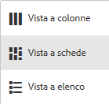
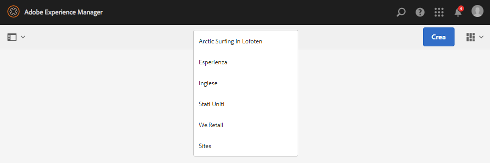
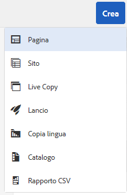
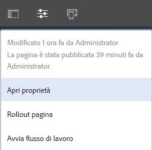
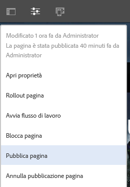
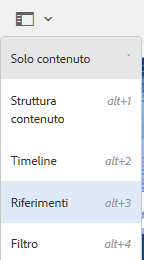
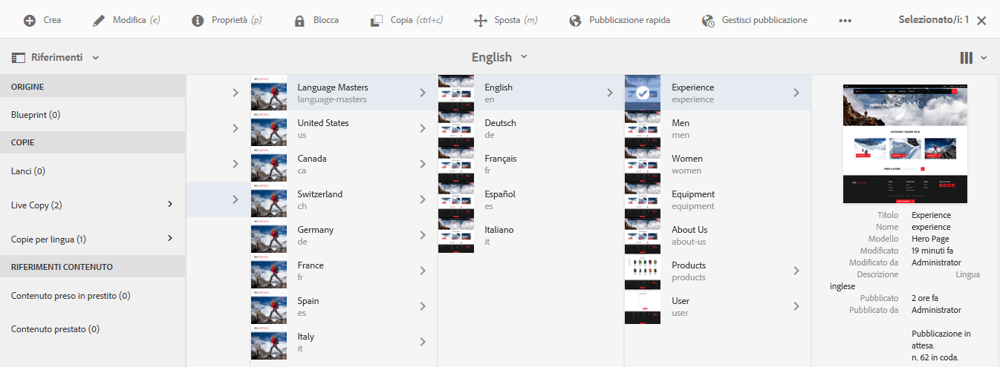
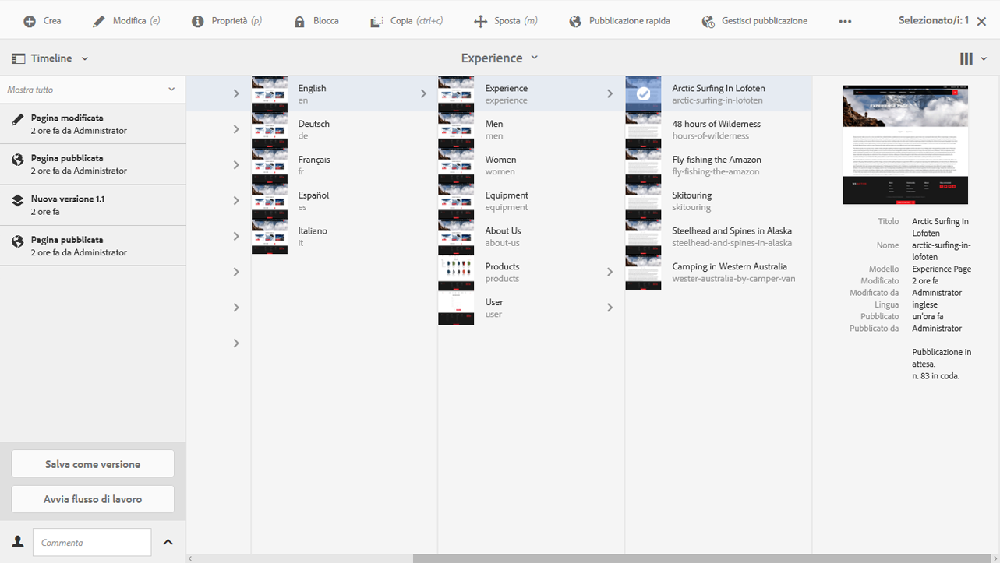

# Guida rapida all’authoring delle pagine{#quick-guide-to-authoring-pages}

>[!CAUTION]
>
>AEM 6.4 ha raggiunto la fine del supporto esteso e questa documentazione non viene più aggiornata. Per maggiori dettagli, consulta la nostra [periodi di assistenza tecnica](https://helpx.adobe.com/it/support/programs/eol-matrix.html). Trova le versioni supportate [qui](https://experienceleague.adobe.com/docs/).

Queste procedure sono intese come guida rapida (di alto livello) alle azioni chiave per la creazione e modifica del contenuto delle pagine in AEM.

Si occupano di:

* Non sono da intendersi come esaustive.
* Fornisci collegamenti alla documentazione dettagliata.

Per maggiori dettagli sull’authoring con AEM consulta:

* [Primi passi per gli autori](/help/sites-authoring/first-steps.md)
* [Utilizzo dell’ambiente Authoring](/help/sites-authoring/author-environment-tools.md)

## Alcuni suggerimenti rapidi {#a-few-quick-hints}

Prima di fornire la panoramica delle specifiche, ecco una piccola raccolta di consigli generali che vale la pena tenere a mente, soprattutto se sei abituato al [ambiente di authoring dell’interfaccia classica](/help/sites-classic-ui-authoring/classicui.md).

### Console Sites {#sites-console}

* **Crea**

   * Questo pulsante è presente in molte console; le opzioni visualizzate sono contestuali e quindi cambiano in base allo scenario specifico.

* Riordinamento delle pagine in una cartella

   * Può essere eseguito nella [vista a elenco](/help/sites-authoring/basic-handling.md#list-view). Le modifiche saranno applicate e risulteranno visibili anche nelle altre viste.

* Modifica dell’interfaccia utente

   * Questo può essere fatto da varie posizioni. Vedi [Selezione dell’interfaccia utente](/help/sites-authoring/select-ui.md).

### Authoring delle pagine {#page-authoring}

* Collegamenti di navigazione

   * ***I collegamenti non sono disponibili per la navigazione*** quando sei in **Modifica** modalità. Per navigare con i collegamenti necessari [anteprima della pagina](/help/sites-authoring/editing-content.md#previewing-pages) utilizzando:

      * [Modalità Anteprima](/help/sites-authoring/editing-content.md#preview-mode)
      * [Visualizza come pubblicato](/help/sites-authoring/editing-content.md#view-as-published)

* I flussi di lavoro e le versioni non vengono più avviati/creati dall’editor pagina; questo è stato fatto a partire da [Timeline](/help/sites-authoring/basic-handling.md#timeline) (accessibile dalla console).

>[!NOTE]
>
>Sono disponibili varie scelte rapide da tastiera che possono semplificare l’esperienza di authoring.
>
>* [Scelte rapide da tastiera per la modifica delle pagine](/help/sites-authoring/page-authoring-keyboard-shortcuts.md)
>* [Scelte rapide da tastiera per le console](/help/sites-authoring/keyboard-shortcuts.md)

## Ricerca di una pagina {#finding-your-page}

1. Apri la console **Sites** (mediante l’opzione **Sites** del pannello [Navigazione globale](/help/sites-authoring/basic-handling.md#global-navigation), che si apre (a discesa) quando selezioni il collegamento Adobe Experience Manager (in alto a sinistra).

1. Spostati verso il basso all’interno della struttura toccando/facendo clic sulla pagina appropriata. La modalità di rappresentazione delle risorse di pagina dipende dalla vista che stai utilizzando, [A schede, Elenco o Colonna](/help/sites-authoring/basic-handling.md#viewing-and-selecting-resources):

   

1. Per spostarti in alto nella struttura, usa le [breadcrumb nell’intestazione](/help/sites-authoring/basic-handling.md#the-header), che permettono di tornare alla posizione selezionata:

   

### Creazione di una nuova pagina {#creating-a-new-page}

1. [Passa alla posizione in cui desideri creare la nuova pagina.](#finding-your-page)
1. Utilizza la **Crea** quindi seleziona **Pagina** dall&#39;elenco:

   

1. Verrà visualizzata la procedura guidata che ti guiderà attraverso la raccolta delle informazioni necessarie quando [creazione della nuova pagina](/help/sites-authoring/managing-pages.md#creating-a-new-page). Seguire le istruzioni sullo schermo.

## Selezione della pagina per ulteriori azioni   {#selecting-your-page-for-further-action}

È possibile selezionare una pagina in modo da poter intervenire su di essa. Quando si seleziona una pagina, la barra degli strumenti viene aggiornata automaticamente in modo da visualizzare le azioni pertinenti a tale risorsa.

La modalità di selezione di una pagina dipende dalla vista utilizzata nella console:

1. Vista a schede:

   * Attiva la modalità di selezione per [selezione della risorsa richiesta](/help/sites-authoring/basic-handling.md#viewing-and-selecting-resources) con:

      * Dispositivo mobile: toccare e tenere premuto
      * Desktop: la [azione rapida](/help/sites-authoring/basic-handling.md#quick-actions) - Icona di spunta:

         

      * Sulla scheda compare un segno di spunta per indicare che è stata selezionata la pagina.
   >[!NOTE]
   >
   >Una volta nella modalità di selezione, **Seleziona** l’icona (un segno di spunta) viene sostituita dalla **Deseleziona** icona (una croce).

1. Vista a elenco:

   * Tocca/fai clic sulla miniatura della risorsa richiesta; sulla miniatura compare un segno di spunta per indicare che è stata selezionata.

1. Vista a colonne:

   * Tocca/fai clic sulla miniatura della risorsa richiesta; sulla miniatura compare un segno di spunta per indicare che è stata selezionata.

## Azioni rapide (solo vista a schede/desktop) {#quick-actions-card-view-desktop-only}

1. [Passa alla pagina](#finding-your-page) sulla quale desideri intervenire.
1. Passa il puntatore del mouse sulla scheda che rappresenta la risorsa desiderata; vengono visualizzate le azioni rapide :

   

## Modifica del contenuto delle pagine {#editing-your-page-content}

1. [Passa alla pagina](#finding-your-page) da modificare.
1. [Apri la pagina per la modifica](/help/sites-authoring/managing-pages.md#opening-a-page-for-editing) tramite l’icona Modifica (matita):

   

   È accessibile da:

   * [Azioni rapide (solo vista a schede/desktop)](#quick-actions-card-view-desktop-only) per la risorsa appropriata.
   * La barra degli strumenti, se la [pagina è stata selezionata](#selecting-your-page-for-further-action).

1. Quando l’editor si apre è possibile:

   * [Aggiungere un nuovo componente alla pagina](/help/sites-authoring/editing-content.md#inserting-a-component) da:

      * apertura del pannello laterale
      * selezionando la scheda dei componenti (la [browser componenti](/help/sites-authoring/author-environment-tools.md#components-browser))
      * trascinate il componente richiesto sulla pagina.

      Il pannello laterale può essere aperto (e chiuso) con:

      

   * [Modificare il contenuto di un componente esistente](/help/sites-authoring/editing-content.md#edit-configure-copy-cut-delete-paste) nella pagina:

      * Apri la barra degli strumenti del componente toccando o facendo clic. Utilizza la **Modifica** (matita) per aprire la finestra di dialogo.
      * Apri l’editor locale per il componente toccando e tenendo premuto o facendo doppio clic lento. Verranno visualizzate le azioni disponibili (per alcuni componenti, si tratterà di una selezione limitata).
      * Per visualizzare tutte le azioni disponibili, entra in modalità a schermo intero utilizzando:

      

   * [Configurare le proprietà di un componente esistente](/help/sites-authoring/editing-content.md#component-edit-dialog)

      * Apri la barra degli strumenti del componente toccando o facendo clic. Utilizza la **Configura** (chiave inglese) per aprire la finestra di dialogo.
   * [Spostare un componente](/help/sites-authoring/editing-content.md#moving-a-component) o:

      * Trascina il componente richiesto nella nuova posizione.
      * Apri la barra degli strumenti del componente toccando o facendo clic. Utilizza le icone **Taglia** e quindi **Incolla** dove richiesto.
   * [Copiare (e incollare)](/help/sites-authoring/editing-content.md#edit-configure-copy-cut-delete-paste) un componente:

      * Apri la barra degli strumenti del componente toccando o facendo clic. Utilizza le icone **Taglia** e quindi **Incolla** come richiesto.
      >[!NOTE]
      >
      >È possibile utilizzare **Incolla** per collocare i componenti sulla stessa pagina o su una pagina differente. Se si incolla un componente in una pagina che era già aperta prima dell’operazione Taglia o Copia, sarà necessario aggiornare la pagina.

   * [Eliminare](/help/sites-authoring/editing-content.md#edit-configure-copy-cut-delete-paste) un componente:

      * Apri la barra degli strumenti del componente toccando o facendo clic, quindi utilizza l’icona **Elimina**.
   * [Aggiungere annotazioni](/help/sites-authoring/annotations.md#annotations) alla pagina:

      * Seleziona la modalità **Annota** (icona a forma di fumetto). Aggiungi le annotazioni utilizzando l’icona **Aggiungi annotazione** (segno più). Esci dalla modalità di annotazione utilizzando la X in alto a destra.

      

   * [Visualizzare un’anteprima di una pagina](/help/sites-authoring/editing-content.md#preview-mode) (per vedere come apparirà nell’ambiente di pubblicazione)

      * Seleziona **Anteprima** dalla barra degli strumenti.
   * Torna alla modalità di modifica (o seleziona un’altra modalità) utilizzando **Modifica** selettore a discesa.

   >[!NOTE]
   >
   >Per spostarsi utilizzando i collegamenti presenti nel contenuto, è necessario utilizzare [Modalità Anteprima](/help/sites-authoring/editing-content.md#preview-mode).

## Modifica delle proprietà pagina   {#editing-the-page-properties}

Esistono due metodi (principali) per [modifica delle proprietà di pagina](/help/sites-authoring/editing-page-properties.md):

* Dalla console **Sites**:

   1. [Passa alla pagina](#finding-your-page) vuoi pubblicare.
   1. Seleziona la **Proprietà** da:

      * [Azioni rapide (solo vista a schede/desktop)](#quick-actions-card-view-desktop-only) per la risorsa appropriata.
      * La barra degli strumenti, se la [pagina è stata selezionata](#selecting-your-page-for-further-action).

   

* Verranno visualizzate le proprietà di pagina. È possibile apportare le modifiche desiderate e poi selezionare Salva per applicarle

   * Quando [modifica della pagina](#editing-your-page-content):

      1. Apri **Informazioni pagina** menu.
      1. Seleziona **Apri proprietà** per aprire la finestra di dialogo per la modifica delle proprietà.

         

## Pubblicazione della pagina (o annullamento della pubblicazione) {#publishing-your-page-or-unpublishing}

Esistono due metodi principali per [pubblicazione della pagina](/help/sites-authoring/publishing-pages.md) (e anche di annullamento della pubblicazione):

* Dalla console **Sites**:

   1. [Passa alla pagina](#finding-your-page) vuoi pubblicare.
   1. Seleziona l’icona **Pubblicazione rapida** da:

      * [Azioni rapide (solo vista a schede/desktop)](#quick-actions-card-view-desktop-only) per la risorsa appropriata.
      * La barra degli strumenti, se la [pagina è stata selezionata](#selecting-your-page-for-further-action) (consente anche di accedere a [Pubblica più tardi](/help/sites-authoring/publishing-pages.md#manage-publication)).

   

* Quando [modifica della pagina](#editing-your-page-content):

   1. Apri **Informazioni pagina** menu.
   1. Seleziona **Pubblica pagina**.

   

* L’annullamento della pubblicazione di una pagina dalla console può essere eseguito solo tramite l’opzione **Gestisci pubblicazione**, disponibile solamente nella barra degli strumenti (non tramite le azioni rapide).

   La **Annulla pubblicazione pagina** è ancora disponibile tramite **Informazioni pagina** nell’editor.

   

   Vedi [Pubblicazione delle pagine](/help/sites-authoring/publishing-pages.md#unpublishing-pages) per ulteriori informazioni.

## Spostamento, utilizzo di Copia e Incolla o eliminazione della pagina   {#move-copy-and-paste-or-delete-your-page}

1. [Passa alla pagina](#finding-your-page) spostare, copiare e incollare o eliminare.
1. Seleziona l’icona Copia (e quindi Incolla), Sposta o Elimina, a seconda delle necessità, utilizzando:

   * [Azioni rapide (solo vista a schede/desktop)](#quick-actions-card-view-desktop-only) per la risorsa richiesta.
   * La barra degli strumenti, se la [pagina è stata selezionata](#selecting-your-page-for-further-action).

   * Copia:

      * Sarà poi necessario passare alla nuova posizione e incollare.
   * Sposta:

      * Verrà visualizzata la procedura guidata per la raccolta delle informazioni necessarie allo spostamento della pagina. Segui le istruzioni sullo schermo.
   * Elimina:

      * Viene richiesto di confermare l’operazione.
   >[!NOTE]
   >
   >Elimina non è disponibile come azione rapida.

## Blocco della pagina (e successivo sblocco) {#locking-your-page-then-unlocking}

[Il blocco di una pagina](/help/sites-authoring/editing-content.md#locking-a-page) non consente ad altri autori di utilizzarla mentre vi lavori. L’icona o il pulsante Blocca (e Sblocca) è disponibile:

* La barra degli strumenti, se la [pagina è stata selezionata](#selecting-your-page-for-further-action).
* Il [menu a discesa Informazioni pagina](#editing-the-page-properties) durante la modifica di una pagina.
* La barra degli strumenti della pagina durante la modifica di una pagina (quando la pagina è bloccata)

Ad esempio, l’icona Blocca ha l’aspetto di un lucchetto chiuso:

## Accesso ai riferimenti di pagina {#accessing-page-references}

[L’accesso rapido ai riferimenti](/help/sites-authoring/author-environment-tools.md#references) a/da una pagina è disponibile nella barra laterale Riferimenti.

1. Seleziona l’icona **Riferimenti** dalla barra degli strumenti (prima o dopo aver [selezionato la pagina](#selecting-your-page-for-further-action)):

   

   Verrà visualizzato un elenco di tipi di riferimenti:

   

1. Tocca o fai clic sul tipo di riferimento richiesto per visualizzare ulteriori dettagli e (se appropriato) per eseguire ulteriori azioni.

## Creazione di una versione della pagina   {#creating-a-version-of-your-page}

1. Per aprire la barra laterale Timeline, seleziona l’icona **[Timeline](/help/sites-authoring/basic-handling.md#timeline)** dalla barra degli strumenti (prima o dopo aver [selezionato la pagina](#selecting-your-page-for-further-action)):

   

1. Tocca o fai clic sulla freccia verso alto in basso a destra della colonna Timeline per visualizzare pulsanti aggiuntivi, tra cui **Salva come versione**.

   

1. Seleziona **Salva come versione** quindi **Crea**.

## Ripristino/confronto di una versione della pagina {#restoring-comparing-a-version-of-your-page}

Lo stesso meccanismo di base viene utilizzato per il ripristino e/o il confronto tra diverse versioni di una pagina:

1. Seleziona l’icona **[Timeline](/help/sites-authoring/basic-handling.md#timeline)** dalla barra degli strumenti (prima o dopo aver [selezionato la pagina](#selecting-your-page-for-further-action)):

   

   Se una versione della pagina è già stata salvata, sarà elencata nella Timeline.

1. Tocca o fai clic sulla versione da ripristinare per visualizzare pulsanti di azione aggiuntivi:

   * **Ripristina questa versione**

      * La versione sarà ripristinata.
   * **Mostra differenze**

      * Viene aperta la pagina con le differenze (tra le due versioni) evidenziate.
