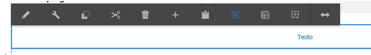
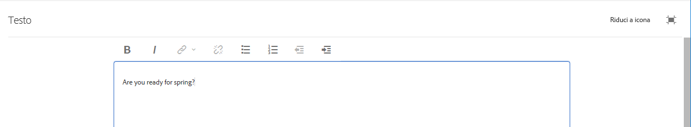

# Utilizzo dell’editor Rich Text per creare contenuto {#using-the-rich-text-editor-to-author-content}

L’Editor Rich Text (RTE) è un componente di base per la creazione di testo nelle pagine AEM. Molti componenti come Testo, Testo e Immagine e Tabella sono basati su editor Rich Text.

>[!NOTE]
>
>La copia di elenchi nidificati nell’editor Rich Text non funziona come previsto. Quando si copiano degli elenchi nidificati da Microsoft Word, è necessario eliminare manualmente gli elenchi dopo aver incollato il testo nell’editor Rich Text.

## In-place editing {#in-place-editing}

Quando si seleziona un componente basato su testo con un solo tocco o clic, viene visualizzata la barra degli strumenti [del](../sites-authoring/editing-content.md#edit-configure-copy-cut-delete-paste)componente.

Toccando o facendo clic di nuovo o selezionando inizialmente il componente con un doppio tocco o clic lento, si apre la modifica diretta con una propria barra degli strumenti. Qui puoi modificare il contenuto ed effettuare modifiche di formattazione di base.

Questa barra degli strumenti contiene le opzioni seguenti:

* **Formato**: Impostare la formattazione Grassetto, Corsivo e Sottolineato.

* **Elenchi**: Creare elenchi puntati o numerati o impostare il rientro.

* **Collegamento ipertestuale**

* **Scollega**

* **Schermo intero**

* **Chiudi**

* **Salva**

## Modifica a schermo intero {#full-screen-editing}

Per i componenti basati su testo, selezionando la modalità a schermo intero dalla barra degli strumenti si aprirà l’editor Rich Text e si nasconderà il resto del contenuto della pagina.

La modalità a schermo intero mostra tutte le opzioni dell’editor Rich Text configurate dall’amministratore. che possono variare a [seconda della configurazione](../sites-administering/rich-text-editor.md) fornita dagli amministratori o dagli sviluppatori AEM. Se viene rilevata un’opzione mancante, chiedete all’amministratore di renderla disponibile.

Altre opzioni dell’editor Rich Text comprendono:

* **Ancoraggio**: Create un ancoraggio nel testo a cui collegarvi/farvi riferimento in un secondo momento.
* **Allinea testo a sinistra**
* **Testo centrato**
* **Allinea testo a destra**

Per chiudere la modalità a schermo intero, fate clic sull’icona Riduci a icona.

