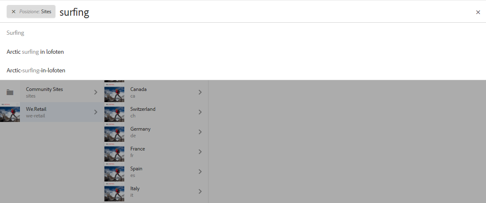
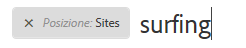
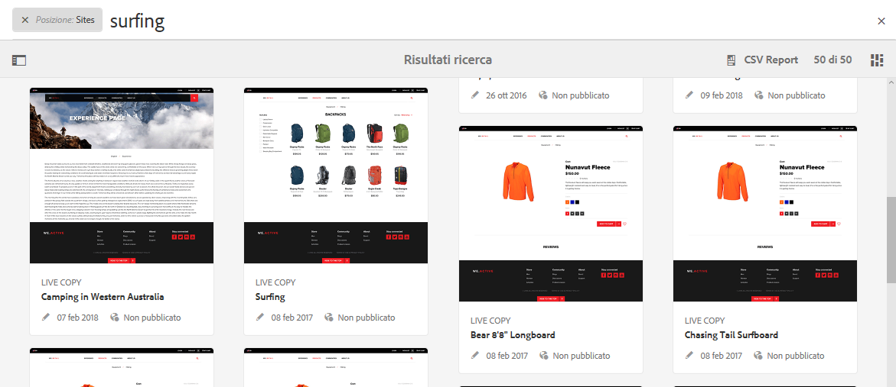
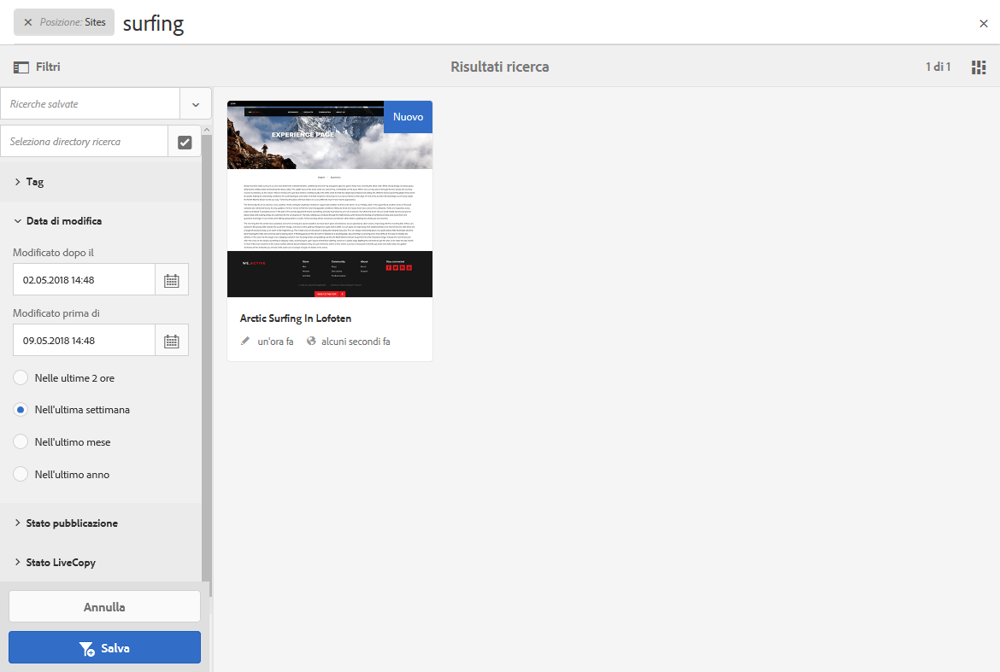
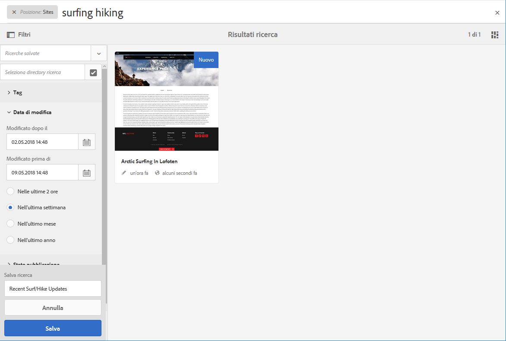
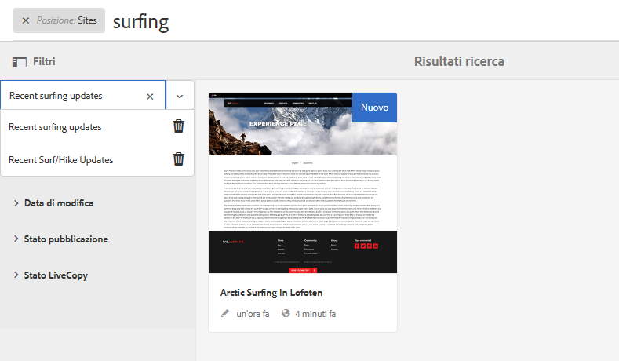
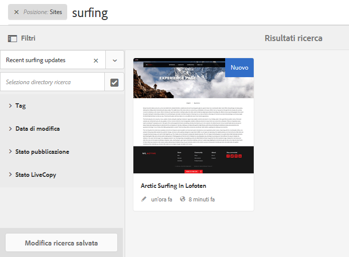

# Ricerca{#search-features}

L’ambiente di authoring di AEM offre vari metodi per la ricerca dei contenuti, a seconda del tipo di risorsa.

>[!NOTE]
>
>Fuori dall’ambiente di authoring sono disponibili anche altri strumenti di ricerca, come [Query Builder](/help/sites-developing/querybuilder-api.md) e [CRXDE Lite](/help/sites-developing/developing-with-crxde-lite.md).

## Informazioni di base sulla ricerca {#search-basics}

La ricerca è disponibile nella barra degli strumenti superiore:

La barra di ricerca consente di effettuare le seguenti operazioni:

* Cercare una parola chiave, un percorso o un tag specifico.
* Filtrare in base a criteri specifici per le risorse come date di modifica, stato della pagina, dimensione del file ecc.
* Definire e utilizzare una [ricerca salvata](#saved-searches) in base ai criteri impostati.

>[!NOTE]
>
>Search can also be invoked by using the hotkey `/` (forward slash) whenever the search rail is visible.

## Ricerca e Filtro {#search-and-filter}

Per cercare e filtrare le risorse:

1. Apri la **Ricerca** (con la lente di ingrandimento nella barra degli strumenti) e immetti il termine da cercare. I suggerimenti verranno visualizzati e possono essere selezionati:

   

   Per impostazione predefinita, i risultati della ricerca sono limitati alla posizione corrente (ovvero alla console e al tipo di risorsa corrispondente):

   

1. Se necessario, è possibile rimuovere il filtro posizione (seleziona la **X** sul filtro da rimuovere) per eseguire la ricerca in tutte le console e i tipi di risorse.
1. I risultati visualizzati saranno raggruppati in base alla console e al tipo di risorsa corrispondente.

   Puoi selezionare una risorsa specifica (sulla quale eseguire ulteriori azioni) oppure approfondire la ricerca selezionando il tipo di risorsa richiesto, ad esempio **Visualizza tutti i siti**:

   

1. Per approfondire la ricerca, seleziona il simbolo della barra laterale (in alto a sinistra) per aprire il pannello laterale **Filtri e opzioni**.

   

   A seconda del tipo di risorsa, nella finestra di ricerca viene visualizzata una selezione predefinita di criteri di ricerca/filtro.

   Il pannello laterale consente di selezionare:

   * Ricerche salvate
   * Directory di ricerca
   * Tag
   * Criteri di ricerca, ad esempio Data di modifica, Stato pubblicazione, Stato LiveCopy.
   >[!NOTE]
   >
   >I criteri di ricerca possono variare:
   >
   >* A seconda del tipo di risorsa selezionato; ad esempio, i criteri Risorse e Community sono comprensibilmente specifici.
   >* La tua istanza, nonché i [moduli di ricerca](/help/sites-administering/search-forms.md), possono essere personalizzati (in base alla posizione all’interno di AEM).

   

1. Puoi inoltre aggiungere termini di ricerca aggiuntivi:

   

1. Chiudi **Ricerca** facendo clic sulla **X** (in alto a destra).

>[!NOTE]
>
>I criteri di ricerca vengono mantenuti quando selezioni un oggetto nei risultati di ricerca.
>
>Quando selezioni un elemento nella pagina dei risultati, e quindi torni alla pagina di ricerca dopo avere utilizzato il pulsante indietro del browser, i criteri di ricerca rimangono.

## Saved Searches {#saved-searches}

Oltre ad eseguire ricerche per un’ampia gamma di facet, è possibile salvare una specifica configurazione di ricerca per riutilizzarla in un secondo momento.

1. Definisci i criteri di ricerca e seleziona **Salva**.

   

1. Assegna un nome e seleziona **Salva** per confermare:

   

1. La ricerca salvata sarà disponibile nel selettore alla successiva apertura del pannello di ricerca:

   

1. Dopo aver salvato una ricerca, puoi:

   * Utilizzare la **x** (in corrispondenza del nome di una ricerca salvata) per avviare una nuova ricerca (la ricerca salvata non verrà eliminata).
   * Seleziona **Modifica ricerca salvata**, modifica le condizioni di ricerca e seleziona nuovamente **Salva**.

Per modificare le ricerche salvate, seleziona una ricerca e fai clic sull’opzione **Modifica ricerca salvata** nella parte inferiore del pannello di ricerca.

