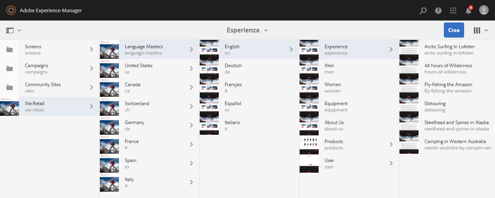
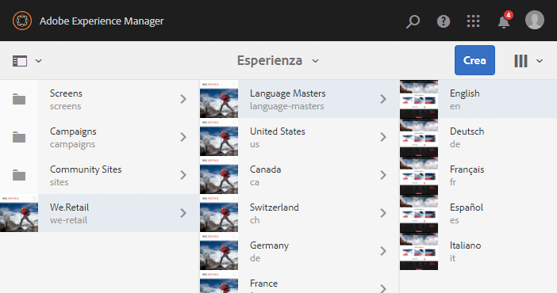
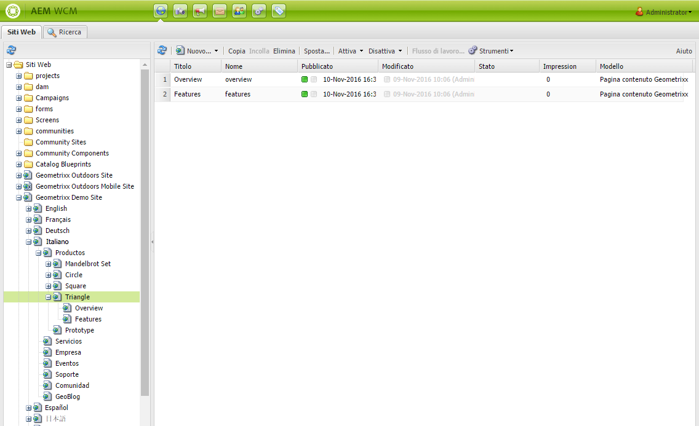
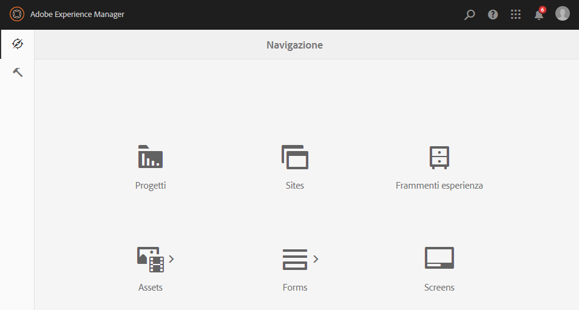
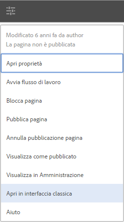

# Selezione dell’interfaccia{#selecting-your-ui}

## Interfaccia utente

Nell’ambiente Authoring è possibile effettuare le seguenti operazioni:

* [Authoring](/help/sites-authoring/author.md) (compresi [creazione e modifica delle pagine](/help/sites-authoring/author-environment-tools.md), [gestione delle risorse](/help/assets/home.md), [community](/help/communities/author-communities.md))

* [Attività di amministrazione](/help/sites-administering/home.md) per generare e mantenere i contenuti del sito web

Sono disponibili due interfacce grafiche, accessibili dalle versioni più recenti dei normali browser.

1. Interfaccia utente touch

   * Questa è la moderna interfaccia utente predefinita di AEM.
   * È un’interfaccia pulita e lineare, prevalentemente di colore grigio.
   * Progettata per essere utilizzata sia su dispositivi desktop che touch, il suo aspetto generale è uguale su tutti i dispositivi, mentre le operazioni per [visualizzare e selezionare le risorse](/help/sites-authoring/basic-handling.md#viewing-and-selecting-resources) sono leggermente diverse (tocco o clic). 

      * Desktop:
   

   * Dispositivi tablet (o desktop con larghezza inferiore a 1024 pixel):
   

1. Interfaccia classica

   * Questa è l’interfaccia utente utilizzata nelle precedenti versioni di AEM.
   * Il colore predominante è il verde.
   * È stata progettata per l’uso con i dispositivi desktop.
   * La seguente documentazione si riferisce all’interfaccia utente moderna. Per informazioni sull’authoring nell’interfaccia classica, consulta la [documentazione sull’authoring nell’interfaccia classica](/help/sites-classic-ui-authoring/classicui.md).
   

## Passaggio delle interfacce

Although the touch-enabled UI is now the standard UI and [feature parity](../release-notes/touch-ui-features-status.md) has been nearly reached with the administration and editing of sites, there may be times when the user wishes to switch to the [classic UI](/help/sites-classic-ui-authoring/classicui.md). Sono disponibili diverse opzioni per eseguire questa operazione.

>[!NOTE]
>
>Per informazioni sullo stato delle funzioni disponibili rispetto all’interfaccia classica, consulta il documento [Stato delle funzioni nell’interfaccia touch](../release-notes/touch-ui-features-status.md).

È possibile definire l’interfaccia utente da usare in diverse aree:

* [Configurazione dell’interfaccia utente predefinita per l’istanza](#configuring-the-default-ui-for-your-instance) : questa opzione consente di impostare l’interfaccia utente predefinita da visualizzare al momento dell’accesso dell’utente, anche se l’utente può ignorare questa opzione e selezionare una diversa interfaccia per il proprio account o la sessione corrente.

* [Impostazione dell’interfaccia utente classica per l’account](/help/sites-authoring/select-ui.md#setting-classic-ui-authoring-for-your-account) : questa opzione consente di impostare l’interfaccia utente predefinita per la modifica delle pagine, anche se l’utente può selezionare una diversa interfaccia per il proprio account o la sessione corrente.

* [Passaggio all’interfaccia utente classica per la sessione](#switching-to-classic-ui-for-the-current-session) corrente: consente di passare all’interfaccia classica per la sessione corrente.

* Per l’[authoring delle pagine il sistema implementa alcune impostazioni locali in base all’interfaccia utente](#ui-overrides-for-the-editor).

>[!CAUTION]
>
>Le diverse opzioni per passare all’interfaccia utente classica non sono immediatamente disponibili, ma devono essere configurate specificamente per l’istanza.
>
>See [Enabling Access to Classic UI](/help/sites-administering/enable-classic-ui.md) for more information.

>[!NOTE]
>
>Nelle istanze aggiornate da una versione precedente viene mantenuta l’interfaccia classica per la creazione e la modifica delle pagine.
>
>After upgrade, page authoring will not be automatically switched to the touch-enabled UI, but you can configure this using the [OSGi configuration](/help/sites-deploying/configuring-osgi.md) of the **WCM Authoring UI Mode Service** ( `AuthoringUIMode` service). Vedi [Ignorare le impostazioni dell’interfaccia per l’editor](#ui-overrides-for-the-editor).

## Configuring the Default UI for Your Instance {#configuring-the-default-ui-for-your-instance}

Un amministratore di sistema può configurare l’interfaccia utente utilizzata all’avvio e all’accesso utilizzando la [mappatura della directory principale](/help/sites-deploying/osgi-configuration-settings.md).

Tale impostazione può essere ignorata e sostituita dalle impostazioni predefinite dell’utente o dalle impostazioni della sessione.

## Impostazione della creazione nell’interfaccia classica del tuo account {#setting-classic-ui-authoring-for-your-account}

Ogni utente può accedere alle proprie [preferenze](/help/sites-authoring/user-properties.md) per definire se desidera utilizzare l’interfaccia classica per la creazione delle pagine (invece dell’interfaccia utente predefinita).

Tale impostazione può essere ignorata e sostituita dalle impostazioni della sessione.

## Passaggio all’interfaccia classica per la sessione corrente {#switching-to-classic-ui-for-the-current-session}

Gli utenti desktop possono passare dall’interfaccia touch all’interfaccia classica (solo per desktop). Esistono diversi metodi per passare all’interfaccia classica per la sessione corrente:

* **Collegamenti di navigazione**

   >[!CAUTION]
   >
   >Questa opzione per passare all’interfaccia utente classica non è immediatamente disponibile e deve essere configurata in modo specifico per l’istanza.
   >
   >
   >See [Enabling Access to Classic UI](/help/sites-administering/enable-classic-ui.md) for more information.

   Se questa funzione è abilitata, ogni volta che passi il mouse su una console applicabile viene visualizzata un’icona (simbolo di un monitor); tocca o fai clic su tale icona per aprire la sezione corrispondente nell’interfaccia classica.

   Ad esempio, i collegamenti da **Sites** permettono di passare all’**amministrazione del sito**:

   

* **URL**

   The classic UI can be accessed using the URL for the welcome screen at `welcome.html`. For example:

   `http://localhost:4502/welcome.html`

   >[!NOTE]
   >
   >L’interfaccia touch è accessibile tramite `sites.html`. Ad esempio:
   >
   >
   >`http://localhost:4502/sites.html`

### Passaggio all’interfaccia classica durante la modifica di una pagina {#switching-to-classic-ui-when-editing-a-page}

>[!CAUTION]
>
>Questa opzione per passare all’interfaccia utente classica non è immediatamente disponibile e deve essere configurata in modo specifico per l’istanza.
>
>See [Enabling Access to Classic UI](/help/sites-administering/enable-classic-ui.md) for more information.

Se abilitata, la voce **Apri interfaccia utente classica** è disponibile nella finestra di dialogo **Informazioni pagina**:

### UI Overrides for the Editor {#ui-overrides-for-the-editor}

Per l’authoring delle pagine, le impostazioni definite da un utente o amministratore di sistema possono essere ignorate e sostituite dal sistema.

* Durante la creazione di pagine:

   * Use of the classic editor is forced when accessing the page using `cf#` in the URL. Ad esempio:

      `http://localhost:4502/cf#/content/geometrixx/en/products/triangle.html`

   * Use of the touch-enabled editor is forced when using `/editor.html` in the URL or when using a touch device. Ad esempio:

      `http://localhost:4502/editor.html/content/geometrixx/en/products/triangle.html`

* Tale comportamento forzato è temporaneo e valido solo per la sessione del browser.

   * A cookie set will be set dependent on whether touch-enabled ( `editor.html`) or classic ( `cf#`) is used.

* Quando si aprono pagine tramite `siteadmin`, viene verificato se i seguenti elementi sono presenti:

   * il cookie
   * una preferenza utente
   * Se non vengono trovati, verranno utilizzate le definizioni impostate nella [configurazione OSGi](/help/sites-deploying/configuring-osgi.md) del **servizio WCM per la modalità dell’interfaccia di authoring** (`AuthoringUIMode`).

>[!NOTE]
>
>Se [un utente ha già definito una preferenza per l’authoring delle pagine](#setting-classic-ui-authoring-for-your-account), questa non viene esclusa se si modifica la proprietà OSGi.

>[!CAUTION]
>
>A causa dell’utilizzo dei cookie, come descritto qui sopra, si consiglia di:
>
>* NON modificare manualmente l’URL; un URL non standard potrebbe dare luogo a una situazione sconosciuta e alla perdita di funzionalità;
>* NON tenere entrambi gli editor aperti allo stesso tempo, ad esempio in due diverse finestre.
>

