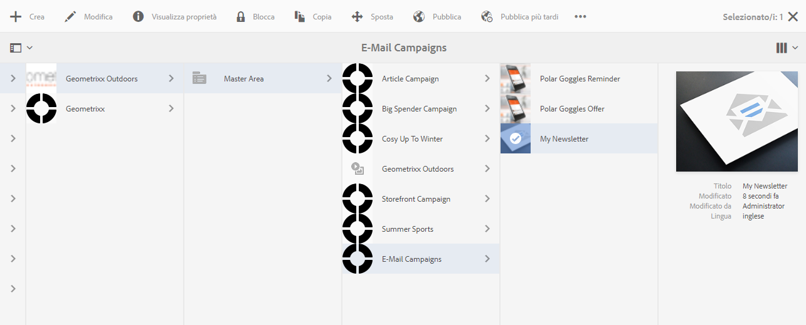

# Targeting di Adobe Campaign{#targeting-your-adobe-campaign}

>[!CAUTION]
>
>AEM 6.4 ha raggiunto la fine del supporto esteso e questa documentazione non viene più aggiornata. Per maggiori dettagli, consulta la nostra [periodi di assistenza tecnica](https://helpx.adobe.com/it/support/programs/eol-matrix.html). Trova le versioni supportate [qui](https://experienceleague.adobe.com/docs/).

Per eseguire il targeting della newsletter Adobe Campaign, devi prima impostare la segmentazione, disponibile solo nell’interfaccia classica (per il contesto client). Dopo di che puoi creare esperienze mirate per Adobe Campaign. Entrambi sono descritti in questa sezione.

## Impostazione della segmentazione in AEM {#setting-up-segmentation-in-aem}

Per impostare la segmentazione, è necessario utilizzare l’interfaccia classica per impostare i segmenti. I passaggi successivi possono essere eseguiti nell’interfaccia utente standard.

L’impostazione della segmentazione include la creazione di segmenti, un marchio, una campagna ed esperienze.

>[!NOTE]
>
>L’ID del segmento deve essere mappato su quello sul lato Adobe Campaign.

### Creazione di segmenti {#creating-segments}

Per creare segmenti:

1. Apri [console di segmentazione](http://localhost:4502/miscadmin#/etc/segmentation) a **&lt;host>:&lt;port>/miscadmin#/etc/segmentation**.
1. Crea una nuova pagina e immetti un titolo, ad esempio: **Segmenti AC**- e seleziona la **Segmento (Adobe Campaign)** modello.
1. Seleziona la pagina creata nella vista struttura a sinistra.
1. Crea un segmento, ad esempio per gli utenti maschili, creando una nuova pagina sotto il segmento creato denominata Uomo e seleziona la **Segmento (Adobe Campaign)** modello.
1. Apri la pagina dei segmenti creata e trascina e rilascia una **ID segmento** dalla barra laterale alla pagina.
1. Fai doppio clic sulla caratteristica, immetti l’ID che rappresenta in questo caso il segmento maschile definito in Adobe Campaign, ad esempio **UOMO** - e fai clic su **OK**. Dovrebbe comparire il seguente messaggio: *`targetData.segmentCode == "MALE"`*
1. Ripeti i passaggi per un altro segmento, ad esempio un segmento che esegue il targeting delle donne.

### Creazione di un marchio {#creating-a-brand}

Per creare un marchio:

1. In **Sites**, passa alla **Campagne** (ad esempio in We.Retail).
1. Fai clic su **Crea pagina** e immetti un titolo per la pagina, ad esempio We.Retail Brand e seleziona la **Brand** modello.

### Creazione di una campagna {#creating-a-campaign}

Per creare una campagna:

1. Apri **Brand** pagina appena creata.
1. Fai clic su **Crea pagina** e immetti un titolo per la pagina, ad esempio We.Retail Campaign, e seleziona la **Campaign** modello e fai clic su **Crea**.

### Creazione di esperienze {#creating-experiences}

Per creare esperienze per i segmenti:

1. Apri **Campaign** pagina appena creata.
1. Crea esperienze per i segmenti facendo clic su **Crea pagina** e inserendo un titolo per la pagina, ad esempio Uomo durante la creazione di un’esperienza per il segmento Uomo, e seleziona il **Esperienza** modello.
1. Apri la pagina Esperienza creata.
1. Fai clic su **Modifica**, quindi in Segmenti fai clic su **Aggiungi elemento**.
1. Inserisci il percorso del segmento maschile, ad esempio **/etc/segmentation/segmenti-ac/uomo** e fai clic su **OK**. Dovrebbe comparire il seguente messaggio: *L’esperienza è destinata a: Maschio*
1. Ripeti i passaggi precedenti per creare un’esperienza per tutti i segmenti, ad esempio il target femminile.

## Creazione di una newsletter con contenuti di destinazione {#creating-a-newsletter-with-targeted-content}

Dopo aver creato segmenti, un marchio, una campagna e un’esperienza, puoi creare una newsletter con contenuti mirati. Dopo aver creato l’esperienza, colleghi le esperienze ai segmenti.

>[!NOTE]
>
>[Gli esempi e-mail sono disponibili solo in Geometrixx](/help/sites-developing/we-retail.md). Scarica il contenuto di Geometrixx di esempio da Condivisione pacchetti.

Per creare una newsletter con contenuti di destinazione:

1. Creare una newsletter con contenuti di destinazione: Sotto Campagne e-mail in Geometrixx Outdoors, tocca o fai clic su **Crea** > **Pagina**, quindi selezionare uno dei modelli di Adobe Campaign Mail.

   

1. Nella newsletter, aggiungi un componente Testo e personalizzazione .
1. Aggiungi del testo al componente Testo e personalizzazione, ad esempio &quot;Questa è l’impostazione predefinita&quot;.
1. Fai clic sulla freccia accanto a **Modifica** e seleziona **Targeting**.
1. Seleziona il tuo marchio dal menu a discesa Marchio e seleziona la tua campagna. Si tratta del marchio e della campagna creati in precedenza.
1. Fai clic su **Avvia targeting**. I segmenti vengono visualizzati nell’area Tipi di pubblico . L’esperienza predefinita viene utilizzata se nessuno dei segmenti definiti corrisponde.

   >[!NOTE]
   >
   >Per impostazione predefinita, gli esempi e-mail inclusi con AEM utilizzano Adobe Campaign come motore di destinazione. Per le newsletter personalizzate, potrebbe essere necessario selezionare Adobe Campaign come motore di destinazione. Quando esegui il targeting, tocca o fai clic su + nella barra degli strumenti, immetti un titolo per la nuova attività e seleziona **Adobe Campaign** come motore di destinazione.

1. Fai clic su **Predefinito** e poi il componente Testo e personalizzazione aggiunto e viene visualizzato il Bullseye con una freccia all’interno. Fai clic sull’icona per eseguire il targeting di questo componente.

   

1. Passa a un altro segmento (Uomo) e fai clic su **Aggiungi offerta** e fai clic sull&#39;icona più +. Quindi modifica l’offerta.
1. Passa a un altro segmento (Femmina) e fai clic su **Aggiungi offerta** e l&#39;icona più +. Quindi modifica questa offerta.
1. Fai clic su **Successivo** per vedere Mappatura , fai clic su **Successivo** per visualizzare Impostazioni, che non si applica ad Adobe Campaign, e fare clic su **Salva**.

   AEM genera automaticamente il codice di targeting corretto per Adobe Campaign quando il contenuto viene utilizzato in una consegna all’interno di Adobe Campaign

1. In Adobe Campaign, crea la consegna - seleziona **Consegna e-mail con contenuto AEM** e seleziona l’account AEM locale, a seconda delle necessità, e conferma le modifiche apportate.

   Nella vista HTML, le diverse esperienze dei componenti di destinazione sono racchiuse nel codice di targeting di Adobe Campaign.

   

   >[!NOTE]
   >
   >Se imposti i segmenti anche in Adobe Campaign, fai clic su **Anteprima** ti mostrerà le esperienze per ogni segmento.
