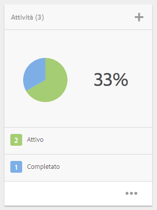
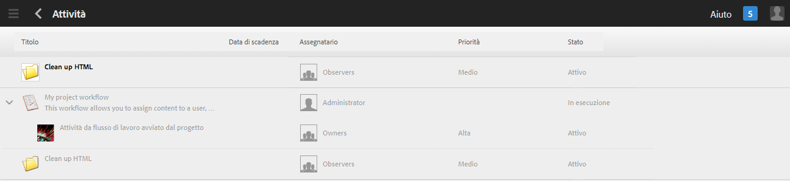
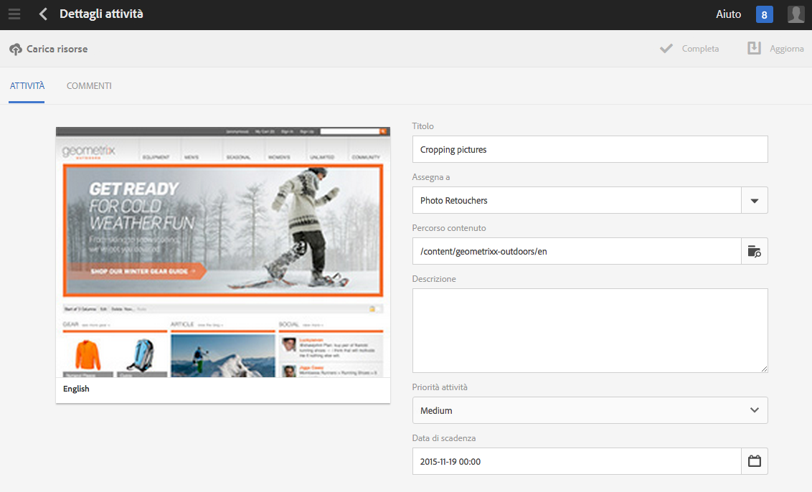
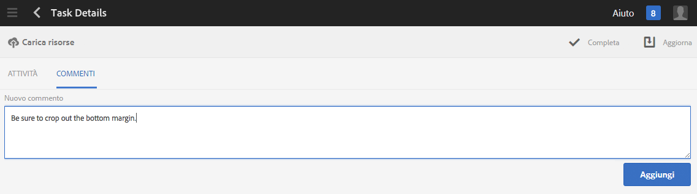
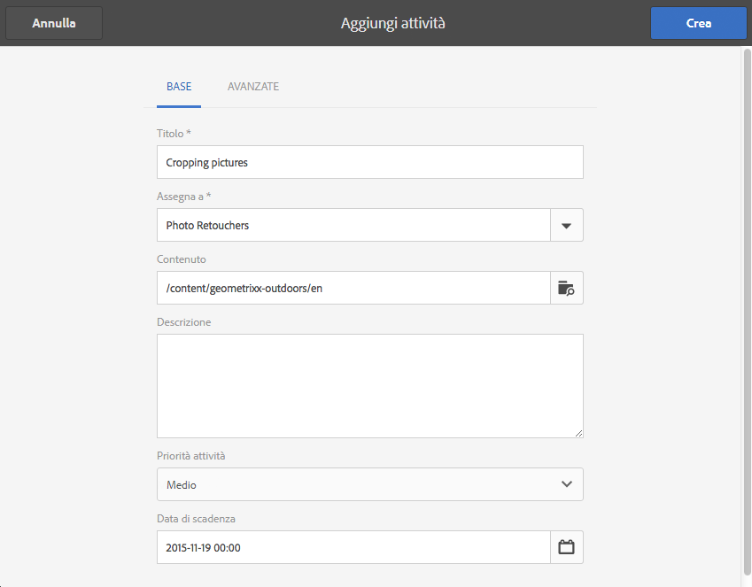
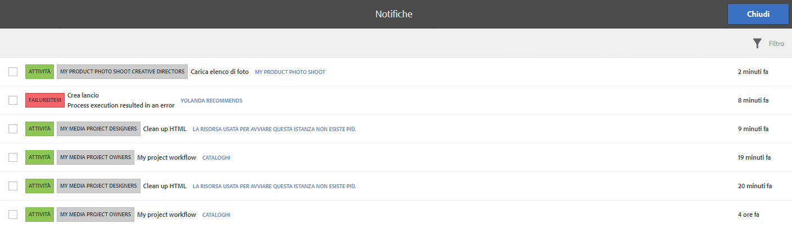
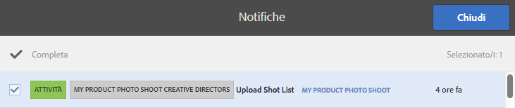

# Utilizzo delle attività{#working-with-tasks}

>[!CAUTION]
>
>AEM 6.4 ha raggiunto la fine del supporto esteso e questa documentazione non viene più aggiornata. Per maggiori dettagli, consulta la nostra [periodi di assistenza tecnica](https://helpx.adobe.com/it/support/programs/eol-matrix.html). Trova le versioni supportate [qui](https://experienceleague.adobe.com/docs/).

Le attività rappresentano gli elementi da eseguire sul contenuto. Quando ti viene assegnata un’attività, questa viene visualizzata nella casella in entrata del flusso di lavoro. Gli elementi attività hanno un valore di task nella colonna Tipo.

Le attività vengono utilizzate anche nei progetti per determinare il livello di completezza delle attività correnti, incluse quelle del flusso di lavoro.

## Tracciamento dell&#39;avanzamento del progetto {#tracking-project-progress}

Puoi tenere traccia dell’avanzamento del progetto visualizzando le attività attive/completate all’interno di un progetto rappresentato da **Attività** piastrelle. L’avanzamento del progetto può essere determinato da:

* **Titolo attività:** l’avanzamento generale del progetto è rappresentato nella sezione Titolo attività, disponibile nella pagina dei dettagli del progetto.

* **Elenco attività**: quando fai clic su Titolo attività, viene visualizzato un elenco delle attività. L’elenco contiene informazioni dettagliate su tutte le attività correlate al progetto.

Sono elencate sia le attività del flusso di lavoro che quelle create direttamente nel **Attività** piastrelle.

### Riquadro attività {#task-tile}

Se un progetto dispone di attività correlate, all’interno del progetto viene visualizzato un riquadro attività . Il riquadro attività mostra lo stato corrente del progetto. Questo si basa sulle attività esistenti all’interno del flusso di lavoro e non include le attività che verranno generate in futuro man mano che il flusso di lavoro procede. Le seguenti informazioni sono visibili nel riquadro attività:

* Percentuale di attività completate
* Percentuale di attività attive
* Percentuale di attività scadute

### Visualizzazione o modifica delle attività in un progetto {#viewing-or-modifying-the-tasks-in-a-project}

Oltre a monitorare l’avanzamento, è anche possibile visualizzare ulteriori informazioni sul progetto o modificarlo.

#### Elenco attività {#task-list}

Fai clic sui puntini di sospensione (..) nel riquadro Attività per visualizzare l’elenco delle attività correlate al progetto. Le attività sono suddivise per flussi di lavoro principali. I dettagli dell’attività vengono visualizzati insieme a metadati quali data di scadenza, assegnatario, priorità e stato.

#### Dettagli attività {#task-details}

Per ulteriori informazioni su una particolare attività, nell’Elenco attività, tocca o fai clic sull’attività e **Dettagli attività **apri.

### Visualizzazione e modifica dei commenti delle attività {#viewing-and-modifying-task-comments}

In Dettagli attività, è possibile modificare o aggiungere commenti. Inoltre, tutti i commenti presenti in un progetto sono visibili nell’area Commenti .

### Aggiunta di attività {#adding-tasks}

È possibile aggiungere nuove attività ai progetti. Queste attività vengono quindi visualizzate nel riquadro Attività e sono disponibili nella casella in entrata Notifiche per eseguire azioni su.

Per aggiungere un’attività:

1. Nel progetto, nella sezione **Attività**, tocca o fai clic sull’icona +. Si apre la finestra **Aggiungi attività**.
1. Immettere le informazioni relative all&#39;attività. Il titolo dell’attività e il gruppo a cui è assegnata sono obbligatori. Informazioni aggiuntive, come il percorso del contenuto, la descrizione, la priorità dell’attività e la data di scadenza, sono facoltative. Inoltre, puoi selezionare la **Avanzate** scheda per immettere il nome dell’attività, utilizzato per assegnare un nome all’URL.

   

1. Tocca o fai clic su **Crea**.

## Utilizzo delle attività nella casella in entrata {#working-with-tasks-in-the-inbox}

Un altro modo per accedere alle attività è la Posta in arrivo. Dalla casella in entrata è possibile aprire il contenuto per implementare le modifiche richieste. Al termine, impostare lo stato dell&#39;attività su Completato. Le attività vengono visualizzate anche nella Posta in arrivo quando sono assegnate a un gruppo di utenti a cui appartieni. In questo caso, qualsiasi membro del gruppo può eseguire il lavoro e completare l&#39;attività.

Per completare un’attività, seleziona l’attività e fai clic su **Completa**. Aggiungi informazioni all’attività, quindi fai clic su **Fine**. Vedi [Casella in entrata](/help/sites-authoring/inbox.md) per ulteriori informazioni.

