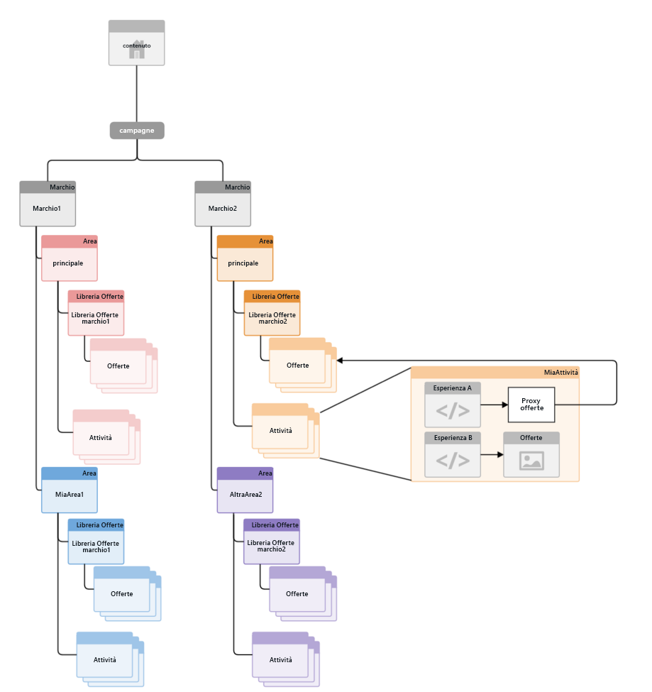
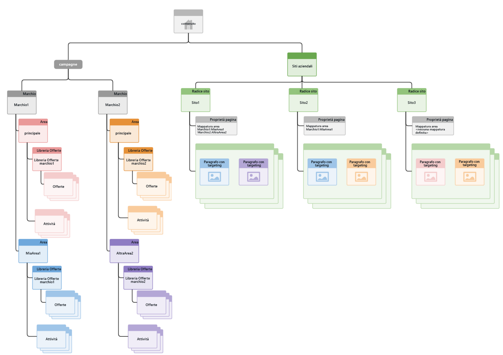

# Struttura della gestione multisito per contenuti di destinazione{#how-multisite-management-for-targeted-content-is-structured}

>[!CAUTION]
>
>AEM 6.4 ha raggiunto la fine del supporto esteso e questa documentazione non viene più aggiornata. Per maggiori dettagli, consulta la nostra [periodi di assistenza tecnica](https://helpx.adobe.com/it/support/programs/eol-matrix.html). Trova le versioni supportate [qui](https://experienceleague.adobe.com/docs/).

Il diagramma seguente illustra la struttura del supporto multisito per contenuti di destinazione.

Le aree vengono visualizzate al di sotto di **/content/campaigns/&lt;brand>** e, per impostazione predefinita, ogni marchio ha un’area master che viene creata automaticamente. Ogni area contiene la propria serie di attività, esperienze e offerte.

Per cercare contenuti mirati, le pagine o i siti possono essere mappati su un’area. Se non è configurata alcuna area, AEM torna all’area master per questo marchio specifico.

Il diagramma seguente è un esempio di come funziona la logica per tre siti, denominati site1, site2 e site3.

* site1 cerca myarea1 per brand1 e otherarea2 per brand2 in base alla mappatura dell&#39;area.
* site2 cerca myarea1 per brand1 e l&#39;area master per brand2 in quanto è definita solo la mappatura dell&#39;area per brand1.
* site3 cerca l’area master per brand1 e brand2, in quanto nessun’altra mappatura area è definita per questo sito.
