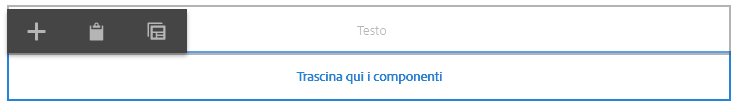

# Creazione di modelli di pagina   {#creating-page-templates}

>[!CAUTION]
>
>AEM 6.4 ha raggiunto la fine del supporto esteso e questa documentazione non viene più aggiornata. Per maggiori dettagli, consulta la nostra [periodi di assistenza tecnica](https://helpx.adobe.com/it/support/programs/eol-matrix.html). Trova le versioni supportate [qui](https://experienceleague.adobe.com/docs/).

Quando crei una pagina devi selezionare un modello, che verrà utilizzato come base per la creazione della nuova pagina. Il modello definisce la struttura della pagina risultante, eventuali contenuti iniziali e i componenti che possono essere utilizzati.

Con l’**Editor modelli**, la creazione e la manutenzione dei modelli non è più un’attività che riguarda solo gli sviluppatori. Può essere coinvolto anche un tipo di “power user”, detto **autore dimodelli**. Gli sviluppatori devono comunque occuparsi di configurare l’ambiente, creare le librerie client e i componenti da utilizzare, ma una volta che questi elementi di base sono implementati, l’**autore del modello** avrà la flessibilità di creare e configurare i modelli senza un progetto di sviluppo.

La **Console Modelli** consente agli autori di modelli di:

* Creare un nuovo modello o copiarne uno esistente.
* Gestisci il ciclo di vita del modello.

La **Editor modelli** consente agli autori di modelli di:

* Aggiungi i componenti al modello e posizionali su una griglia reattiva.
* Preconfigurare i componenti.
* Definisci quali componenti possono essere modificati nelle pagine create con il modello.

Questo documento spiega come **autore di modelli** Puoi utilizzare la console e l’editor dei modelli per creare e gestire modelli modificabili.

Per informazioni dettagliate sul funzionamento dei modelli modificabili a livello tecnico, consulta il documento per sviluppatori [Modelli di pagina - Modificabili](/help/sites-developing/page-templates-editable.md) per ulteriori informazioni.

>[!NOTE]
>
>AEM 6.4.5.0 o versione successiva è necessario per utilizzare modelli modificabili con [Editor SPA](/help/sites-developing/spa-overview.md).

>[!NOTE]
>
>L’**Editor modelli** non supporta il targeting diretto a livello di modello. È possibile impostare come destinazione le pagine create in base a un modello modificabile, ma non i modelli stessi.

>[!CAUTION]
>
>Pagine e modelli creati con **Console Modelli** non sono progettati per essere utilizzati con l’interfaccia classica e tale uso non è supportato.

## Prima di iniziare {#before-you-start}

>[!NOTE]
>
>Un amministratore deve configurare una cartella di modelli nel **browser delle configurazioni** e applicare le autorizzazioni appropriate prima che un autore possa creare un modello in tale cartella.

Prima di iniziare, è importante considerare i seguenti punti:

* La creazione di un nuovo modello richiede collaborazione. Per questo motivo per ogni attività è indicato il relativo [Ruolo.](#roles)

* A seconda di come è configurata l’istanza, potrebbe essere utile sapere che AEM ora fornisce [due tipi di modello di base](/help/sites-authoring/templates.md#editable-and-static-templates). Questo non influisce sul modo in cui [utilizzare un modello per creare una pagina](#using-a-template-to-create-a-page), ma influisce sul tipo di modello che è possibile creare e sul modo in cui una pagina si relaziona al suo modello.

### Ruoli {#roles}

La creazione di un nuovo modello tramite **Templates Console (Console modelli)** e **Editor modelli** richiede la collaborazione tra i seguenti ruoli:

* **Amministratore**:

   * Crea una nuova cartella per i modelli che richiede i diritti di `admin`.
   * Tali compiti possono spesso essere eseguiti anche da uno sviluppatore

* **Sviluppatore**:

   * Concentrati sui dettagli tecnici/interni
   * Deve avere esperienza con l’ambiente di sviluppo.
   * Fornisce all’autore del modello le informazioni necessarie.

* **Autore del modello**:

   * Questo è un autore specifico che è membro del gruppo `template-authors`

      * In questo modo vengono assegnati i privilegi e le autorizzazioni necessarie.
   * Può configurare l’uso di componenti e altri dettagli di alto livello che richiedono:

      * Alcune conoscenze tecniche

         * Ad esempio, l’utilizzo di pattern durante la definizione dei percorsi.
      * Informazioni tecniche fornite dallo sviluppatore.

A causa della natura di alcune attività, come la creazione di una cartella, è necessario un ambiente di sviluppo, che richiede conoscenza/esperienza.

I compiti descritti nel presente documento sono elencati con il ruolo che ne è responsabile.

### Modelli modificabili e statici {#editable-and-static-templates}

AEM ora offre due tipi di modelli di base:

* Modelli modificabili

   * Può essere [creato](#creating-a-new-template-template-author) e [modificato](#editing-templates-template-authors) per gli autori di modelli che utilizzano **Modello** console ed editor. La **Modello** è accessibile nella **Generale** della sezione **Strumenti** console.
   * Dopo la creazione della nuova pagina viene mantenuta una connessione dinamica tra la pagina e il modello. Ciò significa che le modifiche alla struttura del modello e/o al contenuto bloccato verranno applicate a tutte le pagine create con tale modello. Le modifiche al contenuto sbloccato (cioè iniziale) non verranno applicate.
   * Utilizza i criteri dei contenuti, che puoi definire dall’editor modelli, per mantenere le proprietà di progettazione. La modalità Progettazione nell’editor pagina non viene più utilizzata per i modelli modificabili.

* Modelli statici

   * I modelli statici sono disponibili per diverse versioni di AEM.
   * Sono [forniti dai tuoi sviluppatori](/help/sites-developing/page-templates-static.md), per cui non possono essere create o modificate dagli autori.
   * Vengono copiati per creare la nuova pagina, ma non esiste alcuna connessione dinamica (anche se il nome del modello è registrato per informazioni).
   * Utilizzo [Modalità Progettazione](/help/sites-authoring/default-components-designmode.md) per mantenere le proprietà di progettazione.
   * Poiché la modifica di modelli statici è compito esclusivo di uno sviluppatore, consulta il documento per sviluppatori [Modelli di pagina - Statici](/help/sites-developing/page-templates-static.md) per ulteriori informazioni.

Per definizione, la console modelli e l’editor modelli consentono solo la creazione e la modifica di modelli modificabili. Pertanto, questo documento si concentra esclusivamente sui modelli modificabili.

### Utilizzo di un modello per creare una pagina {#using-a-template-to-create-a-page}

Quando si utilizza un modello per [creare una nuova pagina](/help/sites-authoring/managing-pages.md#creating-a-new-page) non vi è alcuna differenza visibile e nessuna indicazione tra modelli statici e modificabili. Per l’autore della pagina, il processo è trasparente.

## Creazione e gestione di modelli {#creating-and-managing-templates}

Quando crei un nuovo modello modificabile:

* Utilizza la **Modello** console. È disponibile nella **Generale** della sezione **Strumenti** console.

   * Oppure direttamente da: [http://localhost:4502/libs/wcm/core/content/sites/templates.html/conf](http://localhost:4502/libs/wcm/core/content/sites/templates.html/conf)

* Se necessario, puoi [creare una cartella per i modelli](#creating-a-template-folder-admin).
* [Crea un nuovo modello](#creating-a-new-template-template-author), che sarà inizialmente vuoto.

* [Definire proprietà aggiuntive](#defining-template-properties-template-author) per il modello, se necessario
* [Modificare il modello](#editing-templates-template-authors) per definire:

   * [Struttura](#editing-a-template-structure-template-author): contenuto predefinito che non può essere modificato nelle pagine create con il modello.
   * [Contenuto iniziale](#editing-a-template-initial-content-author): contenuto predefinito che potrà essere modificato nelle pagine create con il modello.
   * [Layout](#editing-a-template-layout-template-author): per una vasta gamma di dispositivi.
   * [Stili](/help/sites-authoring/style-system.md): definisci gli stili da utilizzare con il modello e i suoi componenti.

* [Attiva il modello](#enabling-a-template-template-author) da utilizzare per la creazione di una pagina
* [Consenti modello](#allowing-a-template-author) per la pagina o la sezione richiesta del sito web
* [Pubblicare il modello](#publishing-a-template-template-author) per renderlo disponibile nell’ambiente di pubblicazione

>[!NOTE]
>
>I **Modelli consentiti** sono spesso predefiniti al momento della configurazione iniziale del sito web.

>[!CAUTION]
>
>Non inserire mai informazioni che devono essere [internazionalizzato](/help/sites-developing/i18n.md) in un modello.

### Creazione di una cartella di modelli - Amministratore {#creating-a-template-folder-admin}

È necessario creare una cartella di modelli per il progetto, che conterrà i modelli specifici per il progetto. Si tratta di un’attività amministrativa descritta nel documento [Modelli di pagina - Modificabili](/help/sites-developing/page-templates-editable.md#template-folders).

### Creazione di un nuovo modello - Autore del modello {#creating-a-new-template-template-author}

1. Apri **Console Modelli** (tramite **Strumenti** -> **Generale**), quindi passa alla cartella desiderata.

   >[!NOTE]
   >
   >In un’istanza AEM standard la cartella **globale** esiste già nella console modelli. Questa contiene i modelli predefiniti e funge da fallback se nella cartella corrente non sono presenti criteri e/o tipi di modello.
   >
   >Si consiglia di utilizzare una [cartella di modelli creata per il progetto](/help/sites-developing/page-templates-editable.md#template-folders).

1. Seleziona **Crea**, seguito da **Crea modello** per aprire la procedura guidata.

1. Scegli una **Tipo di modello**, quindi seleziona **Successivo**.

   >[!NOTE]
   >
   >I tipi di modello sono layout di modelli predefiniti e possono essere considerati modelli per un modello. Questi sono predefiniti dagli sviluppatori o dall’amministratore di sistema. Ulteriori informazioni sono disponibili nel documento per sviluppatori [Modelli di pagina - Modificabili](/help/sites-developing/page-templates-editable.md#template-type).

1. Completa il **Dettagli modello**:

   * **Nome modello**
   * **Descrizione**

1. Seleziona **Crea**. Viene visualizzata una conferma; seleziona **Apri** per iniziare a modificare il modello o **Fine** per tornare alla console dei modelli.

   >[!NOTE]
   >
   >Quando viene creato un nuovo modello, questo viene contrassegnato come **Bozza** nella console, a indicare che non è ancora disponibile per l’uso da parte degli autori di pagine.

### Definizione delle proprietà del modello - Autore del modello   {#defining-template-properties-template-author}

Un modello può avere le seguenti proprietà:

* Immagine

   * Immagine da utilizzare come [miniatura del modello](/help/sites-authoring/templates.md#template-thumbnail-image) per facilitare la selezione, ad esempio nella procedura guidata Crea pagina .

      * Può essere caricato
      * Può essere generato in base al contenuto del modello

* Titolo

   * Un titolo utilizzato per identificare il modello, ad esempio nel **Crea pagina** procedura guidata.

* Descrizione

   * Una descrizione facoltativa per fornire ulteriori informazioni sul modello e sul suo utilizzo, che possono essere visualizzate, ad esempio, nel **Crea pagina** procedura guidata.

Per visualizzare e/o modificare le proprietà:

1. Nella **console Modelli**, seleziona il modello.
1. Seleziona **Visualizza proprietà** dalla barra degli strumenti o le opzioni rapide per aprire la finestra di dialogo.
1. Ora è possibile visualizzare o modificare le proprietà del modello.

>[!NOTE]
>
>Lo stato di un modello (bozza, attivato o disattivato) è indicato nella console.

#### Immagine della miniatura del modello {#template-thumbnail-image}

Per definire la miniatura del modello:

1. Modifica le proprietà del modello.
1. Scegli se caricare una miniatura o generarla dal contenuto del modello.

   * Per caricare una miniatura, tocca o fai clic su **Carica immagine**
   * Per generare una miniatura, tocca o fai clic su **Genera anteprima**

1. Per entrambi i metodi verrà visualizzata un’anteprima della miniatura.

   Se non è soddisfacente, tocca o fai clic su **Cancella** per caricare un’altra immagine o rigenerare la miniatura.

1. Una volta ottenuta la miniatura desiderata, tocca o fai clic su **Salva e chiudi**.

### Abilitazione e autorizzazione di un modello - Autore del modello   {#enabling-and-allowing-a-template-template-author}

Per poter utilizzare un modello quando si crea una pagina, è necessario svolgere le seguenti operazioni:

* [Attiva i modelli](#enabling-a-template-template-author) per renderli disponibili per l’uso durante la creazione di pagine.
* [Consenti ai modelli](#allowing-a-template-author) di specificare i rami di contenuto in cui è possibile utilizzare il modello.

#### Abilitazione di un modello - Autore del modello {#enabling-a-template-template-author}

Un modello può essere abilitato o disabilitato per renderlo disponibile o non disponibile nel **Crea pagina** procedura guidata.

>[!CAUTION]
>
>Una volta abilitato un modello, viene visualizzato un avviso quando un autore inizia ad aggiornare ulteriormente il modello. In questo modo si informa l’utente che è possibile fare riferimento al modello, in modo che eventuali modifiche possano influenzare le pagine che fanno riferimento al modello.

1. Nella **console Modelli**, seleziona il modello.
1. Seleziona **Abilita** o **Disabilita** nella barra degli strumenti e di nuovo nella finestra di dialogo di conferma.
1. È ora possibile utilizzare il modello quando si [crea una nuova pagina](/help/sites-authoring/managing-pages.md#creating-a-new-page), anche se probabilmente si vorrà [modificare il modello](#editing-templates-template-authors) in base a specifiche esigenze.

>[!NOTE]
>
>Lo stato di un modello (bozza, attivato o disattivato) è indicato nella console.

#### Consentire un modello - Autore {#allowing-a-template-author}

Un modello può essere reso disponibile o non disponibile per alcuni rami di pagina.

1. Apri le [Proprietà pagina](/help/sites-authoring/editing-page-properties.md) per la pagina principale del ramo in cui desideri rendere disponibile il modello.

1. Apri la scheda **Avanzate**.

1. In **Impostazioni modello** utilizza **Aggiungi campo** per specificare il percorso del modello.

   Il percorso può essere esplicito o utilizzare pattern. Esempio:

   `/conf/<your-folder>/settings/wcm/templates/.*`

   L’ordine dei percorsi è irrilevante, tutti i percorsi verranno analizzati e gli eventuali modelli recuperati.

   >[!NOTE]
   >
   >Se la **Modelli consentiti** l’elenco viene lasciato vuoto, quindi la struttura viene ascesa fino a quando non viene trovato un valore o un elenco.
   >
   >Consulta [Disponibilità dei modelli](/help/sites-developing/templates.md#template-availability): i principi per i modelli consentiti rimangono gli stessi.

1. Fai clic su **Salva** per salvare le modifiche alle proprietà della pagina.

>[!NOTE]
>
>Spesso i modelli consentiti sono predefiniti per l’intero sito quando è configurato.

### Pubblicazione di un modello - Autore del modello {#publishing-a-template-template-author}

Poiché al modello viene fatto riferimento quando viene eseguito il rendering di una pagina, il modello completamente configurato deve essere pubblicato in modo che sia disponibile nell’ambiente di pubblicazione.

1. Nella **console Modelli**, seleziona il modello.
1. Seleziona **Pubblica** nella barra degli strumenti per aprire la procedura guidata.
1. Seleziona **Criteri per contenuto** da pubblicare in tandem.

1. Seleziona **Pubblica** dalla barra degli strumenti per completare l’azione.

## Modifica dei modelli - Autori dei modelli   {#editing-templates-template-authors}

Quando crei o modifichi un modello, puoi definire diversi aspetti. La modifica dei modelli è simile alla creazione delle pagine.

È possibile modificare i seguenti aspetti di un modello:

* [Struttura](#editing-a-template-structure-template-author)

   I componenti aggiunti qui non possono essere spostati o rimossi dalle pagine risultanti dagli autori delle pagine. Se si desidera che gli autori delle pagine siano in grado di aggiungere e rimuovere componenti alle pagine risultanti, è necessario aggiungere un sistema di paragrafi al modello.

   Quando i componenti sono bloccati, è possibile aggiungere contenuti che non possono essere modificati dagli autori delle pagine. È possibile sbloccare i componenti per definire [Contenuto iniziale](#editing-a-template-initial-content-author).

   >[!NOTE]
   >
   >In modalità struttura non è possibile spostare, tagliare o eliminare i componenti principali di un componente sbloccato.

* [Contenuto iniziale](#editing-a-template-initial-content-author)

   Quando un componente è stato sbloccato, è possibile definire il contenuto iniziale che verrà copiato nelle pagine risultanti, create dal modello. I componenti sbloccati possono essere modificati nella pagina o nelle pagine risultanti.

   >[!NOTE]
   >
   >Nella modalità **Contenuto iniziale** e nelle pagine risultanti, tutti i componenti sbloccati che hanno un elemento padre accessibile (ad esempio i componenti all’interno di un contenitore di layout) possono essere eliminati.

* [Layout](#editing-a-template-layout-template-author)

   Qui è possibile predefinire il layout del modello per i formati di dispositivo richiesti. La modalità **Layout** per la creazione dei modelli ha le stesse funzionalità della modalità **[Layout](/help/sites-authoring/responsive-layout.md#defining-layouts-layout-mode)** per la creazione delle pagine.

* [Criteri di pagina](#editing-a-template-structure-template-author)

   In Criteri di pagina è possibile collegare alla pagina i criteri di pagina predefiniti. I criteri di pagina definiscono le varie configurazioni di progettazione.

* [Stili](/help/sites-authoring/style-system.md)

   Il sistema di stili consente all’autore del modello di definire le classi di stile nel criterio del contenuto di un componente, in modo che un autore di contenuti possa sceglierli quando modifica un componente in una pagina. Gli stili possono essere varianti visive alternative di un componente, per renderlo più flessibile.

   Per ulteriori informazioni, consulta la [documentazione sul sistema di stili](/help/sites-authoring/style-system.md).

Il selettore **Modalità** nella barra degli strumenti consente di selezionare e modificare l’aspetto appropriato del modello:

* [Struttura](#editing-a-template-structure-template-author)
* [Contenuto iniziale](#editing-a-template-initial-content-author)
* [Layout](#editing-a-template-layout-template-author)

L’opzione **Criterio pagina** nel menu **Informazioni pagina** consente invece di [selezionare i criteri di pagina richiesti](#editing-a-template-structure-template-author):

>[!CAUTION]
>
>Se un autore inizia a modificare un modello già abilitato, viene visualizzato un avviso. In questo modo si informa l’utente che è possibile fare riferimento al modello, in modo che eventuali modifiche possano influenzare le pagine che fanno riferimento al modello.

### Modifica di un modello - Struttura - Autore del modello {#editing-a-template-structure-template-author}

In **Struttura** La modalità consente di definire i componenti e i contenuti per il modello e i criteri per il modello e i suoi componenti.

* I componenti definiti nella struttura del modello non possono essere spostati su una pagina risultante né eliminati da alcuna pagina risultante.
* Se desideri che gli autori delle pagine siano in grado di aggiungere e rimuovere componenti, aggiungi al modello un sistema di paragrafi.
* I componenti possono essere sbloccati e bloccati di nuovo per consentire di definire il [contenuto iniziale](#editing-a-template-initial-content-author).

* Vengono definiti i criteri di design per i componenti e la pagina.

In **Struttura** modalità dell’editor modelli:

* **Aggiungi componenti**

   Esistono diversi meccanismi per aggiungere componenti al modello:

   * Da **Componenti** nel pannello laterale.
   * Utilizzando **Inserisci componente** opzione (**+** nella barra degli strumenti dei componenti già presenti nel modello o nel **Trascina qui i componenti** scatola.
   * Trascinando una risorsa (dal **Risorse** browser nel pannello laterale) direttamente sul modello per generare il componente appropriato in situ.

   Una volta aggiunto, ogni componente è contrassegnato con:

   * Un bordo
   * Un marcatore per mostrare il tipo di componente
   * Un marcatore da visualizzare quando il componente è stato sbloccato

   >[!NOTE]
   >
   >Quando si aggiunge al modello un componente **Titolo** pronto per l’uso, questo conterrà la **struttura** di testo predefinita.
   >
   >
   >Se si modifica questa impostazione e si aggiunge un proprio testo, questo testo aggiornato verrà utilizzato quando si crea una pagina dal modello.
   >
   >
   >Se si lascia il testo (struttura) predefinito, il titolo predefinito corrisponde al nome della pagina risultante.

   >[!NOTE]
   >
   >Sebbene non sia identica, l’aggiunta di componenti e risorse a un modello ha molte somiglianze con azioni simili quando [authoring delle pagine](/help/sites-authoring/editing-content.md).

* **Azioni dei componenti**

   Una volta aggiunti al modello, esegui azioni sui componenti. Ogni singola istanza dispone di una barra degli strumenti che consente di accedere alle azioni disponibili, a seconda del tipo di componente.

   

   Può anche dipendere dalle azioni intraprese, ad esempio se un criterio è stato associato al componente, in tal caso l’icona di configurazione del progetto diventa disponibile.

* **Modifica e Configura**

   Con queste due azioni è possibile aggiungere contenuti ai componenti.

* **Bordo per indicare la Struttura**

   Quando si lavora in **Struttura** modalità e bordo arancione indica il componente attualmente selezionato. Una linea tratteggiata indica anche il componente principale.

   Ad esempio, nella schermata sottostante il **Testo** è selezionato all’interno di un **Contenitore di layout** (responsivegrid).

   

* **Criteri e proprietà (Generale)**

   I criteri di progettazione o di contenuto definiscono le proprietà di progettazione di un componente. Ad esempio, i componenti disponibili o le dimensioni minima/massima. Sono applicabili al modello (e alle pagine create con il modello).

   Crea un criterio per i contenuti o selezionane uno esistente per un componente. In questo modo è possibile definire i dettagli del progetto.

    

   La finestra di configurazione è divisa in due parti.

   * Nella parte sinistra, in **Criteri**, è possibile selezionare un criterio esistente.
   * Nella parte destra, in **Proprietà** è possibile impostare le proprietà specifiche del tipo di componente.

   Le proprietà disponibili dipendono dal componente selezionato. Ad esempio, per un componente di testo, le proprietà definiscono, tra le altre opzioni, le opzioni di copia e incolla, le opzioni di formattazione e lo stile del paragrafo.

   ***Criterio***

   I criteri di progettazione o di contenuto definiscono le proprietà di progettazione di un componente. Ad esempio, i componenti disponibili o le dimensioni minima/massima. Sono applicabili al modello (e alle pagine create con il modello).

   In **Criterio** puoi selezionare un criterio esistente da applicare al componente tramite il menu a discesa.

   

   Puoi aggiungere un nuovo criterio selezionando il pulsante di aggiunta accanto al menu a discesa **Seleziona criterio**. Quindi devi assegnare un nuovo titolo nel campo **Titolo criterio**.

   

   Il criterio esistente selezionato nel menu a discesa **Seleziona criterio** può essere copiato come nuovo criterio utilizzando il pulsante Copia, accanto al menu a discesa. Quindi devi assegnare un nuovo titolo nel campo **Titolo criterio**. Per impostazione predefinita, il criterio copiato si chiama **Copia di X**, dove X è il titolo del criterio da cui è stato copiato.

   

   La descrizione del criterio nel campo **Descrizione criterio** è facoltativa.

   Nella sezione **Altri modelli che utilizzano il criterio selezionato**, è possibile vedere facilmente quali altri modelli utilizzano i criteri selezionati nell’elenco a discesa **Seleziona criterio**.

   

   >[!NOTE]
   >
   >Se vengono aggiunti come contenuto iniziale più componenti dello stesso tipo, lo stesso criterio si applica a tutti i componenti. Questo riflette la stessa restrizione in **[Modalità Progettazione](/help/sites-authoring/default-components-designmode.md)** per i modelli statici.

   ***Proprietà***

   Sotto la **Proprietà** Puoi definire le impostazioni del componente. L’intestazione ha due schede:

   * Principale
   * Funzioni

   *Principale*

   Sulla **Principale** vengono definite le impostazioni più importanti del componente.

   Ad esempio, per un componente immagine è possibile definire le larghezze consentite e abilitare il caricamento lento.

   Se un’impostazione consente più configurazioni, tocca o fai clic sul pulsante **Aggiungi** per aggiungere un’altra configurazione.

   

   Per rimuovere una configurazione, tocca o fai clic sul pulsante **Elimina** situato a destra della configurazione.

   Per rimuovere una configurazione, tocca o fai clic sul pulsante** Elimina**.

   

   *Funzioni*

   La **Funzioni** consente di abilitare o disabilitare funzioni aggiuntive del componente.

   Ad esempio, per un componente immagine puoi definire le proporzioni di ritaglio, gli orientamenti consentiti per le immagini e se sono consentiti caricamenti.

   

   >[!CAUTION]
   >
   >In AEM i rapporti di ritaglio sono definiti come **altezza/larghezza**. Questo differisce dalla definizione tradizionale di larghezza/altezza ed è eseguito per motivi di compatibilità legacy. Gli utenti che creano le pagine non noteranno alcuna differenza, purché sia stato definito chiaramente il **Nome**, che verrà visualizzato nell’interfaccia utente.

   >[!NOTE]
   >
   >[I criteri dei contenuti per i componenti che si avvalgono dell’editor Rich Text](/help/sites-administering/rich-text-editor.md) possono essere definiti solo per le opzioni disponibili mediante tale editor tramite le impostazioni di interfaccia utente.

* **Criteri e proprietà (contenitore di layout)**

   Le impostazioni dei criteri e delle proprietà di un contenitore di layout sono simili all’utilizzo generale, ma con alcune differenze.

   >[!NOTE]
   >
   >La configurazione di un criterio è obbligatoria per i componenti contenitore, in quanto consente di definire i componenti che saranno disponibili nel contenitore .

   La finestra di configurazione è divisa in due, come nell&#39;uso generale della finestra.

   ***Criterio***

   I criteri di progettazione o di contenuto definiscono le proprietà di progettazione di un componente. Ad esempio, i componenti disponibili o le dimensioni minima/massima. Sono applicabili al modello (e alle pagine create con il modello).

   In **Criterio** puoi selezionare un criterio esistente da applicare al componente tramite il menu a discesa. Questo funziona come nell’uso generale della finestra.

   ***Proprietà***

   Sotto la **Proprietà** Puoi scegliere i componenti disponibili per il contenitore layout e definirne le impostazioni. L’intestazione ha tre schede:

   * Componenti consentiti
   * Componenti standard
   * Impostazioni reattive

   *Componenti consentiti*

   Sulla **Componenti consentiti** definisci quali componenti sono disponibili per il contenitore layout.

   * I componenti sono raggruppati in base ai gruppi di componenti, che possono essere espansi e compressi.
   * Per selezionare un intero gruppo, seleziona il nome del gruppo e deseleziona tutti gli elementi deselezionati deselezionando .
   * Un segno meno rappresenta almeno uno, ma non tutti gli elementi di un gruppo, selezionati.
   * È disponibile una ricerca per filtrare un componente per nome.
   * I conteggi elencati a destra del nome del gruppo di componenti rappresentano il numero totale di componenti selezionati in tali gruppi, indipendentemente dal filtro.

   

   *Componenti standard*

   Sulla **Componenti predefiniti** , definisci quali componenti vengono associati automaticamente a determinati tipi di file multimediali in modo che, quando un autore trascina una risorsa dal browser delle risorse, AEM sappia a quale componente associarla. Per tale configurazione sono disponibili solo componenti con zone di rilascio.

   Tocca o fai clic su **Aggiungi mappatura** per aggiungere un componente completamente nuovo e la mappatura del tipo MIME.

   Seleziona un componente nell’elenco e tocca o fai clic su **Aggiungi tipo** per aggiungere un altro tipo MIME a un componente già mappato. Fai clic sull’icona **Elimina** per rimuovere un tipo di MIME.

   

   *Impostazioni reattive*

   Nella scheda **Impostazioni reattive** è possibile configurare il numero di colonne nella griglia risultante del contenitore layout.

* **Sblocca/Blocca componenti**

   Sblocca/blocca i componenti per definire se il contenuto è disponibile per la modifica in **Contenuto iniziale** modalità.

   Quando un componente è stato sbloccato:

   * Sul bordo viene visualizzato un indicatore di lucchetto aperto.
   * La barra degli strumenti del componente viene regolata di conseguenza.
   * Il contenuto già inserito non verrà più visualizzato in **Struttura** modalità.

      * Il contenuto già inserito è considerato contenuto iniziale ed è visibile solo nella modalità **Contenuto iniziale**.
   * L’elemento padre di un componente sbloccato non può essere spostato, tagliato o cancellato.

   

   Ciò include lo sblocco di componenti contenitore in modo che possano essere aggiunti altri componenti, sia in modalità **Contenuto iniziale** che sulle pagine risultanti. Se hai già aggiunto componenti/contenuti al contenitore prima di sbloccarlo, questi non saranno più visualizzati in modalità **Struttura** ma saranno presenti in modalità **Contenuto iniziale**. In **Modalità struttura**, verrà mostrato solo il componente del contenitore stesso con il suo elenco di **Componenti consentiti**.

   

   Per risparmiare spazio, il contenitore di layout non cresce per adattarsi all’elenco dei componenti consentiti. Il contenitore diventa invece un elenco scorrevole.

   I componenti configurabili vengono visualizzati con l’icona **Policy**, che può essere toccata o su cui è possibile fare clic per modificare la policy e le proprietà del componente.

   

* **Relazione con le pagine esistenti**

   Se la struttura viene aggiornata dopo la creazione di pagine basate sul modello, a tali pagine verranno applicate le modifiche apportate al modello. Questo fatto è segnalato da un avviso nella barra degli strumenti e da finestre di dialogo di conferma.

   

### Modifica di un modello - Contenuto iniziale - Autore {#editing-a-template-initial-content-author}

**Contenuto iniziale** viene utilizzata per definire il contenuto che verrà visualizzato quando una pagina viene creata per la prima volta in base al modello. Il contenuto iniziale può quindi essere modificato dagli autori delle pagine.

Sebbene tutto il contenuto creato in modalità **Struttura** sia visibile nel **Contenuto iniziale**, solo i componenti sbloccati possono essere selezionati e modificati.

>[!NOTE]
>
>La modalità **Contenuto iniziale** è in pratica una modalità di modifica per le pagine create con quel modello. Pertanto, i criteri non vengono definiti in modalità **Contenuto iniziale**, ma in **[modalità Struttura](/help/sites-authoring/templates.md#editing-a-template-structure-template-author)**.

* I componenti sbloccati disponibili per la modifica sono contrassegnati. Quando sono selezionati, hanno un bordo blu:

   

* I componenti sbloccati dispongono di una barra degli strumenti che consente di modificare e configurare il contenuto:

   

* Se un componente del contenitore è stato sbloccato (in modalità **Struttura**), è possibile aggiungervi nuovi componenti (in modalità **Contenuto iniziale**). I componenti aggiunti in modalità **Contenuto iniziale** possono essere spostati o eliminati dalle pagine risultanti.

   È possibile aggiungere un componente utilizzando l’area **Trascina qui i componenti** o l’opzione **Inserisci nuovo componente** dalla barra degli strumenti del contenitore appropriato.

    

* Se il contenuto iniziale del modello viene aggiornato dopo la creazione delle pagine basate sul modello, tali pagine non saranno influenzate dalle modifiche apportate al contenuto iniziale del modello.

>[!NOTE]
>
>Il contenuto iniziale è destinato alla preparazione dei componenti e del layout di pagina che fungono da punto di partenza per la creazione del contenuto. Non è destinato ad essere il contenuto effettivo che rimarrebbe invariato. Per questo motivo, il contenuto iniziale non può essere tradotto.

### Modifica di un modello - Layout - Autore del modello {#editing-a-template-layout-template-author}

È possibile definire il layout del modello per una serie di dispositivi. Il [Layout reattivo](/help/sites-authoring/responsive-layout.md) per i modelli funziona come per la creazione delle pagine.

>[!NOTE]
>
>Le modifiche al layout verranno applicate in modalità **Contenuto iniziale**, ma non in modalità **Struttura**.

### Modifica di un modello - Progettazione pagina - Autore/sviluppatore del modello {#editing-a-template-page-design-template-author-developer}

La progettazione della pagina, comprese le librerie lato client e le policy di pagina obbligatorie, viene mantenuta nell’opzione **Progettazione pagina** del menu **Informazioni pagina**.

Per accedere al **Progettazione pagina** finestra di dialogo:

1. Da **Editor modelli**, seleziona **Informazioni pagina** dalla barra degli strumenti, quindi **Progettazione pagina** per aprire la finestra di dialogo.
1. La **Progettazione pagina** viene aperta una finestra di dialogo divisa in due sezioni:

   * La metà sinistra definisce il [criteri pagina](/help/sites-authoring/templates.md#page-policies)
   * La metà destra definisce il [proprietà pagina](/help/sites-authoring/templates.md#page-properties)

   

#### Criteri di pagina {#page-policies}

È possibile applicare un criterio per i contenuti al modello o alle pagine risultanti. In tal modo si definiscono i criteri dei contenuti per il sistema di paragrafi principale della pagina.

* Puoi selezionare un criterio esistente per la pagina dal menu a discesa **Seleziona criterio**.

   

   Puoi aggiungere un nuovo criterio selezionando il pulsante di aggiunta accanto al menu a discesa **Seleziona criterio**. Quindi devi assegnare un nuovo titolo nel campo **Titolo criterio**.

   

   Il criterio esistente selezionato nel menu a discesa **Seleziona criterio** può essere copiato come nuovo criterio utilizzando il pulsante Copia, accanto al menu a discesa. Quindi devi assegnare un nuovo titolo nel campo **Titolo criterio**. Per impostazione predefinita, il criterio copiato si chiama **Copia di X**, dove X è il titolo del criterio da cui è stato copiato.

   

* Aggiungi un titolo al criterio nel campo **Titolo criterio**. Un criterio deve avere un titolo che permetta di riconoscerlo facilmente nel menu a discesa **Seleziona criterio**.

   

* La descrizione del criterio nel campo **Descrizione criterio** è facoltativa.
* Nella sezione **Altri modelli che utilizzano il criterio selezionato**, è possibile vedere facilmente quali altri modelli utilizzano i criteri selezionati nell’elenco a discesa **Seleziona criterio**.

   

#### Proprietà pagina {#page-properties}

Con le proprietà della pagina è possibile definire le librerie lato client richieste mediante la finestra di dialogo **Progettazione pagina**. Le librerie lato client includono fogli di stile e Javascript da caricare con il modello e le pagine create con tale modello.

* Specifica le librerie lato client da applicare alle pagine create con questo modello. Immetti il nome di una libreria nel campo di testo nella sezione **Librerie lato client** sezione .

   

* Se sono necessarie più librerie, fai clic sul pulsante Aggiungi per aggiungere un ulteriore campo di testo al nome della libreria.

   

   Aggiungi tutti i campi di testo necessari per le librerie lato client.

   

* Se necessario, definisci la posizione relativa delle librerie trascinando i campi con la maniglia di trascinamento.

   

>[!NOTE]
>
>L’autore del modello può specificare il criterio della pagina sul modello, ma dovrà ottenere i dettagli delle librerie appropriate lato client dallo sviluppatore.

### Modifica di un modello - Proprietà pagina iniziale - Autore {#editing-a-template-initial-page-properties-author}

L’opzione **Proprietà pagina iniziale** consente di definire le [proprietà della pagina iniziale](/help/sites-authoring/editing-page-properties.md) da utilizzare per la creazione delle pagine risultanti.

1. Dall’editor dei modelli, seleziona **Informazioni pagina** dalla barra degli strumenti, quindi **Proprietà pagina iniziale** per aprire la finestra di dialogo.

1. Nella finestra di dialogo è possibile definire le proprietà che si desidera applicare alle pagine create con questo modello.

   

1. Conferma le definizioni con **Fine**.

## Best practice   {#best-practices}

Durante la creazione di modelli è consigliabile tenere in considerazione:

1. L’impatto delle modifiche apportate al modello una volta che le pagine sono state create da quel modello.

   Di seguito è riportato un elenco delle diverse operazioni possibili sui modelli e del loro impatto sulle pagine create da essi:

   * Modifiche alla struttura:

      * Vengono applicate immediatamente alle pagine risultanti.
      * La pubblicazione del modello modificato rimane necessaria per consentire ai visitatori di visualizzare le modifiche.
   * Modifiche ai criteri dei contenuti e alle configurazioni di progettazione:

      * Vengono applicate immediatamente alle pagine risultanti.
      * È necessaria la pubblicazione delle modifiche affinché i visitatori possano vedere le modifiche.
   * Modifiche al contenuto iniziale:

      * Questi si applicano solo alle pagine create dopo le modifiche al modello.
   * Le modifiche al layout dipendono dal fatto che il componente modificato faccia parte di:

      * Solo struttura - applicata immediatamente
      * Contenere il contenuto iniziale: solo nelle pagine create dopo la modifica

   Presta particolare attenzione quando:

   * Blocco o sblocco di componenti su modelli abilitati.
   * Questo può avere effetti collaterali, in quanto le pagine esistenti possono già utilizzarlo. In genere:

      * Lo sblocco dei componenti (bloccati) risulta mancante nelle pagine esistenti.
      * Il blocco dei componenti (che erano modificabili) ne impedirà la visualizzazione sulle pagine.

   >[!NOTE]
   >
   >AEM fornisce avvisi espliciti quando si modifica lo stato di blocco dei componenti su modelli che non sono più bozze.

1. [Creazione di cartelle personalizzate](#creating-a-template-folder-admin) per i modelli specifici per il sito.
1. [Pubblicare i modelli](#publishing-a-template-template-author) dal **Modelli** console.
