# Gestione dei progetti{#managing-projects}

>[!CAUTION]
>
>AEM 6.4 ha raggiunto la fine del supporto esteso e questa documentazione non viene più aggiornata. Per maggiori dettagli, consulta la nostra [periodi di assistenza tecnica](https://helpx.adobe.com/it/support/programs/eol-matrix.html). Trova le versioni supportate [qui](https://experienceleague.adobe.com/docs/).

I progetti consentono di organizzare il progetto raggruppando le risorse in un’unica entità.

In **Progetti** consente di accedere ai progetti e di eseguire azioni su di essi:

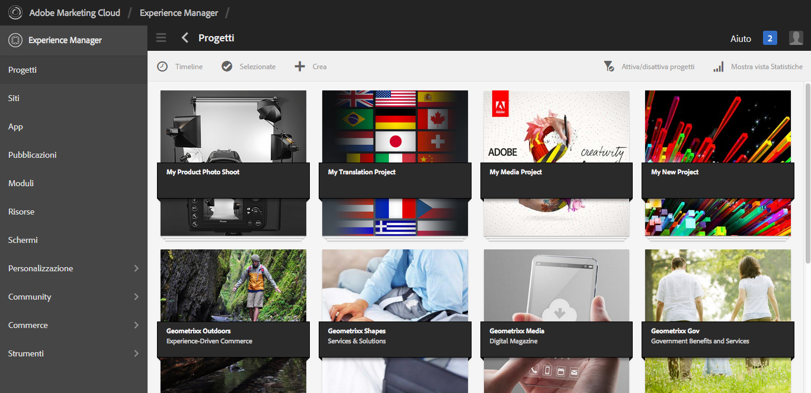

In Progetti puoi creare un progetto, associare le risorse al progetto ed eliminare un progetto o i collegamenti alle risorse. Puoi aprire una tessera per visualizzarne il contenuto e aggiungere elementi a una tessera. Questo argomento descrive tali procedure.

>[!NOTE]
>
>Con la versione 6.2 è stata introdotta la possibilità di organizzare i progetti in cartelle. Nella pagina Progetti puoi creare un progetto o una cartella.
>
>Se viene creata una cartella, l’utente viene quindi portato nella cartella in cui può creare un’altra cartella o un progetto. Consente di organizzare i progetti in cartelle in base a categorie quali campagne di prodotto, posizione, lingue di traduzione e così via.
>
>I progetti e le cartelle possono essere visualizzati in una vista a elenco e anche cercati.

>[!CAUTION]
>
>Affinché gli utenti dei progetti possano vedere altri utenti/gruppi utilizzando le funzionalità Progetti come la creazione di progetti, la creazione di attività/flussi di lavoro, la visualizzazione e la gestione del team, questi utenti devono avere accesso in lettura a **/home/users** e **/home/groups**. Il modo più semplice per implementarlo è quello di fornire **utenti dei progetti** accesso in lettura di gruppo a **/home/users** e **/home/groups**.

## Creazione di un progetto {#creating-a-project}

In AEM sono disponibili i seguenti modelli tra cui scegliere quando si crea un progetto:

* Progetto semplice
* Progetto multimediale
* Progetto servizio fotografico per prodotto
* Progetto di traduzione

La procedura di creazione di un progetto è la stessa per ciascun progetto. La differenza tra i tipi di progetti include i [ruoli utente](/help/sites-authoring/projects.md) e i [flussi di lavoro](/help/sites-authoring/projects-with-workflows.md) disponibili.  Per creare un nuovo progetto:

1. In **Progetti**, tocca o fai clic su **Crea** per aprire la procedura guidata **Crea progetto**:
1. Seleziona un modello. Progetto semplice, Progetto multimediale, [Progetto di traduzione](/help/sites-administering/tc-manage.md)e [Prodotto servizio fotografico](/help/sites-authoring/managing-product-information.md) sono disponibili e fai clic su **Successivo**.

   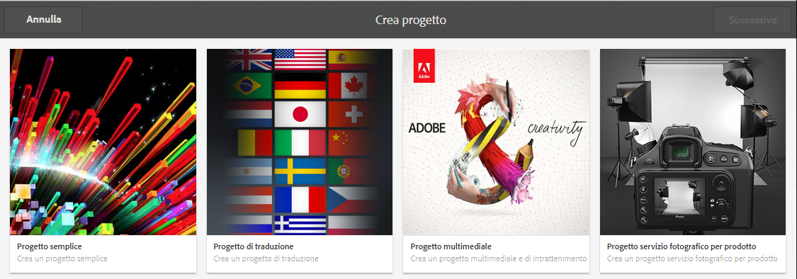

1. Definisci un **titolo** e una **descrizione**; se necessario, aggiungi un’immagine di **miniatura**. Puoi anche aggiungere o eliminare gli utenti e il gruppo a cui appartengono. Inoltre, fai clic su **Avanzate** per aggiungere un nome utilizzato nell’URL.

   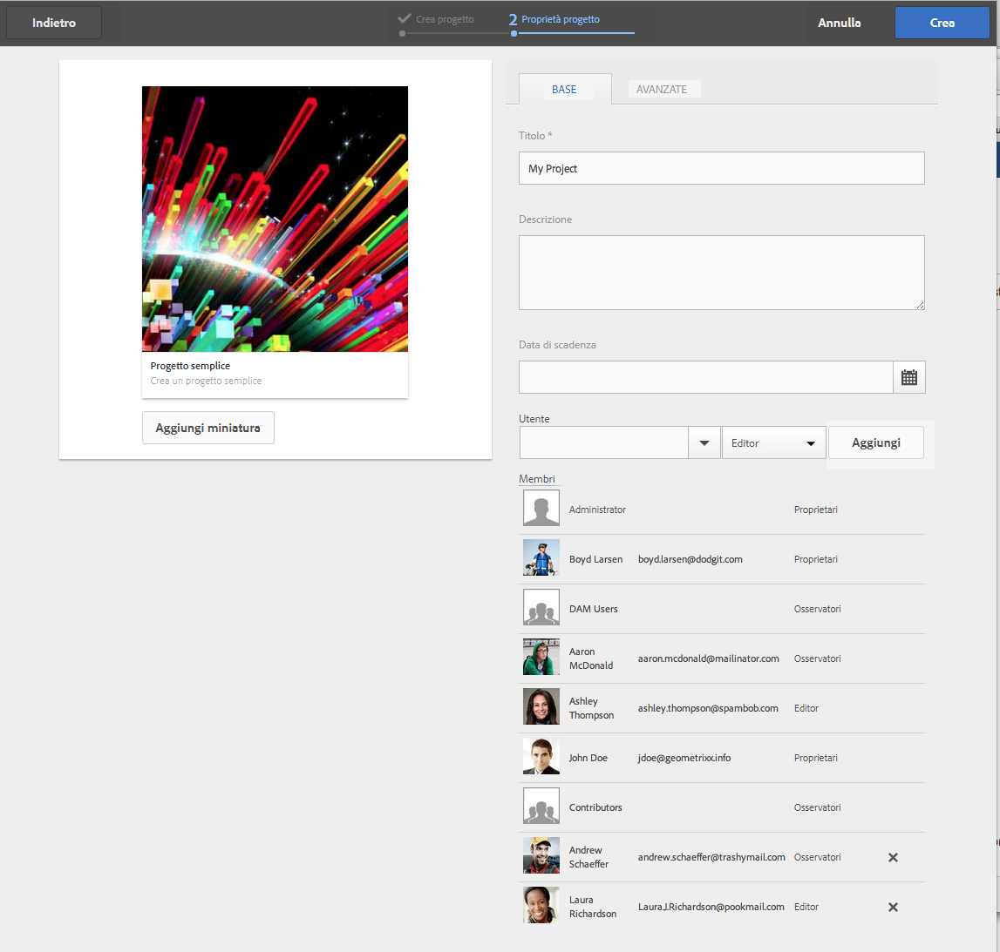

1. Tocca o fai clic su **Crea**. Viene richiesto se desideri aprire il nuovo progetto o tornare alla console.

### Associazione delle risorse al progetto {#associating-resources-with-your-project}

Poiché i progetti consentono di raggruppare le risorse in un’unica entità, è necessario associare le risorse al progetto. Queste risorse sono denominate **Porzioni**. I tipi di risorse che è possibile aggiungere sono descritti in [Porzioni di progetto](/help/sites-authoring/projects.md#project-tiles).

Per associare risorse al progetto:

1. Apri il progetto da **Progetti** console.
1. Tocca o fai clic su **Aggiungi sezione** e seleziona la porzione da collegare al progetto. È possibile selezionare tra più tipi di riquadri.

   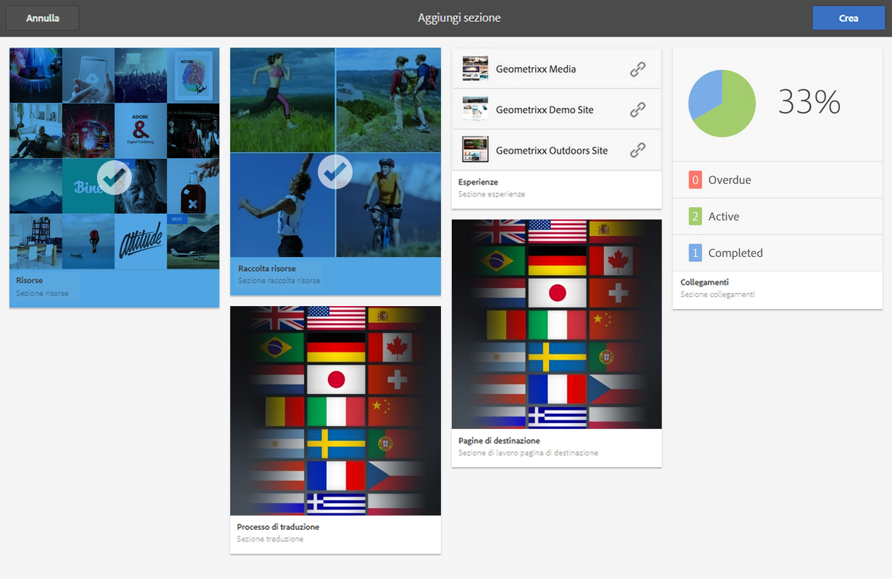

   >[!NOTE]
   >
   >I riquadri associabili a un progetto sono descritti dettagliatamente nella sezione [Riquadri di progetto](/help/sites-authoring/projects.md#project-tiles).

1. Tocca o fai clic su **Crea**. La risorsa è ora collegata al progetto e accessibile da questo.

### Eliminazione di un progetto o di un collegamento di risorsa {#deleting-a-project-or-resource-link}

Per eliminare un progetto dalla console o una risorsa collegata dal progetto si applica lo stesso metodo:

1. Passa alla posizione appropriata:

   * Per eliminare un progetto, passa al livello superiore della **Progetti** console.
   * Per eliminare un collegamento di risorsa all’interno di un progetto, apri il progetto nella console **Progetti**.

1. Entra nella modalità di selezione facendo clic su **Seleziona** e scegli il progetto o collegamento di risorsa.
1. Tocca o fai clic su **Elimina**.

1. È necessario confermare l’eliminazione in una finestra di dialogo. Se confermato, il progetto o il collegamento della risorsa viene eliminato. Per uscire dalla modalità di selezione, tocca o fai clic su **Deseleziona**.

>[!NOTE]
>
>Quando crei il progetto e aggiungi utenti ai vari ruoli, i gruppi associati al progetto vengono creati automaticamente per gestire le autorizzazioni associate. Ad esempio, un progetto denominato Mioprogetto avrebbe tre gruppi: **Proprietari mioprogetto**, **Editor mioprogetto**, **Osservatori mioprogetto**. Tuttavia, se il progetto viene eliminato, tali gruppi non vengono rimossi automaticamente. Un amministratore deve eliminare manualmente i gruppi da **Strumenti** > **Protezione** > **Gruppi**.

### Aggiunta di elementi a una porzione {#adding-items-to-a-tile}

In alcuni riquadri, è possibile aggiungere più di un elemento. Ad esempio, puoi avere più di un flusso di lavoro in esecuzione contemporaneamente o più esperienze.

Per aggiungere elementi a una porzione:

1. In **Progetti**, accedi al progetto e fai clic sull’icona Aggiungi + nella tessera a cui desideri aggiungere un elemento.

   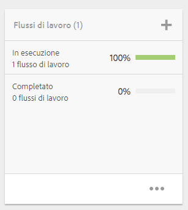

1. Aggiungi un elemento alla tessera come faresti quando crei una nuova tessera. Sono descritte le porzioni di progetto [qui](/help/sites-authoring/projects.md#project-tiles). In questo esempio, è stato aggiunto un altro flusso di lavoro.

   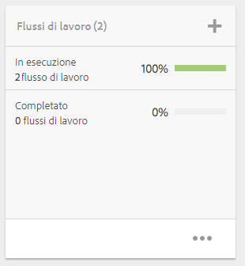

### Apertura di una porzione {#opening-a-tile}

È possibile visualizzare gli elementi inclusi in un riquadro corrente oppure modificarli o eliminarli.

Per aprire una tessera in modo da poter visualizzare o modificare gli elementi:

1. Nella console Progetti , tocca o fai clic sui puntini di sospensione (..)

   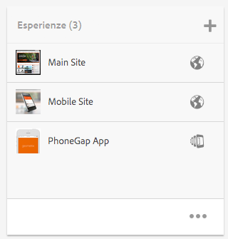

1. AEM elenca gli elementi in quel riquadro. È possibile accedere alla modalità di selezione per modificare o eliminare gli elementi.

   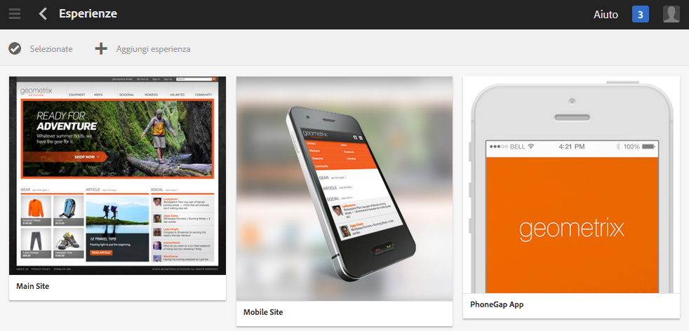

## Visualizzazione delle statistiche di un progetto {#viewing-project-statistics}

Per visualizzare le statistiche del progetto, nella **Progetti** console, fai clic su **Mostra vista statistiche**. Viene visualizzato il livello di completamento per ciascun progetto. Fai clic su **Mostra vista statistiche** di nuovo per passare al **Progetti** console.

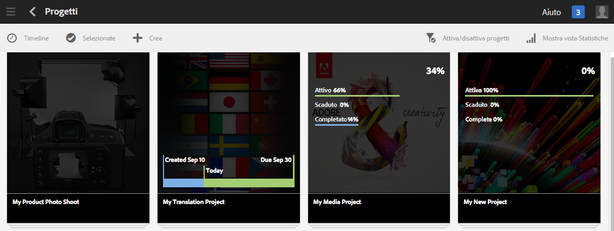

### Visualizzazione della timeline di un progetto {#viewing-a-project-timeline}

La timeline del progetto fornisce informazioni sull’ultimo utilizzo delle risorse del progetto. Per visualizzare la timeline di un progetto, tocca o fai clic su **Timeline**, quindi entra nella modalità di selezione e scegli il progetto. Le risorse vengono visualizzate nel riquadro a sinistra. Per tornare alla console **Progetti**, tocca o fai clic su **Timeline**.

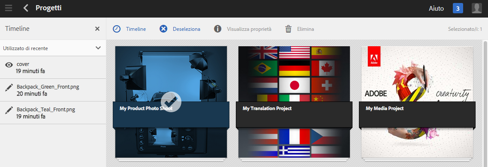

### Visualizzazione di progetti attivi e inattivi {#viewing-active-inactive-projects}

Per visualizzare i progetti attivi o inattivi, dalla console **Progetti** fai clic su **Mostra/nascondi progetti attivi**. Se accanto all’icona è presente un segno di spunta, vengono visualizzati i progetti attivi.

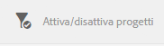

Se l’icona è affiancata da una x, stai visualizzando i progetti inattivi.

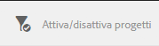

## Rendere i progetti inattivi o attivi {#making-projects-inactive-or-active}

Se hai completato un progetto ma desideri comunque mantenere le informazioni sul progetto, puoi renderlo inattivo.

Per rendere un progetto inattivo (o attivo):

1. In **Progetti** , apri il progetto e trova la **Informazioni sul progetto** piastrelle.

   >[!NOTE]
   Potrebbe essere necessario aggiungere questa porzione se non è già nel progetto. Vedi [Aggiunta di porzioni](#adding-items-to-a-tile).

1. Tocca o fai clic su **Modifica**.
1. Modifica il selettore passando da **Attivo** a **Inattivo** (o viceversa).

   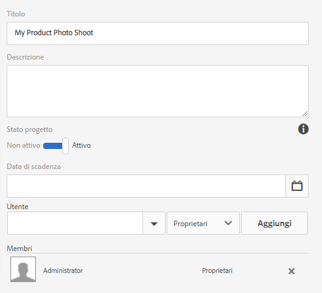

1. Tocca o fai clic su **Fine** per salvare le modifiche apportate.
