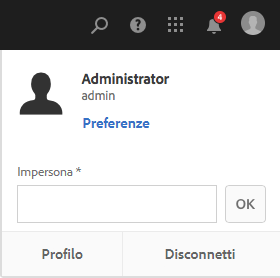
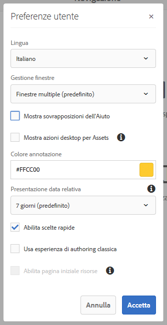

# Configurazione dell’ambiente dell’account{#configuring-your-account-environment}

Con AEM è possibile configurare il proprio account e alcuni aspetti dell’ambiente di authoring.

Using the [User](/help/sites-authoring/user-properties.md#user-settings) option in the [header](/help/sites-authoring/basic-handling.md#the-header) and the associated [My Preferences](#my-preferences) dialog, you can modify your user options.

## Impostazioni utente {#user-settings}

La finestra di dialogo **Impostazioni utente** consente di accedere alle seguenti funzioni:

* Impersona

   * La funzionalità [Impersona](/help/sites-administering/security.md#impersonating-another-user) permette a un utente di lavorare a nome di un altro utente.

* Profilo

   * Offre un collegamento semplice alle [impostazioni utente](/help/sites-administering/security.md).

* [Preferenze](/help/sites-authoring/user-properties.md#my-preferences)

   * Consente di specificare varie preferenze di impostazione specifiche dell’utente.

## Preferenze {#my-preferences}

Puoi accedere alla finestra di dialogo **Preferenze** tramite l’opzione [Utente](/help/sites-authoring/user-properties.md#user-settings) nell’intestazione.

Ogni utente può impostare autonomamente determinate proprietà.

* **Lingua**

   Consente di definire la lingua da usare nell’interfaccia utente dell’ambiente di authoring. Seleziona la lingua desiderata dall’elenco delle opzioni disponibili.

   Anche l’interfaccia classica utilizza questa configurazione.

* **Gestione finestre**

   Consente di definire il comportamento o l’apertura delle finestre. Potete selezionare:

   * **Finestre multiple** (predefinito)

      * Le pagine si apriranno in una nuova finestra.
   * **Finestra singola**

      * Le pagine si apriranno nella finestra corrente.

* **Mostra azioni desktop per Assets**

   Questa opzione richiede l’utilizzo dell’app desktop AEM.

* **Colore annotazione**

   Consente di definire il colore predefinito utilizzato per le annotazioni.

   * Fai clic sul blocco dei colori per aprire il selettore di campioni e selezionare un colore.
   * In alternativa, immetti nel campo il codice esadecimale del colore desiderato.

* **Presentazione data relativa**

   Per migliorare la leggibilità, AEM presenta le date degli ultimi sette giorni come date relative (ad esempio, tre giorni fa) e le date più lontane come date esatte (ad esempio, il 20 marzo 2017).

   Questa opzione definisce il modo in cui il sistema visualizza le date. Sono disponibili le seguenti opzioni:

   * **Mostra sempre data esatta**: viene sempre visualizzata la data esatta e non una data relativa.
   * **1 giorno**: viene visualizzata la data relativa per le date entro un giorno; in caso contrario viene visualizzata una data esatta.
   * **7 giorni (predefinito)**: viene visualizzata la data relativa per date entro sette giorni; in caso contrario viene visualizzata una data esatta.
   * **1 mese**: viene visualizzata la data relativa per le date entro un mese; in caso contrario viene visualizzata una data esatta.
   * **1 anno**: viene visualizzata la data relativa per le date entro un anno; in caso contrario viene visualizzata una data esatta.
   * **Mostra sempre data relativa**: non vengono mai visualizzate date esatte, ma solo date relative.

* **Abilita scelte rapide**

   AEM supporta una serie di scelte rapide da tastiera per ottimizzare l’authoring.

   * [Scelte rapide da tastiera per la modifica delle pagine](/help/sites-authoring/page-authoring-keyboard-shortcuts.md)
   * [Scelte rapide da tastiera per le console](/help/sites-authoring/keyboard-shortcuts.md)
   Questa opzione abilita le scelte rapide da tastiera. Queste sono abilitate per impostazione predefinita, ma possono essere disabilitate se, ad esempio, un utente presenta determinati requisiti di accessibilità.

* **Usa esperienza di authoring classica**

   Questa opzione consente di abilitare l’authoring delle pagine basato sull’[interfaccia classica](/help/sites-classic-ui-authoring/home.md). Per impostazione predefinita viene usata l’interfaccia utente standard.

* **Abilita pagina iniziale risorse**

   Questa opzione è disponibile solo se l’amministratore del sistema ha abilitato l’esperienza Home page di Assets per l’intera organizzazione.

