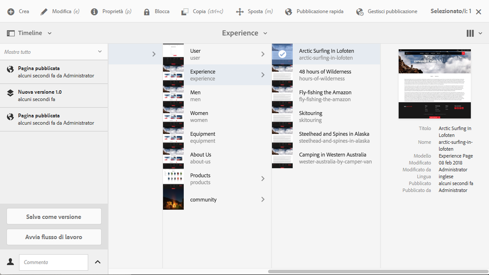
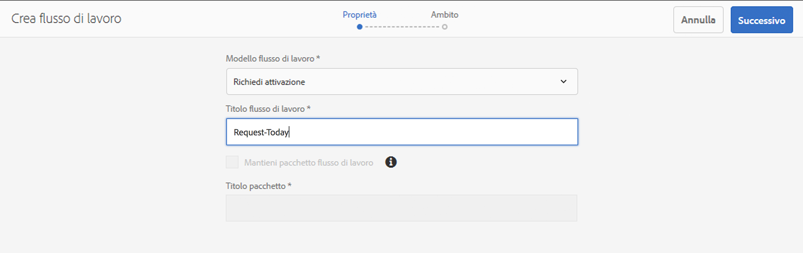
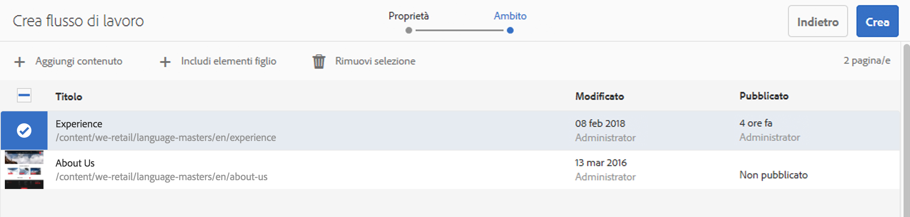
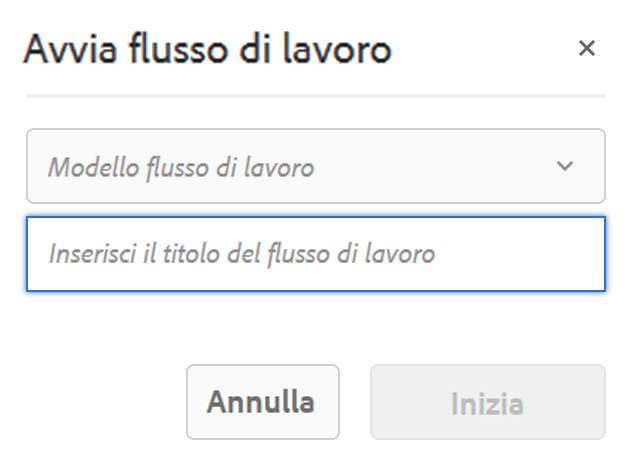

# Applicazione dei flussi di lavoro alle pagine{#applying-workflows-to-pages}

>[!CAUTION]
>
>AEM 6.4 ha raggiunto la fine del supporto esteso e questa documentazione non viene più aggiornata. Per maggiori dettagli, consulta la nostra [periodi di assistenza tecnica](https://helpx.adobe.com/it/support/programs/eol-matrix.html). Trova le versioni supportate [qui](https://experienceleague.adobe.com/docs/).

Durante l’authoring, è possibile ricorrere ai flussi di lavoro per intraprendere azioni sulle pagine; è inoltre possibile applicare più di un flusso di lavoro.

Quando applichi il flusso di lavoro, specifica le seguenti informazioni:

* Flusso di lavoro da applicare.

   Puoi utilizzare qualsiasi flusso di lavoro a cui hai accesso, secondo quanto assegnato dall’amministratore AEM.

* Facoltativamente, un titolo che aiuta a identificare l’istanza del flusso di lavoro nella casella in entrata di un utente.
* Il payload del flusso di lavoro; può essere una o più pagine.

I flussi di lavoro possono essere avviati da:

* la **[Sites](#starting-a-workflow-from-the-sites-console)** console.
* durante la modifica di una pagina, da **[Informazioni pagina](#starting-a-workflow-from-the-page-editor)**.

>[!NOTE]
>
>Consulta anche:
>
>* [Come applicare i flussi di lavoro alle risorse DAM](/help/assets/assets-workflow.md).
>* [Utilizzo dei flussi di lavoro per i progetti](/help/sites-authoring/projects-with-workflows.md).
>

>[!NOTE]
>
>AEM amministratori possono [avvia flussi di lavoro utilizzando diversi altri metodi](/help/sites-administering/workflows-starting.md).

## Avvio di un flusso di lavoro dalla console Sites {#starting-a-workflow-from-the-sites-console}

Puoi avviare un flusso di lavoro da:

* la **[Crea](#starting-a-workflow-from-the-sites-toolbar)** della barra degli strumenti Sites.
* la **[Timeline](#starting-a-workflow-from-the-timeline)** della console Sites .

In entrambi i casi è necessario:

* [Specificare i dettagli del flusso di lavoro nella Creazione guidata flusso di lavoro](#specifying-workflow-details-in-the-create-workflow-wizard).

### Avvio di un flusso di lavoro dalla barra degli strumenti Sites {#starting-a-workflow-from-the-sites-toolbar}

Puoi avviare un flusso di lavoro dalla barra degli strumenti della console **Sites**:

1. Vai alla pagina richiesta e selezionala.

1. Dall’opzione **Crea** nella barra degli strumenti è ora possibile selezionare **Flusso di lavoro**.

   

1. La **Crea flusso di lavoro** la procedura guidata ti aiuterà [specifica i dettagli del flusso di lavoro](#specifying-workflow-details-in-the-create-workflow-wizard).

### Avvio di un flusso di lavoro dalla timeline {#starting-a-workflow-from-the-timeline}

Da **Timeline** puoi avviare un flusso di lavoro da applicare alla risorsa selezionata.

1. [Seleziona la risorsa](/help/sites-authoring/basic-handling.md#viewing-and-selecting-resources) e apri [Timeline](/help/sites-authoring/basic-handling.md#timeline) (o apri Timeline, quindi seleziona la risorsa).
1. Puoi utilizzare la freccia dal campo commento per visualizzare **Avvia flusso di lavoro**:

   

1. La **Crea flusso di lavoro** la procedura guidata ti aiuterà [specifica i dettagli del flusso di lavoro](#specifying-workflow-details-in-the-create-workflow-wizard).

### Specifica dei dettagli del flusso di lavoro nella Creazione guidata flusso di lavoro {#specifying-workflow-details-in-the-create-workflow-wizard}

La **Crea flusso di lavoro** la procedura guidata consente di selezionare il flusso di lavoro e specificare i dettagli richiesti.

Dopo aver aperto la **Crea flusso di lavoro** procedura guidata da:

* la **[Crea](#starting-a-workflow-from-the-sites-toolbar)** della barra degli strumenti Sites.
* la **[Timeline](#starting-a-workflow-from-the-timeline)** della console Sites .

Puoi specificare i dettagli:

1. In **Proprietà** le opzioni di base del flusso di lavoro sono definite:

   * **Modello flusso di lavoro**
   * **Titolo flusso di lavoro**

      * Puoi specificare un titolo per questa istanza, in modo da identificarla in un secondo momento.

   A seconda del modello di flusso di lavoro, sono disponibili anche le seguenti opzioni. Questi consentono di mantenere il pacchetto creato come payload al termine del flusso di lavoro.

   * **Mantieni pacchetto flusso di lavoro**
   * **Titolo pacchetto**

      * Puoi specificare un titolo per il pacchetto, per facilitarne l’identificazione.
   >[!NOTE]
   >
   >L’opzione **Mantieni pacchetto flusso di lavoro** è disponibile quando il flusso di lavoro è stato configurato per Supporto risorse multiple e sono state selezionate più risorse.

   Una volta completato, premere su **Successivo** per continuare.

   

1. Al passaggio **Ambito** puoi selezionare:

   * **Aggiungi contenuto**, per aprire il [browser percorsi](/help/sites-authoring/author-environment-tools.md#path-browser) e selezionare altre risorse; una volta nel browser, tocca o fai clic su **Seleziona** per aggiungere contenuti all’istanza di flusso di lavoro.
   * Una risorsa esistente per visualizzare le seguenti azioni:

      * **Includi elementi figlio** per specificare gli elementi secondari di tale risorsa che verranno inclusi nel flusso di lavoro.

         Una finestra di dialogo si apre per permettere di perfezionare la selezione includendo:

         * Solo gli elementi figli di primo livello.
         * Solo pagine modificate.
         * Solo pagine già pubblicate.

         Tutti gli elementi secondari specificati vengono aggiunti all’elenco delle risorse a cui verrà applicato il flusso di lavoro.

      * **Rimuovi selezione** per rimuovere la risorsa dal flusso di lavoro.

   

   >[!NOTE]
   >
   >Se aggiungi ulteriori risorse, puoi selezionare **Indietro** per regolare l’impostazione di **Mantieni pacchetto flusso di lavoro** nel passaggio **Proprietà**.

1. Usa **Crea** per chiudere la procedura guidata e creare l’istanza di flusso di lavoro. Nella console Sites viene visualizzata una notifica.

## Avvio di un flusso di lavoro dall’Editor pagina {#starting-a-workflow-from-the-page-editor}

Durante la modifica di una pagina è possibile selezionare **Informazioni pagina** dalla barra degli strumenti. L’opzione del menu a discesa **Avvia nel flusso di lavoro**. Questa apre una finestra di dialogo nella quale puoi specificare il flusso di lavoro obbligatorio, insieme a un titolo richiesto:

