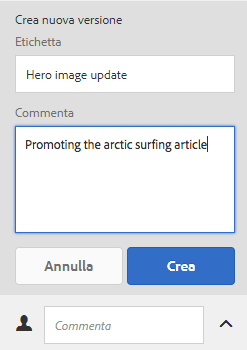
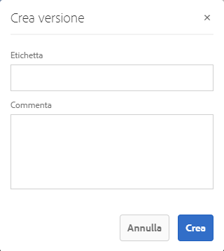
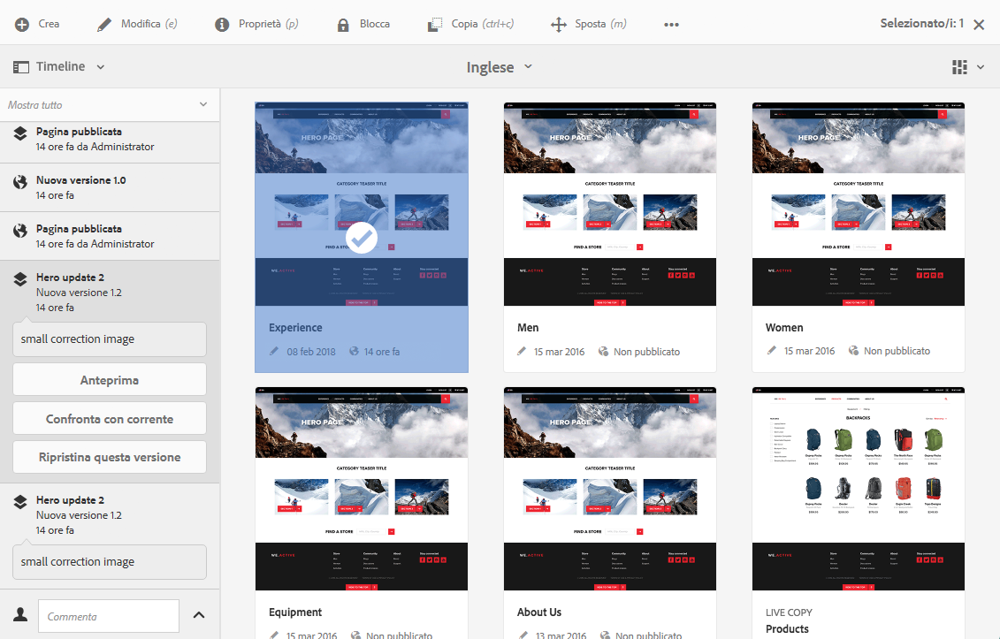
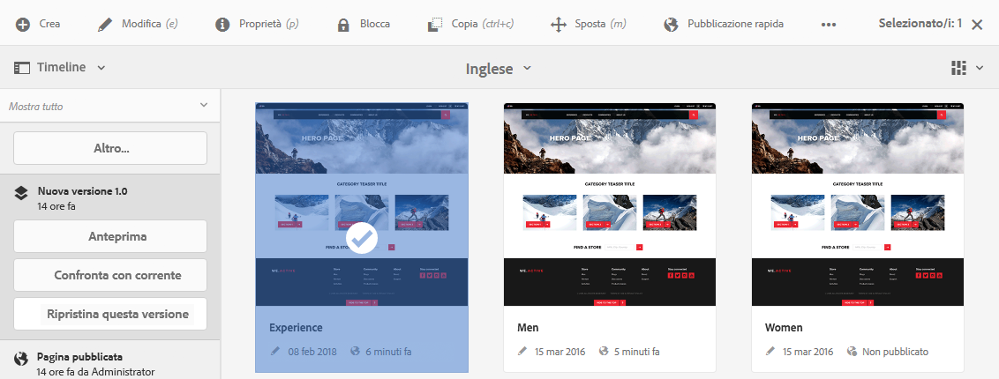
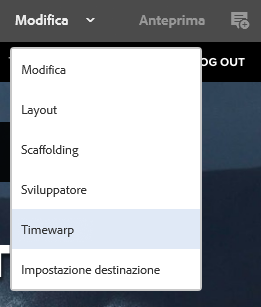
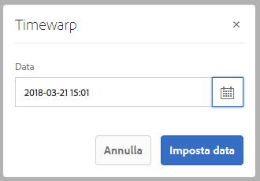
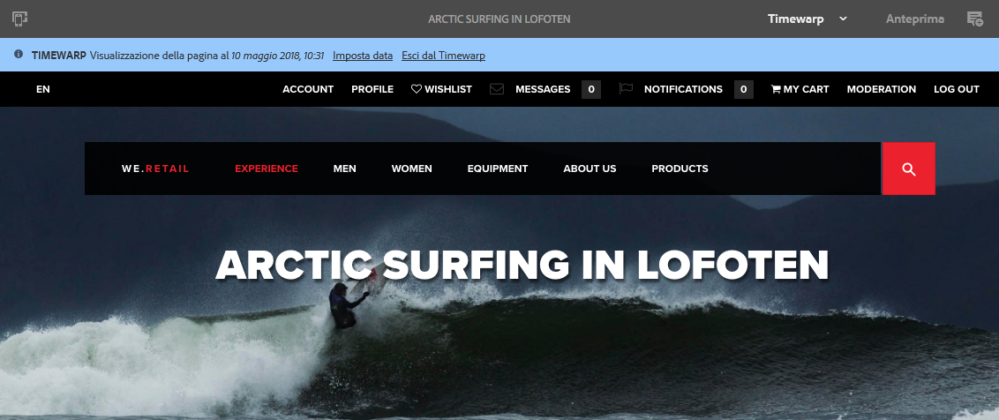

# Utilizzo delle versioni di una pagina  {#working-with-page-versions}

>[!CAUTION]
>
>AEM 6.4 ha raggiunto la fine del supporto esteso e questa documentazione non viene più aggiornata. Per maggiori dettagli, consulta la nostra [periodi di assistenza tecnica](https://helpx.adobe.com/it/support/programs/eol-matrix.html). Trova le versioni supportate [qui](https://experienceleague.adobe.com/docs/).

Il controllo delle versioni crea uno &quot;snapshot&quot; di una pagina in un momento specifico. Con il controllo delle versioni è possibile eseguire le seguenti operazioni:

* Crea una versione di una pagina.
* Ripristinare una versione precedente di una pagina per annullare, ad esempio, una modifica apportata a una pagina.
* Confronta la versione corrente di una pagina con una versione precedente con le differenze nel testo e nelle immagini evidenziate.

## Creazione di una nuova versione   {#creating-a-new-version}

Puoi creare una versione della risorsa da:

* la [Barra laterale Timeline](#creating-a-new-version-timeline)
* la [Crea](#creating-a-new-version-create-with-a-selected-resource) opzione (quando è selezionata una risorsa)

### Creazione di una nuova versione - Timeline {#creating-a-new-version-timeline}

1. Passa alla pagina per la quale desideri creare una versione.
1. Seleziona la pagina in [modalità di selezione](/help/sites-authoring/basic-handling.md#viewing-and-selecting-resources).
1. Apri **Timeline** colonna.
1. Tocca o fai clic sulla freccia accanto al campo del commento per visualizzare le opzioni:

   

1. Seleziona **Salva come versione**.
1. Inserisci un **Etichetta** e **Commento** se necessario.

   

1. Conferma la nuova versione selezionando **Crea**.

   Le informazioni nella timeline vengono aggiornate per indicare che si tratta di una nuova versione.

### Creazione di una nuova versione - Con una risorsa selezionata {#creating-a-new-version-create-with-a-selected-resource}

1. Passa alla pagina per la quale desideri creare una versione.
1. Seleziona la pagina in [modalità di selezione](/help/sites-authoring/basic-handling.md#viewing-and-selecting-resources).
1. Seleziona la **Crea** dalla barra degli strumenti.
1. Viene aperta una finestra di dialogo. Puoi immettere un’**etichetta** e un **commento**, se necessario:

   

1. Conferma la nuova versione selezionando **Crea**.

   Viene aperta la timeline con le informazioni aggiornate per indicare che si tratta di una nuova versione.

## Ripristino di una versione della pagina {#reverting-to-a-page-version}

Una volta creata una versione, puoi ripristinarla se necessario.

>[!NOTE]
>
>Durante il ripristino di una pagina, la versione creata farà parte di un nuovo ramo.
>
>Per maggiore chiarezza:
>
>* Crea versioni di qualsiasi pagina.
>* Le etichette iniziali e i nomi dei nodi di versione saranno 1.0, 1.1, 1.2 e così via.
>* Ripristinare la prima versione; ovvero 1.0.
>* Crea di nuovo nuove versioni.
>* Le etichette generate e i nomi dei nodi saranno ora 1.0.0, 1.0.1, 1.0.2, ecc.
>

Per ripristinare una versione precedente:

1. Passa alla pagina da ripristinare a una versione precedente.
1. Seleziona la pagina in [modalità di selezione](/help/sites-authoring/basic-handling.md#viewing-and-selecting-resources).
1. Apri la colonna **Timeline** e seleziona **Mostra tutti** o **Versioni**. Vengono elencate le versioni disponibili per la pagina selezionata.
1. Seleziona la versione da ripristinare. Verranno visualizzate le opzioni possibili:

   

1. Seleziona **Ripristina questa versione**. La versione selezionata viene ripristinata e le informazioni nella timeline vengono aggiornate.

## Anteprima di una versione   {#previewing-a-version}

Puoi visualizzare in anteprima una versione specifica:

1. Passa alla pagina da confrontare.
1. Seleziona la pagina in [modalità di selezione](/help/sites-authoring/basic-handling.md#viewing-and-selecting-resources).
1. Apri la colonna **Timeline** e seleziona **Mostra tutti** o **Versioni**.
1. Vengono elencate le versioni disponibili. Seleziona la versione da visualizzare in anteprima:

   

1. Seleziona **Anteprima**. La pagina verrà visualizzata in una nuova scheda.

   >[!CAUTION]
   >
   >Se una pagina è stata spostata, non è più possibile eseguire un’anteprima sulle versioni eseguite prima dello spostamento.
   >
   >Se riscontri dei problemi con un&#39;anteprima, controlla il [Timeline](/help/sites-authoring/basic-handling.md#timeline) per verificare se la pagina è stata spostata.

## Confronto di una versione con la pagina corrente {#comparing-a-version-with-current-page}

Per confrontare una versione precedente con la pagina corrente:

1. Passa alla pagina da confrontare.
1. Seleziona la pagina in [modalità di selezione](/help/sites-authoring/basic-handling.md#viewing-and-selecting-resources).
1. Apri la colonna **Timeline** e seleziona **Mostra tutti** o **Versioni**.
1. Vengono elencate le versioni disponibili. Seleziona la versione da confrontare:

   

1. Seleziona **Confronta con corrente**. La [differenze tra pagine](/help/sites-authoring/page-diff.md) apre e visualizza le differenze.

## Timewarp   {#timewarp}

Timewarp è una funzione progettata per simulare lo stato *di pubblicazione* di una pagina in specifici momenti nel passato.

Lo scopo è quello di consentire di tenere traccia del sito web pubblicato in un determinato momento. Questa funzione utilizza le versioni della pagina per determinare lo stato dell’ambiente di pubblicazione.

Per effettuare questo collegamento:

* Il sistema cerca la versione della pagina che era attiva al momento selezionato.
* In altre parole, la versione mostrata era stata creata/attivata *prima* del momento temporale selezionato in Timewarp.
* Quando si passa a una pagina che è stata eliminata, questa viene riprodotta purché nella directory archivio siano ancora disponibili le versioni precedenti della pagina.
* Se non viene individuata alcuna versione pubblicata, Timewarp ripristina lo stato corrente della pagina nell’ambiente di authoring, in modo da evitare un errore 404 di pagina non trovata, che impedirebbe la navigazione.

### Utilizzo di Timewarp {#using-timewarp}

Timewarp è un [modalità](/help/sites-authoring/author-environment-tools.md#page-modes) dell’editor di pagine. Per avviarlo, è sufficiente attivarlo come per qualsiasi altra modalità.

1. Avvia l’editor per la pagina in cui desideri avviare Timewarp, quindi seleziona **Timewarp** nella selezione della modalità.

   

1. Nella finestra di dialogo, imposta una data e un’ora di destinazione e tocca o fai clic su **Imposta data**. Se non si seleziona un’ora, per impostazione predefinita verrà utilizzata l’ora corrente.

   

1. La pagina viene visualizzata in base alla data impostata. La modalità Timewarp è indicata dalla barra di stato blu nella parte superiore della finestra. Utilizza i collegamenti nella barra di stato per selezionare una nuova data di destinazione o uscire dalla modalità Timewarp.

   

### Limitazioni di Timewarp

Timewarp semplifica al massimo la riproduzione di una pagina in un determinato momento. Tuttavia, a causa delle complessità dell’authoring continuo di contenuti in AEM, questo non è sempre possibile. Tieni presenti queste limitazioni quando utilizzi Timewarp.

* **Timewarp funziona in base alle pagine pubblicate**: Timewarp funziona correttamente solo se la pagina è stata già pubblicata. In caso contrario viene mostrata la pagina corrente nell’ambiente di authoring.
* **Timewarp utilizza le versioni di pagina**: se passi a una pagina che è stata rimossa o eliminata dall’archivio, questa verrà riprodotta correttamente se nell’archivio sono ancora disponibili versioni precedenti della pagina.
* **Le versioni rimosse influiscono su Timewarp**: se dalla directory archivio sono state rimosse delle versioni, Timewarp non può mostrare la visualizzazione corretta.
* **Timewarp è di sola lettura**: non è possibile modificare la versione precedente della pagina, ma solo visualizzarla. Se desideri ripristinare la versione precedente, devi farlo manualmente utilizzando la funzione di ripristino.
* **Timewarp si basa solo sul contenuto della pagina**: se sono stati modificati alcuni elementi (come codice, css, risorse/immagini ecc.) per il rendering del sito web, la visualizzazione sarà diversa da come era all’origine, poiché per tali elementi non vengono conservate precedenti versioni nell’archivio.

>[!CAUTION]
>
>Timewarp è uno strumento utile per aiutare gli autori a comprendere e creare i propri contenuti. Non deve essere utilizzato come registro di controllo o per fini legali.
