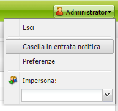
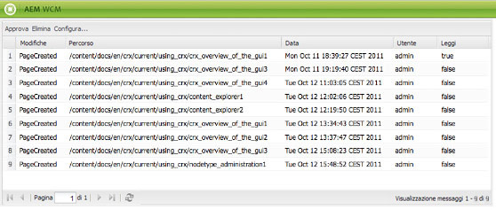
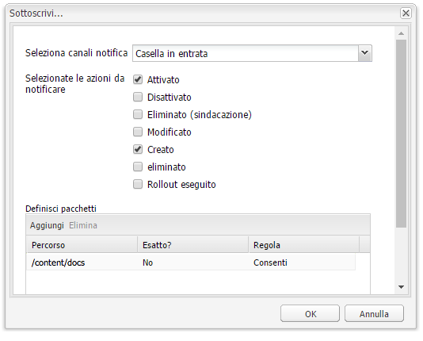
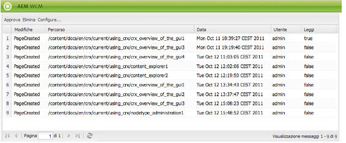

# Casella in entrata{#your-inbox}

>[!CAUTION]
>
>AEM 6.4 ha raggiunto la fine del supporto esteso e questa documentazione non viene più aggiornata. Per maggiori dettagli, consulta la nostra [periodi di assistenza tecnica](https://helpx.adobe.com/it/support/programs/eol-matrix.html). Trova le versioni supportate [qui](https://experienceleague.adobe.com/docs/).

È possibile ricevere notifiche da varie aree di AEM, ad esempio notifiche su elementi di lavoro o attività che rappresentano azioni da eseguire sul contenuto della pagina.

Queste notifiche vengono ricevute in due caselle in entrata, separate dal tipo di notifiche:

* Una casella in entrata in cui puoi visualizzare le notifiche ricevute in seguito a sottoscrizioni è descritta nella sezione seguente.
* Una casella in entrata specializzata per gli elementi del flusso di lavoro è descritta in [Partecipazione ai flussi di lavoro](/help/sites-classic-ui-authoring/classic-workflows-participating.md) documento.

## Visualizzazione delle notifiche {#viewing-your-notifications}

Per visualizzare le notifiche:

1. Apri la casella in entrata delle notifiche: in **Siti Web** console, fai clic sul pulsante dell’utente nell’angolo in alto a destra e seleziona **Casella in entrata notifica**.

   

   >[!NOTE]
   >
   >Puoi anche accedere alla console direttamente nel browser; ad esempio:
   >
   >` https://<host>:<port>/libs/wcm/core/content/inbox.html`

1. Le tue notifiche saranno elencate. Puoi eseguire le azioni necessarie:

   * [Iscrizione alle notifiche](#subscribing-to-notifications)
   * [Elaborazione delle notifiche](#processing-your-notifications)

   

## Iscrizione alle notifiche {#subscribing-to-notifications}

Per effettuare la sottoscrizione alle notifiche:

1. Apri la casella in entrata delle notifiche: in **Siti Web** console, fai clic sul pulsante dell’utente nell’angolo in alto a destra e seleziona **Casella in entrata notifica**.

   

   >[!NOTE]
   >
   >Puoi anche accedere alla console direttamente nel browser; ad esempio:
   >
   >`https://<host>:<port>/libs/wcm/core/content/inbox.html`

1. Fai clic su **Configura...** nell’angolo in alto a sinistra per aprire la finestra di dialogo di configurazione.

   

1. Seleziona il canale di notifica:

   * **Inbox**: le notifiche verranno visualizzate nella tua casella in entrata AEM.
   * **E-mail**: le notifiche vengono inviate all’indirizzo e-mail definito nel profilo utente.

   >[!NOTE]
   >
   >Per ricevere notifiche tramite e-mail è necessario configurare alcune impostazioni. È inoltre possibile personalizzare il modello e-mail o aggiungere un modello e-mail per una nuova lingua. Fai riferimento a [Configurazione della notifica e-mail](/help/sites-administering/notification.md#configuringemailnotification) per configurare le notifiche e-mail in AEM.

1. Seleziona le azioni della pagina per le quali ricevere la notifica:

   * Attivato: quando una pagina è stata attivata.
   * Disattivato: quando una pagina è stata disattivata.
   * Soppresso (sindacato): quando una pagina è stata eliminata replicata, ovvero quando un’azione di eliminazione eseguita su una pagina viene replicata.

      Quando una pagina viene eliminata o spostata, un’azione di eliminazione viene replicata automaticamente: la pagina viene eliminata nell’istanza sorgente in cui è stata eseguita l’azione di eliminazione e nell’istanza di destinazione definita dagli agenti di replica.

   * Modificato: quando una pagina è stata modificata.
   * Creato: quando è stata creata una pagina.
   * Eliminato: quando una pagina è stata eliminata tramite l’azione di eliminazione della pagina.
   * Rollout eseguito: quando è stato eseguito il rollout di una pagina.

1. Definisci i percorsi delle pagine per le quali riceverai una notifica:

   * Fai clic su **Aggiungi** per aggiungere una nuova riga alla tabella.
   * Fai clic sul pulsante **Percorso** e inserire il percorso, ad esempio `/content/docs`.
   * Per ricevere le notifiche per tutte le pagine appartenenti al sottoalbero, impostate **Esatto?** a **No**.

      Per ricevere le notifiche solo per la pagina definita dal percorso, imposta **Esatto?** a **Sì**.

   * Per consentire la regola, imposta **Regola** a **Consenti**. Se impostato su **Nega**, la regola viene negata ma non rimossa e può essere abilitata in seguito.

   Per rimuovere una definizione, seleziona la riga facendo clic su una cella della tabella e fai clic su **Elimina**.

1. Fai clic su **OK** per salvare la configurazione.

## Elaborazione delle notifiche {#processing-your-notifications}

Se hai scelto di ricevere le notifiche nella tua casella in entrata AEM, le notifiche vengono inserite nella tua casella in entrata. È possibile [visualizzare le notifiche](#viewing-your-notifications) quindi seleziona le notifiche richieste per:

* Approva facendo clic su **Approva**: il valore nel **Leggi** è impostato su **true**.

* Elimina facendo clic su **Elimina**.

