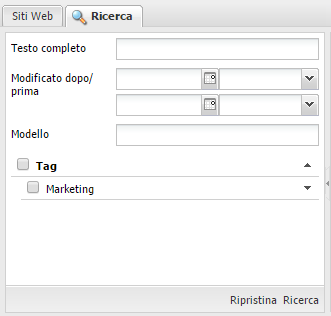
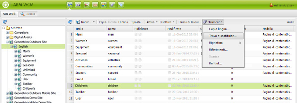
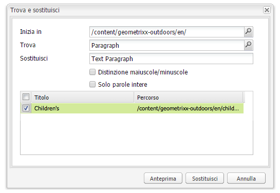

# Ricerca{#search-features}

L’ambiente di authoring di AEM offre vari metodi per la ricerca dei contenuti, a seconda del tipo di risorsa.

>[!NOTE]
>
>Fuori dall’ambiente di authoring sono disponibili anche altri strumenti di ricerca, come [Query Builder](/help/sites-developing/querybuilder-api.md) e [CRXDE Lite](/help/sites-developing/developing-with-crxde-lite.md).

## Informazioni di base sulla ricerca {#search-basics}

Per accedere al pannello di ricerca, fai clic sulla scheda **Cerca** nella parte superiore del pannello sinistro della console specifica.

Il pannello di ricerca consente di effettuare ricerche in tutte le pagine del sito Web. Contiene campi e widget per i seguenti elementi:

* **Testo completo**: consente di cercare il testo specificato.
* **Modificato prima/dopo**: consente di ricercare solo le pagine modificate tra due date specifiche.
* **Modello**: per cercare solo nelle pagine basate su uno specifico modello
* **Tag**: per cercare solo nelle pagine con uno specifico tag

>[!NOTE]
>
>Quando l’istanza è configurata per la ricerca [Lucene](/help/sites-deploying/queries-and-indexing.md), puoi utilizzare i seguenti elementi in **Testo completo**:
>
>* [Caratteri jolly](https://lucene.apache.org/core/5_3_1/queryparser/org/apache/lucene/queryparser/classic/package-summary.html#Wildcard_Searches)
>* [Operatori booleani](https://lucene.apache.org/core/5_3_1/queryparser/org/apache/lucene/queryparser/classic/package-summary.html#Boolean_operators)
   >
   >
* [Espressioni regolari](https://lucene.apache.org/core/5_3_1/queryparser/org/apache/lucene/queryparser/classic/package-summary.html#Regexp_Searches)
>* [Gruppi di campi](https://lucene.apache.org/core/5_3_1/queryparser/org/apache/lucene/queryparser/classic/package-summary.html#Field_Grouping)
>* [Incremento](https://lucene.apache.org/core/5_3_1/queryparser/org/apache/lucene/queryparser/classic/package-summary.html#Boosting_a_Term)
>

Per eseguire la ricerca, fai clic su **Cerca** nella parte inferiore del riquadro. Per azzerare i criteri di ricerca, fai clic su **Ripristina**.

## Filtro {#filter}

È possibile impostare un filtro (e cancellarlo) in varie aree, per visualizzare specifici elementi:

## Cerca e sostituisci {#find-and-replace}

Nella console **Siti web**, l’opzione di menu **Trova e sostituisci** consente di cercare e sostituire più istanze di una stringa in una sezione del sito web.

1. Seleziona la pagina o la cartella principale in cui desideri eseguire l’operazione di ricerca e sostituzione.
1. Seleziona **Strumenti**, quindi **Trova e sostituisci:**:

   

1. Nella finestra di dialogo **Trova e sostituisci** è possibile:

   * Verificare il percorso radice in cui viene avviata l’operazione
   * Definire il termine da trovare
   * Definire il termine sostitutivo
   * Specificare se nella ricerca è necessario distinguere tra maiuscole e minuscole
   * Specificare se cercare solo parole intere (in caso contrario vengono trovate anche le sottostringhe)
   Clicking **Preview** lists where the term has been found. You can select/clear specific instances to be replaced:

   

1. Fai clic su **Sostituisci** per sostituire effettivamente tutte le istanze. Viene richiesto di confermare l’operazione.

L’ambito predefinito del servlet di ricerca e sostituzione include le seguenti proprietà:

* `jcr:title`
* `jcr:description`
* `jcr:text`
* `text`

The scope can be changed using the Apache Felix Web Management Console (for example, at `http://localhost:4502/system/console/configMgr`). Select `CQ WCM Find Replace Servlet (com.day.cq.wcm.core.impl.servlets.FindReplaceServlet)` and configure the scope as required.

>[!NOTE]
>
>In un’installazione standard di AEM, per il comando Trova e sostituisci viene utilizzata la funzionalità di ricerca Lucene.
>
>La funzionalità Lucene indicizza le proprietà delle stringhe con lunghezza fino a 16 KB. Per le stringhe di lunghezza superiore a tale valore la ricerca non viene eseguita.

