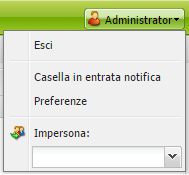
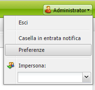
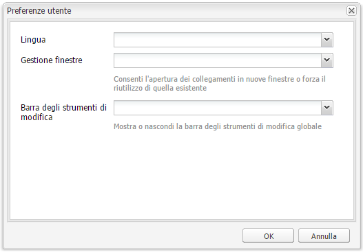

# Configurazione dell’ambiente dell’account{#configuring-your-account-environment}

Con AEM è possibile configurare il proprio account e alcuni aspetti dell’ambiente di authoring.

Le [impostazioni dell’account](#account-settings) e le [preferenze utente](#user-preferences) consentono di definire le opzioni e le preferenze elencate di seguito:

* **Barra degli strumenti di modifica** Consente di specificare se visualizzare o meno la barra degli strumenti di modifica globale. Questa barra degli strumenti, visualizzata nella parte superiore della finestra del browser, fornisce 
**I pulsanti Copia**, **Taglia**, **Incolla** ed **Elimina** possono essere utilizzati con i componenti paragrafo della pagina:

   * Mostra se necessario (predefinito)
   * Mostra sempre
   * Mantieni nascosto

* **Impersona** La funzionalità [Impersona](/help/sites-administering/security.md#impersonating-another-user) permette a un utente di lavorare a nome di un altro utente.

* **Lingua** Lingua da usare nell’interfaccia dell’ambiente Authoring. Selezionate la lingua desiderata dall’elenco delle lingue disponibili.

* **Gestione finestre** Seleziona una delle seguenti opzioni:

   * Finestre multiple (predefinito): Le pagine verranno aperte in una nuova finestra.
   * Finestra singola: Le pagine verranno aperte nella finestra corrente.

## Impostazioni account {#account-settings}

L’icona dell’utente permette di accedere a varie opzioni, tra cui:

* Disconnetti
* [Impersona](/help/sites-administering/security.md#impersonating-another-user)
* [Preferenze utente](#user-preferences)
* [Casella in entrata notifica](/help/sites-classic-ui-authoring/author-env-inbox.md)

## Preferenze utente {#user-preferences}

Ogni utente può impostare alcune proprietà personali tramite la finestra di dialogo **Preferenze** accessibile dall’angolo in alto a destra delle console.

Nella finestra di dialogo sono disponibili le seguenti opzioni:

