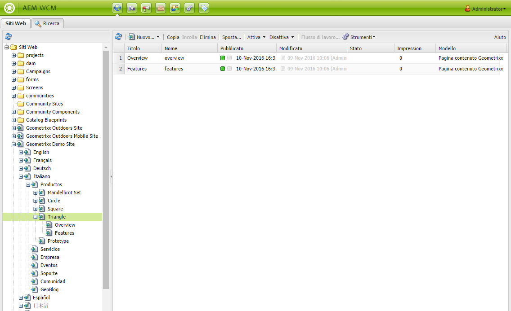

# Utilizzo dell’ambiente Authoring{#working-with-the-author-environment}

>[!CAUTION]
>
>AEM 6.4 ha raggiunto la fine del supporto esteso e questa documentazione non viene più aggiornata. Per maggiori dettagli, consulta la nostra [periodi di assistenza tecnica](https://helpx.adobe.com/it/support/programs/eol-matrix.html). Trova le versioni supportate [qui](https://experienceleague.adobe.com/docs/).

>[!NOTE]
>
>La documentazione seguente si concentra sull’interfaccia classica. Per informazioni sull’authoring nell’interfaccia touch moderna, consulta la sezione [documentazione standard sull’authoring](/help/assets/assets.md).

L’ambiente di authoring consente di eseguire attività correlate a:

* [Authoring](/help/sites-authoring/author.md) (tra cui [authoring delle pagine](/help/sites-authoring/qg-page-authoring.md) e [gestione delle risorse](/help/assets/assets.md))

* [Amministrazione](/help/sites-administering/administer-best-practices.md) attività necessarie per generare e mantenere i contenuti del sito web

Sono disponibili due interfacce grafiche, accessibili da qualsiasi browser moderno:

1. Interfaccia classica

   * Questa interfaccia utente è sempre disponibile in AEM da molti anni.
   * È prevalentemente verde.
   * È stato progettato per l&#39;uso su dispositivi desktop.
   * Non viene più mantenuto.
   * La documentazione seguente si concentra su questa interfaccia classica. Per informazioni sull’authoring nella moderna interfaccia utente touch, consulta la sezione [documentazione standard sull’authoring](/help/sites-authoring/author.md).
   

1. Interfaccia touch

   * Questa è l’interfaccia AEM moderna e standard.
   * È prevalentemente di colore grigio, con interfaccia pulita e piatta.
   * È progettato per l&#39;uso su dispositivi touch e desktop (ottimizzato per touch). L&#39;aspetto e la sensazione sono gli stessi su tutti i dispositivi, tuttavia [visualizzazione e selezione delle risorse](/help/sites-authoring/basic-handling.md) sono leggermente diverse (tocco o clic).
   * Consulta la sezione [documentazione standard sull’authoring](/help/sites-authoring/author.md) per ulteriori informazioni su come creare utilizzando l’interfaccia utente touch. La documentazione seguente si concentra sull’interfaccia classica.

   * Desktop:
   

   * Dispositivi tablet (o desktop con larghezza inferiore a 1024 pixel):
   
