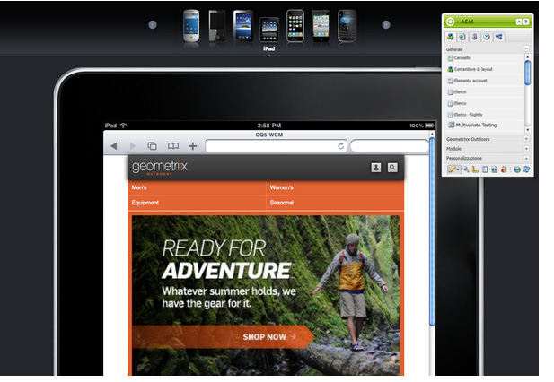

# Authoring di una pagina per dispositivi mobili{#authoring-a-page-for-mobile-devices}

>[!CAUTION]
>
>AEM 6.4 ha raggiunto la fine del supporto esteso e questa documentazione non viene più aggiornata. Per maggiori dettagli, consulta la nostra [periodi di assistenza tecnica](https://helpx.adobe.com/it/support/programs/eol-matrix.html). Trova le versioni supportate [qui](https://experienceleague.adobe.com/docs/).

Quando crei una pagina mobile, questa viene visualizzata in modo da simulare il dispositivo mobile. Durante l’authoring della pagina, puoi passare da un emulatore all’altro per vedere cosa vedrà l’utente finale quando accede alla pagina.

I dispositivi sono raggruppati nelle categorie feature, smart e touch in base alle capacità dei dispositivi di rendering di una pagina. Quando l’utente accede a una pagina mobile, AEM rileva il dispositivo e invia la rappresentazione corrispondente al gruppo di dispositivi.

>[!NOTE]
>
>Per creare un sito mobile basato su un sito standard esistente, crea una Live Copy del sito standard. (Vedi [Creazione di una Live Copy per canali diversi](/help/sites-administering/msm-livecopy.md).)
>
>Gli sviluppatori AEM possono creare nuovi gruppi di dispositivi. (Vedi [Creazione di filtri per i gruppi di dispositivi.](/help/sites-developing/groupfilters.md))

Segui la procedura seguente per creare una pagina mobile:

1. Nel browser, vai alla pagina **Siteadmin** console.
1. Apri **Prodotti** pagina sottostante **Siti Web** >> **Sito Demo Di Geometrixx Mobile** >> **Inglese**.

1. Passa a un emulatore diverso. A questo scopo, puoi effettuare le seguenti operazioni:

   * Fai clic sull’icona del dispositivo nella parte superiore della pagina.
   * Fai clic sul pulsante **Modifica** nel **Barra laterale** e seleziona il dispositivo nel menu a discesa.

1. Trascina e rilascia la **Testo e immagine** Dalla scheda Mobile della barra laterale alla pagina.
1. Modifica il componente e aggiungi del testo. Fai clic su **OK** per salvare le modifiche.

La pagina si presenta come segue:

>[!NOTE]
>
>Gli emulatori vengono disattivati quando una pagina nell’istanza di authoring viene richiesta da un dispositivo mobile. L’authoring può quindi essere eseguito utilizzando l’interfaccia touch.
