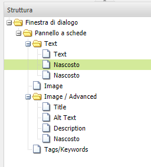
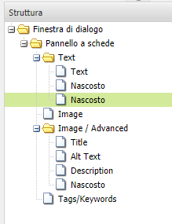
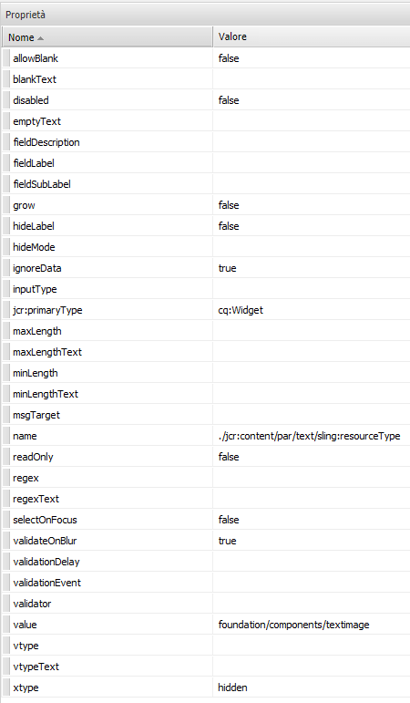
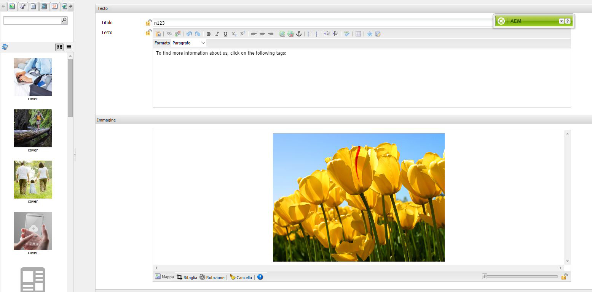

# Scaffolding{#scaffolding}

>[!CAUTION]
>
>AEM 6.4 ha raggiunto la fine del supporto esteso e questa documentazione non viene più aggiornata. Per maggiori dettagli, consulta la nostra [periodi di assistenza tecnica](https://helpx.adobe.com/it/support/programs/eol-matrix.html). Trova le versioni supportate [qui](https://experienceleague.adobe.com/docs/).

A volte può essere necessario creare un insieme di pagine di grandi dimensioni con la stessa struttura e contenuti diversi. Tramite l’interfaccia AEM standard, dovrai creare ogni pagina, trascinare i componenti appropriati sulla pagina e completarli singolarmente.

Con la pagina di scaffolding è possibile creare un modulo (scaffolding) con campi che riflettono la struttura desiderata per le pagine e quindi utilizzare il modulo per creare facilmente pagine basate su questa struttura.

>[!NOTE]
>
>Scaffolding (nell’interfaccia classica) [rispetta l’ereditarietà MSM](#scaffolding-with-msm-inheritance).

## Come funziona lo scaffolding {#how-scaffolding-works}

Le pagine di scaffolding sono memorizzate in **Strumenti** console dell’amministratore del sito.

* Apri **Strumenti** console e fai clic su **Scaffolding pagina predefinito**.

* Sotto questo clic **geometrixx**.
* Sotto **geometrixx** troverai un *pagina di scaffolding* chiamato **News**. Fare doppio clic per aprire la pagina.

La pagina di scaffolding è costituita da un modulo con un campo per ogni elemento di contenuto che forma la pagina da creare, oltre a quattro parametri importanti a cui è possibile accedere tramite il pulsante **Proprietà pagina** della pagina di scaffolding.

Le proprietà della pagina di scaffolding sono:

* **Testo titolo**: Questo è il nome della pagina di scaffolding stessa. In questo esempio si chiama &quot;News&quot;.
* **Descrizione**: Viene visualizzato sotto il titolo della pagina di scaffolding.
* **Modello di Target**: Questo è il modello che verrà utilizzato dalla pagina di scaffolding per creare una nuova pagina. In questo esempio è *Pagina Contenuto Geometrixx* modello.

* **Percorso di Target**: Percorso della pagina padre in cui verranno create le nuove pagine dalla pagina di scaffolding. In questo esempio il percorso è */content/geometrixx/en/news*.

Il corpo della pagina di scaffolding è il modulo. Quando un utente desidera creare una pagina utilizzando la pagina di scaffolding, compila il modulo e fa clic su *Crea*, in basso. In **News** l’esempio sopra il modulo contiene i campi seguenti:

* **Titolo**: Questo è il nome della pagina da creare. Questo campo è sempre presente su ogni scaffolding.
* **Testo**: Questo campo corrisponde a un componente di testo nella pagina risultante.
* **Immagine**: Questo campo corrisponde a un componente immagine nella pagina risultante.
* **Immagine/Avanzato**: **Titolo**: Titolo dell’immagine.

* **Immagine/Avanzato**: **Testo Alt**: Testo alt per l’immagine.

* **Immagine/Avanzato**: **Descrizione**: Descrizione dell’immagine.

* **Immagine/Avanzato**: **Dimensione**: Dimensione dell&#39;immagine.

* **Tag/Parole chiave**: Metadati da assegnare alla pagina. Questo campo è sempre presente su ogni scaffolding.

## Creazione di una pagina di scaffolding {#creating-a-scaffold}

Per creare una nuova pagina di scaffolding, vai alla sezione **Strumenti** console, quindi **Scaffolding pagina predefinito** e crea una nuova pagina. Sarà disponibile un singolo tipo di modello di pagina, il *Modello per scaffolding.*

*Vai a **Proprietà pagina**della nuova pagina e imposta il* Testo titolo *,* Descrizione *,* Modello di Target *e* Percorso di Target *, come descritto in precedenza.*

*Successivamente, è necessario definire la struttura della pagina che verrà creata dalla pagina di scaffolding. A questo scopo, passa alla modalità di progettazione nella pagina di scaffolding. Viene visualizzato un collegamento che consente di modificare la pagina di scaffolding nel **editor di dialogo**.

Con l’editor basato su finestra di dialogo è possibile specificare le proprietà che verranno create ogni volta che si crea una nuova pagina utilizzando questa pagina di scaffolding.

La definizione della finestra di dialogo per una pagina di scaffolding funziona in modo simile a quella di un componente (vedi [Componenti](/help/sites-developing/components.md)). Esistono tuttavia alcune importanti differenze:

* Le definizioni delle finestre di dialogo dei componenti vengono visualizzate come normali finestre di dialogo (ad esempio nel riquadro centrale dell’editor basato su finestra di dialogo), mentre le definizioni delle finestre di dialogo delle pagine di scaffolding, sebbene siano visualizzate come normali finestre di dialogo nell’editor basato su finestra di dialogo, vengono visualizzate nella pagina di scaffolding come un modulo di scaffolding (come mostrato nella **News** scaffolding (sopra).
* Le finestre di dialogo dei componenti contengono solo i campi per i valori necessari per definire il contenuto di un singolo componente specifico. Una finestra di dialogo di scaffolding deve fornire campi per ogni proprietà in ogni paragrafo della pagina da creare.
* Nel caso delle finestre di dialogo dei componenti, il componente utilizzato per eseguire il rendering del contenuto specificato è implicito e quindi il `sling:resourceType` La proprietà del paragrafo viene compilata automaticamente alla creazione del paragrafo. Con una pagina di scaffolding, tutte le informazioni che definiscono sia il contenuto che il componente assegnato per un determinato paragrafo devono essere fornite dalla finestra di dialogo stessa. Nelle finestre di dialogo delle pagine di scaffolding queste informazioni devono essere fornite utilizzando *Nascosto* per inviare queste informazioni durante la creazione della pagina.

Guarda l&#39;esempio **News** la finestra di dialogo di scaffolding nell’editor basato su finestra di dialogo consente di spiegare come funziona. Passa alla modalità progettazione nella pagina di scaffolding e fai clic sul collegamento dell’editor basato su finestra di dialogo.

Ora fai clic sul campo della finestra di dialogo **Finestra di dialogo > Pannello a schede > Testo > Testo**, come riportato di seguito:

L’elenco delle proprietà per questo campo verrà visualizzato sul lato destro dell’editor basato su finestra di dialogo, come riportato di seguito:

Osserva la proprietà name del campo. Ha il valore

./jcr:content/par/text/text

Questo è il nome della proprietà in cui verrà scritto il contenuto del campo quando la pagina di scaffolding verrà utilizzata per creare una pagina. La proprietà viene indicata come percorso relativo dal nodo che rappresenta la pagina da creare. Specifica la proprietà text, sotto il nodo text, che si trova sotto il nodo par, che a sua volta è un figlio del nodo jcr:content sotto il nodo della pagina.

Definisce la posizione di archiviazione del contenuto per il testo che verrà inserito in questo campo. Tuttavia, dobbiamo anche specificare altre due caratteristiche per questo contenuto:

* Il fatto che la stringa memorizzata qui deve essere interpretata come *rich text* e
* quale componente deve essere utilizzato per eseguire il rendering di questo contenuto nella pagina risultante.

Nota che in una finestra di dialogo di componente normale non è necessario specificare queste informazioni perché sono implicite nel fatto che la finestra di dialogo è già associata a un componente specifico.

Per specificare queste due informazioni si utilizzano campi nascosti. Fai clic sul primo campo nascosto **Finestra di dialogo > Pannello a schede > Testo > Nascosto**, come riportato di seguito:

Le proprietà di questo campo nascosto sono le seguenti:

La proprietà name di questo campo nascosto è

`./jcr:content/par/text/textIsRich`

Si tratta di una proprietà booleana utilizzata per interpretare la stringa di testo memorizzata in `./jcr:content/par/text/text.`

Poiché sappiamo che il testo deve essere interpretato come testo RTF, specifichiamo il `value` proprietà del campo come `true`.

>[!CAUTION]
>
>L’editor basato su finestra di dialogo consente all’utente di modificare i valori di *esistente* nella definizione della finestra di dialogo. Per aggiungere una nuova proprietà, è necessario utilizzare [CRXDE Lite](/help/sites-developing/developing-with-crxde-lite.md). Ad esempio, quando un nuovo campo nascosto viene aggiunto a una definizione di finestra di dialogo con l’editor basato su finestra di dialogo, non dispone di un *value* (ovvero una proprietà denominata &quot;value&quot;). Se il campo nascosto in questione richiede un valore predefinito *value* da impostare allora questa proprietà deve essere aggiunta manualmente con uno degli strumenti CRX. Impossibile aggiungere il valore con l’editor basato su finestra di dialogo. Tuttavia, una volta che la proprietà è presente, è possibile modificarne il valore con l’editor basato su finestra di dialogo.

Il secondo campo nascosto può essere visualizzato facendo clic su di esso in questo modo:

Le proprietà di questo campo nascosto sono le seguenti:

La proprietà name di questo campo nascosto è

`./jcr:content/par/text/sling:resourceType`

e il valore fisso specificato per questa proprietà è

`foundation/components/textimage`

&quot;Questo specifica che il componente da utilizzare per il rendering del contenuto di testo di questo paragrafo è il *Immagine testo* componente. Utilizzo con `isRichText` Valore booleano specificato nell’altro campo nascosto, il componente può eseguire il rendering della stringa di testo effettiva memorizzata in `./jcr:content/par/text/text` nel modo desiderato.

## Scaffolding con ereditarietà MSM {#scaffolding-with-msm-inheritance}

Nell’interfaccia classica, lo scaffolding è completamente integrato con l’ereditarietà MSM (se applicabile).

Quando si apre una pagina in **Scaffolding** (utilizzando l’icona nella parte inferiore della barra laterale) tutti i componenti soggetti a ereditarietà saranno indicati da:

* un simbolo di blocco (per la maggior parte dei componenti; (ad esempio Testo e Titolo)
* una maschera con il testo **Fare clic per annullare l’ereditarietà** (per i componenti Immagine)

Questi mostrano che il componente non può essere modificato finché l’ereditarietà non viene annullata.

>[!NOTE]
>
>È paragonabile a [componenti ereditati durante la modifica del contenuto della pagina](/help/sites-authoring/editing-content.md#inheritedcomponentsclassicui).

Facendo clic sul simbolo del lucchetto o sull’icona dell’immagine è possibile interrompere l’ereditarietà:

* il simbolo si trasforma in lucchetto aperto.
* una volta sbloccato, puoi modificare il contenuto.

Dopo lo sblocco è possibile ripristinare l’ereditarietà facendo clic sul simbolo del lucchetto sbloccato - le modifiche apportate andranno perse.

>[!NOTE]
>
>Se l’ereditarietà viene annullata a livello di pagina (dalla scheda Livecopy di Proprietà pagina), tutti i componenti saranno modificabili in **Scaffolding** (verranno visualizzati in stato sbloccato).
