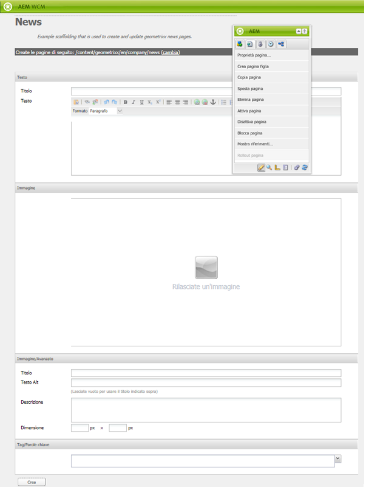
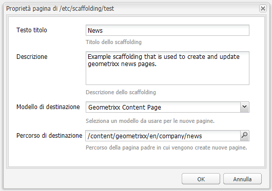
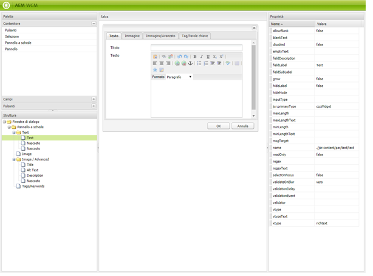
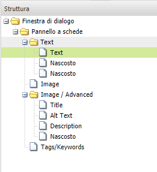
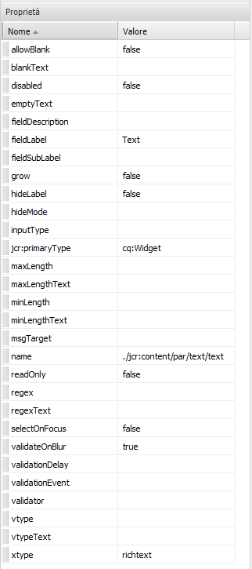
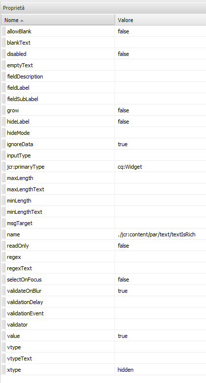
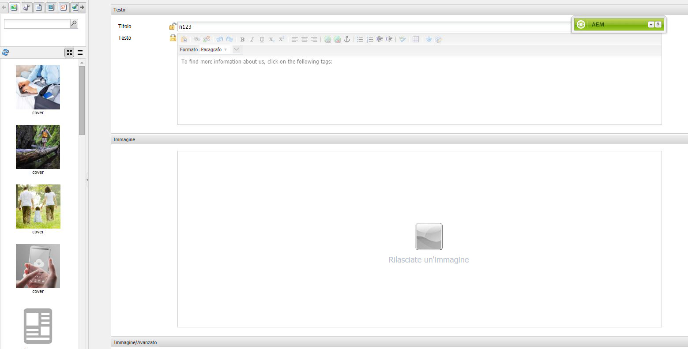

# Scaffolding{#scaffolding}

In alcuni casi può essere necessario creare un insieme di più pagine con la stessa struttura e contenuti diversi. Tramite l’interfaccia standard di AEM sarebbe necessario creare ogni singola pagina, trascinarvi i componenti appropriati e completarli uno a uno.

Con la funzione di scaffolding è invece possibile creare un modulo (scaffolding significa letteralmente impalcatura) con i campi necessari per creare la struttura desiderata per le pagine e quindi utilizzare il modulo per creare agevolmente pagine basate su tale struttura.

>[!NOTE]
>
>Lo Scaffolding (nell’interfaccia classica) [rispetta l’ereditarietà MSM](#scaffolding-with-msm-inheritance).

## Utilizzo dello scaffolding {#how-scaffolding-works}

Scaffolds are stored in the **Tools** console of the site admin.

* Apri la console **Strumenti** e fai clic su **Scaffolding pagine predefinito**.

* Quindi fai clic su **geometrixx**.
* In **geometrixx** è disponibile una *pagina di scaffolding* denominata **News**. Fai doppio clic sulla pagina per aprirla.

The scaffold consists of a form with a field for each piece of content that will make up the page to be created and four important parameters which are accessed through the **Page Properties** of the scaffold page.

Le proprietà della pagina di scaffolding sono:

* **Testo titolo**: nome della pagina di scaffolding stessa. In questo esempio è denominata “News”.
* **Descrizione**: visualizzata sotto il titolo della pagina di scaffolding.
* **Modello di destinazione**: modello che verrà utilizzato dalla pagina di scaffolding per creare una nuova pagina. In questo esempio il modello è *Pagina contenuto Geometrixx*.

* **Percorso di destinazione**: percorso della pagina padre in cui la pagina di scaffolding dovrà creare le nuove pagine. In this example the path is */content/geometrixx/en/news*.

Il corpo della pagina di scaffolding è costituito dal modulo. Se un utente desidera creare una pagina tramite la pagina di scaffolding, deve compilare il modulo e fare clic su *Crea* in basso. Il modulo **News** dell’esempio precedente include i campi seguenti:

* **Titolo**: nome della pagina da creare. Questo campo è presente in tutte le pagine di scaffolding.
* **Testo**: questo campo corrisponde a un componente di testo nella pagina risultante.
* **Immagine**: Questo campo corrisponde a un componente Immagine nella pagina risultante.
* **Immagine/Avanzato** - **Titolo**: titolo dell’immagine.

* **Immagine/Avanzato** - **Testo Alt**: testo alternativo dell’immagine.

* **Immagine/Avanzato**: **Descrizione**: Descrizione dell’immagine.

* **Immagine/Avanzato**: **Dimensione**: dimensione dell’immagine.

* **Tag/Parole chiave**: metadati da assegnare alla pagina. Questo campo è presente in tutte le pagine di scaffolding.

## Creazione di uno scaffolding {#creating-a-scaffold}

To create a new scaffold go to the **Tools** console, then **Default Page Scaffolding** and create a new page. A single page template type will be available, the *Scaffolding Template.*

*Passate alle proprietà&#x200B;**di**pagina della nuova pagina e impostate Testo**titolo,* Descrizione *, Modello**di destinazione e Percorso**destinazione, come descritto sopra.*

*Occorre quindi definire la struttura della pagina che verrà creata dalla pagina di scaffolding. A questo scopo, passate alla modalità di progettazione nella pagina di scaffolding. Viene visualizzato un collegamento che consente di modificare la pagina di scaffolding nell’**editor basato su finestra di dialogo**.

Utilizzando l’editor basato su finestra di dialogo potete specificare le proprietà che verranno create ogni volta che viene creata una nuova pagina tramite questa pagina di scaffolding.

La definizione della finestra di dialogo per una pagina di scaffolding funziona in modo simile a quella di un componente (vedi [Componenti](/help/sites-developing/components.md)). Esistono tuttavia alcune importanti differenze:

* Le definizioni delle finestre di dialogo dei componenti sono rappresentate da normali finestre di dialogo (come mostrato nel riquadro centrale dell’editor basato su finestra di dialogo, ad esempio). Le definizioni delle finestre di dialogo delle pagine di scaffolding sono invece rappresentate come moduli nella pagina di scaffolding, anche se appaiono come normali finestre di dialogo nell’editor basato su finestra di dialogo (come mostrato nella pagina di scaffolding **News** qui sopra).
* Le finestre di dialogo dei componenti contengono solo i campi corrispondenti ai valori necessari per definire il contenuto di un particolare componente . Le finestre di dialogo delle pagine di scaffolding devono includere campi per tutte le proprietà di ogni paragrafo della pagina da creare.
* Nel caso delle finestre di dialogo dei componenti, il componente utilizzato per rappresentare il contenuto specificato è implicito, pertanto la proprietà del paragrafo `sling:resourceType` viene compilata automaticamente alla creazione del paragrafo. Per una pagina di scaffolding, la finestra di dialogo stessa deve includere tutte le informazioni che definiscono sia il contenuto che il componente assegnato per un determinato paragrafo. Nelle finestre di dialogo delle pagine di scaffolding tali informazioni devono essere fornite utilizzando campi *nascosti*, in modo da inviare le informazioni al momento della creazione della pagina.

Per comprendere il funzionamento, è possibile osservare la finestra di dialogo della pagina di scaffolding **News** nell’esempio nell’editor basato su finestra di dialogo. Apri la pagina di scaffolding in modalità progettazione e fai clic sul collegamento per l’editor basato su finestra di dialogo.

Now, click on the dialog field **Dialog > Tab Panel > Text > Text**, like this:

Sul lato destro dell’editor basato su finestra di dialogo viene visualizzato l’elenco delle proprietà del campo:

Osserva la proprietà nome per questo campo, con valore

 &quot;merge_preserve&quot;./jcr:content/par/text/text

Questo è il nome della proprietà in cui verrà scritto il contenuto del campo quando la pagina di scaffolding verrà utilizzata per creare una pagina. La proprietà è definita come percorso relativo rispetto al nodo che rappresenta la pagina da creare. Specifica la proprietà text, sotto il nodo text, che si trova sotto il nodo par, che a sua volta è un nodo figlio del nodo jcr:content sotto il nodo della pagina.

Tale valore definisce il percorso di memorizzazione del contenuto per il testo che dovrà essere inserito in questo campo. È tuttavia necessario specificare altre due caratteristiche per il contenuto, ovvero:

* Il fatto che la stringa memorizzata in tale percorso deve essere interpretata come *testo RTF* e
* il componente da utilizzare per rappresentare il contenuto nella pagina risultante.

Nella finestra di dialogo di un componente normale, non sarebbe necessario specificare tali informazioni perché sono implicite, essendo la finestra di dialogo già associata a un componente specifico.

Per specificare queste due informazioni si utilizzano i campi nascosti. Click on the first hidden field **Dialog > Tab Panel > Text > Hidden**, like this:

Le proprietà di questo campo nascosto sono le seguenti:

La proprietà nome del campo nascosto è

`./jcr:content/par/text/textIsRich`

This is a boolean property used to interpret the text string stored at `./jcr:content/par/text/text.`

Because we know that the text should be interpreted as a rich text we specify the `value` property of this field as `true`.

>[!CAUTION]
>
>The dialog editor allows the user to change the values of *existing* properties in the dialog definition. Per aggiungere una nuova proprietà, l’utente deve utilizzare [CRXDE Lite](/help/sites-developing/developing-with-crxde-lite.md). Ad esempio, i nuovi campi nascosti aggiunti alla definizione di una finestra di dialogo con l’editor basato su finestra di dialogo non dispongono della proprietà *valore*, ovvero una proprietà di nome &quot;valore&quot;. Se per il campo nascosto in questione è necessario impostare una proprietà *valore* predefinita, quest’ultima dovrà essere aggiunta manualmente tramite uno degli strumenti CRX. Il valore non può essere aggiunto direttamente tramite l’editor basato su finestra di dialogo. Se tuttavia la proprietà è già presente, è possibile modificarne il valore tramite l’editor basato su finestra di dialogo.

Il secondo campo nascosto può essere visualizzato facendo clic su di esso, come mostrato nella figura:

Le proprietà di questo campo nascosto sono le seguenti:

La proprietà nome del campo nascosto è

`./jcr:content/par/text/sling:resourceType`

e il valore fisso specificato per tale proprietà è

`foundation/components/textimage`

``Tale valore indica che per rappresentare il contenuto di testo del paragrafo è necessario utilizzare il componente *Testo e immagine*. Using with the `isRichText` boolean specified in the other hidden field, the component can render the actual text string stored at `./jcr:content/par/text/text` in the desired way.

## Scaffolding con ereditarietà MSM {#scaffolding-with-msm-inheritance}

Nell’interfaccia classica, lo scaffolding è completamente integrato con l’ereditarietà MSM (se applicabile).

Quando apri una pagina nella modalità di **scaffolding** (utilizzando l’icona nella parte inferiore di supporto) tutti i componenti che sono soggetti a ereditarietà verranno visualizzati da:

* un lucchetto (per la maggior parte dei componenti; ad esempio Testo e Titolo)
* una maschera con la dicitura **Fai clic per cancellare l’ereditarietà** (per componenti Immagine)

Questo indica che il componente non può essere modificato finché l’ereditarietà non viene annullata.

>[!NOTE]
>
>È paragonabile ai [componenti ereditati quando si modifica il contenuto della pagina](/help/sites-authoring/editing-content.md#inheritedcomponentsclassicui).

Facendo clic sul simbolo del lucchetto o sull’icona dell’immagine è possibile interrompere l’ereditarietà:

* Il simbolo si trasforma in un lucchetto aperto.
* Una volta sbloccato, è possibile modificare il contenuto.

Dopo lo sblocco è possibile ripristinare l’ereditarietà con un clic sul simbolo del lucchetto aperto; tutte le modifiche apportate andranno perdute.

>[!NOTE]
>
>If the inheritance is canceled at the page level (from the Livecopy tab of Page Properties) then all components will be editable in **Scaffolding** mode (they will be shown in unlocked state).

