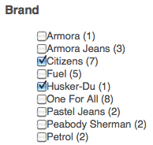
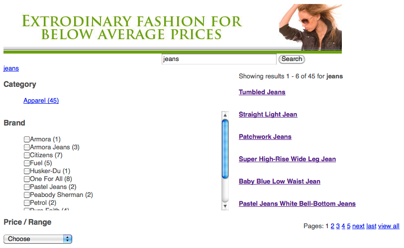

# Adding Search&amp;Promote features to your page {#adding-search-promote-features-to-your-page}

To integrate Search&amp;Promote capabilities in your web site, use the [!UICONTROL Search&amp;Promote] components to add the following features to your pages:

* Ricerca per parola chiave
* Pagina dei risultati di ricerca
* Ottimizzazione della ricerca
* Banner

Nota che è possibile utilizzare le funzionalità di Search&amp;Promote solo se sono state attivate dall’amministratore di AEM. Consulta [Integrazione con Adobe Search&amp;Promote](/help/sites-administering/search-and-promote.md).

Sul server Search&amp;Promote sono configurati i facet, così come le informazioni fornite da ogni componente. La tabella seguente fornisce una breve descrizione di ciascun componente. Le sezioni successive forniscono informazioni dettagliate sul loro utilizzo.

<table> 
 <tbody> 
  <tr> 
   <th>Componente Search&amp;Promote</th> 
   <th>Descrizione</th> 
  </tr> 
  <tr> 
   <td>Banner</td> 
   <td>Visualizza gli annunci pubblicitari dei banner. Banners are selected based on data gathered through Search&amp;Promote.  </td> 
  </tr> 
  <tr> 
   <td>Breadcrumb</td> 
   <td>Visualizza la parola chiave di ricerca e la sequenza di filtri applicati dall'utente ai risultati della ricerca.</td> 
  </tr> 
  <tr> 
   <td>Facet elenco caselle di controllo</td> 
   <td>Elenco di caselle di controllo per la selezione dei facet per filtrare i risultati di ricerca.</td> 
  </tr> 
  <tr> 
   <td>Facet a discesa</td> 
   <td>Elenco a discesa di facet per filtrare i risultati della ricerca.</td> 
  </tr> 
  <tr> 
   <td>Facet elenco collegamenti</td> 
   <td>Elenco di collegamenti facet per filtrare i risultati della ricerca.</td> 
  </tr> 
  <tr> 
   <td>Paginazione</td> 
   <td>Controlli per spostarsi tra le pagine dei risultati della ricerca.</td> 
  </tr> 
  <tr> 
   <td>Risultati</td> 
   <td>Visualizza i risultati di una ricerca per parole chiave.</td> 
  </tr> 
  <tr> 
   <td>Ricerca</td> 
   <td>Aggiunge un campo di ricerca alla pagina.</td> 
  </tr> 
 </tbody> 
</table>

## Creazione della pagina dei risultati di ricerca {#creating-the-search-results-page}

Utilizza la console Siti web WCM per creare una pagina per visualizzare i risultati della ricerca. I risultati di una ricerca da qualsiasi componente Ricerca possono essere visualizzati in questa pagina se si utilizza lo stesso servizio di Search&amp;Promote.

I componenti che consentono agli utenti di rivedere i risultati della ricerca sono Risultati e Paginazione. Il componente **[!UICONTROL Risultati]** non ha proprietà configurabili in modalità Modifica o Progettazione. Il componente Risultati elenca semplicemente i risultati della ricerca, che forniscono collegamenti ad altre pagine, e visualizza il numero di risultati per la parola chiave di ricerca.

Il componente **[!UICONTROL Paginazione]** consente agli utenti di navigare tra più pagine dei risultati di ricerca. L&#39;utente può vedere il numero di pagine, passare alla pagina successiva o precedente, selezionare una pagina da aprire o unificare tutti i risultati in una pagina.

You can configure the following component properties in [!UICONTROL Edit] mode to control runtime behavior:

* **[!UICONTROL Nascondi pagina]** a risultato singolo - Selezionate questa opzione per nascondere i controlli di navigazione della pagina quando la ricerca restituisce una singola pagina di risultati.
* **[!UICONTROL Nascondi prima/ultimo]** : selezionate questa opzione per impedire agli utenti di passare alla prima o all’ultima pagina di risultati.
* **[!UICONTROL Nascondi precedente/successivo]** - Determina se gli utenti possono passare alle pagine dei risultati relative alla pagina corrente.
* **[!UICONTROL Nascondi visualizzazione tutto]** - Determina se l&#39;utente può consolidare tutti i risultati di ricerca in una singola pagina. In genere, la fornitura di dati impaginati rende più efficiente l&#39;uso delle risorse del server. Seleziona questa opzione per impedire il trasferimento di set di dati di grandi dimensioni in un messaggio di risposta.

## Abilita il filtraggio dei risultati per facet. {#enabling-the-filtering-of-results-by-facets}

Puoi consentire agli utenti di filtrare i risultati della ricerca per facet. The **[!UICONTROL Checkbox List Facet]**, **[!UICONTROL Dropdown Facet]**, and **[!UICONTROL Link List Facet]** components enable users to select one or more facets for filtering. Quando si utilizzano questi componenti, è necessario includere anche il componente **[!UICONTROL Breadcrumb]**. Le Breadcrumb indicano i filtri attuali utilizzati.

The **[!UICONTROL Checkbox List Facet]**, **[!UICONTROL Dropdown Facet]**, and **[!UICONTROL Link List Facet]** components each have the following properties that you configure in **[!UICONTROL Edit]** mode:

* **[!UICONTROL Nome]** facet - Il nome del facet utilizzato per i filtri.

Il componente **[!UICONTROL Facet elenco casella di selezione]** mostra un elenco di facet accompagnati da una casella di selezione. Utilizza un **[!UICONTROL Facet elenco casella di selezione]** in modo che gli utenti possano visualizzare un sottoinsieme di risultati che includono elementi da più facet. Ad esempio, il facet Marchio è appropriato poiché vari marchi forniscono lo stesso tipo di prodotto.

Viene visualizzata una casella di selezione per ogni facet a cui è associato un risultato della ricerca. Quando un utente seleziona una casella, la pagina viene ricaricata con un set di risultati aggiornato. Tutte le caselle di controllo rimangono sulla pagina in modo che i clienti possano aggiungere o rimuovere i facet al filtro in qualsiasi momento:

Il componente **[!UICONTROL Facet a discesa]** consente ai clienti di selezionare un elemento facet da un elenco a discesa. Questo componente è utile quando desideri che i clienti si concentrino su un singolo elemento facet per volta. Ad esempio, il facet Reparto è appropriato per consentire ai clienti di restringere la ricerca dei prodotti in base al genere. John cerca *jeans* e poi filtra sul reparto Uomini.

L&#39;elenco a discesa contiene i facet che sono associati a tutti i risultati di ricerca. Selezionando una voce nell&#39;elenco a discesa, la pagina viene ricaricata con un set di risultati aggiornato. Le voci dell&#39;elenco a discesa non cambiano, in modo che i clienti possano passare in qualsiasi momento da un facet all&#39;altro.

Il componente **[!UICONTROL Facet elenco collegamenti]** consente ai clienti di limitare progressivamente la loro attenzione agli elementi che sono categorizzati con molteplici membri di facet o facet.

I membri dei facet vengono visualizzati come un elenco di collegamenti. Il testo di ogni collegamento è il nome di un membro dei facet che è associato ai risultati di ricerca correnti. Quando un cliente fa clic su un collegamento di un facet, la pagina viene ricaricata e viene visualizzato un sottoinsieme dei risultati della ricerca. L&#39;elenco dei collegamenti viene aggiornato di conseguenza, consentendo una ricerca ancora più ristretta.

The links in the list also changes when a filter is applied from a different type of [!UICONTROL Search&amp;Promote] component. L&#39;uso di componenti filtranti di tipo multiplo può fornire combinazioni di filtri efficaci.

Il componente **[!UICONTROL Breadcrumb]** consente ai clienti di vedere i filtri attualmente applicati ai risultati di ricerca, nell&#39;ordine in cui sono stati applicati. I clienti possono selezionare gli elementi nella breadcrumb per tornare a quella combinazione di filtri.

Puoi configurare le seguenti proprietà per Breadcrumb in modalità Modifica per personalizzare l&#39;aspetto del componente:

* **[!UICONTROL Delimitatore]** - Consente di definire la stringa di caratteri o caratteri da utilizzare come delimitatore tra ciascun percorso di navigazione. Il campo Delimiter accetta qualsiasi stringa di caratteri come input. L&#39;impostazione predefinita è: &quot;>&quot; (senza virgolette)
* **[!UICONTROL Delimitatore]** finale - Consente di definire una stringa di caratteri o caratteri da visualizzare alla fine delle breadcrumb. Il campo Delimitatore finale accetta qualsiasi stringa di caratteri come input. L’impostazione predefinita è &quot;blank&quot; (cioè alla fine della linea di navigazione non viene visualizzato nulla)

## Aggiunta di caselle di ricerca {#adding-search-boxes}

The **[!UICONTROL Search]** component enables customers to perform keyword searches. Aggiungi Componenti di ricerca in ogni pagina in cui si desidera fornire l&#39;accesso alla ricerca.

Configure the following properties in **[!UICONTROL Edit]** mode to control runtime behavior:

* **[!UICONTROL Percorso]** pagina risultati - Percorso della pagina in cui sono visualizzati i risultati della ricerca.
* **[!UICONTROL Abilita completamento]** automatico: selezionare questa opzione per fare in modo che le parole chiave di ricerca suggerite vengano visualizzate quando il cliente inizia a digitare nella casella di ricerca.

## Aggiunta di banner {#adding-banners}

The **[!UICONTROL Banners]** component displays banner advertisements according to the customer&#39;s Search&amp;Promote searches. La logica sul server Search&amp;Replace determina quale banner mostrare. Ad esempio, una ricerca sui jeans potrebbe far apparire un banner legato alla moda. Il filtro sul reparto Uomini potrebbe affinare ulteriormente la scelta del banner.

The **[!UICONTROL Banners]** component provides one configurable property named **[!UICONTROL Banner Area]**. In **[!UICONTROL Edit]** mode, select one of the property values to specify how the banner appears. Il servizio di Search&amp;Promote determina l&#39;elenco di valori selezionabili.

## Esempio di pagina di ricerca Search&amp;Promote {#example-search-promote-search-page}

Questo diagramma mostra i componenti che vengono aggiunti a una pagina per creare la sottostante pagina completamente funzionale dei risultati di Search&amp;Promote.

 , 

