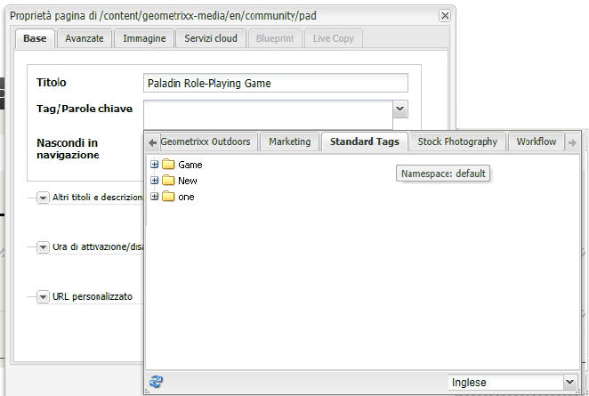
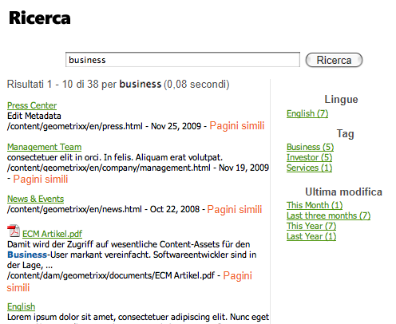

# Utilizzo dei tag  {#using-tags}

I tag sono un metodo semplice e veloce per classificare i contenuti di un sito web. I tag possono essere paragonati a parole chiave o etichette assegnate a una pagina, una risorsa o ad altro contenuto per consentire la ricerca di contenuti specifici e correlati.

* Per informazioni sulla creazione e la gestione dei tag, nonché sui tag di contenuto applicati, consultate [Amministrazione dei tag](/help/sites-administering/tags.md).
* Per informazioni sul framework dei tag, nonché sull&#39;inclusione e l&#39;estensione dei tag nelle applicazioni personalizzate, consultate [Tagging per sviluppatori](/help/sites-developing/tags.md).

## Dieci motivi per utilizzare l’assegnazione tag {#ten-reasons-to-use-tagging}

1. Organizzazione dei contenuti: l’assegnazione di tag semplifica il lavoro agli autori, che possono organizzare rapidamente i contenuti con il minimo sforzo.
1. Organizzazione dei tag: i tag organizzano i contenuti, e le tassonomie (o namespace) gerarchiche organizzano i tag.
1. Tag estremamente organizzati: attraverso la creazione di tag principali e secondari, è possibile creare tassonomie complete che includono termini, termini derivati e relazioni che li collegano. In questo modo è possibile creare una seconda (o terza) gerarchia di contenuti parallela a quella ufficiale.
1. Tagging controllato: l’aggiunta di tag può essere controllata applicando autorizzazioni ai tag e/o ai namespace per controllare la creazione e l’applicazione di tag.
1. Tagging flessibile: i tag possono avere molti nomi diversi, come tag, termini di tassonomia, categorie, etichette e molto altro ancora. Sono flessibili dal punto di vista del modello di contenuto e della modalità di utilizzo. Possono essere ad esempio utilizzati per sintetizzare le caratteristiche demografiche del target, suddividere in categorie e classificare i contenuti o creare una gerarchia di contenuti secondaria.
1. Ricerca migliorata: il componente di ricerca predefinito in AEM include i tag creati e assegnati a cui possono essere applicati filtri per restringere i risultati a quelli rilevanti.
1. Abilitazione SEO: i tag assegnati come proprietà della pagina vengono visualizzati automaticamente nei metatag della pagina, rendendola visibile ai motori di ricerca.
1. Sofisticazione semplice: i tag possono essere creati da una parola e dal tocco di un pulsante. In seguito, è possibile aggiungere un titolo, una descrizione ed etichette illimitate per fornire ulteriore semantica al tag.
1. Coerenza di base: il sistema di tagging è un componente di base di AEM ed è utilizzato da tutte le funzioni AEM per classificare i contenuti. Inoltre, per gli sviluppatori è disponibile l’API di assegnazione tag che consente di creare applicazioni abilitate per l’assegnazione tag con accesso alle stesse tassonomie.
1. Struttura e flessibilità: AEM è ideale per lavorare con informazioni strutturate, grazie alla nidificazione delle pagine e dei percorsi. È molto efficace anche per la gestione delle informazioni non strutturate, grazie alla funzione integrata di ricerca testuale. L’assegnazione di tag offre i vantaggi delle struttura e della flessibilità.

Quando progetti la struttura dei contenuti di un sito e lo schema di metadati per le risorse, considera l’approccio leggero e accessibile fornito dai tag.

## Applicazione dei tag   {#applying-tags}

Nell’ambiente di authoring gli autori possono applicare i tag accedendo alle proprietà della pagina e immettendo uno o più tag nel campo **Tag/Parole chiave**.

Per applicare [tag predefiniti](/help/sites-administering/tags.md), nella finestra **Proprietà pagina** utilizzare il campo a discesa `Tags/Keywords` per selezionare dall&#39;elenco dei tag consentiti per la pagina. La scheda **Tag standard** è lo spazio dei nomi predefinito, il che significa che non esiste un `namespace-string:` con un prefisso alla tassonomia.

### Pubblicazione dei tag {#publishing-tags}

Come avviene per le pagine, su tag e namespace è possibile effettuare le operazioni descritte di seguito.

**Attiva**

* Consente di attivare singoli tag.

   Come per le pagine, è necessario attivare i nuovi tag creati prima che siano disponibili nell’ambiente di pubblicazione.

>[!NOTE]
>
>Quando si attiva una pagina, si apre automaticamente una finestra di dialogo che consente di attivare i tag non attivati appartenenti alla pagina.

**Disattiva**

* È possibile disattivare i tag selezionati.

## Tag cloud  {#tag-clouds}

I tag cloud mostrano un insieme di tag relativi alla pagina corrente, all’intero sito Web o ai contenuti maggiormente utilizzati. I tag cloud sono uno strumento per evidenziare i problemi che sono (o sono stati) di interesse per l’utente. Le dimensioni del testo utilizzato per visualizzare il tag variano a seconda dell&#39;uso.

Il componente [Tag cloud](/help/sites-classic-ui-authoring/classic-page-author-edit-mode.md#tag-cloud) (gruppo di componenti Generale) viene utilizzato per aggiungere un Tag cloud a una pagina.

## Ricerca sui tag  {#searching-on-tags}

Puoi ricercare i tag sia nell’ambiente di creazione e modifica che nell’ambiente di pubblicazione.

### Uso del componente Ricerca  {#using-search-component}

L&#39;aggiunta di un [componente di ricerca](/help/sites-classic-ui-authoring/classic-page-author-edit-mode.md#search) a una pagina fornisce una funzionalità di ricerca che include i tag e può essere utilizzata sia nell&#39;ambiente di creazione che nell&#39;ambiente di pubblicazione.

