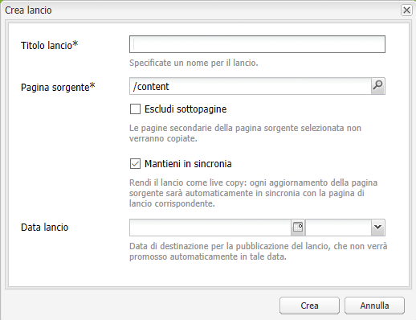
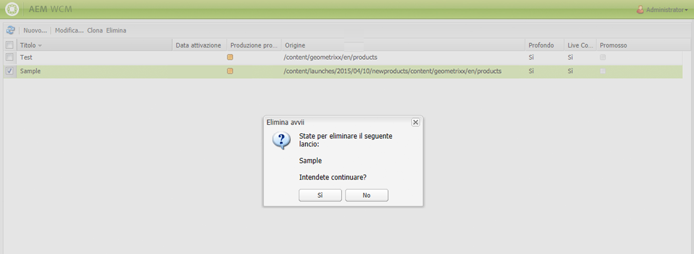

# Creazione dei lanci{#creating-launches}

Puoi creare un lancio per abilitare l’aggiornamento di una nuova versione di pagine web esistenti da attivare in futuro. Per creare un lancio, è necessario specificare un titolo e la pagina di origine:

* The title appears in the **Sidekick**, from where authors can access them to work on them.
* Per impostazione predefinita nel lancio vengono incluse le pagine figlie della pagina di origine. Se necessario, potete comunque usare anche solo la pagina sorgente.
* Per impostazione predefinita, [Live Copy](/help/sites-administering/msm.md) aggiorna automaticamente le pagine di lancio mano a mano che vengono modificate le pagine sorgente. Per evitare che vengano apportate tali modifiche automatiche, puoi specificare che venga creata una copia statica.

Facoltativamente, puoi specificare la **Data lancio** (e l’ora) per definire quando promuovere e attivare le pagine del lancio. Tuttavia, la **Data lancio** funziona solo in combinazione con il flag **Production Ready** (vedi la sezione [Modifica di una configurazione di lancio](/help/sites-classic-ui-authoring/classic-launches-editing.md#editing-a-launch-configuration)). Affinché le azioni vengano effettivamente eseguite in automatico, è necessario impostare entrambe.

## Creazione di un lancio {#creating-a-launch}

La seguente procedura consente di creare un lancio.

1. Open the Website administration page ([http://localhost:4502/siteadmin](http://localhost:4502/siteadmin)).
1. Fai clic su **Nuovo…**, quindi su **Nuovo lancio…**.
1. Nella finestra di dialogo **Crea lancio**, specifica i valori delle seguenti proprietà:

   * **Titolo lancio**: nome del lancio. Scegli un nome che possa essere facilmente riconosciuto dagli autori.
   * **Pagina sorgente**: percorso della pagina per la quale viene creato il lancio. Per impostazione predefinita, vengono incluse tutte le pagine figlie.
   * **Escludi sottopagine**: seleziona questa opzione per creare il lancio solo per la pagina sorgente e non per le pagine figlie. Per impostazione predefinita, questa opzione non è selezionata.
   * **Mantieni in sincronia**: seleziona questa opzione per aggiornare automaticamente il contenuto delle pagine del lancio quando vengono modificate le pagine sorgenti. Ciò avviene creando una [Live Copy](/help/sites-administering/msm.md) del lancio.
   * **Data lancio**: la data e l&#39;ora in cui la copia del lancio deve essere attivata (in base alla segnalazione **Produzione pronta**; consulta [Lanci: l&#39;ordine degli eventi](/help/sites-authoring/launches.md#launches-the-order-of-events)).
   

1. Fai clic su **Crea**. 

## Eliminazione di un lancio {#deleting-a-launch}

È possibile eliminare un lancio.

1. Nella console dei lanci [, seleziona il lancio da eliminare.](/help/sites-classic-ui-authoring/classic-launches.md)
1. Fai clic su **Elimina**. È necessaria la conferma:

   

   >[!CAUTION]
   >
   >Prima di eliminare i lanci nidificati, è necessario eliminare i livelli sottostanti.

