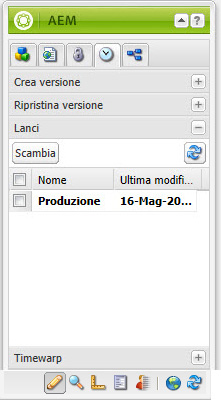
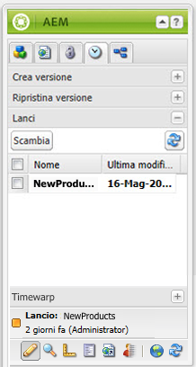

# Modifica dei lanci{#editing-launches}

>[!CAUTION]
>
>AEM 6.4 ha raggiunto la fine del supporto esteso e questa documentazione non viene più aggiornata. Per maggiori dettagli, consulta la nostra [periodi di assistenza tecnica](https://helpx.adobe.com/it/support/programs/eol-matrix.html). Trova le versioni supportate [qui](https://experienceleague.adobe.com/docs/).

## Modifica delle pagine di lancio {#editing-launch-pages}

Quando è stato creato un lancio per una pagina (o un insieme di pagine) è possibile modificare il contenuto nella copia di lancio delle pagine.

1. Apri la pagina per la modifica.
1. Nella barra laterale, selezionate la **Controllo delle versioni** , quindi espandi la **Lanci** gruppo. Il titolo del lancio attualmente in corso di modifica utilizza un font in grassetto.

   

1. Seleziona il lancio su cui desideri lavorare, quindi fai clic su **Interruttore**.
1. Inizia a modificare.

   >[!NOTE]
   >
   >È possibile utilizzare **Pagina** scheda della barra laterale per eseguire azioni quali **Crea pagina figlia**, tra gli altri.

## Modifica di una configurazione di lancio {#editing-a-launch-configuration}

Dopo aver creato un lancio, puoi modificare il nome del lancio e la data del lancio. Puoi anche specificare un’immagine da associare al lancio.

1. Apri la pagina di amministrazione dei lanci ([http://localhost:4502/libs/launches/content/admin.html](http://localhost:4502/libs/launches/content/admin.html)).

1. Seleziona il lancio richiesto e fai clic su **Modifica** per aprire la finestra di dialogo:

   * In **Generale** è possibile modificare:

      * **Titolo**
      * **Data live**: equivale alla data del lancio
      * **Produzione pronta**

      Vedi [Lanci - Ordine degli eventi](/help/sites-authoring/launches.md#launches-the-order-of-events) per informazioni sullo scopo e l&#39;interazione di questi campi.

   * In **Immagine** è possibile caricare un file di immagine.

1. Fai clic su **Salva**.

## Esplorazione dello stato di lancio di una pagina {#discovering-the-launch-status-of-a-page}

Quando modifichi un lancio di una pagina, le informazioni sul lancio vengono visualizzate nella parte inferiore della sezione **Controllo delle versioni** scheda della barra laterale:

* Nome del lancio.
* L&#39;ora dall&#39;ultima modifica.
* Utente che ha eseguito l’ultima modifica.
* Lo stato del **Produzione pronta** flag (arancione=non impostato; green=set).

