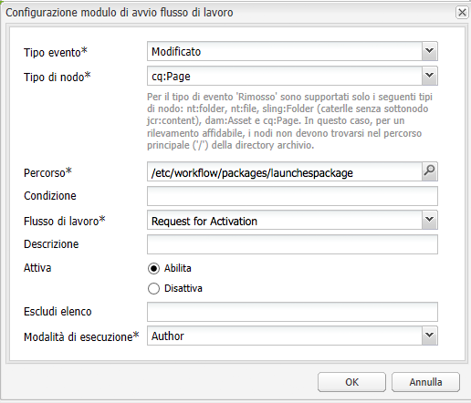

# Promozione dei lanci{#promoting-launches}

>[!CAUTION]
>
>AEM 6.4 ha raggiunto la fine del supporto esteso e questa documentazione non viene più aggiornata. Per maggiori dettagli, consulta la nostra [periodi di assistenza tecnica](https://helpx.adobe.com/it/support/programs/eol-matrix.html). Trova le versioni supportate [qui](https://experienceleague.adobe.com/docs/).

È necessario promuovere le pagine di lancio per spostare nuovamente il contenuto nell’origine (produzione) prima della pubblicazione. Quando una pagina di lancio viene promossa, la pagina corrispondente nelle pagine sorgente viene sostituita con il contenuto della pagina promossa. Quando si promuove una pagina di lancio sono disponibili le seguenti opzioni:

* Promuovere solo la pagina corrente o l’intero lancio.
* Promuovere le pagine figlie della pagina corrente.
* Promuovere il lancio completo o solo le pagine che sono state modificate.

## Promozione delle pagine di lancio {#promoting-launch-pages}

Per promuovere le pagine, esegui i seguenti passaggi durante la modifica della pagina di lancio che desideri promuovere:

1. Sulla **Pagina** scheda nella barra laterale, fate clic su **Promuovi lancio**.
1. Specifica le pagine da promuovere:

   * (Impostazione predefinita) Per promuovere solo la pagina corrente, seleziona **Promuovi modifiche pagina a versione produzione**.
   * Per promuovere anche le pagine figlie della pagina corrente, seleziona **Includi sottopagine**.
   * Per promuovere tutte le pagine del lancio, seleziona **Promuovi lancio completo alla versione di produzione**.

1. Per aggiungere le pagine di produzione a un pacchetto di flusso di lavoro, seleziona **Aggiungi al pacchetto del flusso di lavoro** quindi seleziona il pacchetto del flusso di lavoro.
1. Fai clic su **Promuovi**.

## Elaborazione di pagine promosse tramite Flusso di lavoro AEM {#processing-promoted-pages-using-aem-workflow}

Utilizza i modelli di flusso di lavoro per eseguire l’elaborazione in blocco delle pagine dei lanci promossi:

1. Crea un pacchetto di flusso di lavoro.
1. Quando gli autori promuovono le pagine Launch, le memorizzano nel pacchetto del flusso di lavoro.
1. Avvia un modello di flusso di lavoro utilizzando il pacchetto come payload.

Per avviare automaticamente un flusso di lavoro quando vengono promosse le pagine, [configurare un modulo di avvio del flusso di lavoro](/help/sites-administering/workflows-starting.md#workflows-launchers) per il nodo del pacchetto.

Ad esempio, puoi generare automaticamente le richieste di attivazione pagina non appena un autore promuove una pagina di lancio. Configura un modulo di avvio del flusso di lavoro per avviare il flusso di lavoro Attivazione richiesta quando viene modificato il nodo del pacchetto.

