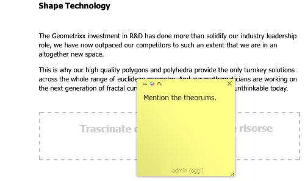
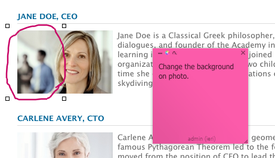

# Annotazioni durante la modifica di una pagina{#annotations-when-editing-a-page}

>[!CAUTION]
>
>AEM 6.4 ha raggiunto la fine del supporto esteso e questa documentazione non viene più aggiornata. Per maggiori dettagli, consulta la nostra [periodi di assistenza tecnica](https://helpx.adobe.com/it/support/programs/eol-matrix.html). Trova le versioni supportate [qui](https://experienceleague.adobe.com/docs/).

L’aggiunta di contenuti alle pagine del sito web è spesso soggetta a discussioni prima che venga effettivamente pubblicato. Per facilitare questa fase, molti componenti direttamente correlati al contenuto (a differenza, ad esempio, del layout) consentono di aggiungere un’annotazione.

Un’annotazione si presenta come una nota colorata applicata alla pagina. può contenere commenti o domande inseriti da un utente e destinati ad altri autori o revisori.

>[!NOTE]
>
>Nella definizione di un singolo tipo di componente è possibile specificare se l’aggiunta di annotazioni è supportata o meno per le istanze del componente.

>[!NOTE]
>
>Le annotazioni create nell’interfaccia classica vengono visualizzate anche nell’interfaccia touch. Tuttavia, gli schizzi sono specifici per l’interfaccia utente e vengono visualizzati solo nell’interfaccia in cui sono stati creati.

>[!CAUTION]
>
>Se si elimina una risorsa (ad esempio, un paragrafo), vengono anche eliminate tutte le annotazioni e gli schizzi associati ad essa; indipendentemente dalla loro posizione sulla pagina nel suo insieme.

>[!NOTE]
>
>A seconda delle esigenze è inoltre possibile sviluppare un flusso di lavoro per inviare notifiche quando vengono aggiunte, aggiornate o eliminate delle annotazioni.

## Annotazioni {#annotations}

A seconda della progettazione del paragrafo, l’annotazione è disponibile come opzione nel menu di scelta rapida (in genere disponibile facendo clic con il pulsante destro del mouse sul paragrafo) o come pulsante sulla barra di modifica del paragrafo.

In entrambi i casi, seleziona **Annota**. Un’annotazione per una nota colorata viene applicata al paragrafo e viene attivata la modalità Modifica, che consente di aggiungere direttamente testo:

È possibile spostare l’annotazione in una nuova posizione sulla pagina. Fate clic sull’area del bordo superiore, quindi tenete premuto e trascinate l’annotazione fino alla nuova posizione. Può trovarsi in qualsiasi punto della pagina, anche se in genere è utile mantenerla in connessione con il paragrafo.

Le annotazioni (compresi gli schizzi correlati) sono incluse anche in tutte le azioni di copia, taglio o eliminazione eseguite sul paragrafo al quale sono collegate; per le azioni di copia o taglio, la posizione dell’annotazione (e dei relativi schizzi) mantiene la propria posizione rispetto al paragrafo di origine.

È inoltre possibile aumentare o diminuire le dimensioni dell’annotazione trascinando l’angolo in basso a destra.

A scopo di tracciamento, la riga piè di pagina indica l’utente che ha creato l’annotazione e la data. Gli autori successivi possono modificare la stessa annotazione (il piè di pagina viene aggiornato di conseguenza) o creare una nuova annotazione per lo stesso paragrafo.

L’eliminazione di un’annotazione è preceduta da una richiesta di conferma. L’eliminazione di un’annotazione comporta l’eliminazione anche di eventuali sketch associati ad essa.

Le tre icone in alto a sinistra consentono di ridurre a icona l’annotazione (ed eventuali sketch), modificarne il colore e aggiungere sketch.

>[!NOTE]
>
>Le annotazioni sono visibili solo in modalità Modifica nell’ambiente di authoring.
>
>Non sono visibili nell’ambiente di pubblicazione, né nelle modalità Anteprima o Progettazione dell’ambiente di authoring.

>[!NOTE]
>
>Non è possibile aggiungere annotazioni a una pagina che è stata bloccata da un altro utente.

## Schizzi per annotazione {#annotation-sketches}

>[!NOTE]
>
>Gli schizzi non sono disponibili in Internet Explorer, quindi:
>
>* l’icona non viene visualizzata.
>* gli schizzi esistenti creati in un altro browser non verranno visualizzati.
>

Gli schizzi sono una funzione delle annotazioni per la creazione di semplici elementi grafici a linee in qualsiasi punto della finestra del browser (parte visibile):

* In modalità schizzo, il cursore assume la forma di un mirino. Puoi disegnare più linee distinte.
* La linea dello schizzo ha lo stesso colore dell’annotazione e può essere:

   * mano libera

      la modalità predefinita; per terminare, rilascia il pulsante del mouse.

   * diritto:

      tenere premuto `ALT` e fare clic sui punti iniziale e finale; per terminare, fai doppio clic.

* Una volta usciti dalla modalità schizzo, potete fare clic su una linea dello schizzo per selezionarlo.
* Per spostare uno sketch, selezionalo e trascinalo nella posizione desiderata.
* Uno schizzo sovrappone il contenuto. Questo significa che entro i 4 angoli dello sketch non è possibile fare clic sul paragrafo sottostante; ad esempio, per modificare o accedere a un collegamento. Se questo diventa un problema (ad esempio, se uno schizzo copre un’area estesa della pagina), riducete al minimo l’annotazione appropriata, riducendo al minimo tutti gli schizzi correlati, consentendo l’accesso all’area sottostante.
* Per eliminare un singolo schizzo, selezionalo e premi il pulsante **Elimina** key (**fn**-**backspace** su un MAC).

* Se si sposta o si copia un paragrafo, verranno spostate o copiate anche tutte le relative annotazioni e i relativi schizzi; la loro posizione rispetto al paragrafo rimarrà la stessa.
* Se eliminate un’annotazione, vengono eliminati anche tutti gli schizzi associati.
