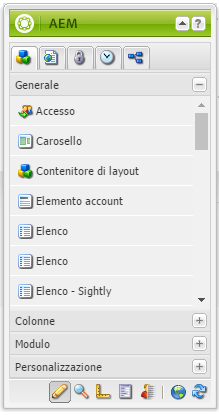
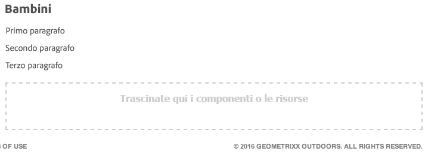
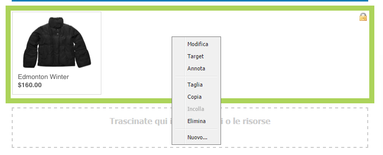
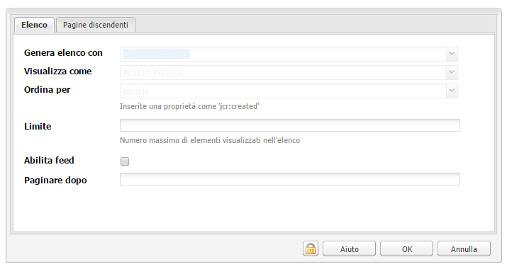
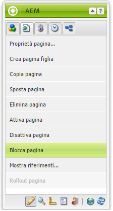

# Modifica del contenuto di una pagina{#editing-page-content}

Una volta creata la pagina (nuova o come parte di un lancio o una live copy) è possibile aggiornarla modificandone i contenuti.

Per aggiungere i contenuti si trascinano sulla pagina specifici componenti, in base al tipo di contenuto, che possono quindi essere modificati, spostati o eliminati.

>[!NOTE]
>
>Il tuo account deve disporre dei [diritti di accesso](/help/sites-administering/security.md) e delle [autorizzazioni](/help/sites-administering/security.md#permissions) adeguati per intervenire sulle pagine, ad esempio per aggiungere, modificare o eliminare componenti, aggiungere annotazioni, sbloccare la pagina.
>
>Nell’eventualità di problemi, rivolgiti al tuo amministratore di sistema.

## Barra laterale {#sidekick}

La barra laterale è uno strumento fondamentale per l’authoring delle pagine. Si tratta di un elemento mobile e sempre visibile.

Sono disponibili diverse schede e icone, tra cui:

* Componenti
* Pagina
* Informazioni
* Gestione versioni
* Flusso di lavoro
* Modalità
* Scaffolding
* ClientContext
* Siti Web

Queste consentono di accedere a numerose funzionalità, tra cui:

* [Selezione di componenti](/help/sites-classic-ui-authoring/classic-page-author-env-tools.md#sidekick)
* [visualizzazione di riferimenti di pagina](/help/sites-classic-ui-authoring/classic-page-author-env-tools.md#showing-references)
* [accesso al registro di controllo](/help/sites-classic-ui-authoring/classic-page-author-env-tools.md#audit-log)
* [passaggio da una modalità all’altra](/help/sites-classic-ui-authoring/classic-page-author-env-tools.md#page-modes)
* [creazione](/help/sites-classic-ui-authoring/classic-page-author-work-with-versions.md#creating-a-new-version), [ripristino](/help/sites-classic-ui-authoring/classic-page-author-work-with-versions.md#restoring-a-page-version-from-sidekick) e [confronto](/help/sites-classic-ui-authoring/classic-page-author-work-with-versions.md#comparing-with-a-previous-version) di versioni

* [pubblicazione](/help/sites-classic-ui-authoring/classic-page-author-publish-pages.md#publishing-a-page) e [annullamento della pubblicazione](/help/sites-classic-ui-authoring/classic-page-author-publish-pages.md#unpublishing-a-page) di una pagina

* [modifica delle proprietà di una pagina](/help/sites-classic-ui-authoring/classic-page-author-edit-page-properties.md)

* [scaffolding](/help/sites-authoring/scaffolding.md)

* [ClientContext](/help/sites-administering/client-context.md)

## Inserimento di un componente {#inserting-a-component}

### Inserimento di un componente {#inserting-a-component-1}

Dopo avere aperto la pagina è possibile iniziare ad aggiungere il contenuto. A tale scopo, è necessario aggiungere i componenti (o paragrafi).

Per inserire un nuovo componente:

1. Per selezionare il tipo di paragrafo da inserire sono disponibili vari metodi:

   * Fai doppio clic sull’area con l’etichetta **Trascina qui i componenti o le risorse**: viene visualizzata la barra degli strumenti **Inserisci nuovo componente**. Seleziona un componente e fai clic su **OK**.
   * Trascinate un componente dalla barra degli strumenti mobile (o barra laterale) per inserire un nuovo paragrafo.
   * Fai clic con il pulsante destro del mouse su un paragrafo esistente e seleziona **Nuovo**: si apre la barra degli strumenti Inserisci nuovo componente. Seleziona un componente e fai clic su **OK**.

   

1. Sia nella barra laterale che nella barra degli strumenti **Inserisci nuovo componente** viene visualizzato un elenco dei tipi di componenti (o paragrafi) disponibili. Questi ultimi sono suddivisi in varie categorie (ad esempio Generale, Colonne e così via), che possono essere espanse.

   Le opzioni disponibili variano a seconda dell’ambiente di produzione. Per informazioni dettagliate sui componenti, consulta [Componenti predefiniti](/help/sites-classic-ui-authoring/classic-page-author-default-components.md).

1. Inserisci nella pagina il componente desiderato. Quindi fai doppio clic sul paragrafo. Viene visualizzata una finestra che consente di configurare il paragrafo e aggiungere il contenuto.

### Inserimento di un componente tramite Content Finder {#inserting-a-component-using-the-content-finder}

Per aggiungere un nuovo componente alla pagina, puoi anche trascinare una risorsa da [Content Finder](/help/sites-classic-ui-authoring/classic-page-author-env-tools.md#the-content-finder). In questo modo, si crea automaticamente un nuovo componente di tipo appropriato, che contiene la risorsa.

Questo vale per i seguenti tipi di risorse (alcune dipenderanno dal sistema della pagina o del paragrafo):

| Tipo risorsa | Tipo componente risultante |
|---|---|
| Immagine | Immagine |
| Documento | Scarica |
| Prodotto | Prodotto |
| Video | Flash |

>[!NOTE]
>
>Puoi configurare questo comportamento per l’installazione in uso. Per ulteriori dettagli, vedere la sezione su come [Configurare un sistema di paragrafi in modo che il trascinamento di una risorsa crei uno specifico componente](/help/sites-developing/developing-components.md#configuring-a-paragraph-system-so-that-dragging-an-asset-creates-a-component-instance).

Per creare un componente trascinando uno dei tipi di risorsa indicati sopra:

1. Assicurati che la pagina sia in [**modalità Modifica **.](/help/sites-classic-ui-authoring/classic-page-author-env-tools.md#page-modes)
1. Apri [Content Finder](/help/sites-classic-ui-authoring/classic-page-author-env-tools.md#the-content-finder).
1. Trascina la risorsa richiesta nella posizione desiderata. Il [segnaposto](#componentplaceholder) indica dove sarà posizionato il componente.

   In tale posizione viene creato un componente adatto al tipo di risorsa, che include la risorsa selezionata.

1. Se necessario, [modifica](#editmovecopypastedelete) il componente.

## Modifica di un componente (contenuto e proprietà) {#editing-a-component-content-and-properties}

Per modificare un paragrafo esistente, è possibile effettuare una delle seguenti operazioni:

* **Fai doppio clic** sul paragrafo per aprirlo. Viene aperta la stessa finestra visualizzata quando è stato creato il paragrafo con il contenuto attuale. Apporta le modifiche desiderate e fai clic su **OK**.

* **Fai clic con il pulsante destro del mouse** sul paragrafo, quindi scegli **Modifica**.

* Per passare alla modalità di modifica locale, **fai clic due volte** sul paragrafo (doppio clic lento). Potrai modificare il testo direttamente nella pagina, anziché all’interno di una finestra di dialogo. In questa modalità nella parte superiore della pagina sarà disponibile una barra degli strumenti. Le modifiche apportate verranno salvate automaticamente.

## Spostamento di un componente {#moving-a-component}

Per spostare un paragrafo:

>[!NOTE]
>
>Per spostare un componente puoi anche utilizzare [Taglia e Incolla](#cut-copy-paste-a-component).

1. Seleziona il paragrafo da spostare.

   

1. Trascina il paragrafo nella nuova posizione. In AEM le posizioni in cui è possibile spostare il paragrafo sono indicate da una spunta verde. Rilascia il paragrafo nella posizione desiderata.
1. Il paragrafo è stato spostato:

   

## Eliminazione di un componente {#deleting-a-component}

Per eliminare un paragrafo:

1. Seleziona il paragrafo e **fai clic con il pulsante destro del mouse**.

   

1. Scegli **Elimina** dal menu. Poiché l’operazione non può essere annullata, in AEM WCM viene richiesto di confermare l’eliminazione del paragrafo.
1. Fai clic su **OK**.

>[!NOTE]
>
>Se hai impostato le [Proprietà utente per mostrare la barra degli strumenti di modifica globale](/help/sites-classic-ui-authoring/author-env-user-props.md), è anche possibile eseguire alcune azioni sui paragrafi utilizzando i pulsanti disponibili **Copia**, **Taglia**, **Incolla**, **Elimina**.\
>Sono inoltre disponibili varie [scelte rapide da tastiera](/help/sites-classic-ui-authoring/classic-page-author-keyboard-shortcuts.md).

## Operazioni di Taglia, Copia e Incolla su un componente {#cut-copy-paste-a-component}

Come per l’[Eliminazione di un componente](#deleting-a-component), è possibile utilizzare il menu di scelta rapida per copiare, tagliare e/o incollare un componente

>[!NOTE]
>
>Se hai impostato le [Proprietà utente per mostrare la barra degli strumenti di modifica globale](/help/sites-classic-ui-authoring/author-env-user-props.md), è anche possibile eseguire alcune azioni sui paragrafi utilizzando i pulsanti disponibili **Copia**, **Taglia**, **Incolla**, **Elimina**.
>
>Sono inoltre disponibili varie [scelte rapide da tastiera](/help/sites-classic-ui-authoring/classic-page-author-keyboard-shortcuts.md).

>[!NOTE]
>
>Le operazioni “Taglia”, “Copia” e “Incolla” possono essere eseguite sul contenuto solo all’interno della stessa pagina.

## Componenti ereditati {#inherited-components}

I componenti ereditati possono essere il risultato di vari scenari, tra cui:

* [Gestione multisito](/help/sites-administering/msm.md), anche in combinazione con [scaffolding](/help/sites-classic-ui-authoring/classic-feature-scaffolding.md#scaffolding-with-msm-inheritance).

* [Lanci](/help/sites-classic-ui-authoring/classic-launches.md) (se basati su Live Copy).
* Componenti specifici; ad esempio, il sistema paragrafo ereditato all’interno di Geometrixx.

È possibile annullare (e quindi riattivare) l’ereditarietà. In base al componente, questo può essere disponibile da:

1. **Live Copy**

   Un’icona a forma di lucchetto identifica i componenti che fanno parte di una Live Copy o di un lancio. È possibile fare clic sul lucchetto per annullare l’ereditarietà.

   * L’icona a forma di lucchetto viene visualizzata quando il componente è selezionato, ad esempio:

   

   * L’icona a forma di lucchetto viene visualizzata anche nella finestra di dialogo dei componenti, ad esempio:

   

1. **Un sistema paragrafo ereditato**

   La finestra di dialogo di configurazione. Ad esempio, come con il sistema paragrafo ereditato all&#39;interno di Geometrixx:

   

## Aggiunta di annotazioni {#adding-annotations}

Le [annotazioni](/help/sites-classic-ui-authoring/classic-page-author-annotations.md) consentono agli autori di fornire feedback sui contenuti. Spesso vengono utilizzate a scopo di revisione e convalida.

## Anteprima delle pagine   {#previewing-pages}

Lungo il lato inferiore della barra laterale sono disponibili due icone importanti per visualizzare le pagine in anteprima:

* L’icona matita indica che si è in modalità Modifica, dove è possibile aggiungere, modificare, spostare o eliminare i contenuti.

   

* L’icona a forma di lente d’ingrandimento consente di passare alla modalità Anteprima nella quale la pagina viene visualizzata così come lo sarà nell’ambiente di pubblicazione (a volte è necessario aggiornare la visualizzazione della pagina):

   

   Nella modalità Anteprima la barra laterale è ridotta. Fate clic sulla freccia verso il basso per tornare alla modalità Modifica:

   

## Trova e sostituisci {#find-replace}

Per modificare più occorrenze di una stessa parola o frase, l’opzione di menu **[Trova e sostituisci](/help/sites-classic-ui-authoring/author-env-search.md#find-and-replace)**consente di cercare e sostituire più istanze di una stringa in una sezione del sito Web.

## Blocco di una pagina {#locking-a-page}

AEM consente di bloccare una pagina in modo da impedire che i contenuti possano essere modificati. Questa funzione è utile quando si devono apportare numerose modifiche a una pagina oppure se occorre bloccarla per un breve periodo di tempo.

>[!CAUTION]
>
>La pagina può essere sbloccata solo dall’utente che l’ha bloccata (oppure da un account con diritti di tipo amministratore).

Per bloccare una pagina:

1. Nella scheda **Siti Web** seleziona la pagina da bloccare.
1. Fai doppio clic sulla pagina per aprirla in modalità di modifica.
1. Nella scheda **Pagina** della barra laterale seleziona **Blocca pagina**.

   

   Un messaggio indica che la pagina è bloccata e di conseguenza non è accessibile agli altri utenti. Inoltre, nel riquadro destro della console **Siti Web**, in AEM WCM la pagina viene visualizzata come bloccata, con l’indicazione dell’utente che ha applicato il blocco.

   

## Sblocco di una pagina {#unlocking-a-page}

Per sbloccare una pagina:

1. Nella scheda **Siti Web** seleziona la pagina da sbloccare.
1. Fai doppio clic sulla pagina per aprirla.
1. Nella scheda **Pagina** della barra laterale seleziona **Sblocca pagina**.

## Annullamento e ripristino di operazioni di modifica delle pagine {#undoing-and-redoing-page-edits}

Con il frame del contenuto della pagina attivo, usa le seguenti scelte rapide da tastiera:

* Annulla: Ctrl+Z (Windows) o Comando+Z (Mac)
* Ripristina: Ctrl+Y (Windows) o Comando+Y (Mac)

Quando si annullano e si ripristinano operazioni di rimozione, aggiunta o spostamento di uno o più paragrafi, i paragrafi interessati sono indicati da un’evidenziazione intermittente (impostazione predefinita). 

>[!NOTE]
>
>Per informazioni sulle possibilità di annullare e ripristinare le modifiche apportate a una pagina, consulta [Annullamento e ripristino di operazioni di modifica delle pagine - La teoria](#undoing-and-redoing-page-edits-the-theory).

## Annullamento e ripristino di operazioni di modifica delle pagine - La teoria {#undoing-and-redoing-page-edits-the-theory}

>[!NOTE]
>
>L’amministratore di sistema può [configurare vari aspetti delle funzioni Annulla e Ripristina](/help/sites-administering/config-undo.md) in base ai requisiti particolari del caso in questione.

In AEM viene memorizzata la cronologia delle operazioni eseguite dall’utente e la sequenza di esecuzione. È quindi possibile annullare numerose azioni nell’ordine in cui sono state eseguite. Successivamente si può utilizzare il comando Ripristina per riapplicare una o più azioni.

Se è selezionato un elemento nella pagina del contenuto, il comando Annulla/Ripristina si riferisce all’elemento selezionato, ad esempio un componente di testo.

Il comportamento dei comandi di annullamento e ripristino è simile a quello delle altre applicazioni software. Tali comandi consentono di ripristinare uno stato recente della pagina web in lavorazione. Se ad esempio si sposta un paragrafo di testo altrove nella pagina, è possibile ricorrere al comando Annulla per riportarlo nella posizione originale. Se poi si cambia idea e si decide di rispostare il paragrafo, si può usare il comando Ripristina.

>[!NOTE]
>
>Operazioni disponibili:
>
>* Le azioni annullate possono essere ripristinate solo se dopo l’annullamento non sono state apportate altre modifiche alla pagina.
>* Per impostazione predefinita, è possibile annullare fino a 20 azioni di modifica.
>* Puoi eseguire le operazioni Annulla e Ripristina anche con le relative [scelte rapide da tastiera](/help/sites-classic-ui-authoring/classic-page-author-keyboard-shortcuts.md).

>

I comandi Annulla e Ripristina possono essere utilizzati per i seguenti tipi di modifiche:

* Aggiunta, modifica, rimozione e spostamento di paragrafi
* Modifica locale del contenuto dei paragrafi
* Operazioni Copia, Taglia e Incolla per elementi all’interno di una pagina
* Operazioni Copia, Taglia e Incolla per elementi tra pagine diverse
* Aggiunta, rimozione e modifica di file e immagini
* Aggiunta, rimozione e modifica di annotazioni e schizzi
* Modifiche alla pagina di scaffolding
* Aggiunta e rimozione di riferimenti
* Modifica dei valori delle proprietà nelle finestre di dialogo dei componenti.

Per i campi modulo generati dai componenti modulo non deve essere specificato alcun valore durante la creazione delle pagine. Pertanto i comandi Annulla/Ripristina non incidono sulle modifiche apportate ai valori di questo tipo di componenti. Ad esempio, non è possibile annullare la selezione di un valore in un elenco a discesa.

>[!NOTE]
>
>Per annullare e ripristinare le modifiche apportate a file e immagini sono necessarie autorizzazioni speciali. Inoltre, la cronologia di annullamento per le modifiche apportate a file e immagini ha una durata in ore minima, oltre la quale la possibilità di annullare le modifiche non è garantita. L’amministratore può concedere le autorizzazioni e cambiare l’intervallo predefinito di dieci ore.

