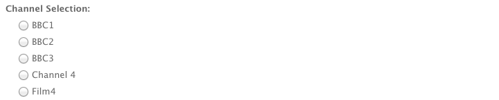

# Componenti per l’authoring delle pagine{#components-for-page-authoring}

>[!CAUTION]
>
>AEM 6.4 ha raggiunto la fine del supporto esteso e questa documentazione non viene più aggiornata. Per maggiori dettagli, consulta la nostra [periodi di assistenza tecnica](https://helpx.adobe.com/it/support/programs/eol-matrix.html). Trova le versioni supportate [qui](https://experienceleague.adobe.com/docs/).

I seguenti componenti sono destinati all’utilizzo per la creazione di contenuti per una pagina web standard. Costituiscono un sottoinsieme dei componenti disponibili out-of-the-box per un’installazione standard di AEM.

Alcuni sono immediatamente disponibili nella barra laterale, altri anche utilizzando [Modalità Progettazione](/help/sites-classic-ui-authoring/classic-page-author-design-mode.md) per attivarli o disattivarli.

>[!CAUTION]
>
>Questa sezione descrive solo i componenti disponibili pronti all’uso in un’installazione AEM standard.
>
>A seconda dell’istanza, è possibile che i componenti personalizzati siano stati sviluppati esplicitamente per le proprie esigenze. Questi possono anche avere lo stesso nome di alcuni dei componenti qui discussi.

I componenti sono disponibili quando [modifica di una pagina](/help/sites-classic-ui-authoring/classic-page-author-edit-content.md) dal **Componenti** scheda della barra laterale e **Inserisci nuovo componente** selettore (quando fai doppio clic nel **Trascina qui i componenti o le risorse** area).

Puoi selezionare un componente e trascinarlo nella posizione desiderata sulla pagina, quindi [Modifica contenuto e proprietà](/help/sites-classic-ui-authoring/classic-page-author-edit-content.md#editing-a-component-content-and-properties).

I componenti sono ordinati in base a varie categorie (gruppi di componenti), tra cui (per la creazione delle pagine):

* [Generale](#general): Include componenti di base tra cui testo, immagini, tabelle, grafici e così via.
* [Colonne](#columns): Include i componenti necessari per organizzare il layout dei contenuti.
* [Modulo](#formgroup): Include tutti i componenti necessari alla creazione di un modulo.

## Generale {#general}

I componenti Generali sono i componenti di base utilizzati per creare contenuti.

### Elemento account {#account-item}

Puoi definire un collegamento con titolo e descrizione.


### Immagine adattiva {#adaptive-image}

Il componente Immagine adattiva foundation genera immagini di dimensioni tali da adattarsi alla finestra in cui viene aperta la pagina web. Per utilizzare il componente, fornisci una risorsa immagine dal file system o da DAM. Quando la pagina web viene aperta, il browser scarica una copia dell’immagine che è stata ridimensionata in modo da adattarla alla finestra corrente.

Le dimensioni della finestra possono essere determinate dalle seguenti caratteristiche:

* Schermata del dispositivo: In genere, i dispositivi mobili visualizzano le pagine web in modo che si estendono su tutto lo schermo.
* Dimensioni della finestra del browser Web: Gli utenti di computer portatili e desktop possono ridimensionare le finestre del browser Web.

Ad esempio, il componente genera un’immagine piccola quando la pagina web viene aperta su un cellulare e un’immagine media quando viene aperta su un tablet. Su un portatile, il componente crea un&#39;immagine grande quando la pagina viene aperta in un browser web massimizzato. Quando il browser viene ridimensionato per adattarsi a una parte dello schermo, il componente si adatta fornendo un’immagine più piccola e aggiorna la visualizzazione.

#### Formati immagine supportati {#supported-image-formats}

Con il componente Immagine adattiva è possibile utilizzare file di immagine con le seguenti estensioni:

* .jpg
* .jpeg
* .png
* .gif &amp;ast;&amp;ast;

>[!CAUTION]
>
>&amp;ast;&amp;ast; I file .gif animati non sono supportati in AEM per le rappresentazioni adattive.

#### Dimensioni e qualità delle immagini {#images-sizes-and-quality}

Nella tabella seguente sono elencati i valori di larghezza dell&#39;immagine generati per la larghezza di visualizzazione specificata. L’altezza dell’immagine generata viene calcolata in modo da mantenere proporzioni costanti e non si verifica spazio vuoto all’interno del bordo dell’immagine. Il ritaglio può essere utilizzato per evitare spazi bianchi.

Quando l&#39;immagine è un&#39;immagine di JPEG, la dimensione del riquadro di visualizzazione può anche influenzare la qualità di JPEG. Sono possibili le seguenti qualità JPEG:

* Bassa (0,42)
* Media (0,82)
* Alta (1,00)

| Intervallo di larghezza di visualizzazione (pixel) | Larghezza immagine (pixel) | Qualità JPEG | Tipo di dispositivo di destinazione |
|---|---|---|---|
| larghezza &lt;= 319 | 320 | bassa |  |
| larghezza = 320 | 320 | media | Cellulare (verticale) |
| 320 &lt; larghezza &lt; 481 | 480 | media | Cellulare (orizzontale) |
| 480 &lt; larghezza &lt; 769 | 476 | alta | Tablet (verticale) |
| 768 &lt; larghezza &lt; 1025 | 620 | alta | Tablet (orizzontale) |
| larghezza &lt;= 1025 | full (dimensione originale) | alta | Desktop |

#### Proprietà {#properties}

La finestra di dialogo consente di modificare le proprietà per l’istanza del componente Immagine adattiva, molte delle quali sono comuni con il componente Immagine su cui è basato. Le proprietà sono disponibili in due schede:

* **Immagine**

   * **Immagine**

      Trascina un’immagine da Content Finder oppure fai clic per aprire una finestra con cui caricare un’immagine. Una volta caricata l’immagine, è possibile ritagliarla, ruotarla o eliminarla. Per ingrandire e ridurre l’immagine, utilizzate la barra di scorrimento al di sotto dell’immagine (sopra i pulsanti OK e Annulla)

   * **Ritaglia**

      Ritaglia un’immagine. Trascinate il bordo per ritagliare l’immagine.

   * **Rotazione**

      Fate clic più volte su Ruota fino a ottenere la rotazione desiderata.

   * **Cancella**

      Rimuovi l&#39;immagine corrente.

* **Avanzate**

   * **Titolo**

      Il componente Immagine adattiva non utilizza questa proprietà.

   * **Testo Alt**

      Testo alternativo per l’immagine.

   * **Collega a**

      Il componente Immagine adattiva non utilizza questa proprietà.

   * **Descrizione**

      Il componente Immagine adattiva non utilizza questa proprietà.

#### Estensione del componente Immagine adattiva {#extending-the-adaptive-image-component}

Per informazioni sulla personalizzazione del componente Immagine adattiva, consulta [Informazioni sul componente Immagine adattiva](/help/sites-developing/responsive.md#using-adaptive-images).

### Carosello {#carousel}

Il componente Carosello consente di visualizzare le immagini associate a singole pagine:

* una per volta
* per un breve periodo
* in un ordine specificato
* con un ritardo specificato

I controlli selezionabili consentono inoltre all’utente di scorrere le pagine visualizzate in tempo reale e su richiesta. Facendo clic sull’immagine della pagina visibile si passa alla pagina corrispondente. In altre parole, il carosello funge da controllo di navigazione.

#### Proprietà {#properties-1}

Sono disponibili in due schede:

* **Carosello**
Qui si specifica il funzionamento del carosello:

   * Velocità di riproduzione

      Tempo in millisecondi prima della visualizzazione della diapositiva successiva.
   * Tempo di transizione

      Tempo in millisecondi per la transizione tra due diapositive.
   * Stile comandi

      Sono disponibili varie opzioni da un menu a discesa; ad esempio, Pulsanti Prec/Succ, Opzioni alto-destra.

* **Elenco**
Qui si specifica come vengono incluse le pagine nel carosello:

   * **Genera elenco con**

      Esistono diversi modi per creare un elenco di pagine: Pagine figlie, Elenco fisso, Ricerca o Ricerca avanzata (descritti di seguito).

      Tieni presente che, indipendentemente dal metodo scelto, alle pagine incluse nell’elenco dovrebbe essere già associata un’immagine alla pagina, questa verrà visualizzata nel carosello. Se non è presente un’immagine per una determinata pagina nelle Proprietà pagina di tale pagina, è necessario associare un’immagine alla pagina prima di iniziare. In caso contrario il carosello visualizzerà una pagina vuota (o per lo più vuota). Vedi [Modifica delle proprietà di una pagina](/help/sites-classic-ui-authoring/classic-page-author-edit-page-properties.md).

      A seconda dell’elemento scelto viene visualizzato un nuovo pannello:

      * **Opzioni per le pagine secondarie**

         * **Pagina padre**

            Specifica un percorso manualmente o utilizzando il selettore. Lascia vuoto per utilizzare la pagina corrente come pagina padre.
      * **Opzioni per elenco fisso**

         * **Pagine**

            Seleziona un elenco di pagine. Utilizzo `+` per aggiungere altre voci e i pulsanti su/giù per regolare l&#39;ordine.
      * **Opzioni per la ricerca**

         * **Inizia in**

            Immettere un percorso iniziale, manualmente o utilizzando il selettore.

         * **Query di ricerca**
È possibile immettere una query di ricerca con testo normale.
      * **Opzioni di ricerca avanzata**

         * **Notazione predicato Querybuilder**

            È possibile inserire una query di ricerca utilizzando la notazione predicato Querybuilder. Ad esempio, puoi inserire &quot;fulltext=Marketing&quot; per visualizzare nel carosello tutte le pagine con &quot;Marketing&quot; nel contenuto.

            Vedi [API di QueryBuilder](/help/sites-developing/querybuilder-api.md) per una discussione completa delle espressioni di query e ulteriori esempi.
   * **Ordina per**

      Seleziona `jcr:title`, `jcr:created`, `cq:lastModified`oppure `cq:template` dal menu a discesa .

   * **Limite**

      Numero massimo di elementi da utilizzare nel carosello; questo è facoltativo.


>[!NOTE]
>
>Puoi creare un componente carosello personalizzato per Adobe Experience Manager per la visualizzazione delle risorse digitali presenti nel DAM AEM. Per informazioni, consulta [Creazione di componenti Carosello personalizzati per Adobe Experience Manager](https://helpx.adobe.com/experience-manager/using/custom-carousel-components.html).

### Grafico {#chart}

Il componente Grafico consente di aggiungere un grafico a barre, a linee o a torta. AEM un grafico a partire dai dati forniti. Puoi fornire i dati digitando direttamente nella scheda Dati oppure copiando e incollando un foglio di calcolo.

* **Dati**

   * **Dati grafico**

      Immetti i dati del grafico in formato CSV; il formato Valori separati da virgola utilizza virgole (&quot;,&quot;) come separatore di campo.

* **Avanzate**

   * **Tipo di grafico**

      Selezionare tra Grafico a torta, Grafico a linee e Grafico a barre.

   * **Testo alternativo**

      Testo alternativo che viene visualizzato al posto del grafico.

   * **Larghezza**

      Larghezza del grafico in pixel.

   * **Altezza**

      Altezza del grafico in pixel.

Di seguito è riportato un esempio di dati del grafico seguito dal grafico a barre risultante:

 

>[!NOTE]
>
>Puoi creare un controllo grafico AEM personalizzato che visualizza i dati presenti nel JCR AEM. Per informazioni, consulta [Visualizzazione dei dati di Adobe Experience Manager in un grafico](https://helpx.adobe.com/experience-manager/using/displaying-experience-manager-data-chart.html).

### Frammenti di contenuto {#content-fragment}

>[!CAUTION]
>
>La funzionalità completa di Gestione dei frammenti di contenuto è disponibile solo nell’interfaccia touch.
>
>Il componente Frammento di contenuto può essere visualizzato nella barra laterale dell’interfaccia classica, ma non sono disponibili ulteriori funzioni.

[Frammenti di contenuto](/help/sites-classic-ui-authoring/classic-page-author-content-fragments.md) vengono creati e gestiti come risorse indipendenti dalla pagina. Puoi quindi utilizzare questi frammenti, con le relative varianti, durante l’authoring di pagine di contenuto.

### Importazione progettazione {#design-importer}

Questo consente di caricare un file zip contenente un pacchetto di progettazione.

### Scarica {#download}

Il componente Scarica crea un collegamento nella pagina web selezionata per scaricare un file specifico. Puoi trascinare una risorsa da Content Finder oppure caricare un file.

* **Download**

   * **Descrizione**

      Breve descrizione visualizzata con il collegamento di download.

   * **File**

      File disponibile per il download nella pagina web risultante. Trascina una risorsa da Content Finder oppure fai clic sull’area per caricare il file da rendere disponibile per il download.

L’esempio seguente mostra il componente Scarica in Geometrixx:


### Esterno {#external}

Il componente per l’integrazione con applicazioni esterne (**Esterno**) consente di incorporare applicazioni esterne nella pagina AEM utilizzando un iframe.

* **Esterno**

   * **Applicazione di destinazione**

      Specificare l&#39;URL dell&#39;applicazione web da integrare; ad esempio:

      ```
      https://en.wikipedia.org/wiki/Main_Page
      ```

   * **Passa parametri**

      Se necessario, seleziona la casella per i parametri da passare all’applicazione.

   * **Larghezza e altezza**

      Definire le dimensioni dell’iframe

l&#39;applicazione esterna è integrata nel sistema paragrafo della pagina AEM; ad esempio, quando si utilizza un&#39;applicazione Target di `https://en.wikipedia.org/wiki/Main_Page`:


>[!NOTE]
>
>A seconda del caso d’uso, sono disponibili altre opzioni per l’integrazione di applicazioni esterne, ad esempio. la [Integrazione di portlet](/help/sites-administering/aem-as-portal.md).

### Flash {#flash}

Il componente Flash consente di caricare un filmato Flash. Puoi trascinare una risorsa Flash da Content Finder sul componente oppure utilizzare la finestra di dialogo:

* **Flash**

   * **Filmato Flash**

      File del filmato Flash. Potete trascinare una risorsa da Content Finder oppure fare clic per aprire una finestra con cui individuare il contenuto.

   * **Dimensione**

      Dimension in pixel dell’area di visualizzazione destinata al filmato.

* **Immagine alternativa**

   Immagine alternativa da visualizzare

* **Avanzate**

   * **Menu di scelta rapida**

      Indica se il menu di scelta rapida deve essere visualizzato o nascosto.

   * **Modalità finestra**

      Aspetto della finestra, ad esempio opaca, trasparente o distinta (solida).

   * **Colore sfondo**

      Colore di sfondo selezionato dalla tavola colori fornita.

   * **Versione minima**

      Versione minima del Flash Player di Adobe necessario per eseguire il filmato. Il valore predefinito è 9.0.0.

   * **Attributi**

      Eventuali altri attributi richiesti.

### Immagine {#image}

Il componente Immagine visualizza un’immagine e il relativo testo in base ai parametri specificati.

Puoi caricare un’immagine, quindi modificarla e manipolarla (ad esempio ritagliarla, ruotarla, aggiungere un collegamento/titolo/testo).

Puoi trascinare un’immagine da [Content Finder](/help/sites-classic-ui-authoring/classic-page-author-env-tools.md#the-content-finder) direttamente sul componente o sulla relativa finestra di dialogo Modifica. È inoltre possibile fare doppio clic nell’area centrale della finestra di dialogo Modifica per sfogliare il file system locale e caricare un’immagine. Le due schede della finestra di dialogo Modifica controllano anche tutte le definizioni e le manipolazioni dell’immagine:


>[!NOTE]
>
>Impossibile monitorare l&#39;avanzamento del caricamento con Internet Explorer.
>
>Gli utenti di Internet Explorer devono caricare l’immagine e fare clic su **Ok** quindi riapri l’immagine per visualizzare il file caricato nell’anteprima e per poter eseguire modifiche (ad es. ritagliare).
>
>Consulta la sezione [Piattaforme certificate](/help/release-notes/release-notes.md#certifiedplatforms) per ulteriori informazioni sulle funzioni di HTML5 utilizzate da AEM.

Quando un’immagine viene caricata, puoi configurare quanto segue:

* **Mappa**

   Per mappare un’immagine, seleziona Mappa. È possibile specificare come si desidera creare la mappa immagine (rettangolare, poligonale e così via) e la destinazione dell’area.

* **Ritaglia**

   Selezionate Ritaglia per ritagliare un’immagine. Utilizza il mouse per ritagliare l&#39;immagine.

* **Rotazione**

   Per ruotare un’immagine, selezionate Ruota. Utilizzare ripetutamente finché l&#39;immagine non viene ruotata nel modo desiderato.

* **Cancella**

   Rimuovi l&#39;immagine corrente.

* **Barra Zoom**

   Per ingrandire e ridurre l’immagine, utilizzate la barra di scorrimento al di sotto dell’immagine (sopra i pulsanti OK e Annulla)

* **Titolo**

   Titolo dell’immagine.

* **Testo Alt**

   Testo alternativo da utilizzare per la creazione di contenuto accessibile.

* **Collega a**

   Crea un collegamento a risorse o altre pagine all’interno del sito web.

* **Descrizione**

   Una descrizione dell’immagine.

* **Dimensione**

   Imposta l’altezza e la larghezza dell’immagine.

L&#39;immagine finale (con **Titolo** e **Descrizione**) può essere visualizzata come:


### Contenitore di layout {#layout-container}

>[!CAUTION]
>
>Il componente Contenitore di layout è disponibile anche nell’interfaccia classica, ma le sue funzionalità complete sono disponibili solo nell’interfaccia touch. Per maggiori dettagli vedi [Layout reattivo](/help/sites-classic-ui-authoring/classic-page-author-responsive-layout.md).

### Elenco {#list}

Il componente Elenco consente di configurare i criteri di ricerca per la visualizzazione di un elenco:

* **Elenco**

   * **Genera elenco con**

      Qui si specifica dove verrà recuperato il contenuto dell’elenco. Esistono diversi metodi:

   * A seconda dell’elemento scelto viene visualizzato un nuovo pannello:

      * **Opzioni per le pagine secondarie**

         * **Bambini di** (Pagina padre)

            Specifica un percorso manualmente o utilizzando il selettore. Lascia vuoto per utilizzare la pagina corrente come pagina padre.
      * **Opzioni per elenco fisso**

         * **Pagine** - Selezionare un elenco di pagine. Utilizza + per aggiungere altre voci e i pulsanti su/giù per regolare l’ordine.
      * **Opzioni per la ricerca**

         * **Inizia** - Immettere un percorso iniziale, manualmente o utilizzando il selettore. Query di ricerca È possibile immettere una query di ricerca di testo normale.
      * **Opzioni di ricerca avanzata**

         * **Notazione predicato Querybuilder** - È possibile inserire una query di ricerca utilizzando la notazione predicato Querybuilder. Ad esempio, puoi inserire &quot;fulltext=Marketing&quot; per visualizzare nel carosello tutte le pagine con &quot;Marketing&quot; nel contenuto. Vedi [API di QueryBuilder](/help/sites-developing/querybuilder-api.md) per una discussione completa delle espressioni di query e ulteriori esempi.
      * **Tag** - Specifica la **Pagina padre**, **Tag/Parole chiave** e i criteri di corrispondenza richiesti.
   * **Visualizza come**

      Come si desidera che gli elementi siano elencati; include collegamenti, teaser e notizie.

   * **Ordina per**

      Se l’elenco deve essere ordinato e, in tal caso, i criteri da utilizzare per l’ordinamento. Puoi immettere un criterio o selezionarne uno dall’elenco a discesa fornito.

   * **Limite**

      Specifica il numero massimo di elementi da visualizzare nell’elenco.

   * **Abilita feed**

      Indica se attivare un feed RSS per l’elenco.

   * **Paginare dopo**

      Qui è possibile specificare il numero di voci da visualizzare contemporaneamente. Un elenco con più elementi di quanto specificato utilizzerà l’impaginazione per visualizzare l’elenco in più parti.


L’esempio seguente mostra un **Elenco** come può visualizzare un elenco di pagine figlie (la progettazione è controllata dalle definizioni CSS personalizzate di una progettazione del sito).


### Accesso {#login}

Vengono forniti i campi Nome utente e Password .


Puoi configurare i seguenti parametri:

* Accesso

   * Etichetta sezione

      Testo iniziale per i campi di input.

   * Etichetta nome utente

      Testo per etichettare il campo del nome utente.

   * Etichetta password

      Testo per etichettare il campo password.

   * Etichetta pulsante Accesso

      Testo del pulsante di accesso.

   * Reindirizza a

      Puoi specificare la pagina del sito web che deve essere aperta dopo l’accesso dell’utente.

* Accesso già effettuato

   * Etichetta pulsante Continua

      Testo per indicare che l’utente ha già effettuato l’accesso.

### Stato ordine {#order-status}

* **Titolo**

   * **Titolo**

      Specificare il testo del titolo che si desidera visualizzare.

   * **Collegamento**

      Specifica la pagina (prodotto) per la quale deve essere visualizzato lo stato dell’ordine.

   * **Tipo/Dimensione**

      Seleziona dalla selezione fornita.


### Riferimento {#reference}

La **Riferimento** consente di fare riferimento a testo da un’altra pagina del sito web AEM (nell’istanza corrente). Il contenuto del paragrafo a cui si fa riferimento viene visualizzato come se si trovasse nella pagina corrente. Il contenuto viene aggiornato quando il paragrafo sorgente cambia (potrebbe essere necessario un aggiornamento della pagina).

* **Riferimento paragrafo**

   * **Riferimento**

      Specifica il percorso della pagina e il paragrafo a cui fare riferimento (includere il contenuto).

Per specificare il percorso di un paragrafo, è necessario aggiungere come suffisso il percorso (della pagina) con:

`.../jcr:content/par/<paragraph-ID>`

Ad esempio:

`/content/geometrixx-outdoors/en/equipment/biking/cajamara/jcr:content/par/similar-products`

Oltre a fare riferimento a un paragrafo specifico, il percorso può anche essere modificato per specificare un sistema di paragrafi completo. Per farlo, è possibile soffiare il percorso con:

`/jcr:content/par`

Ad esempio:

`/content/geometrixx-outdoors/en/equipment/biking/cajamara/jcr:content/par`

Una volta configurato il contenuto apparirà esattamente come nella pagina sorgente. Il fatto che si tratti di un riferimento viene visualizzato solo quando si apre il componente per la modifica:


### Ricerca {#search-features}

Il componente Ricerca aggiunge funzionalità di ricerca alla pagina.

Puoi configurare i seguenti parametri:

* Ricerca

   * **Tipi di nodo**

      Se la ricerca deve essere limitata a specifici tipi di nodo elencali qui; ad esempio, `cq:Page`.

   * **Percorso di ricerca**

      Specificare la pagina principale del ramo che si desidera cercare.

   * **Testo pulsante Cerca**

      Nome visualizzato sul pulsante di ricerca effettivo.

   * **Testo per le statistiche**

      Testo visualizzato sopra i risultati della ricerca.

   * **Testo Nessun risultato**

      In assenza di risultati, viene visualizzato il testo inserito qui.

   * **Controllo ortografia del testo**

      Se un utente immette un termine simile, questo testo viene visualizzato prima del termine.

      Ad esempio, se digitate geometrixxe, il sistema visualizza &quot;Intendete? geometrixx&quot;.

   * **Testo per pagine simili**

      Testo visualizzato accanto a un risultato per pagine simili. Fai clic su questo collegamento per visualizzare le pagine con contenuto simile.

   * **Testo di ricerche correlate**

      Testo visualizzato accanto a ricerche per termini e argomenti correlati.

   * **Testo delle tendenze di ricerca**

      Titolo al di sopra dei termini di ricerca inseriti dall’utente.

   * **Etichetta pagina risultati**

      Testo visualizzato in fondo all’elenco con collegamenti alle altre pagine dei risultati.

   * **Etichetta precedente**

      Nome visualizzato sul collegamento alle pagine di ricerca precedenti.

   * **Etichetta successiva**

      Nome visualizzato sul collegamento alle pagine di ricerca successive.

L’esempio seguente mostra il componente Ricerca dopo una ricerca per la parola *geometrixx* dalla directory principale di un&#39;installazione standard. Questo illustra anche l’impaginazione dei risultati:


L’esempio seguente mostra un termine di ricerca errato e non disponibile:


### Sitemap {#sitemap}

Un elenco automatico di mappa del sito, che (con le impostazioni predefinite) elenca tutte le pagine (come collegamenti attivi) del sito Web corrente. Ad esempio, un estratto mostra:


Se necessario, puoi configurare i seguenti parametri:

* **Sitemap**

   * **Percorso radice**
Percorso da cui deve iniziare l’elenco.

### Presentazione {#slideshow}

Questo componente consente di caricare una serie di immagini da visualizzare sulla pagina come slideshow.È possibile aggiungere o rimuovere immagini e assegnare un titolo a ognuna di esse. In Avanzate è inoltre possibile specificare la dimensione dell’area di visualizzazione.

Puoi configurare i seguenti parametri:

* **Diapositive**

   * **Nuova diapositiva**

      È possibile specificare una selezione di diapositive utilizzando **Aggiungi** e **Rimuovi**).

   * **Titolo**

      Se necessario, specifica un titolo. Questo viene sovrapposto sulla diapositiva appropriata.

* **Avanzate**

   * **Dimensione**

      Specifica la larghezza e l’altezza in pixel.

Il componente Presentazione visualizza quindi ripetutamente ciascuna immagine in sequenza, per un breve periodo di tempo, prima di passare alla diapositiva successiva:


### Tabella {#table}

>[!NOTE]
>
>La **Tabella** è basato su [Editor Rich Text](/help/sites-classic-ui-authoring/classic-page-author-rich-text-editor.md), come **[Testo](#text)** componente.
>
>Si consiglia di utilizzare il **Tabella** componenti per tabelle, anche se possono essere costruiti con **Testo** componente.

La **Tabella** Il componente è preconfigurato per consentire la creazione, il riempimento e il formato di una tabella. Tramite la finestra di dialogo è possibile configurare la tabella e creare il contenuto in uno dei modi seguenti:

* da zero
* copiare e incollare un foglio di calcolo o una tabella da un editor esterno (come Excel, OpenOffice, Blocco note, ecc.).


La schermata seguente mostra un esempio del componente tabella; la progettazione è determinata dal CSS specifico per il sito:


### Tag cloud {#tag-cloud}

Una nuvola di tag mostra graficamente una selezione di tag applicati al contenuto del sito web:


Durante la configurazione del componente Tag Cloud, puoi specificare:

* **Tag da visualizzare**

   Da dove vengono raccolti i tag da visualizzare. Seleziona da una pagina, da una pagina con tutte le pagine figlie o tutti i tag.

* **Pagina**

   Seleziona la pagina a cui fare riferimento.

* **Nessun collegamento sui tag**

   Indica se i tag visualizzati devono fungere da collegamenti.

Per ulteriori informazioni sull’applicazione dei tag, visita [Utilizzo dei tag](/help/sites-classic-ui-authoring/classic-feature-tags.md).

### Testo {#text}

>[!NOTE]
>
>La **Testo** è basato su [Editor Rich Text](/help/sites-classic-ui-authoring/classic-page-author-rich-text-editor.md), come **[Tabella](#table)** componente.
>
>Si consiglia di utilizzare il **Tabella** componenti per tabelle, anche se possono essere costruiti con **Testo** componente.

Il componente Testo consente di inserire un blocco di testo utilizzando un editor WYSIWYG, con funzionalità fornite da [Editor Rich Text](/help/sites-classic-ui-authoring/classic-page-author-rich-text-editor.md). Una selezione di icone consente di formattare il testo, con caratteristiche del font, allineamento, collegamenti, elenchi e rientri.


Quando apri la **Stili** della scheda **Modifica** è inoltre possibile impostare:

* **Spaziatore**
* **Stile di testo**

Il testo formattato verrà quindi mostrato sulla pagina; la progettazione effettiva dipenderà dal CSS del sito:


Per informazioni più dettagliate sul componente Testo e sulla funzionalità fornita dall’editor Rich Text, consulta la sezione [Editor Rich Text](/help/sites-classic-ui-authoring/classic-page-author-rich-text-editor.md) pagina.

#### Modifica locale {#inplace-editing}

Oltre alla modalità di modifica Rich Text basata su finestra di dialogo, AEM fornisce anche [Modifica locale](/help/sites-authoring/editing-content.md), che consente di modificare direttamente il testo visualizzato nel layout della pagina.

### Testo e immagine {#text-image}

Il componente Testo e immagine aggiunge un blocco di testo e un’immagine. È inoltre possibile aggiungere e modificare testo e immagini separatamente. Consulta la sezione [Testo](#text) e [Immagine](#image) componenti per dettagli.

 

Puoi configurare i seguenti parametri:

* **Stili dei componenti** (**Stili**)

   Qui puoi allineare l’immagine a sinistra o a destra. Il valore predefinito è **Sinistra** allineata, con l&#39;immagine a sinistra.

* **Proprietà immagine** (**Proprietà immagine avanzate**)

   Consente di specificare quanto segue:

   * **Risorsa immagine**

      Carica l’immagine richiesta.

   * **Titolo**

      il titolo del blocco; Il mouse viene visualizzato al passaggio del mouse.

   * **Testo Alt**

      Testo alternativo che verrà mostrato qualora l’immagine non sia disponibile. Se lasciato vuoto, verrà utilizzato il titolo.

   * **Collega a**

      Specifica un percorso di destinazione.

   * **Descrizione**

      Una descrizione dell’immagine.

   * **Dimensione**

      Imposta l’altezza e la larghezza dell’immagine.

L’esempio seguente mostra un componente Testo e immagine che mostra l’immagine allineata a sinistra:


### Titolo {#title}

Il componente Titolo può:

* visualizza il nome della pagina corrente; a questo scopo, lascia vuoto il campo Titolo .
* visualizza un testo specificato nel campo Titolo .

Puoi configurare i seguenti parametri:

* **Titolo**

   Se desideri utilizzare un nome diverso dal titolo della pagina, inseriscilo qui.

* **Collegamento**

   URI se il titolo deve fungere da collegamento.

* **Tipo/Dimensione**

   Selezionare Piccolo o Grande dall’elenco a discesa. Piccolo viene generato come immagine. Grande viene generato come testo.

L’esempio seguente mostra un **Titolo** componente visualizzato; la progettazione è determinata dal CSS specifico per il sito.


### Video {#video}

La **Video** consente di inserire un elemento video predefinito pronto all’uso in una pagina.

Vedi anche [Configurare i profili video](/help/sites-administering/config-video.md#configuringvideoprofiles) da utilizzare con gli elementi di HTML5.

Dopo aver posizionato un’istanza del componente sulla pagina è possibile configurare quanto segue:

* Video

   * **Risorsa video** - Carica o rilascia la risorsa video.
   * **Dimensione** - Le dimensioni native del video (larghezza x altezza in pixel) verranno visualizzate nelle caselle accanto a Dimensioni (vedi sopra). Immetti manualmente le dimensioni di larghezza e altezza per sovrascrivere le dimensioni native del video. Fai clic su **OK** per chiudere la finestra di dialogo.

>[!NOTE]
>
>I formati supportati includono:
>
>* `.mp4`
>* `Ogg`
>* `FLV` (video Flash)
>


## Colonne {#columns}

Le colonne sono un meccanismo per controllare il layout del contenuto in AEM. In un’installazione standard vengono forniti componenti per la creazione di due e/o 3 colonne.

L’esempio seguente mostra i componenti 2 Colonne e 3 Colonne in uso. È possibile utilizzare i segnaposto per i nuovi componenti:


### 2 Colonne {#columns-1}

Componente Controllo colonna con impostazione predefinita di 2 colonne uguali.

### 3 Colonne {#columns-2}

Componente Controllo colonna con impostazione predefinita di 3 colonne uguali.

### Controllo colonna {#column-control}

Il componente Controllo colonna consente agli utenti di selezionare in che modo desiderano dividere in più colonne il contenuto del pannello principale della pagina web. Gli utenti possono selezionare il numero di colonne desiderato (da un elenco predefinito) e quindi creare, eliminare o spostare il contenuto all’interno di ciascuna colonna.

* **Controllo colonna**

   * **Layout colonna**

      Selezionare il numero di colonne desiderato. Una volta creata, ogni colonna dispone di un proprio collegamento per trascinare componenti o risorse durante l’aggiunta di contenuto.

## Modulo {#form}

I componenti modulo vengono utilizzati per creare moduli che consentono ai visitatori di inviare contributi. Forms e i componenti per moduli possono essere utilizzati per raccogliere informazioni quali feedback dagli utenti (ad esempio, un questionario sulla soddisfazione del cliente) e informazioni sugli utenti (ad esempio, registrazione utente).

>[!NOTE]
>
>Vedi [Guida di AEM Forms](/help/forms/home.md) per informazioni su AEM Forms.

Forms è costituito da diversi componenti diversi:

* **Modulo**

   Il componente Modulo definisce l’inizio e la fine di un nuovo modulo sulla pagina. È quindi possibile inserire altri componenti tra questi elementi, ad esempio tabelle, download e così via.

* **Campi ed elementi modulo**

   I campi e gli elementi modulo possono includere caselle di testo, pulsanti di scelta, immagini e così via. L’utente spesso completa un’azione in un campo modulo, ad esempio digita del testo. Per ulteriori informazioni, consulta la sezione sui singoli elementi del modulo .

* **Componenti del profilo**

   I componenti profilo si riferiscono ai profili dei visitatori utilizzati per collaborazione social e altre aree in cui è richiesta la personalizzazione in base al visitatore.

Di seguito è riportato un esempio di modulo; è costituito da **Modulo** componente (inizio e fine), con due **Testo modulo** campi utilizzati per l’input, a **Testo generale** campo utilizzato per il testo introduttivo e un **Invia** pulsante .


>[!NOTE]
>
>Per ulteriori informazioni sullo sviluppo e la personalizzazione dei moduli, consulta [Pagina Sviluppo di Forms](/help/sites-developing/developing-forms.md). Ciò include l’aggiunta di azioni, vincoli, precaricamento di campi e l’utilizzo di script per chiamare un servizio per intervenire, tra gli altri.

### Impostazioni comuni a (molti) componenti modulo {#settings-common-to-many-form-components}

Sebbene ciascuno dei componenti modulo abbia uno scopo diverso, molti sono composti da opzioni e parametri simili.

Quando si configura un componente modulo, nella finestra di dialogo sono disponibili le seguenti schede:

* **Titolo e testo**

   Qui si specificano le informazioni di base, ad esempio il titolo del modulo ed eventuale testo di corredo. Se appropriato è inoltre possibile definire altre informazioni chiave, ad esempio se il campo è selezionabile in più elementi e quali possono essere selezionati.

* **Valori iniziali**

   Consente di specificare un valore predefinito.

* **Vincoli**

   Qui è possibile specificare se un campo è obbligatorio ed eventuali vincoli associati al campo (ad esempio se il valore deve essere numerico e così via).

* **Attribuzione stile**

   Indica la dimensione e lo stile dei campi.

>[!NOTE]
>
>I campi disponibili variano notevolmente a seconda del singolo componente.

Queste schede forniscono i parametri necessari; dipendono dal singolo tipo di componente, ma possono includere:

* **Titolo e testo**

   * **Nome elemento**

      Nome dell’elemento modulo. Indica la posizione di memorizzazione dei dati nel repository.

      Questo campo è obbligatorio e deve contenere solo i seguenti caratteri:

      * caratteri alfanumerici
      * `_ . / : -`
   * **Titolo**

      Titolo visualizzato con il campo . Se lasciato vuoto, viene visualizzato il titolo predefinito.

   * **Descrizione**

      Consente di fornire informazioni aggiuntive per l’utente, se necessario. Nel modulo questo viene visualizzato sotto il campo, in un font più piccolo rispetto al titolo.

   * **Mostra/Nascondi**

      Determina quando il campo è visibile.


* **Valori iniziali**

   * **Valore predefinito**

      Il valore visualizzato nel campo all’apertura del modulo; Cioè prima che l&#39;utente abbia effettuato qualsiasi input.

* **Vincoli**

   * **Obbligatorio**

      Questo dipende dal tipo di componente modulo, ma fornisce una o più caselle di controllo per indicare che questo campo, o alcune parti di esso, sono obbligatorie.

   * **Messaggio richiesto** - Un messaggio per informare gli utenti che questo campo è obbligatorio; anche un campo obbligatorio sarà contrassegnato da un asterisco.
   * **Vincolo** - I vincoli disponibili per la selezione dipendono dal tipo di componente modulo.
   * **Messaggio vincolo**
Un messaggio per informare gli utenti di ciò che è necessario.

* **Attribuzione stile**

   * **Dimensione**

      In righe e colonne.

   * **Larghezza**

      In pixel.

   * **CSS**

### Modulo (componente) {#form-component}

Il componente Modulo definisce l’inizio e la fine di un modulo mediante l’uso della **Inizio modulo** e **Fine modulo** elementi. Sono sempre associati per garantire la corretta definizione del modulo.


Tra l’inizio e la fine di un modulo è possibile aggiungere componenti modulo che definiscono i campi di immissione effettivi per gli utenti.

#### Inizio del modulo {#start-of-form}

Questo componente è necessario per definire l’inizio di un nuovo modulo su una pagina. Puoi configurare i seguenti parametri:

* **Modulo**

   * **Pagina di ringraziamento**
Pagina a cui fare riferimento per ringraziare i visitatori dopo aver fornito il proprio input. Se viene lasciato vuoto, dopo l’invio viene nuovamente visualizzato il modulo.
   * **Avvia flusso di lavoro**
Determina il flusso di lavoro che viene attivato dopo l’invio del modulo.

* **Avanzate**

   * **Tipo di azione**

      Un modulo richiede un’azione. L’azione definisce l’operazione che viene attivata per l’esecuzione con i dati inviati dall’utente (simile a action= in HTML). Alcuni hanno bisogno di **Configurazione azione**.

      Una selezione di tipi di azioni è inclusa in un’installazione standard AEM:

      * **Richiesta account**
      * **Crea contenuto**
      * **Crea lead**
      * **Crea e aggiorna account**
      * **Servizio e-mail: crea utente con sottoscrizione e aggiungi all&#39;elenco**
      * **Servizio e-mail: invia messaggio di risposta automatica**
      * **Servizio e-mail: annulla sottoscrizione a mailing list**
      * **Modifica community**
      * **Modifica risorse**
      * **Modifica risorse controllate da flusso di lavoro**
      * **Mail**
      * **Dettagli ordine inoltrato**
      * **Aggiornamento profilo**
      * **Ripristina password**
      * **Imposta password**
      * **Contenuto store**

         Questo è il tipo di azione predefinito.

      * **Contenuto store con caricamenti**
      * **Invia ordine**
      * **Annulla sottoscrizione utente**
      * **Aggiorna ordine**
   * **Identificatore modulo**

      L’identificatore del modulo identifica il modulo in modo univoco. Utilizzare l’identificatore del modulo se sono presenti più moduli su una singola pagina; assicurati che abbiano identificatori diversi.

   * **Percorso di caricamento**

      Percorso delle proprietà nodo utilizzato per caricare valori predefiniti nei campi del modulo.

      Questo è un campo facoltativo che specifica il percorso di un nodo nel repository. Quando le proprietà di questo nodo corrispondono ai nomi dei campi, i campi appropriati del modulo vengono precaricati con il valore di tali proprietà. Se non esiste alcuna corrispondenza, il campo contiene il valore predefinito.

      Utilizzo **Percorso di caricamento** è possibile precaricare il modulo con i valori inseriti nei campi richiesti. Vedi [Precaricamento dei valori dei moduli](/help/sites-developing/developing-forms.md#preloading-form-values).

   * **Convalida client**

      Indica se il modulo richiede la convalida client (convalida server) *sempre* si verifica.) Ciò può essere ottenuto in combinazione con **Forms Captcha** componente.

   * **Tipo risorsa validazione**

      Definisce il tipo di risorsa per la convalida del modulo se si desidera convalidare l’intero modulo (anziché i singoli campi). Se si convalida l’intero modulo, includere anche uno dei seguenti elementi:

      * Uno script per la convalida client:

         `/apps/<myApp>/form/<myValidation>/formclientvalidation.jsp`

      * Uno script per la convalida sul lato server:

         `/apps/<myApp>/form/<myValidation>/formservervalidation.jsp`
   * **Configurazione azione**

      Le opzioni disponibili in **Configurazione azione** dipendono dal **Tipo di azione** selezionato:

      * **Richiesta account**

         * **Pagina Crea account**
Pagina utilizzata per creare un nuovo account.
      * **Crea contenuto**

         * Percorso contenuto

            Percorso di contenuto per qualsiasi contenuto riprodotto nel modulo. Immettere un percorso che termina con una barra `/`. La barra indica che per ogni porta del modulo viene creato un nuovo nodo nel percorso specificato; ad esempio:

            `/forms/feedback/`

         * **Tipo**

            Seleziona il tipo richiesto.

         * **Modulo**

            Specificare il modulo.

         * **Rendering con**

            Seleziona l’opzione desiderata dall’elenco.

         * **Tipo risorsa**

            Se impostato, questo viene aggiunto a ogni commento come `sling:resourceType`

         * **Selettore vista**
      * **Crea lead**

         * **Il lead verrà aggiunto a questo elenco**

            Specifica l’elenco di lead richiesto.
      * **Crea e aggiorna account**

         * **Gruppo iniziale**

            Gruppo a cui assegnare il nuovo utente.

         * **Pagina principale**

            Pagina da visualizzare dopo l’accesso.

         * **Percorso**

            Percorso (relativo) per la creazione e la memorizzazione del nuovo account.

         * **Visualizza dati...**

            Fai clic su questo pulsante per accedere alle informazioni sui risultati del modulo in Modifiche collettive. Da qui puoi esportare le informazioni in un `.tsv` File (separato da tabulazioni) da utilizzare, ad esempio, in un foglio di calcolo Excel.
      * **Mail**

         * **Da**

            Immetti l’indirizzo e-mail dal quale deve essere inviato il messaggio e-mail.

         * **Invia a**

            Immettere gli indirizzi e-mail a cui deve essere inviato il modulo.

         * **CC**

            Inserisci gli indirizzi e-mail per invio CC.

         * **CCN**

            Inserisci gli indirizzi e-mail CCN.

         * **Oggetto**

            Immetti l’oggetto dell’e-mail.
      * **Ripristina password**

         * **Pagina modifica password**

            Pagina utilizzata per modificare la password.
      * **Contenuto store**

         * **Percorso contenuto**

            Percorso di contenuto per qualsiasi contenuto riprodotto nel modulo. Immettere un percorso che termina con una barra `/`. La barra indica che per ogni porta del modulo viene creato un nuovo nodo nel percorso specificato; ad esempio:

            `/forms/feedback/`

         * **Visualizza dati...**

            Fai clic su questo pulsante per accedere alle informazioni sui risultati del modulo in Modifiche collettive. Da qui puoi esportare le informazioni in un file .tsv (separato da tabulazioni) da utilizzare, ad esempio, in un foglio di calcolo Excel.
      * **Contenuto store con caricamenti**

         Ha le stesse opzioni di **Contenuto store**.

      * **Annulla sottoscrizione utente**

         * **Il lead verrà eliminato da questo elenco**

            Specifica l’elenco di lead richiesto.


#### Fine del modulo {#end-of-form}

Indica la fine del modulo. Puoi configurare i seguenti parametri:

* **Fine modulo**

   * **Mostra pulsante Invia**

      Indica se mostrare o meno un pulsante Invia.

   * **Nome invio**

      Identificatore, se si utilizzano più pulsanti Invia in un modulo.

   * **Titolo invio**

      Nome visualizzato sul pulsante, ad esempio Invia.

   * **Mostra pulsante Ripristina**

      Selezionare la casella di controllo per rendere visibile il pulsante Ripristina.

   * **Titolo ripristino**

      Nome visualizzato sul pulsante Ripristina.

   * **Descrizione**

      Informazioni visualizzate sotto il pulsante.

### Nome account {#account-name}

Questo consente all’utente di inserire un nome account:


### Indirizzo {#address}

Questo consente di aggiungere un campo indirizzo internazionale nel seguente formato:


Il componente è configurato per l’uso immediato, ma se necessario puoi modificare la configurazione. Ad esempio, è possibile aggiungere vincoli per i singoli elementi dell’indirizzo . Se i campi rimangono vuoti, verranno utilizzate le impostazioni predefinite.

### Captcha {#captcha}

Il componente Captcha richiede all’utente di digitare una stringa alfanumerica come visualizzata sullo schermo. La stringa cambia con ogni aggiornamento.


Puoi configurare vari parametri per questo componente, incluso un messaggio da visualizzare quando la stringa captcha non è valida.

### Gruppo di caselle di controllo {#checkbox-group}

Una casella di controllo consente di creare un elenco di una o più caselle di controllo, molte delle quali possono essere selezionate contemporaneamente.


Puoi specificare vari parametri, tra cui un titolo, una descrizione e un nome di elemento. Utilizzando i pulsanti + e - è possibile aggiungere o rimuovere elementi, quindi posizionarli con le frecce su e giù.

>[!NOTE]
>
>Utilizzo **Percorso di caricamento elementi** è possibile precaricare l’elenco dei gruppi di caselle di controllo con i relativi valori.
>
>Vedi [Precaricamento dei campi modulo con più valori](/help/sites-developing/developing-forms.md#preloading-form-fields-with-multiple-values).

### Dati carta di credito {#credit-card-details}

Ciò ti consente di fornire i campi necessari per inserire i dettagli della carta di credito. Puoi configurarlo per specificare i tipi di scheda accettati e le informazioni richieste (ad esempio, il codice di sicurezza).


### Elenco a discesa {#dropdown-list}

Un elenco a discesa può essere configurato per fornire all’utente un intervallo di valori da selezionare:


È possibile specificare un titolo e gli elementi da visualizzare nell’elenco. Utilizzando i pulsanti + e - è possibile aggiungere o rimuovere le voci dell’elenco, quindi posizionarle con i pulsanti Su e Giù . È possibile specificare se gli utenti possono selezionare più elementi dall’elenco e tutti gli elementi che devono essere selezionati automaticamente la prima volta che aprono l’elenco (valori iniziali).

>[!NOTE]
>
>Utilizzo **Percorso di caricamento elementi** puoi precaricare l’elenco a discesa con i relativi valori.
>
>Vedi [Precaricamento dei campi modulo con più valori](/help/sites-developing/developing-forms.md#preloading-form-fields-with-multiple-values).

### Caricamento di file {#file-upload}

Il componente Caricamento file offre all’utente la possibilità di selezionare e caricare un file.


>[!NOTE]
>
>Puoi creare un componente di caricamento personalizzato per caricare i file su un servlet Sling. Per informazioni, consulta [Caricamento di file in Adobe Experience Manager](https://helpx.adobe.com/experience-manager/using/uploading-files-aem1.html).

### Campo nascosto {#hidden-field}

Questo componente consente di creare un campo nascosto. Questi possono essere utilizzati per vari scopi; ad esempio, quando è necessario eseguire un’azione dopo l’invio del modulo o quando i dati nascosti sono necessari in fase di post-elaborazione.


>[!NOTE]
>
>È inoltre possibile personalizzare il modulo in modo da mostrare o nascondere specifici componenti in base al valore di altri campi del modulo. La modifica della visibilità di un campo modulo è utile quando il campo è necessario solo in presenza di condizioni specifiche.
>
>Vedi [Mostrare e nascondere i componenti di un modulo](/help/sites-developing/developing-forms.md#showing-and-hiding-form-components).

### Pulsante immagine {#image-button}

Un pulsante immagine consente di creare un pulsante con immagine e testo personalizzati:


### Caricamento immagine {#image-upload}

Il componente Caricamento immagine offre all’utente la possibilità di selezionare e caricare un file di immagine.


### Campo collegamento {#link-field}

Il campo di collegamento consente all’utente di specificare un URL:


Viene utilizzato frequentemente per il modulo evento calendario, in cui è utilizzato per il campo URL/collegamento di un evento.

### Campo password {#password-field}

Viene utilizzato per consentire all’utente di inserire la propria password:


### Reimpostazione password {#password-reset}

Questo componente fornisce all’utente due campi:

* immissione di una password
* inserimento ripetuto della password per verificare che l&#39;input sia corretto.

Con le impostazioni predefinite, il componente viene visualizzato come segue:


### Gruppo pulsanti di scelta {#radio-group}

Un gruppo pulsanti di scelta fornisce un elenco di una o più caselle di controllo, una sola delle quali può essere selezionata in un determinato momento.

Puoi specificare il nome dell’elemento insieme a un titolo e a una descrizione Utilizza i pulsanti + e - per aggiungere o rimuovere elementi, posizionali con le frecce verso l’alto o il basso e specifica un valore predefinito, se necessario:



>[!NOTE]
>
>Utilizzo **Percorso di caricamento elementi** puoi precaricare il gruppo pulsanti di scelta con i relativi valori.
>
>Vedi [Precaricamento dei campi modulo con più valori](/help/sites-developing/developing-forms.md#preloading-form-fields-with-multiple-values).

### Pulsante Invia {#submit-button}

Questo componente consente di creare un pulsante di invio, con il testo predefinito:


Oppure con il tuo testo:


### Campo tag {#tags-field}

Questo campo consente di selezionare i tag:


Puoi specificare vari parametri, compresi i namespace utilizzabili mediante la scheda apposita:

* **Campo tag**

   * **Namespace consentiti**

      * **Geometrixx Outdoors**
      * **Flusso di lavoro**
      * **Forum**
      * **Fotografia Stock**
      * **Geometrixx Media**
      * **Tag standard**
      * **Marketing**
      * **Proprietà risorsa**
   * **Larghezza in pixel**
   * **Dimensione popup**


### Campo testo {#text-field}

Il campo di testo standard può essere configurato con le dimensioni richieste e con un messaggio lead personalizzato:


### Pulsanti invio flusso di lavoro {#workflow-submit-button-s}

Questo consente di creare un pulsante Invia da utilizzare in un flusso di lavoro.


