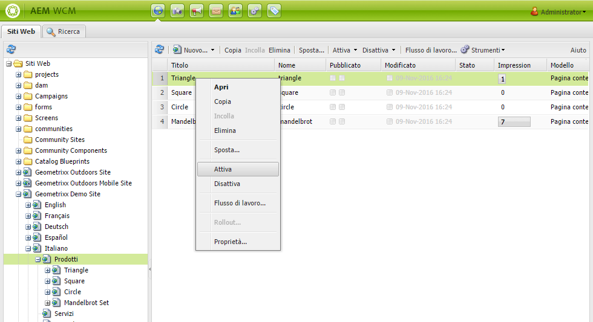
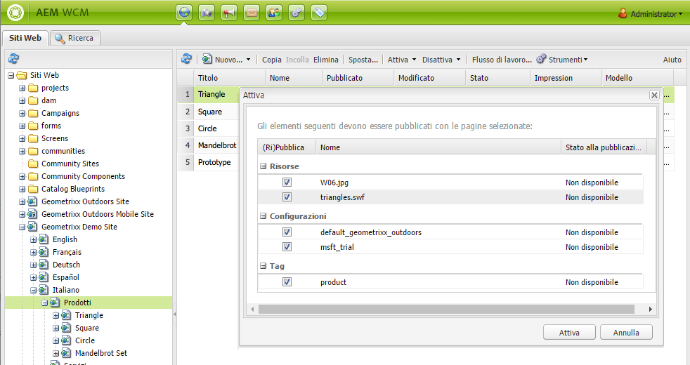
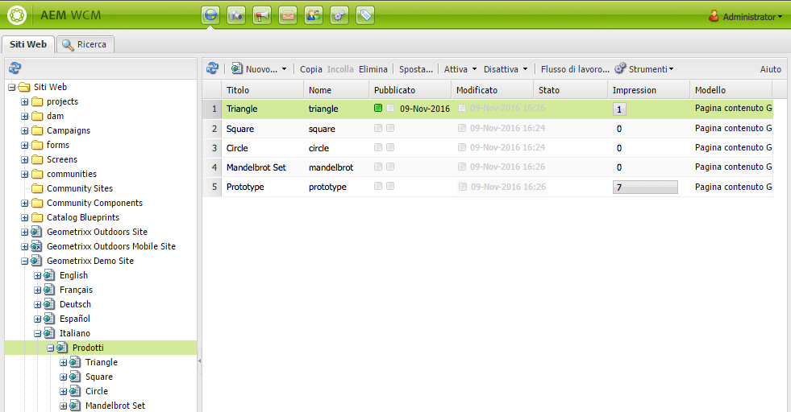
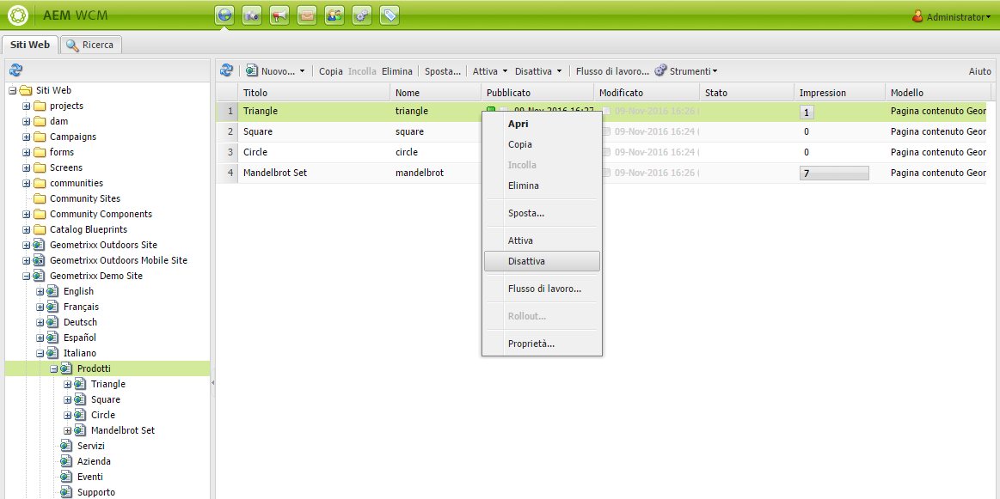
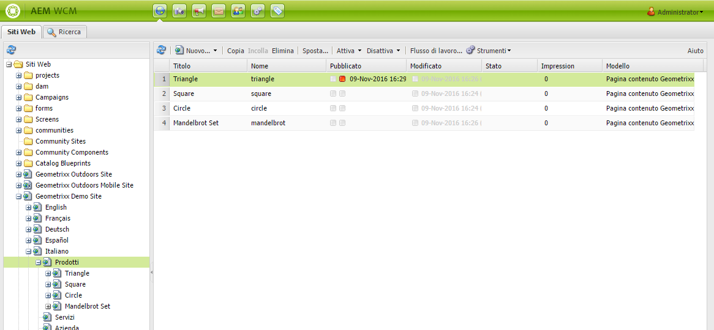
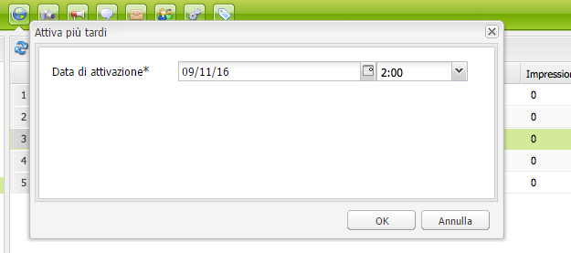
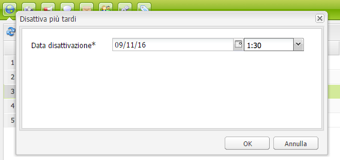
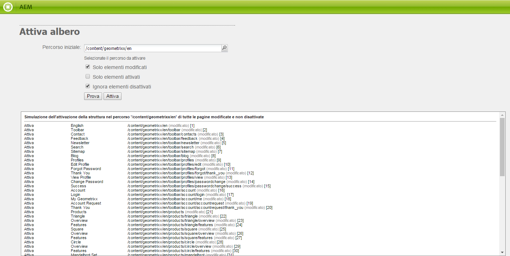

# Pubblicazione delle pagine{#publishing-pages}

>[!CAUTION]
>
>AEM 6.4 ha raggiunto la fine del supporto esteso e questa documentazione non viene più aggiornata. Per maggiori dettagli, consulta la nostra [periodi di assistenza tecnica](https://helpx.adobe.com/it/support/programs/eol-matrix.html). Trova le versioni supportate [qui](https://experienceleague.adobe.com/docs/).

Dopo aver creato e rivisto i contenuti nell’ambiente di authoring, devi renderli disponibili nel sito web pubblico (l’ambiente di pubblicazione).

Questa operazione è denominata pubblicazione della pagina. Quando si rimuove una pagina dall’ambiente di pubblicazione, si parla di annullamento della pubblicazione. Durante la pubblicazione e l’annullamento della pubblicazione della pagina rimane disponibile nell’ambiente di authoring per ulteriori modifiche, finché non viene eliminata.

Puoi anche pubblicare/annullare la pubblicazione di una pagina immediatamente o in una data/ora futura predefinita.

>[!NOTE]
>
>Alcuni termini relativi alla pubblicazione possono essere confusi:
>
>* **Pubblicare/Annullare la pubblicazione**
   >  Termini principali per le azioni che consentono di rendere o meno i contenuti disponibili al pubblico nell’ambiente di pubblicazione.
>
>* **Attivare/Disattivare**
   >  Sinonimi di pubblicare/annullare la pubblicazione.
>
>* **Replicare/Replica**
   >  Si tratta dei termini tecnici che descrivono lo spostamento di dati (ad esempio contenuto di pagina, file, codice, commenti degli utenti) da un ambiente all’altro, ad esempio per la pubblicazione o la replica inversa dei commenti degli utenti.
>

>[!NOTE]
>
>Se non disponi dei privilegi necessari per pubblicare una pagina specifica:
>
>* Viene avviato un flusso di lavoro per inviare alla persona appropriata la richiesta di pubblicazione.
>* Viene visualizzato un messaggio di notifica (per un breve periodo di tempo).
>

## Pubblicazione di una pagina {#publishing-a-page}

Esistono due metodi per attivare una pagina:

* [dalla console Siti web](#activating-a-page-from-the-websites-console)
* [dalla barra laterale della pagina stessa](#activating-a-page-from-sidekick)

>[!NOTE]
>
>È inoltre possibile attivare una struttura secondaria composta da più pagine utilizzando [Attiva albero](#howtoactivateacompletesectiontreeofyourwebsite) nella console Strumenti.

### Attivazione di una pagina dalla console Siti Web {#activating-a-page-from-the-websites-console}

Puoi attivare le pagine nella console Siti web . Dopo aver aperto una pagina e modificato il contenuto, torna alla console Siti Web :

1. Nella console Siti Web selezionate la pagina da attivare.
1. Seleziona **Attiva**, dal menu principale o dal menu a discesa dell’elemento pagina selezionato.

   Per attivare il contenuto della pagina e di tutte le relative sottopagine, utilizza la funzione [**Strumenti** console](/help/sites-classic-ui-authoring/classic-page-author-publish-pages.md#howtoactivateacompletesectiontreeofyourwebsite).

   

   >[!NOTE]
   >
   >Se necessario, AEM richiede di attivare o riattivare tutte le risorse collegate alla pagina. Puoi selezionare o deselezionare le caselle di controllo per attivare tali risorse.

1. Se necessario, AEM richiede di attivare o riattivare tutte le risorse collegate alla pagina. Puoi selezionare o deselezionare le caselle di controllo per attivare tali risorse.

   

1. AEM WCM attiva il contenuto selezionato. La pagina o le pagine pubblicate vengono visualizzate nel [Console Siti Web](/help/sites-classic-ui-authoring/author-env-basic-handling.md#page-information-on-the-websites-console) (in verde) con informazioni su chi ha attivato il contenuto e sulla data e ora dell’attivazione.

   

### Attivazione di una pagina dalla barra laterale {#activating-a-page-from-sidekick}

È inoltre possibile attivare una pagina quando è aperta per la modifica.

Dopo aver aperto la pagina e modificato il suo contenuto:

1. Seleziona la **Pagina** nella barra laterale.
1. Fai clic su **Attiva pagina**.

   Nella parte superiore destra della finestra viene visualizzato un messaggio di conferma dell’attivazione della pagina.

## Annullamento della pubblicazione di una pagina {#unpublishing-a-page}

Per rimuovere una pagina dall’ambiente di pubblicazione, è necessario disattivarne il contenuto.

Per disattivare una pagina:

1. Nella console Siti Web selezionate la pagina da disattivare.
1. Seleziona **Disattiva**, dal menu principale o dal menu a discesa dell’elemento pagina selezionato. Viene richiesto di confermare l’eliminazione.

   

1. Aggiorna [Console Siti Web](/help/sites-classic-ui-authoring/author-env-basic-handling.md#page-information-on-the-websites-console) e il contenuto è contrassegnato in rosso, per indicare che non è più pubblicato.

   

## Attiva/Disattiva più tardi {#activate-deactivate-later}

### Attiva più tardi {#activate-later}

Per pianificare l&#39;attivazione in un secondo momento:

1. Nella console Siti web , passa a **Attiva** e seleziona **Attiva più tardi**.
1. Nella la finestra di dialogo visualizzata specifica la data e l’ora dell’attivazione e fai clic su **OK**. Viene creata una versione della pagina che viene attivata al momento specificato.

   

Verrà avviato un flusso di lavoro per attivare tale versione della pagina alla data e all’ora specificate. In modo analogo, se si sceglie di annullare l’attivazione in un secondo momento, verrà avviato un flusso di lavoro per disattivare tale versione della pagina alla data e all’ora specificate.

Per annullare questa attivazione/disattivazione, vai alla pagina [Console del flusso di lavoro](/help/sites-administering/workflows-administering.md#main-pars-title-3-yjqslz-refd) per interrompere il flusso di lavoro corrispondente.

### Disattiva più tardi {#deactivate-later}

Per pianificare la disattivazione in un secondo momento:

1. Nella console Siti Web passate alla **Disattiva** e seleziona **Disattiva più tardi**.

1. Nella la finestra di dialogo visualizzata specifica la data e l’ora della disattivazione e fai clic su **OK**.

   

**Disattivazione in ritardo** r avvia un flusso di lavoro per disattivare tale versione della pagina alla data e all’ora specificate.

Per annullare questa disattivazione, vai alla pagina [Console del flusso di lavoro](/help/sites-administering/workflows-administering.md#main-pars-title-3-yjqslz-refd) per interrompere il flusso di lavoro corrispondente.

## Attivazione/Disattivazione pianificata (ora di attivazione/disattivazione) {#scheduled-activation-deactivation-on-off-time}

Puoi pianificare la pubblicazione o l’annullamento della pubblicazione di una pagina utilizzando **Ora di attivazione** e **Ora di disattivazione** che può essere definito nella [Proprietà pagina](/help/sites-classic-ui-authoring/classic-page-author-edit-page-properties.md).

### Determinazione dello stato di pubblicazione di una pagina - Interfaccia classica {#determining-page-publication-status-classic-ui}

Lo stato può essere visualizzato dal [Console Siti Web](/help/sites-classic-ui-authoring/author-env-basic-handling.md#page-information-on-the-websites-console). I colori indicano lo stato di pubblicazione.

## Attivazione di una sezione completa (struttura ad albero) del sito web {#activating-a-complete-section-tree-of-your-website}

Da **Siti Web** è possibile attivare le singole pagine. Dopo aver inserito o aggiornato un numero considerevole di pagine di contenuto, tutte residenti sotto la stessa pagina principale, può essere più semplice attivare l’intero albero con una singola azione. Puoi anche eseguire una prova per simulare un’attivazione ed evidenziare le pagine da attivare.

1. Apri **Strumenti** selezionando la console dalla **Benvenuto** e quindi fai doppio clic su **Replica** per aprire la console ( `http://localhost:4502/etc/replication.html`).

   

1. Sulla **Replica** console, fai clic su **Attiva albero**.

   La finestra seguente ( `http://localhost:4502/etc/replication/treeactivation.html`).

   

1. Inserisci il **Percorso iniziale**. Specifica il percorso della directory principale della sezione da attivare (pubblicare). Questa pagina e tutte le pagine sottostanti vengono considerate per l’attivazione o utilizzate per la simulazione, se è selezionata l’opzione Prova.
1. Attiva i criteri di selezione come necessario:

   * **Modificato solo**: vengono attivate solo le pagine modificate.
   * **Solo attivato**: vengono attivate solo le pagine che sono già state attivate. Agisce come una forma di riattivazione.
   * **Ignora disattivati**: ignora le pagine disattivate.

1. Seleziona l’azione da eseguire:

   1. Seleziona **Prova a secco** per controllare quali pagine *avrebbe* essere attivato. Questa è solo un&#39;emulazione, non verrà attivata alcuna pagina.
   1. Seleziona **Attiva** per attivare le pagine.
