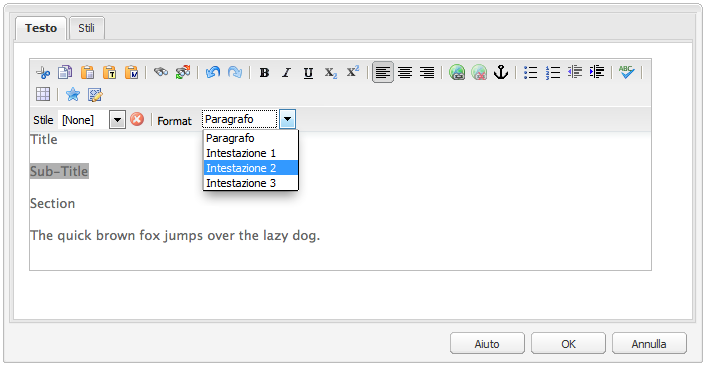
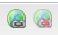

# Editor Rich Text{#rich-text-editor}

>[!CAUTION]
>
>AEM 6.4 ha raggiunto la fine del supporto esteso e questa documentazione non viene più aggiornata. Per maggiori dettagli, consulta la nostra [periodi di assistenza tecnica](https://helpx.adobe.com/it/support/programs/eol-matrix.html). Trova le versioni supportate [qui](https://experienceleague.adobe.com/docs/).

L’editor Rich Text è un componente di base per l’inserimento di contenuti di testo in AEM. Costituisce la base di vari componenti, tra cui:

* Testo
* Testo e immagine
* Tabella

## Editor Rich Text {#rich-text-editor-2}

La finestra di dialogo di modifica WYSIWYG fornisce un’ampia gamma di funzionalità:

>[!NOTE]
>
>Le funzioni disponibili possono essere configurate per i singoli progetti, pertanto potrebbero variare a seconda dell’installazione in uso.

## Modifica diretta {#in-place-editing}

Oltre alla modalità di modifica Rich Text basata su finestra di dialogo, AEM fornisce anche la modalità di modifica diretta, che consente di modificare direttamente il testo visualizzato nel layout della pagina.

Per accedere alla modalità di modifica locale, fai due volte clic su un paragrafo (doppio clic lento). Il bordo del componente diventa arancione.

È possibile modificare direttamente il testo sulla pagina, anziché all’interno di una finestra di dialogo. È sufficiente apportare le modifiche e verranno salvate automaticamente.

>[!NOTE]
>
>Se è aperto Content Finder, nella parte superiore della scheda (come sopra) viene visualizzata una barra degli strumenti con le opzioni di formattazione dell’editor Rich Text.
>
>Se Content Finder non è aperto, la barra degli strumenti non verrà visualizzata.

Attualmente, la modalità di modifica locale è abilitata per gli elementi di pagina generati da **Testo** e **Titolo** componenti.

>[!NOTE]
>
>La **Titolo** Il componente è progettato per contenere un testo breve senza interruzioni di riga. Quando si modifica un titolo in modalità di modifica diretta, quando si immette un’interruzione di riga viene aperta una nuova **Testo** sotto il titolo.

## Funzioni dell’Editor Rich Text {#features-of-the-rich-text-editor}

L’Editor Rich Text fornisce una serie di funzioni: [dipende dalla configurazione](/help/sites-administering/rich-text-editor.md) del singolo componente. Le funzioni sono disponibili sia per l’interfaccia touch che per quella classica.

### Formati di carattere di base {#basic-character-formats}

Consente di applicare la formattazione ai caratteri selezionati (evidenziati); alcune opzioni dispongono anche di tasti di scelta rapida:

* Grassetto (Ctrl+B)
* Corsivo (Ctrl+I)
* Sottolineato (Ctrl+U)
* Pedice
* Apice

Tutti funzionano come un interruttore, quindi la riselezione rimuoverà il formato.

### Stili e formati predefiniti {#predefined-styles-and-formats}

L’installazione può includere stili e formati predefiniti. Sono disponibili con **Stile** e **Formato** elenchi a discesa e possono essere applicati al testo selezionato.

Uno stile può essere applicato a una stringa specifica (lo stile è correlato ai CSS):

Un formato viene invece applicato all’intero paragrafo di testo (un formato è basato su HTML):

È possibile modificare solo un formato specifico (il formato predefinito è **Paragrafo**).

È possibile rimuovere uno stile; posizionare il cursore all’interno del testo a cui è stato applicato lo stile e fare clic sull’icona di rimozione:

>[!CAUTION]
>
>Non riselezionare il testo a cui è stato applicato lo stile oppure l’icona viene disattivata.

### Taglia, Copia, Incolla {#cut-copy-paste}

Le funzioni standard di **Taglia** e **Copia** sono disponibili. Vari sapori di **Incolla** sono forniti per soddisfare i diversi formati.

* Taglia (**Ctrl-X**)
* Copia (**Ctrl+C**)
* Incolla

   Questo è il meccanismo di incolla predefinito (**Ctrl+V**) per il componente; quando installato out-of-the-box, è configurato come &quot;Incolla da Word&quot;.

* Incolla testo semplice

   Elimina tutti gli stili e la formattazione per incollare solo il testo normale.

* Incolla da Word

   Incolla il contenuto come HTML (eseguendo le operazioni di riformattazione necessarie).

### Annulla, Ripristina {#undo-redo}

AEM registra le ultime 50 azioni eseguite nel componente corrente, in ordine cronologico. Se necessario, queste azioni possono essere annullate (e successivamente ripristinate) in ordine preciso.

>[!CAUTION]
>
>La cronologia viene mantenuta solo per la sessione di modifica corrente. Viene riavviato ogni volta che si apre il componente per la modifica.

>[!NOTE]
>
>Il numero predefinito di attività è 50. L&#39;installazione potrebbe essere diversa.

### Allineamento {#alignment}

Il testo può essere allineato a sinistra, al centro o a destra.

### Rientro {#indentation}

È possibile aumentare o diminuire il rientro di un paragrafo. Il rientro viene applicato al paragrafo selezionato. Eventuale nuovo testo inserito mantiene il livello di rientro corrente.

### Elenchi {#lists}

All’interno del testo è possibile creare elenchi puntati e numerati. Selezionare il tipo di elenco e iniziare a digitare oppure evidenziare il testo da convertire. In entrambi i casi, un feed di riga avvierà una nuova voce dell’elenco.

È possibile creare elenchi nidificati applicando un rientro a una o più voci dell’elenco.

Per modificare lo stile di un elenco, posiziona il cursore all’interno dell’elenco e seleziona l’altro stile. Un sottoelenco può avere anche uno stile diverso da quello dell’elenco che lo contiene. Questo può essere applicato una volta creato il sottoelenco (tramite rientro).

### Collegamenti {#links}

Per generare un collegamento a un URL (all’interno o all’esterno del sito web), evidenzia il testo richiesto e fai clic sul pulsante **Collegamento ipertestuale** icona:

Una finestra di dialogo consente di specificare l’URL di destinazione; anche se deve essere aperto in una nuova finestra.

Operazioni disponibili:

* Digitare un URI direttamente
* utilizza la mappa del sito per selezionare una pagina all’interno del sito web
* immetti l’URI, quindi aggiungi l’ancoraggio di destinazione; ad esempio `www.TargetUri.org#AnchorName`
* immettere solo un ancoraggio (per fare riferimento alla pagina corrente); ad esempio `#anchor`
* cerca una pagina in Content Finder, quindi trascina e rilascia l’icona della pagina nella finestra di dialogo Collegamento ipertestuale

>[!NOTE]
>
>L’URI può essere preceduto da uno qualsiasi dei protocolli configurati per l’installazione. In un&#39;installazione standard questi sono `https://`, `ftp://`e `mailto:`. I protocolli non configurati per l’installazione in uso verranno rifiutati e contrassegnati come non validi.

Per interrompere il collegamento, posizionate il cursore all’interno del testo di collegamento e fate clic sul pulsante **Scollega** icona:

### Ancoraggi {#anchors}

Per creare un ancoraggio all’interno del testo, posizionate il cursore nel testo o selezionate parte del testo. Quindi fai clic sul pulsante **Ancoraggio** per aprire la finestra di dialogo.

Inserisci il nome dell’ancoraggio e fai clic su **OK** da salvare.

L’ancoraggio viene visualizzato quando il componente viene modificato e può essere utilizzato all’interno di una destinazione per i collegamenti.

### Trova e sostituisci {#find-and-replace}

AEM fornisce entrambe **Trova** e **Sostituisci** (trova e sostituisci).

Entrambi hanno un **Trova successivo** per cercare il testo specificato nel componente aperto. È inoltre possibile specificare la corrispondenza tra maiuscole e minuscole.

La ricerca inizia sempre dalla posizione corrente del cursore all’interno del testo. Una volta raggiunta la fine del componente, viene visualizzato un messaggio per informare l’utente che l’operazione di ricerca successiva inizierà dall’alto.

La **Sostituisci** consente di: **Trova**, quindi **Sostituisci** una singola istanza con il testo specificato, oppure **Sostituisci tutto** nel componente corrente.

### Immagini {#images}

È possibile trascinare le immagini da Content Finder per aggiungerle al testo.

>[!NOTE]
>
>AEM inoltre offre componenti specializzati per una configurazione più dettagliata delle immagini. Ad esempio, **Immagine** e **Immagine testo** sono disponibili i componenti .

### Controllo ortografia {#spelling-checker}

Il correttore ortografico controlla tutto il testo nel componente corrente.

Eventuali errori di ortografia vengono evidenziati:

>[!NOTE]
>
>Il correttore ortografico funziona nella lingua del sito web, scegliendo la proprietà language della struttura secondaria o estraendo la lingua dall’URL. Ad esempio, `en` il ramo sarà controllato per inglese e `de` per il tedesco.

### Tabelle {#tables}

Le tabelle sono disponibili:

* Come **Tabella** component

   

* Da all’interno di **Testo** component

   

   >[!NOTE]
   >
   >Anche se le tabelle sono disponibili nell’editor Rich Text, si consiglia di utilizzare la variabile **Tabella** durante la creazione di tabelle.

In entrambi i casi **Testo** e **Tabella** la funzionalità della tabella dei componenti è disponibile tramite il menu di scelta rapida, solitamente il pulsante destro del mouse, selezionato all’interno della tabella; ad esempio:

>[!NOTE]
>
>In **Tabella** è disponibile anche una barra degli strumenti specializzata, che include varie funzioni standard dell’editor Rich Text e un sottoinsieme delle funzioni specifiche della tabella.

Le funzioni specifiche della tabella sono:

<table> 
 <tbody> 
  <tr> 
   <td><a href="#table-properties">Proprietà tabella</a>  </td> 
  </tr> 
  <tr> 
   <td><a href="#cell-properties">Proprietà cella  </a></td> 
  </tr> 
  <tr> 
   <td><a href="#add-or-delete-rows">Aggiungi/Elimina righe  </a></td> 
  </tr> 
  <tr> 
   <td><a href="#add-or-delete-columns">Aggiungi/Elimina colonne  </a></td> 
  </tr> 
  <tr> 
   <td><a href="#selecting-entire-rows-or-columns">Selezione di righe o colonne intere  </a></td> 
  </tr> 
  <tr> 
   <td><a href="#merge-cells">Unisci celle  </a></td> 
  </tr> 
  <tr> 
   <td><a href="#split-cells">Dividi celle  </a></td> 
  </tr> 
  <tr> 
   <td><a href="#creating-nested-tables">Tabelle nidificate</a></td> 
  </tr> 
  <tr> 
   <td><a href="#remove-table">Rimuovi tabella</a> </td> 
  </tr> 
 </tbody> 
</table>

#### Proprietà tabella {#table-properties}

È possibile configurare le proprietà di base della tabella prima di fare clic su **OK** per salvare:

* **Larghezza**

   Larghezza totale della tabella.

* **Altezza**

   Altezza totale della tabella.

* **Bordo**

   Dimensione del bordo della tabella.

* **Margine celle**

   Definisce lo spazio vuoto tra il contenuto di una cella e i relativi bordi.

* **Spaziatura celle**

   Definisce la distanza tra le celle.

>[!NOTE]
>
>**Larghezza**, **Altezza** e alcune proprietà delle celle possono essere definite in:
>
>* pixel
>* percentuali

>[!CAUTION]
>
>L’Adobe consiglia vivamente di definire un **Larghezza** per il tuo tavolo.

#### Proprietà cella {#cell-properties}

È possibile configurare le proprietà di una cella o di una serie di celle specifiche:

* **Larghezza**
* **Altezza**
* **Allineamento orizzontale** - A sinistra, Centro o A destra
* **Allineamento verticale** - In alto, In mezzo, In basso o Linea di base
* **Tipo di cella** - Dati o intestazione
* **Applica a:**
   * Cella singola
   * Riga intera
   * Colonna intera

#### Aggiungi/Elimina righe {#add-or-delete-rows}

Le righe possono essere aggiunte sopra o sotto la riga corrente.

È inoltre possibile eliminare la riga corrente.

#### Aggiungi/Elimina colonne {#add-or-delete-columns}

Le colonne possono essere aggiunte a sinistra o a destra della colonna corrente.

È inoltre possibile eliminare la colonna corrente.

#### Selezione di righe o colonne intere {#selecting-entire-rows-or-columns}

Seleziona l’intera riga o colonna corrente. Sono quindi disponibili azioni specifiche (ad esempio l’unione).

#### Unisci celle {#merge-cells}

 

* Se è stato selezionato un gruppo di celle, è possibile unirle in un unico gruppo.
* Se è selezionata una sola cella, è possibile unirla con la cella a destra o sotto.

#### Dividi celle {#split-cells}

Selezionare una singola cella per dividerla:

* Se si divide una cella in orizzontale, viene generata una nuova cella a destra della cella corrente, all’interno della colonna corrente.
* Se si divide una cella in verticale, viene generata una nuova cella sotto la cella corrente, ma all’interno della riga corrente.

#### Creazione di tabelle nidificate {#creating-nested-tables}

La creazione di una tabella nidificata creerà una nuova tabella indipendente all’interno della cella corrente.

>[!NOTE]
>
>Alcuni comportamenti aggiuntivi dipendono dal browser:
>
>* IE di Windows: Per selezionare più celle, premi Ctrl+clic con il pulsante principale del mouse (in genere il sinistro).
>* Firefox: Trascinare il mouse per selezionare un intervallo di celle.
>

#### Rimuovi tabella {#remove-table}

In questo modo la tabella verrà rimossa dall’interno della **Testo** componente.

### Caratteri speciali {#special-characters}

È possibile rendere disponibili caratteri speciali all’editor Rich Text; possono variare a seconda dell’installazione.

Passa il mouse per visualizzare una versione ingrandita del carattere, quindi fai clic per includerlo nella posizione corrente nel testo.

### Modalità di modifica sorgente {#source-editing-mode}

La modalità di modifica sorgente consente di visualizzare e modificare il HTML sottostante del componente.

Ecco il testo:

avrà l’aspetto seguente nella modalità sorgente (spesso l’origine è molto più lunga, quindi dovrai scorrere):

>[!CAUTION]
>
>Quando si esce dalla modalità di origine, AEM effettua alcuni controlli di convalida, ad esempio per verificare che il testo sia correttamente contenuto o nidificato nei blocchi. Questo può comportare modifiche alle modifiche apportate.
