# Utilizzo di Adobe Campaign 6.1 e Adobe Campaign Standard{#working-with-adobe-campaign-and-adobe-campaign-standard}

>[!CAUTION]
>
>AEM 6.4 ha raggiunto la fine del supporto esteso e questa documentazione non viene più aggiornata. Per maggiori dettagli, consulta la nostra [periodi di assistenza tecnica](https://helpx.adobe.com/it/support/programs/eol-matrix.html). Trova le versioni supportate [qui](https://experienceleague.adobe.com/docs/).

Puoi creare contenuti e-mail in AEM ed elaborarli nelle e-mail di Adobe Campaign. A questo scopo, devi:

1. Crea una nuova newsletter in AEM da un modello specifico per Adobe Campaign.
1. Seleziona [un servizio Adobe Campaign](#selectingtheadobecampaigncloudservice) prima di modificare il contenuto per accedere a tutte le funzionalità.
1. Modifica il contenuto.
1. Convalida il contenuto.

Il contenuto può quindi essere sincronizzato con una consegna in Adobe Campaign. Le istruzioni dettagliate sono descritte in questo documento.

>[!NOTE]
>
>Prima di poter utilizzare questa funzionalità, devi configurare AEM per l’integrazione con [Adobe Campaign](/help/sites-administering/campaignonpremise.md) o [Adobe Campaign Standard](/help/sites-administering/campaignstandard.md).

## Invio di contenuti e-mail tramite Adobe Campaign {#sending-email-content-via-adobe-campaign}

Dopo aver configurato AEM e Adobe Campaign, puoi creare il contenuto della consegna e-mail direttamente in AEM e quindi elaborarlo in Adobe Campaign.

Quando crei contenuto Adobe Campaign in AEM, devi effettuare il collegamento a un servizio Adobe Campaign prima di modificare il contenuto per accedere a tutte le funzionalità.

Esistono due casi possibili:

* Il contenuto può essere sincronizzato con una consegna da Adobe Campaign. Questo consente di utilizzare AEM contenuto in una consegna.
* (Solo Adobe Campaign on-premise) Il contenuto può essere inviato direttamente ad Adobe Campaign, che genera automaticamente una nuova consegna e-mail. Questa modalità ha delle limitazioni.

Le istruzioni dettagliate sono descritte in questo documento.

### Creazione di nuovo contenuto e-mail {#creating-new-email-content}

>[!NOTE]
>
>Quando aggiungi modelli e-mail, assicurati di aggiungerli in **/content/campagne** per renderli disponibili.

1. In AEM, seleziona la **Siti Web** quindi sfoglia il tuo explorer per trovare dove vengono gestite le tue campagne e-mail. Nell&#39;esempio seguente, il nodo interessato è **Siti Web** > **Campagne** > **Geometrixx Outdoors** > **Campagne e-mail**.

   >[!NOTE]
   >
   >[Gli esempi e-mail sono disponibili solo in Geometrixx](/help/sites-developing/we-retail.md#weretail). Scarica il contenuto di Geometrixx di esempio da Condivisione pacchetti.

   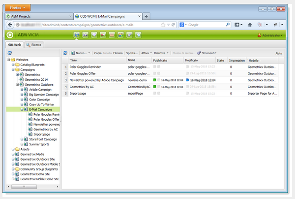

1. Seleziona **Nuovo** > **Nuova pagina** per creare nuovi contenuti e-mail.
1. Seleziona uno dei modelli disponibili specifico per Adobe Campaign, quindi compila le proprietà generali della pagina. Per impostazione predefinita sono disponibili tre modelli:

   * **E-mail Adobe Campaign (AC 6.1)**: consente di aggiungere contenuto a un modello predefinito prima di inviarlo ad Adobe Campaign 6.1 per la consegna.
   * **E-mail Adobe Campaign (ACS)**: consente di aggiungere contenuto a un modello predefinito prima di inviarlo ad Adobe Campaign Standard per la consegna.

   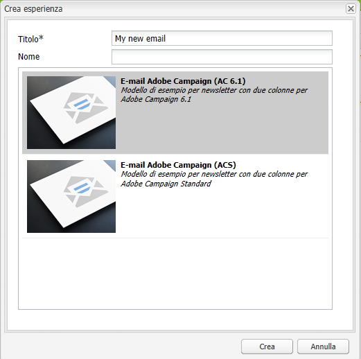

1. Fai clic su **Crea** per creare l’e-mail o la newsletter.

### Selezione del servizio cloud e del modello di Adobe Campaign {#selecting-the-adobe-campaign-cloud-service-and-template}

Per eseguire l’integrazione con Adobe Campaign, devi aggiungere alla pagina un servizio cloud Adobe Campaign. In questo modo puoi accedere alla personalizzazione e ad altre informazioni di Adobe Campaign.

Inoltre, potrebbe essere necessario selezionare il modello Adobe Campaign, modificare l’oggetto e aggiungere contenuto di testo normale per gli utenti che non visualizzano l’e-mail in HTML.

1. Seleziona la **Pagina** scheda nella barra laterale, quindi seleziona **Proprietà pagina.**
1. In **Servizi cloud** nella finestra a comparsa, seleziona **Aggiungi servizio** per aggiungere il servizio Adobe Campaign e fai clic su **OK**.

   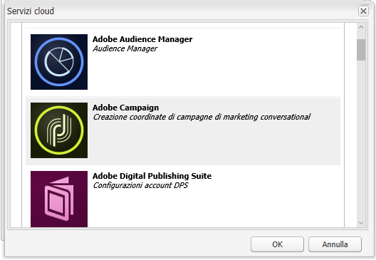

1. Seleziona dall’elenco a discesa la configurazione che corrisponde alla tua istanza di Adobe Campaign, quindi fai clic su **OK**.

   >[!NOTE]
   >
   >Assicurati di toccare/fare clic **OK** o **Applica** dopo l’aggiunta del servizio cloud. Ciò abilita **Adobe Campaign** per funzionare correttamente.

1. Se desideri applicare un modello di consegna e-mail specifico (da Adobe Campaign), diverso da quello predefinito **mail** modello, seleziona **Proprietà pagina** di nuovo. In **Adobe Campaign** , immetti il nome interno del modello di consegna e-mail nell’istanza Adobe Campaign correlata.

   In Adobe Campaign Standard, il modello è **Consegna con contenuti AEM**. In Adobe Campaign 6.1, il modello è **Consegna e-mail con contenuto AEM**.

   Quando selezioni il modello, AEM attiva automaticamente la **Newsletter Adobe Campaign** componenti.

### Modifica del contenuto delle e-mail {#editing-email-content}

È possibile modificare il contenuto delle e-mail nell’interfaccia utente classica o nell’interfaccia touch.

1. Immetti l’oggetto e la versione testuale dell’e-mail selezionando **Proprietà pagina** > **E-mail** dalla cassetta degli attrezzi.

   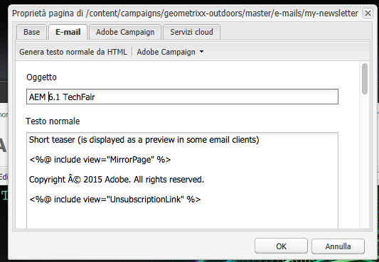

1. Modifica il contenuto delle e-mail aggiungendo gli elementi desiderati da quelli disponibili nella barra laterale. A questo scopo, trascinali e rilasciali. Quindi fai doppio clic sull’elemento da modificare.

   Ad esempio, puoi aggiungere del testo contenente campi di personalizzazione.

   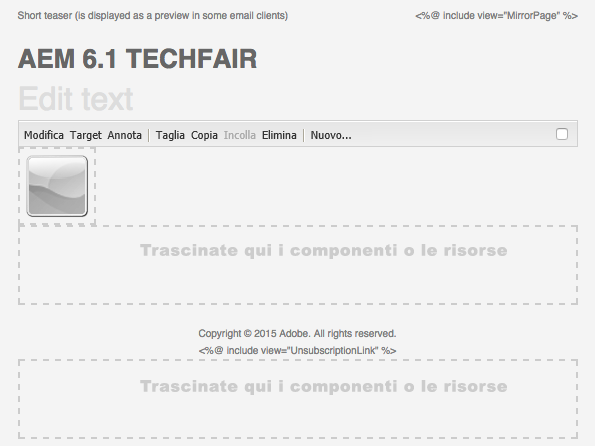

   Vedi [Componenti di Adobe Campaign](/help/sites-classic-ui-authoring/classic-personalization-ac-components.md) per una descrizione dei componenti disponibili per newsletter/campagne e-mail di Adobe Campaign.

   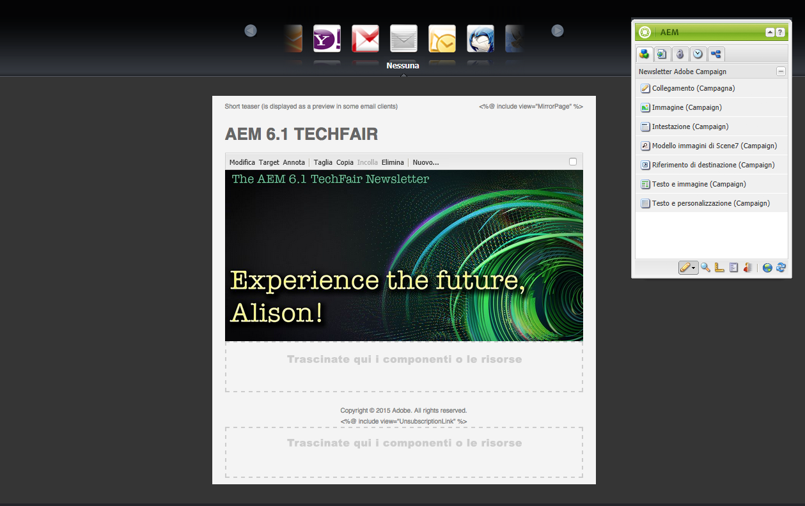

### Inserimento di personalizzazioni {#inserting-personalization}

Quando modifichi il contenuto, puoi inserire:

* Campi contestuali di Adobe Campaign. Si tratta di campi che puoi inserire all’interno del testo e che si adattano in base ai dati del destinatario (ad esempio nome, cognome o qualsiasi dato della dimensione di destinazione).
* Blocchi di personalizzazione Adobe Campaign. Si tratta di blocchi di contenuto predefinito non correlati ai dati del destinatario, ad esempio un logo del marchio, o collegati a una pagina speculare.

Vedi [Componenti di Adobe Campaign](/help/sites-classic-ui-authoring/classic-personalization-ac-components.md) per una descrizione completa dei componenti di Campaign.

>[!NOTE]
>
>* Solo i campi di Adobe Campaign **Profili** vengono prese in considerazione le dimensioni di targeting.
>* Quando visualizzi Proprietà da **Sites**, non puoi accedere ai campi di contesto di Adobe Campaign. Puoi accedere direttamente dall’e-mail durante la modifica.
>

1. Inserisci un nuovo **Newsletter** > **Testo e personalizzazione (Campaign)** componente.
1. Apri il componente facendo doppio clic su di esso. La **Modifica** window dispone di una funzionalità che consente di inserire gli elementi di personalizzazione.

   >[!NOTE]
   >
   >I campi di contesto disponibili corrispondono al **Profili** dimensione di targeting in Adobe Campaign.
   >
   >Vedi [Collegamento di una pagina AEM a un’e-mail di Adobe Campaign](/help/sites-classic-ui-authoring/classic-personalization-ac-campaign.md#linkinganaempagetoanadobecampaignemail).

   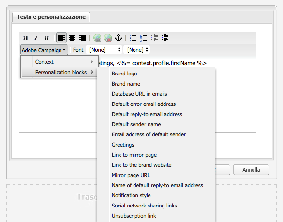

1. Seleziona **Contesto client** nella barra laterale per testare i campi di personalizzazione utilizzando i dati nei profili personali.

   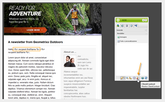

1. Viene visualizzata una finestra che consente di selezionare la persona desiderata. I campi di personalizzazione vengono sostituiti automaticamente dai dati del profilo selezionato.

   

### Anteprima di una newsletter {#previewing-a-newsletter}

Puoi visualizzare in anteprima l’aspetto della newsletter e la personalizzazione.

1. Apri la newsletter da visualizzare in anteprima e fai clic su Anteprima (lente di ingrandimento) per ridurre la barra laterale.
1. Fai clic su una delle icone del client e-mail per verificare l’aspetto della newsletter in ciascun client e-mail.

   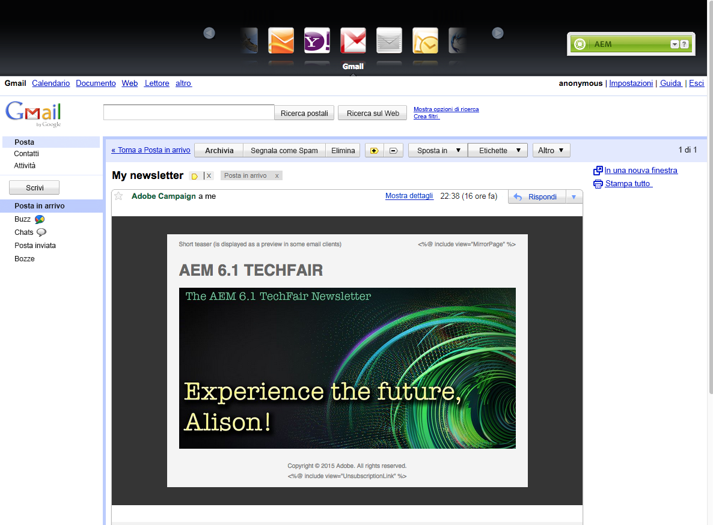

1. Espandi la barra laterale per iniziare di nuovo l’editing.

### Approvazione del contenuto in AEM {#approving-content-in-aem}

Al termine del contenuto, puoi avviare il processo di approvazione. Vai a **Flusso di lavoro** scheda della casella degli strumenti e seleziona la **Approva per Adobe Campaign** workflow.

Questo flusso di lavoro predefinito prevede due passaggi: revisione poi approvazione o revisione poi rifiuto. Tuttavia, questo flusso di lavoro può essere esteso e adattato a un processo più complesso.

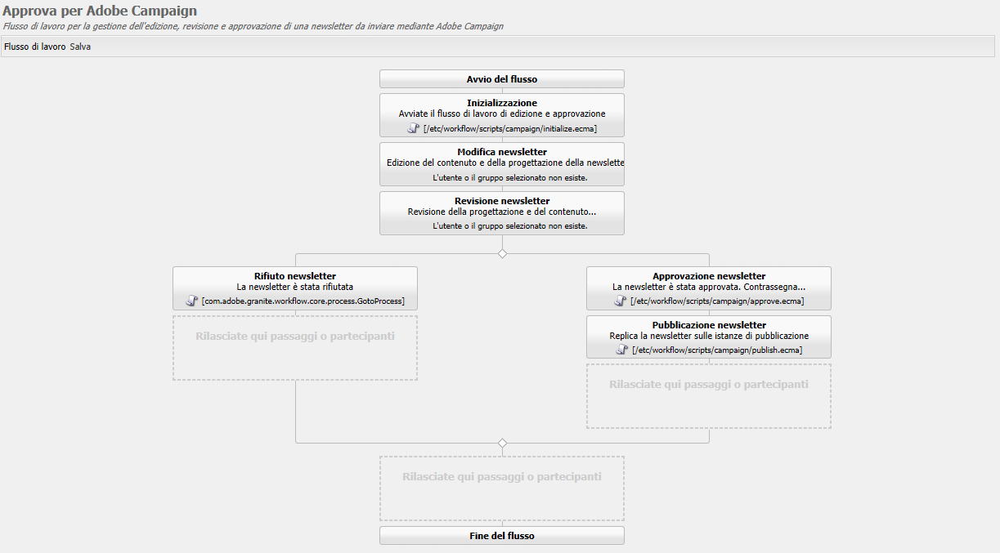

Per approvare il contenuto per Adobe Campaign, applica il flusso di lavoro selezionando **Flusso di lavoro** nella barra laterale e selezionando **Approva per Adobe Campaign** e fai clic su **Avvia flusso di lavoro**. Segui i passaggi e approva il contenuto. È inoltre possibile rifiutare il contenuto selezionando **Rifiuta** anziché **Approva** nell’ultimo passaggio del flusso di lavoro.

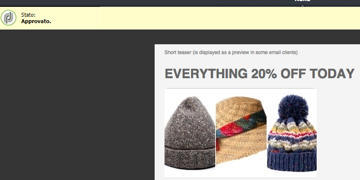

Dopo l’approvazione del contenuto, questo viene visualizzato come approvato in Adobe Campaign. L’e-mail può quindi essere inviata.

In Adobe Campaign Standard:

In Adobe Campaign 6.1:

>[!NOTE]
>
>Il contenuto non approvato può essere sincronizzato con una consegna in Adobe Campaign, ma la consegna non può essere eseguita. Solo i contenuti approvati possono essere inviati tramite le consegne di Campaign.

## Collegamento di AEM con Adobe Campaign Standard e Adobe Campaign 6.1 {#linking-aem-with-adobe-campaign-standard-and-adobe-campaign}

>[!NOTE]
>
>Vedi [Collegamento di AEM con Adobe Campaign Standard e Adobe Campaign 6.1](/help/sites-authoring/campaign.md#linking-aem-with-adobe-campaign-standard-and-adobe-campaign-classic) sotto [Utilizzo di Adobe Campaign 6.1 e Adobe Campaign Standard](/help/sites-authoring/campaign.md) per ulteriori informazioni, consulta la documentazione standard sull’authoring .
