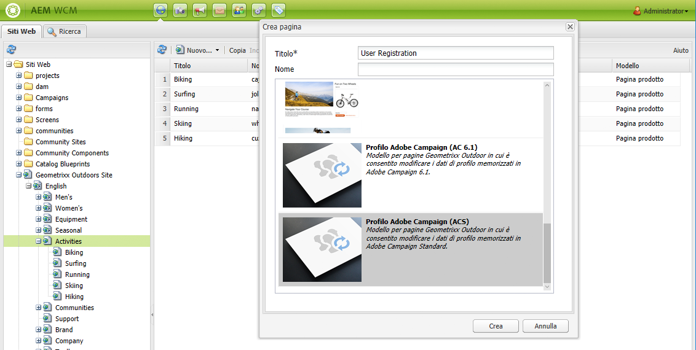
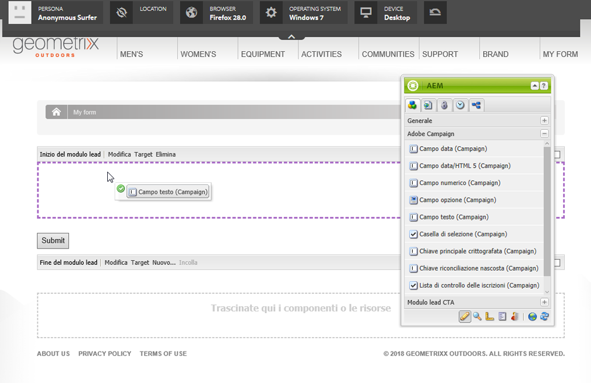

# Creazione di moduli di Adobe Campaign in AEM{#creating-adobe-campaign-forms-in-aem}

AEM consente di creare e utilizzare i moduli che interagiscono con Adobe Campaign sul tuo sito web. Campi specifici possono essere immessi nei moduli e associati al database Adobe Campaign.

Puoi gestire nuove iscrizioni di contatti, annullamenti di iscrizioni e i dati del profilo utente, il tutto integrando i dati nel tuo database di Adobe Campaign.

Per utilizzare i moduli di Adobe Campaign in AEM, è necessario seguire questi passaggi, descritti in questo documento:

1. Rendere disponibile un modello.
1. Creare un modulo.
1. Modificare il contenuto del modulo.

Sono disponibili tre tipi di moduli, specifici per Adobe Campaign, per impostazione predefinita:

* Salvare un profilo
* Iscriversi a un servizio
* Annullare l’iscrizione a un servizio

Questi moduli definiscono un parametro URL che accetta la chiave principale crittografata di un profilo Adobe Campaign. In base a questo parametro URL, il modulo aggiorna i dati del profilo Adobe Campaign associato.

Anche se si creano i moduli in modo indipendente, in un caso di utilizzo tipico, generi un collegamento personalizzato a una pagina del modulo all&#39;interno del contenuto della newsletter, in modo che i destinatari possano accedere al collegamento e modificare i dati del proprio profilo (per iscriversi, annullare l’iscrizione o aggiornare il profilo).

Il modulo si aggiorna automaticamente a seconda dell’utente. Per ulteriori informazioni, consulta [Modifica del contenuto del modulo](#editing-form-content).

## Rendere disponibile un modello {#making-a-template-available}

Prima di poter creare i moduli specifici di Adobe Campaign, è necessario rendere disponibili i diversi modelli nell&#39;applicazione AEM.

To do this, see the [Templates documentation](/help/sites-developing/page-templates-static.md#templateavailability).

Innanzitutto, verifica che la connessione tra le istanze di creazione e pubblicazione e Adobe Campaign funzioni correttamente. Consulta [Integrazione con Adobe Campaign Standard](/help/sites-administering/campaignstandard.md) o [Integrazione con Adobe Campaign 6.1](/help/sites-administering/campaignonpremise.md).

>[!NOTE]
>
>Verifica che la proprietà **acMapping** sul nodo **jcr:content** della pagina sia impostato su **mapRecipient** o **profilo** quando usi rispettivamente Adobe Campaign 6.1.x o Adobe Campaign Standard.

### Creazione di un modulo {#creating-a-form}

1. Inizia da siteadmin.
1. Scorri attraverso la struttura a albero per arrivare al punto in cui puoi creare il modulo nel tuo sito web.
1. Select **New** > **New page...**.
1. Select either **Adobe Campaign Profile (AC 6.1)** or **Adobe Campaign Profile (ACS)** template and enter the page properties.

   >[!NOTE]
   >
   >If the template is not available, refer to the [Making a template available](/help/sites-classic-ui-authoring/classic-personalization-ac.md#activatingatemplate) section.

1. Click **Create** to create the form.

   

   Ora puoi [modificare e configurare il contenuto del tuo modulo](#editing-form-content).

## Modifica del contenuto del modulo {#editing-form-content}

I moduli dedicati ad Adobe Campaign hanno componenti specifici. Questi componenti dispongono di un’opzione per consentire di collegare ciascun campo del modulo a un campo del database di Adobe Campaign.

>[!NOTE]
>
>If the desired template is not available, see [Making a template available](/help/sites-classic-ui-authoring/classic-personalization-ac.md#activatingatemplate).

Questa sezione contiene solo dettagli sui collegamenti specifici a Adobe Campaign. For more information on a more general overview of how to use forms in Adobe Experience Manager, see [Editmode components](/help/sites-classic-ui-authoring/classic-page-author-edit-mode.md).

1. Spostati sul modulo che desideri modificare.
1. In the toolbox, select **Page** > **Page Properties...** then go to the **Cloud Services** tab of the pop-up window.
1. Add the Adobe Campaign service by clicking **Add service**, and then selecting the configuration that corresponds to your Adobe Campaign instance in the service&#39;s drop down list. Questa configurazione viene mantenuta quando viene impostata la connessione tra le tue istanze. For more information, see [Connecting AEM to Adobe Campaign](/help/sites-administering/campaignonpremise.md#connecting-aem-to-adobe-campaign).

   >[!NOTE]
   >
   >Se necessario, sblocca la configurazione facendo clic sull&#39;icona a forma di lucchetto per poter aggiungere il servizio Adobe Campaign.

1. Access the form&#39;s general parameters using the **Edit** button found at the start of the form. The **Form** tab allows you to select a thank you page to which the user will be redirected after having validated the form.

   The **Advanced** form allows you to select the type of form. The **Post Options** field gives you the choice between three types of Adobe Campaign forms:

   * **Adobe Campaign: Salva profilo**: consente di creare o aggiornare un destinatario in Adobe Campaign (valore predefinito).
   * **Adobe Campaign: iscrizione a servizi**: consente di gestire le iscrizioni dei destinatari in Adobe Campaign.
   * **Adobe Campaign: Annulla iscrizione a servizi**: consente di annullare le iscrizioni dei destinatari in Adobe Campaign.

   The **Action Configuration** field lets you specify whether or not you would like to create the recipient profile in the Adobe Campaign database if it does not yet exist. To do this, check the **Create user if not existing** option.

1. Aggiungi i componenti selezionati trascinandoli dalla casella strumenti e rilasciandoli nel modulo. Per ulteriori informazioni sui componenti specifici per Adobe Campaign disponibili, consulta [Componenti Adobe Form](/help/sites-classic-ui-authoring/classic-personalization-ac-components.md).

   

1. Configura i campi aggiunti selezionandoli con doppio clic. The **Adobe Campaign** tab lets you link the field to a field in the Adobe Campaign recipient table. Puoi anche specificare se il campo fa parte della chiave di riconciliazione che consente di essere riconosciuti ai destinatari già presenti nel database di Adobe Campaign.

   >[!CAUTION]
   >
   >The **Element Name** must be different for each form field. Se necessario, modificalo.
   >
   >Each form must contain an **Encrypted Primary Key** component in order to correctly manage recipients in the Adobe Campaign database.

1. Activate the page by selecting **Page** > **Activate Page** in the toolbox. La pagina viene attivata sul tuo sito. È possibile visualizzarla accedendo al’&#39;istanza di pubblicazione di AEM. I dati nel database di Adobe Campaign vengono aggiornati quando viene convalidato un modulo.

## Test di un modulo {#testing-a-form}

Dopo aver creato un modulo e modificato il suo contenuto, potresti voler verificare che funzioni come previsto.

>[!NOTE]
>
>You must have an **Encryted Primary Key** component on each form. In Componenti  Adobe Campaign, in modo che solo tali componenti siano visibili.
>
>Anche se in questa procedura si inserisce il numero EPK manualmente, in pratica gli utenti otterrebbero un collegamento a questa pagina (che sia per annullare l’iscrizione, iscriversi o aggiornare il profilo) all&#39;interno di una newsletter. In base all&#39;utente, l’EPK si aggiorna automaticamente.
>
>To create that link, you use the variable **Main resource identifier**(Adobe Campaign Standard) or **Encrypted identifier** (Adobe Campaign 6.1) (for example, in a **Text &amp; Personalization (Campaign)** component), which links to the epk in Adobe Campaign.

Per eseguire questa operazione, è necessario ottenere manualmente l&#39;EPK da un profilo Adobe Campaign e aggiungerlo all&#39;URL:

1. Per ottenere la chiave crittografata primaria (EPK) di un profilo Adobe Campaign:

   * In Adobe Campaign Standard - Navigate to **Profiles and Audiences** > **Profiles**, which lists the existing profiles. Make sure the table displays the **Main Resource Identifier** field in a column (This can be configured by clicking/tapping **Configure list**). Copia l’identificatore della risorsa principale del profilo desiderato.
   * In Adobe Campaign 6.11, go to **Profiles and Targets** >  **Recipients**, which lists the existing profiles. Make sure the table displays the **Encrypted identifier** field in a column (This can be configured by right-clicking on an entry and selecting **Configure list...**). Copia l’identificatore crittografato del profilo desiderato.

1. In AEM, open the form page on the publish instance and append the EPK from step 1 as a URL parameter: use the same name that you previously defined in the EPK component when authoring the form (for example: `?epk=...`)
1. Ora puoi usare il modulo per modificare i dati e le iscrizioni associati al profilo Adobe Campaign collegato. Dopo aver modificato alcuni campi e inviato il modulo, puoi verificare in Adobe Campaign che siano stati aggiornati i dati relativi.

I dati nel database di Adobe Campaign vengono aggiornati quando viene convalidato un modulo.
