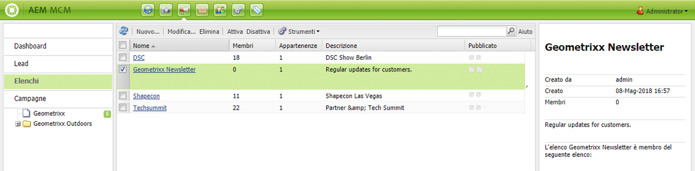
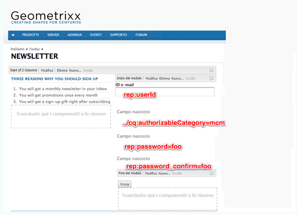
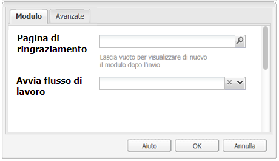
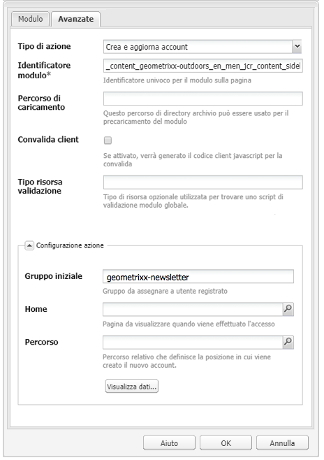
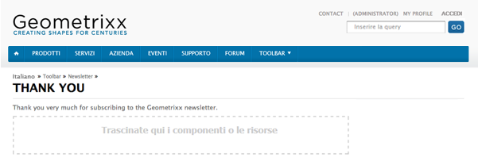
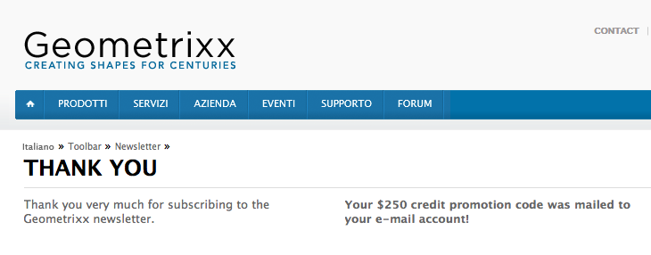

# Creazione di una pagina di destinazione efficace per una newsletter{#creating-an-effective-newsletter-landing-page}

Una pagina di destinazione efficace per una newsletter può stimolare quante più persone possibile a registrarsi per la newsletter (o altra campagna marketing e-mail). Dalle informazioni raccolte con le registrazioni per la newsletter è possibile ottenere lead importanti.

Per creare una pagina di destinazione efficace per una newsletter, è necessario effettuare le seguenti operazioni:

1. Crea un elenco per la newsletter in modo che gli utenti possano registrarsi.
1. Crea un modulo di registrazione. Inserisci un passaggio di flusso di lavoro per aggiungere automaticamente l’utente che si registra per la newsletter all’elenco dei lead.
1. Crea una pagina di conferma per ringraziare gli utenti che si sono registrati ed eventualmente fornire loro un’offerta promozionale.
1. Aggiungi dei teaser.

>[!NOTE]
>
> Adobe non prevede di migliorare ulteriormente questa funzionalità (Gestione di lead ed elenchi).\
>La raccomandazione è di sfruttare [Adobe Campaign e la sua integrazione](/help/sites-administering/campaign.md)AEM.

## Creazione di un Elenco per la newsletter {#creating-a-list-for-the-newsletter}

Crea un elenco, ad esempio **Newsletter Geometrixx**, in MCM per la newsletter oggetto della registrazione. La creazione di elenchi è descritta in [Creare elenchi](/help/sites-classic-ui-authoring/classic-personalization-campaigns.md#creatingnewlists).

Esempio di elenco:

## Crea di un modulo di registrazione {#create-a-sign-up-form}

Crea un modulo di registrazione per la newsletter che consenta agli utenti di sottoscrivere a tag. Il sito web di esempio Geometrixx offre una pagina newsletter nella barra degli strumenti di Geometrixx, con cui è possibile creare il modulo.

Per creare un modulo di newsletter, consulta le informazioni sulla creazione di moduli nella [Documentazione dei moduli](/help/sites-authoring/default-components.md#form). La newsletter utilizza i tag presenti nella libreria Tag. Per aggiungere altri tag, consulta [Amministrazione dei tag](/help/sites-authoring/tags.md#tagadministration).

I campi nascosti nel seguente esempio forniscono le informazioni minime necessarie (e-mail); è possibile aggiungere successivamente altri campi, ma questo può avere un impatto sul tasso di conversione.

L’esempio di seguito rappresenta un modulo creato in http://localhost:4502/cf#/content/geometrixx/en/toolbar/newsletter.html

1. Crea il modulo.

   

1. Fai clic su **Modifica** nel componente Modulo per configurare il modulo per andare alla pagina di ringraziamento (consulta [Creazione di pagine di ringraziamento](#creating-a-thank-you-page)).

   

1. Impostate l’azione Modulo (ossia cosa deve accadere quando il modulo viene inviato) e configurate il gruppo per assegnare gli utenti registrati all’elenco precedentemente creato (ad esempio, geometrixx-newsletter).

   

## Creazione di una pagina di ringraziamento {#creating-a-thank-you-page}

Quando gli utenti fanno clic su **Sottoscrivi**, dovrà automaticamente aprirsi la pagina di ringraziamento. Crea la pagina di ringraziamento nella Pagina newsletter Geometrixx. Dopo aver creato il modulo per la newsletter, modificate il componente Modulo e aggiungete il percorso della pagina di ringraziamento.

Dopo l’invio del modulo di richiesta, l’utente passa alla pagina di **Ringraziamento** e quindi riceve un messaggio e-mail. Questa pagina di ringraziamento è stata creata in /content/geometrixx/en/toolbar/newsletter/thank_you.

## Aggiunta di teaser {#adding-teasers}

Aggiungi i [teaser](/help/sites-classic-ui-authoring/classic-personalization-campaigns.md#teasers) per il targeting di gruppi di pubblico specifici. Ad esempio, aggiungete dei teaser nella pagina di ringraziamento e di registrazione per la newsletter.

Per aggiungere dei teaser con cui rendere più efficace la pagina di arrivo della newsletter:

1. Create un paragrafo teaser per un premio di registrazione. Seleziona la strategia **Primo** e includi del testo che informi l’utente del premio a cui avrà diritto.

   

1. Crea un paragrafo teaser per la pagina di ringraziamento. Seleziona la strategia **Primo** e includi del testo che indichi che il premio è stato inviato.

   

1. Create una campagna con i due teaser: uno con tag Business e uno senza tag.

## Invio del contenuto agli utenti registrati {#pushing-content-to-subscribers}

Implementa eventuali modifiche nelle pagine tramite la funzionalità Newsletter in MCM. Implementa quindi i contenuti aggiornati per gli utenti che si sono registrati.

Consulta [Inviare newsletter](/help/sites-classic-ui-authoring/classic-personalization-campaigns.md#newsletters).
