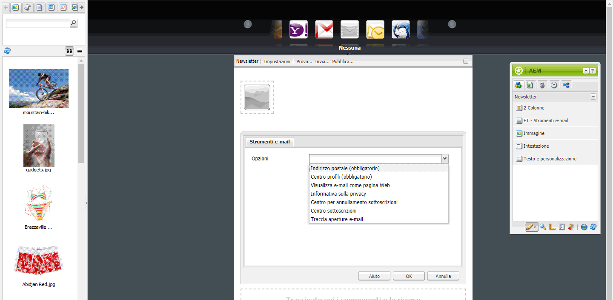
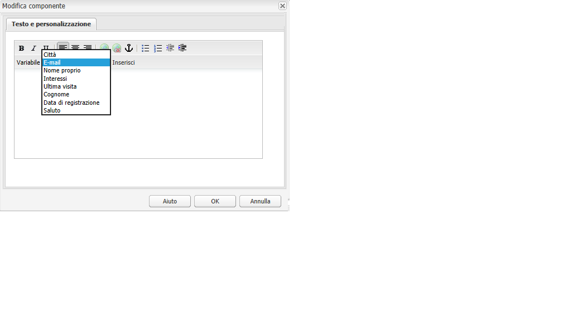
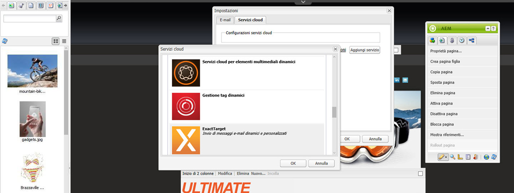
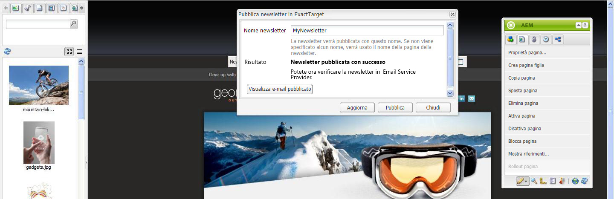

# Pubblicazione di un messaggio e-mail ai provider di servizi e-mail{#publishing-an-email-to-email-service-providers}

>[!CAUTION]
>
>AEM 6.4 ha raggiunto la fine del supporto esteso e questa documentazione non viene più aggiornata. Per maggiori dettagli, consulta la nostra [periodi di assistenza tecnica](https://helpx.adobe.com/it/support/programs/eol-matrix.html). Trova le versioni supportate [qui](https://experienceleague.adobe.com/docs/).

È possibile pubblicare newsletter su servizi e-mail come ExactTarget e Silverpop Engage. Questo documento descrive come configurare AEM per pubblicare una newsletter in questi servizi e-mail.

>[!NOTE]
>
>È necessario configurare il provider di servizi prima di creare e pubblicare un messaggio e-mail. Vedi [Configurazione di ExactTarget](/help/sites-administering/exacttarget.md) e [Configurazione di Silverpop Engage](/help/sites-administering/silverpop.md) per ulteriori informazioni.

Per pubblicare l’e-mail sul provider di servizi e-mail, devi eseguire i seguenti passaggi:

1. Crea un messaggio e-mail.
1. Applica la configurazione del servizio e-mail all’e-mail.
1. Pubblica l’e-mail.

>[!NOTE]
>
>Se aggiorni i provider di posta elettronica, fai una prova rapida o invia una newsletter, queste operazioni non riescono se la newsletter non viene pubblicata prima nell’istanza Pubblica o se l’istanza Pubblica non è disponibile. Assicurati di pubblicare la newsletter e che l’istanza Pubblica sia attiva e in esecuzione.

## Creazione di un messaggio e-mail {#creating-an-email}

Un’e-mail o una newsletter da pubblicare in un servizio e-mail può essere creata in una campagna utilizzando **Newsletter Geometrixx** modello. È inoltre possibile utilizzare **E-mail Geometrixx Outdoors** modello. Esempio di e-mail/newsletter basato su **E-mail Geometrixx Outdoors** modello disponibile in `https://<hostname>:<port>/cf#/content/campaigns/geometrixx-outdoors/e-mails.html`.

Per creare un nuovo messaggio e-mail pubblicato nel servizio e-mail configurato:

1. Vai a **Siti Web** e poi **Campagne**. Seleziona una campagna.
1. Fai clic su **Nuovo** per aprire **Crea pagina** finestra.
1. Immetti il titolo, il nome e seleziona il **Newsletter Geometrixx** dall’elenco dei modelli disponibili.
1. Fai clic su **Crea**.
1. Apri il messaggio e-mail creato.
1. Passa alla modalità di progettazione per selezionare i componenti da visualizzare nella barra laterale.
1. Passa alla modalità di modifica e inizia ad aggiungere contenuto (testo, immagini, [strumenti e-mail](#adding-exacttarget-email-tools-to-your-email), [variabili di personalizzazione](#adding-text-and-personalization-tool-to-your-e-mail)e così via) alla tua e-mail.

### Aggiunta di strumenti e-mail ExactTarget all’e-mail {#adding-exacttarget-email-tools-to-your-email}

>[!NOTE]
>
>Questa sezione è specifica del servizio ExactTarget.

La **Strumenti e-mail** per ExactTarget puoi aggiungere ulteriori funzionalità e-mail all’e-mail o alla newsletter.

1. Apri un messaggio e-mail da pubblicare su ExactTarget.
1. Aggiungi il componente **ET - Strumenti e-mail** alla pagina utilizzando la barra laterale. Apri il componente in modalità Modifica .

   

1. Seleziona un’opzione dal **Opzioni** menu:

<table> 
 <tbody> 
  <tr> 
   <td>Indirizzo postale (obbligatorio)</td> 
   <td>Questo componente inserisce l’indirizzo postale dell’organizzazione nell’e-mail.</td> 
  </tr> 
  <tr> 
   <td>Centro profili (obbligatorio)</td> 
   <td>Il centro profili è una pagina web in cui gli abbonati possono inserire e mantenere le informazioni personali che conservi su di loro.</td> 
  </tr> 
  <tr> 
   <td>Visualizza e-mail come pagina Web</td> 
   <td>Questo componente consente all’utente di visualizzare l’e-mail come una pagina web.</td> 
  </tr> 
  <tr> 
   <td>Informativa sulla privacy</td> 
   <td>Questo componente inserisce il collegamento all’informativa sulla privacy nell’e-mail.  </td> 
  </tr> 
  <tr> 
   <td>Centro per annullamento sottoscrizioni</td> 
   <td>Consente all’utente di annullare l’iscrizione alla mailing list.</td> 
  </tr> 
  <tr> 
   <td>Centro sottoscrizioni</td> 
   <td>Un centro sottoscrizioni è una pagina web in cui un utente iscritto può controllare i messaggi ricevuti dall’organizzazione.</td> 
  </tr> 
  <tr> 
   <td>Traccia aperture e-mail</td> 
   <td>Componente nascosto che consente di utilizzare la funzione di tracciamento ExactTarget.  </td> 
  </tr> 
 </tbody> 
</table>

>[!NOTE]
>
>La **Opzioni** Il menu a discesa viene popolato solo se la configurazione ExactTarget viene applicata all&#39;e-mail. Vedi [Applicazione della configurazione del servizio e-mail alle impostazioni e-mail](#applying-e-mail-service-configuration-to-e-mail-settings) per ulteriori informazioni.

1. Pubblica l’e-mail su ExactTarget.

   L’e-mail con gli strumenti e-mail è disponibile per l’utilizzo nell’account ExactTarget configurato.

>[!NOTE]
>
>* Gli URL all’interno degli strumenti e-mail vengono sostituiti (nell’e-mail ricevuta) dai loro valori effettivi solo quando un’e-mail viene inviata utilizzando **Invio semplice** o **Invio guidato** ma non **Invia test**.
>
>* Sono necessari due degli strumenti e-mail: **Indirizzo postale (obbligatorio)** e **Centro profili (obbligatorio)**. Quando l’e-mail viene pubblicata su ExactTarget, questi due strumenti e-mail vengono aggiunti in fondo a ogni e-mail per impostazione predefinita.
>

### Aggiunta dello strumento Testo e Personalizzazione al messaggio e-mail {#adding-text-and-personalization-tool-to-your-e-mail}

Puoi aggiungere campi personalizzati in un messaggio e-mail aggiungendo il **Testo e personalizzazione** nella pagina:

1. Apri l&#39;e-mail da pubblicare nel servizio e-mail.
1. Per abilitare il campo di personalizzazione dal servizio e-mail, aggiungi la configurazione del framework durante la configurazione del servizio e-mail. Vedi [configurazione di Silverpop Engage](/help/sites-administering/silverpop.md) e [configurazione di Exact Target](/help/sites-administering/exacttarget.md) per ulteriori informazioni.
1. Aggiungi il componente **Testo e personalizzazione** dalla barra laterale. Questo componente è la parte del gruppo newsletter. Apri questo componente in modalità di modifica.

   

1. Aggiungi al testo il campo personalizzato desiderato selezionandolo dal menu a discesa e facendo clic su **Inserisci**.
1. Fai clic su **OK** per finire.

## Applicazione della configurazione del servizio e-mail alle impostazioni e-mail {#applying-e-mail-service-configuration-to-e-mail-settings}

Per applicare la configurazione del servizio e-mail a una newsletter:

1. Creare una configurazione del servizio e-mail.
1. Apri il tuo indirizzo e-mail/newsletter.
1. Apri le impostazioni e-mail/newsletter facendo clic su **Impostazioni** o facendo clic su **Proprietà pagina in** la barra laterale.
1. Fai clic su **Aggiungi servizio** in **Cloud Services** scheda . Viene visualizzato l’elenco dei servizi disponibili. Seleziona la configurazione richiesta - o **ExactTarget** o **Silverpop** - dall’elenco a discesa.

   

1. Fai clic su **OK**.

## Pubblicazione di e-mail sul servizio e-mail {#publishing-emails-to-email-service}

Le e-mail/newsletter possono essere pubblicate sul servizio e-mail seguendo questi passaggi:

1. Apri il messaggio e-mail.
1. Prima di pubblicare un’e-mail, accertati di aver applicato la configurazione corretta all’e-mail.
1. Fai clic su **Pubblica**. Viene aperta la **Pubblica newsletter sul provider di servizi e-mail** finestra.
1. Compila il **Nome newsletter** campo . L&#39;e-mail o newsletter viene pubblicata su E-mail Service Provider con questo nome. Se non viene fornito un nome e-mail, l’e-mail viene pubblicata utilizzando il nome della pagina della newsletter in AEM.
1. Fai clic su **Pubblica**.

   

   In caso di esito positivo, AEM conferma che è possibile visualizzare l’e-mail in ExactTarget o Silverpop Engage.

   Nel caso di ExactTarget, l’e-mail pubblicata può essere visualizzata facendo clic su **Visualizza e-mail pubblicata**. Viene visualizzata direttamente la newsletter pubblicata in ExactTarget ([https://members.exacttarget.com/](https://members.exacttarget.com/).).

>[!NOTE]
>
>Se un’e-mail o newsletter viene pubblicata con lo stesso nome di un’e-mail o newsletter già pubblicata, l’e-mail o newsletter precedente non viene sostituita. Viene invece creata una nuova e-mail/newsletter con lo stesso nome (gli ID di due newsletter sono, tuttavia, diversi).
>
>Quando si pubblica l’e-mail o la newsletter su E-mail Service Provider, viene pubblicata anche l’e-mail o la newsletter nell’istanza di pubblicazione AEM.

### Aggiornamento di un messaggio e-mail pubblicato {#updating-a-published-e-mail}

La **Aggiorna** nella finestra di dialogo Pubblica puoi aggiornare una newsletter già pubblicata su un provider di servizi e-mail. Nel caso in cui la newsletter non sia ancora stata pubblicata e il **Aggiorna** fai clic su un pulsante **Newsletter non pubblicata** viene visualizzato un messaggio.

Per aggiornare un messaggio e-mail pubblicato:

1. Apri l’e-mail o newsletter precedentemente pubblicata su un provider di servizi e-mail che desideri ripubblicare dopo aver apportato modifiche all’e-mail o alla newsletter.
1. Fai clic su **Pubblica**. La **Pubblica newsletter su Email Service Provider** viene visualizzata la finestra . Fai clic su **Aggiorna**.

   Per verificare se l’e-mail o newsletter è stata aggiornata su ExactTarget, fai clic su **Visualizza e-mail pubblicata**. Viene visualizzata l’e-mail pubblicata in ExactTarget.

   Per verificare se l&#39;e-mail/newsletter è stata aggiornata su Silverpop Email Service, visita il sito Silverpop Engage.
